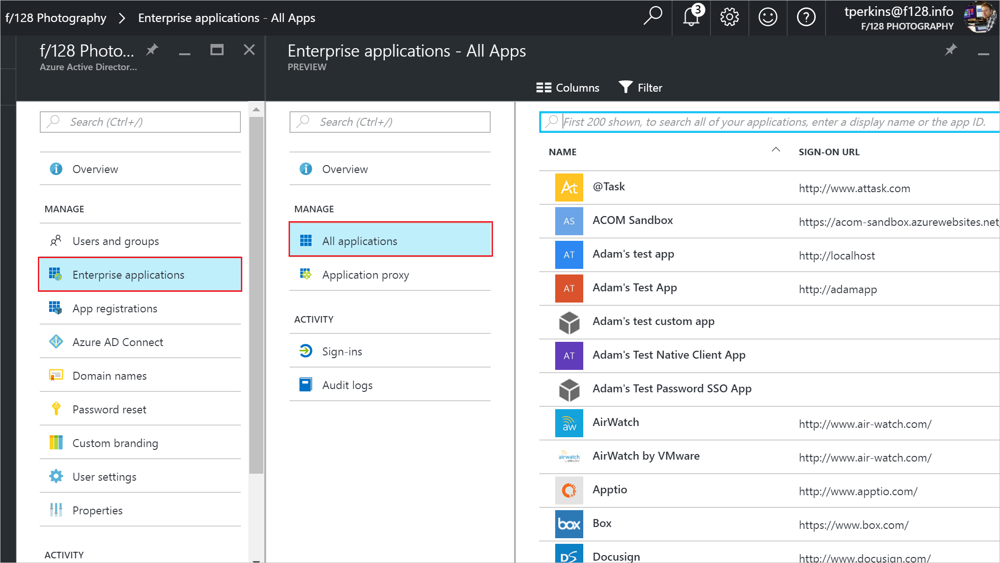
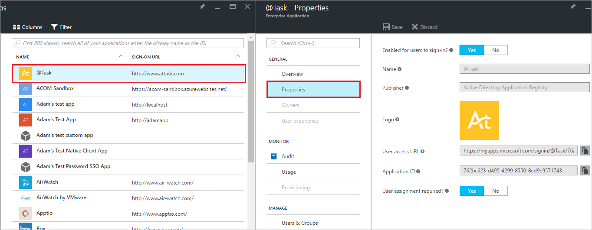

# 在 Azure Active Directory 中对企业应用禁用用户登录
可以轻松地禁用企业应用程序，防止用户在 Azure Active Directory (Azure AD) 中登录该程序。 必须具有适当的权限才能管理企业应用，并且必须是目录的全局管理员。

## 如何禁用用户登录？
1. 使用目录全局管理员的帐户登录到 [Azure 门户](https://portal.azure.cn) 。
2. 选择“更多服务”，在文本框中输入 **Azure Active Directory**，并选择“Enter”。
3. 在“Azure Active Directory -  ***目录名***”边栏选项卡（即，正在管理的目录的 Azure AD 边栏选项卡）中，选择“企业应用程序”。

    
4. 在“企业应用程序”边栏选项卡中，选择“所有应用程序”。 此时会显示可管理应用的列表。
5. 在在“企业应用程序 - 所有应用程序”边栏选项卡中，选择一个应用。
6. 在“appname”边栏选项卡（即标题中包含所选应用名称的边栏选项卡）中，选择“属性”。

    
7. 在“***appname*** - 属性”边栏选项卡中，对“启用以让用户登录?”设置选择“否”。
8. 选择“保存”命令。

## 后续步骤
* [查看所有组](active-directory-groups-view-azure-portal.md)
* [向企业应用分配用户或组](active-directory-coreapps-assign-user-azure-portal.md)
* [删除企业应用的用户或组分配](active-directory-coreapps-remove-assignment-azure-portal.md)
* [更改企业应用的名称或徽标](active-directory-coreapps-change-app-logo-user-azure-portal.md)
