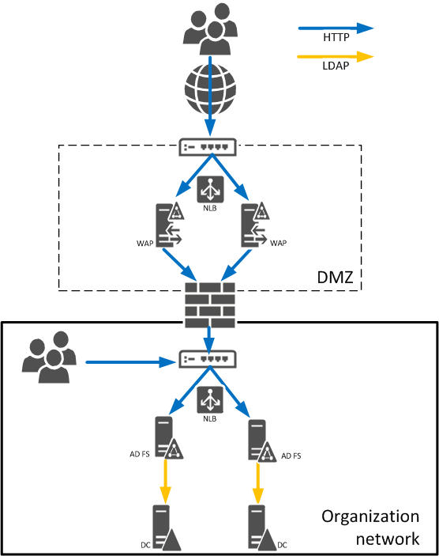
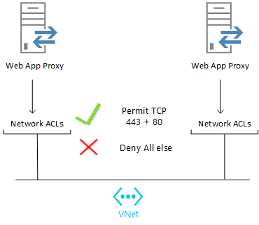
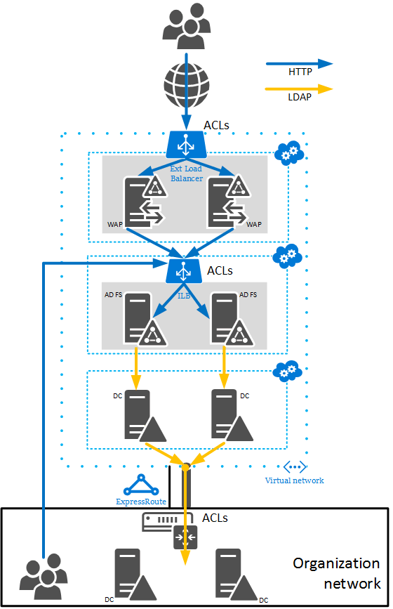
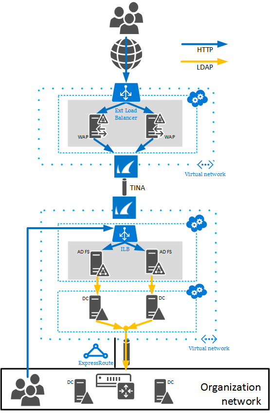
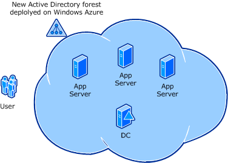
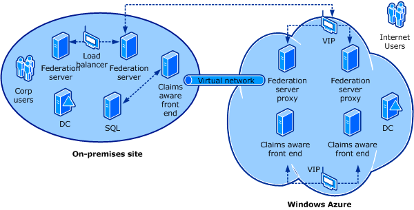
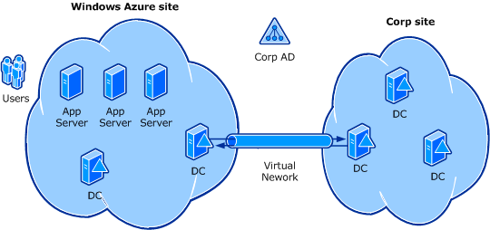

# 有关在 Azure 虚拟机上部署 Windows Server Active Directory 的指导
本文阐述在本地部署 Windows Server Active Directory 域服务 (AD DS) 和 Active Directory 联合身份验证服务 (AD FS) 与在 Azure 虚拟机上部署这些服务的重要区别。

## 范围和受众
本文面向能够熟练地在本地部署 Active Directory 的人员。本文介绍在 Azure 虚拟机/Azure 虚拟网络上部署 Active Directory 与传统的本地 Active Directory 部署的区别。Azure 虚拟机和 Azure 虚拟网络是一种基础结构即服务 (IaaS) 产品的一部分，组织可通过该产品利用云中的计算资源。

对于不熟悉 AD 部署的用户，可根据需要参阅 [AD DS Deployment Guide](https://technet.microsoft.com/zh-cn/library/cc753963)（AD DS 部署指南）或 [Plan your AD FS deployment](https://technet.microsoft.com/zh-cn/library/dn151324.aspx)（规划 AD FS 部署）。

本文假设读者熟悉以下概念：

- Windows Server AD DS 部署和管理
- 为支持 Windows Server AD DS 基础结构而进行的 DNS 部署和配置
- Windows Server AD FS 部署和管理
- 部署、配置和管理可使用 Windows Server AD FS 令牌的信赖方应用程序（网站和 Web 服务）
- 一般的虚拟机概念，例如如何配置虚拟机、虚拟磁盘和虚拟网络

本文重点介绍混合部署方案的要求，这种方案是将 Windows Server AD DS 或 AD FS 的一部分部署在本地，还有一部分则部署在 Azure 虚拟机上。本文首先介绍在 Azure 虚拟机上以及在本地运行 Windows Server AD DS 和 AD FS 之间的关键区别以及影响设计和部署的重要决策。本文的其余部分更详细地介绍每个决策点的准则以及如何将这些准则应用于不同的部署方案。

本文不讨论如何配置 [Azure Active Directory](./index.md) - 一种基于 REST 的服务，用于为云应用程序提供身份管理和访问控制功能。但是，Azure Active Directory (Azure AD) 和 Windows Server AD DS 旨在协同使用以为当前的混合 IT 环境和新式应用程序提供身份和访问管理解决方案。要帮助了解 Windows Server AD DS 与 Azure AD 之间的区别和关系，请设想以下情况：

1. 使用 Azure 将本地数据中心扩展到云中时，可能在云中 Azure 虚拟机上运行 Windows Server AD DS。
2. 你可以使用 Azure AD 允许用户单一登录到软件即服务 (SaaS) 应用程序。例如，Microsoft Office 365 使用此项技术，并且在 Azure 或其他云平台上运行的应用程序也可使用它。
3. 可能使用 Azure AD（其访问控制服务）让用户使用来自 Facebook、Google、Microsoft 或其他身份提供商的身份登录到在云中或本地托管的应用程序。

有关这些区别的详细信息，请参阅 [Azure Identity](./fundamentals-identity.md)（Azure 标识）。

## 相关资源

可以下载并运行 [Azure 虚拟机就绪评估工具](https://www.microsoft.com/download/details.aspx?id=40898)。该评估工具将自动检查你的本地环境并根据本主题中的指南生成一份自定义报告以帮助你将环境迁移到 Azure。

建议首先查看涉及以下主题的教程、指南：

- [在 Azure 门户中配置仅限云的虚拟网络](../virtual-network/virtual-networks-create-vnet-classic-portal.md)
- [在 Azure 门户中配置站点到站点 VPN](../vpn-gateway/vpn-gateway-site-to-site-create.md)
- [在 Azure 虚拟网络中安装新的 Active Directory 林](./active-directory-new-forest-virtual-machine.md)
- [在 Azure 上安装副本 Active Directory 域控制器 ](./active-directory-install-replica-active-directory-domain-controller.md)
- [Azure IT Pro IaaS：(01) 虚拟机基础知识](https://channel9.msdn.com/Series/Windows-Azure-IT-Pro-IaaS/01)

## 介绍
在 Azure 虚拟机上部署 Windows Server Active Directory 的基本要求与在本地虚拟机（某种程度上还包括物理计算机）中部署它几乎没有区别。例如，就 Windows Server AD DS 而言，如果在 Azure 虚拟机上部署的域控制器 (DC) 是现有本地企业域/林中的副本，则对待 Azure 部署的方式与对待任何其他额外的 Windows Server Active Directory 站点的方式大体上相同。即，必须在 Windows Server AD DS 中定义子网，必须创建站点，必须将子网链接到该站点，并且必须使用相应的站点链接连接到其他站点。但是，有一些区别为所有 Azure 部署共有，还有一些区别根据具体的部署方案而异。下面概述了两个重要区别：

### 可能需要向 Azure 虚拟机提供与本地企业网络的连接。
将 Azure 虚拟机连回本地企业网络需要 Azure 虚拟网络，其中包括可无缝连接 Azure 虚拟机和本地虚拟机的站点到站点或站点到点虚拟专用网络 (VPN) 组件。此 VPN 组件还可使本地域成员计算机可访问在 Azure 虚拟机上独占托管其域控制器的 Windows Server Active Directory 域。但是，如果 VPN 失败，则依赖于 Windows Server Active Directory 的身份验证和其他操作也将失败，注意到这一点很重要。虽然用户也许能够使用现有缓存的凭据进行登录，但其票证尚未发出或已过时的所有对等或客户端对服务器身份验证尝试都将失败。

请参阅[虚拟网络](../virtual-network/index.md)，观看演示视频并获得分步教程的列表，包括在 Azure 门户中[配置站点到站点 VPN](../vpn-gateway/vpn-gateway-site-to-site-create.md)。

> [!NOTE]
也可以在未与本地网络连接的 Azure 虚拟网络上部署 Windows Server Active Directory。但是，本主题中的准则假设使用 Azure 虚拟网络，因为它提供对 Windows Server 至关重要的 IP 寻址功能。
> 
> 

### 必须使用 Azure PowerShell 配置静态 IP 地址。
默认情况下分配动态地址，但可改用 Set-AzureStaticVNetIP cmdlet 分配静态 IP 地址。这将设置静态 IP 地址，该地址将通过服务修复和 VM 关闭/重新启动而持久保留。有关详细信息，请参阅 [Static internal IP address for virtual machines](http://azure.microsoft.com/blog/static-internal-ip-address-for-virtual-machines/)（虚拟机的静态内部 IP 地址）。

## 术语和定义
下面是本文中所述各种 Azure 技术的术语的不完整列表。

- **Azure 虚拟机**：通过 Azure 中的 IaaS 产品，客户可部署一类 VM，让它运行几乎任何传统上位于本地的服务器工作负荷。
- **Azure 虚拟网络**：Azure 中的网络服务，通过它，客户可在 Azure 中创建和管理虚拟网络，并可使用虚拟专用网络 (VPN) 安全地将这些虚拟网络链接到其自身的本地网络基础结构。
- **虚拟 IP 地址**：一个面向 Internet 的 IP 地址，它未绑定到特定的计算机或网络接口卡。云服务分配有一个虚拟 IP 地址，用于接收重定向到 Azure VM 的网络流量。虚拟 IP 地址是可包含一个或多个 Azure 虚拟机的云服务的属性。另请注意，Azure 虚拟网络可包含一个或多个云服务。虚拟 IP 地址提供本机负载均衡功能。
- **动态 IP 地址**：这是仅供内部使用的 IP 地址。它应配置为用于托管 DC/DNS 服务器角色的 VM 的静态 IP 地址（通过使用 Set-AzureStaticVNetIP cmdlet）。
- **服务修复**：Azure 检测到服务失败后再次自动使该服务恢复运行状态的进程。服务修复是 Azure 的一个方面，支持可用性和复原。虽然未必属实，但在 VM 上运行的 DC 发生服务修复事件后的结果类似于一次计划外的重新引导，但有少量副作用。

  - VM 中的虚拟网络适配器将更改
  - 虚拟网络适配器的 MAC 地址将更改
  - VM 的处理器/CPU ID 将更改
  - 只要 VM 连接到虚拟网络，并且 VM 的 IP 地址是静态的，虚拟网络适配器的 IP 配置就不会更改。

  但任何上述行为均不影响 Windows Server Active Directory，因为它不依赖于 MAC 地址或处理器/CPU ID，此外，建议在 Azure 虚拟网络上运行 Azure 上的所有 Windows Server Active Directory 部署，如上所述。

## 将 Windows Server Active Directory 域控制器虚拟化是否安全？
在 Azure 虚拟机上部署 Windows Server Active Directory DC 所遵照的准则与在虚拟机中本地运行 DC 相同。只要遵照备份和还原 DC 的准则，运行虚拟化 DC 就是一种安全做法。有关运行虚拟化 DC 的约束和准则的详细信息，请参阅 [Running Domain Controllers in Hyper-V](https://technet.microsoft.com/zh-cn/library/dd363553)（在 Hyper-V 中运行域控制器）。

虚拟机监控程序提供或简化的技术（包括 Windows Server Active Directory）可导致许多分布式系统出问题。例如，在物理服务器上，可以克隆磁盘，或使用不支持的方法回滚服务器的状态，包括使用 SAN 等，但在物理服务器上这样做比在虚拟机监控程序中还原虚拟机快照困难得多。Azure 提供的功能可能会导致相同的不良情况。例如，不应复制 DC 的 VHD 文件代替执行定期备份，因为还原这些文件会导致与使用快照还原功能类似的情况。

此类回滚将引发 USN 气泡，这些气泡可导致 DC 之间永久处于不同状态。这样导致的后果包括：

- 延迟对象
- 密码不一致
- 属性值不一致
- 如果回滚架构主机，则架构不匹配

有关如何影响 DC 的详细信息，请参阅 [USN and USN Rollback](https://technet.microsoft.com/zh-cn/library/virtual_active_directory_domain_controller_virtualization_hyperv.aspx#usn_and_usn_rollback)（USN 和 USN 回滚）。

从 Windows Server 2012 开始，[AD DS 中内置了额外的安全保护](https://technet.microsoft.com/zh-cn/library/hh831734.aspx)。只要底层虚拟机监控程序平台支持 VM-GenerationID，这些安全保护就可以防止虚拟化域控制器出现上述问题。Azure 支持 VM-GenerationID，这意味着 Azure 虚拟机上运行 Windows Server 2012 或更高版本的域控制器具有额外的安全防护措施。

> [!NOTE]
应在来宾操作系统中关闭并重新启动 Azure 中运行域控制器角色的 VM，而不是使用 Azure 经典管理门户中的“关闭”选项。目前，使用门户关闭 VM 会导致解除分配 VM。解除分配 VM 的优点是不会产生费用，但也会重置 VM-GenerationID，这对于 DC 来说是不希望发生的。重置 VM-GenerationID 时，也会重置 AD DS 数据库的 invocationID，RID 池将被丢弃，SYSVOL 将标记为非权威性。有关详细信息，请参阅 [Introduction to Active Directory Domain Services (AD DS) Virtualization](https://technet.microsoft.com/zh-cn/library/hh831734.aspx)（Active Directory 域服务 (AD DS) 虚拟化简介和 [Safely Virtualizing DFSR](http://blogs.technet.com/b/filecab/archive/2013/04/05/safely-virtualizing-dfsr.aspx)（安全虚拟化 DFSR）。
> 
> 

## 为什么要在 Azure 虚拟机上部署 Windows Server AD DS？
许多 Windows Server AD DS 部署方案都很适合作为 VM 部署在 Azure 上。例如，假设你在欧洲有一家公司，需要对远方亚洲的用户进行身份验证。这家公司以前没有在亚洲部署过 Windows Server Active Directory DC，因部署成本较高，并且专业技能不足，无法在部署后管理服务器。因此，由欧洲的 DC 为来自亚洲的身份验证请求提供服务，但产生的结果不理想。在这种情况下，可在已指定必须在亚洲的 Azure 数据中心内运行的 VM 上部署一个 DC。将该 DC 附加到直接连接到远方的 Azure 虚拟网络将提高身份验证性能。

Azure 也很适合替代其他情况下成本高昂的灾难恢复 (DR) 站点。在 Azure 上托管少量域控制器和一个虚拟网络的成本相对较低，因此是一个有吸引力的备选方案。

最后，你可能要在 Azure 上部署需要 Windows Server Active Directory、但不依赖本地网络或企业 Windows Server Active Directory 的网络应用程序，如 SharePoint。在这种情况下，最好在 Azure 上部署一个独立的林以满足 SharePoint 服务器的要求。同样，也支持部署需要连接到本地网络和企业 Active Directory 的网络应用程序。

> [!NOTE]
由于提供 3 层连接，因此在 Azure 虚拟网络与本地网络之间提供连接的 VPN 组件还可使在本地运行的成员服务器利用在 Azure 虚拟网络上作为 Azure 虚拟机运行的 DC。但是，如果没有 VPN 可用，则在本地计算机与基于 Azure 的域控制器之间将无法通信，从而导致身份验证错误和各种其他错误。
> 
> 

## 在 Azure 虚拟机上部署的 Windows Server Active Directory 域控制器与本地部署的域控制器之间的比较
- 对于任何包括多个 VM 的 Windows Server Active Directory 部署方案，必须使用 Azure 虚拟网络以确保 IP 地址一致。请注意，本指南假设 DC 在 Azure 虚拟网络上运行。
- 就本地 DC 来说，建议使用静态 IP 地址。静态 IP 地址只能使用 Azure PowerShell 配置。有关详细信息，请参阅 [Static internal IP address for VMs](http://azure.microsoft.com/blog/static-internal-ip-address-for-virtual-machines/)（VM 的静态内部 IP 地址）。如果你使用监视系统或其他解决方案来检查来宾操作系统中的静态 IP 地址配置，则可以为 VM 的网络适配器属性分配同一静态 IP 地址。但请注意，如果 VM 正在进行服务修复或已在经典管理门户中关闭并且其地址已解除分配，则该网络适配器将被放弃。在这种情况下，需要重置来宾中的静态 IP 地址。
- 在虚拟网络上部署 VM 并不意味着（或要求）连回本地网络；虚拟网络仅产生这种可能性。必须创建一个虚拟网络，供 Azure 与本地网络之间进行专用通信。需要在本地网络上部署 VPN 终结点。打开的 VPN 从 Azure 通向本地网络。有关详细信息，请参阅 [Virtual Network Overview](../virtual-network/virtual-networks-overview.md)（虚拟网络概述）和 [Configure a Site-to-Site VPN in the Azure Portal](../vpn-gateway/vpn-gateway-site-to-site-create.md)（在 Azure 门户中配置站点到站点 VPN）。

    > [!NOTE]
    有一个[创建点到站点 VPN](../vpn-gateway/vpn-gateway-point-to-site-create.md) 的选项可将单独的基于 Windows 的计算机直接连接到 Azure 虚拟网络。
    > 
    > 

- 无论是否创建虚拟网络，Azure 均按传出流量收费，而不按传入流量收费。选择各种 Windows Server Active Directory 设计都会影响部署生成多少传出流量。例如，部署只读域控制器 (RODC) 将限制传出流量，因为它在出站时不进行复制。但部署 RODC 的决定将需要根据是否需要对 DC 执行写入操作以及站点中的应用程序和服务与 RODC 的[兼容性](https://technet.microsoft.com/zh-cn/library/cc755190)来进行权衡。有关流量收费的详细信息，请参阅 [Azure pricing at-a-glance](https://www.azure.cn/pricing/)（Azure 价格一览表）。
- 虽然可以全面控制 Azure 上要用于本地 VM 的服务器资源（如 RAM 数量、磁盘大小等），但仍必须从预先配置的服务器大小的列表中进行选择。对于 DC，除了操作系统磁盘之外，还需要数据磁盘以存储 Windows Server Active Directory 数据库。

## 是否可以在 Azure 虚拟机上部署 Windows Server AD FS？
是的，可以在 Azure 虚拟机上部署 Windows Server AD FS，本地 [AD FS 部署最佳实践](https://technet.microsoft.com/zh-cn/library/dn151324.aspx)同样适用于 Azure 上的 AD FS 部署。但是，其中一些最佳实践（例如负载均衡和高可用性）的要求超越了 AD FS 本身所能提供的技术，因此必须通过底层基础结构来提供。让我们回顾一下某些最佳实践，并了解如何使用 Azure 虚拟机和 Azure 虚拟网络来实现这些目的。

1. **切勿直接在 Internet 中公开安全令牌服务 (STS) 服务器。**

    由于 STS 角色会发出安全令牌，因此这一点很重要。因此，应该将 STS 服务器（如 AD FS 服务器）视为要与域控制器受到相同级别的保护。如果某一 STS 的安全性受到威胁，恶意用户将能够向信赖方应用程序和信任组织中的其他 STS 服务器发出可能包含其选择的声明的访问令牌。
2. **将所有用户域的 Active Directory 域控制器部署在 AD FS 服务器所在的同一个网络中。**

    AD FS 服务器使用 Active Directory 域服务对用户进行身份验证。建议将域控制器部署在 AD FS 服务器所在的同一个网络中。这样，当 Azure 网络与本地网络之间的链接断开时可以保持业务连续性，并可以在登录时降低延迟和提高性能。
3. **部署多个 AD FS 节点以实现高可用性和负载均衡。**

    在大多数情况下，AD FS 启用的应用程序失败是不可接受的，因为需要安全令牌的应用程序往往是任务关键型应用程序。鉴于 AD FS 现在对于访问任务关键型应用程序起着关键作用，必须通过多个 AD FS 代理和 AD FS 服务器为 AD FS 服务提供高可用性。为实现请求分发，负载均衡器通常部署在 AD FS 代理和 AD FS 服务器的前端。
4. **部署一个或多个 Web 应用程序代理节点以进行 Internet 访问。**

    当用户需要访问受 AD FS 服务保护的应用程序时，需要通过 Internet 使用 AD FS 服务。这可以通过部署 Web 应用程序代理服务来实现。强烈建议部署多个节点以提供高可用性和负载均衡。
5. **限制为只能从 Web 应用程序代理节点访问内部网络资源。**

    若要允许外部用户从 Internet 访问 AD FS，你需要部署 Web 应用程序代理节点（在早期版本的 Windows Server 中为 AD FS 代理）。Web 应用程序代理节点直接向 Internet 公开。这些节点不需要加入域，并且它们只需通过 TCP 端口 443 和 80 访问 AD FS 服务器。强烈建议阻止与其他所有计算机（尤其是域控制器）进行通信。

    通常可以通过外围网络在本地实现此目的。防火墙使用允许列表操作模式限制将外围网络的流量定向到本地网络（也就是说，只允许来自指定 IP 地址的流量和通过指定端口传送的流量，并阻止其他所有流量）。

下图显示了一种传统的本地 AD FS 部署。

  

但是，由于 Azure 无法提供完整的本机防火墙功能，因此还需要使用其他选项来限制流量。下表显示每个选项及其优点和缺点。

| 选项 | 优点 | 缺点 |
| --- | --- | --- |
| [Azure 网络 ACL](../virtual-network/virtual-networks-acl.md) |成本更低，初始配置更简单 |如果要将任何新的 VM 添加到部署中，则需要完成其他网络 ACL 配置。 |
| [Barracuda NG 防火墙](https://www.barracuda.com/products/ngfirewall) |允许列表操作模式，不需要进行网络 ACL 配置 |成本更高，初始设置更复杂。 |

在这种情况下，部署 AD FS 的高级步骤如下：

1. 使用 VPN 或 [ExpressRoute](../expressroute/index.md) 创建提供跨界连接的虚拟网络。
2. 在虚拟网络上部署域控制器。此步骤是可选的，但建议执行。
3. 在虚拟网络上部署已加入域的 AD FS 服务器。
4. 创建[内部负载均衡集](http://azure.microsoft.com/blog/internal-load-balancing/)，该集包含 AD FS 服务器，并使用虚拟网络中的新专用 IP 地址（动态 IP 地址）。

   1. 更新 DNS，以创建指向内部负载均衡集专用（动态）IP 地址的 FQDN。
5. 为 Web 应用程序代理节点中创建云服务（或单独的虚拟网络）。
6. 在云服务或虚拟网络中部署 Web 应用程序代理节点

   1. 创建外部负载均衡集，其中包含 Web 应用程序代理节点。
   2. 将外部 DNS 名称 (FQDN) 更新为指向云服务的公共 IP 地址（虚拟 IP 地址）。
   3. 将 AD FS 代理配置为使用对应于 AD FS 服务器内部负载均衡集的 FQDN。
   4. 将基于声明的网站更新为使用其声明提供程序的外部 FQDN。
7. 限制在 Web 应用程序代理与 AD FS 虚拟网络中的任何计算机之间进行访问。

若要限制流量，需要对 Azure 内部负载均衡器的负载均衡集进行配置，以仅只向 TCP 端口 80 和 443 传送流量，并丢弃传送到负载均衡集内部动态 IP 地址的所有其他流量。

  

只允许以下源向 AD FS 服务器传送流量：

- Azure 内部负载均衡器。
- 本地网络上的管理员的 IP 地址。

> [!WARNING]
在设计上，必须阻止 Web 应用程序代理节点访问 Azure 虚拟网络中的其他任何 VM 或本地网络中的任何位置。为此，可以在本地设备中针对 Express Route 连接或者在 VPN 设备上针对站点到站点 VPN 连接配置防火墙规则。
> 
> 

这种做法的一个缺点是需要为多个设备（包括内部负载均衡器、AD FS 服务器，以及添加到虚拟网络中的其他任何服务器）配置网络 ACL。如果在部署中添加了任何设备但未将网络 ACL 配置为限制向该设备传送流量，则整个部署可能会面临风险。如果 Web 应用程序代理节点的 IP 地址发生变化，则必须重置网络 ACL（这意味着，应该将代理配置为使用[静态动态 IP 地址](http://azure.microsoft.com/blog/static-internal-ip-address-for-virtual-machines/)）。

  

另一种做法是使用 [Barracuda NG 防火墙](https://www.barracuda.com/products/ngfirewall)设备控制 AD FS 代理服务器与 AD FS 服务器之间的流量。这种做法符合安全性和高可用性的最佳实践，在完成初始设置后需要更少的管理，因为 Barracuda NG 防火墙设备提供允许列表防火墙管理模式，并且可以直接在 Azure 虚拟网络中安装。这样，便不需要在每次向部署中添加新服务器后都要配置网络 ACL。但这种做法加大了初始部署的复杂性和成本。

在这种情况下，将要部署两个虚拟网络而不是一个。我们将这两个虚拟网络称为 VNet1 和 VNet2。VNet1 包含代理，VNet2 包含 STS，并负责将网络连接回到企业网络。因此，VNet1 在物理上（尽管它是虚拟网络）与 VNet2 相互隔离，从而与企业网络也相互隔离。VNet1 使用专用的隧道技术（称为独立于传输的网络体系结构 (TINA)）连接到 VNet2。TINA 隧道附加到每个使用 Barracuda NG 防火墙的虚拟网络 - 每个虚拟网络上各有一个 Barracuda。为实现高可用性，建议你在每个虚拟网络上部署两个 Barracuda，其中一个处于主动状态，另一个处于被动状态。这些 Barracuda 提供极其丰富的防火墙功能，使我们能够在 Azure 中模拟传统本地外围网络的操作。

  

有关详细信息，请参阅 [AD FS: Extend a claims-aware on-premises front-end application to the Internet](#BKMK_CloudOnlyFed)（AD FS：将声明感知本地前端应用程序扩展到 Internet）。

### 当目标仅为实现 Office 365 SSO 时部署 AD FS 的替代做法
如果你的目标只是针对 Office 365 实现单一登录，则还可以采用另一种方法部署 AD FS。在这种情况下，使用本地密码同步就可轻松部署 DirSync 并实现相同的最终结果，部署复杂性接近于零，因为这种方法不需要 AD FS 或 Azure。

下表对部署和不部署 AD FS 这两种情况下的登录过程进行比较。

| 使用 AD FS 和 DirSync 进行 Office 365 单一登录 | 使用 DirSync + 密码同步进行相同的 Office 365 登录 |
| --- | --- |
| 1\.用户登录到公司网络，并且针对 Windows Server Active Directory 对用户进行身份验证。 |1\.用户登录到公司网络，并且针对 Windows Server Active Directory 对用户进行身份验证。 |
| 2\.用户尝试访问 Office 365（我是 @contoso.com）。 |2\.用户尝试访问 Office 365（我是 @contoso.com）。 |
| 3\.Office 365 将用户重定向到 Azure AD。 |3\.Office 365 将用户重定向到 Azure AD。 |
| 4\.由于 Azure AD 无法对用户进行身份验证并且了解与本地 AD FS 之间的信任关系，因此它会将用户重定向到 AD FS。 |4\.Azure AD 无法直接接受 Kerberos 票证，并不存在任何信任关系，因此它会请求用户输入凭据。 |
| 5\.用户将 Kerberos 票证发送到 AD FS STS。 |5\.用户输入同一本地密码，Azure AD 根据 DirSync 同步的用户名和密码对这些凭据进行验证。 |
| 6\.AD FS 将 Kerberos 票证转换为所需的令牌格式/声明并将用户重定向到 Azure AD。 |6\.Azure AD 将用户重定向到 Office 365。 |
| 7\.用户向 Azure AD 进行身份验证（另一个转换将发生）。 |7\.用户可使用 Azure AD 令牌登录到 Office 365 和 OWA。 |
| 8\.Azure AD 将用户重定向到 Office 365。 | |
| 9\.用户在无提示的情况下登录到 Office 365。 | |

在采用 DirSync 和密码同步方案（无 AD FS）的 Office 365 中，“相同的登录”取代“单一登录”，其中“相同”指的是用户必须再次输入他们访问 Office 365 时使用的相同的本地凭据。请注意，用户浏览器可以记住这些数据以减少后续提示。

### 额外的精神食粮
- 如果在 Azure 虚拟机上部署 AD FS 代理服务器，则需要与 AD FS 服务器建立连接。如果这些服务器在本地，则建议利用虚拟网络提供的站点到站点 VPN 连接使 Web 应用程序代理节点可与其 AD FS 服务器通信。
- 如果在 Azure 虚拟机上部署 AD FS 服务器，则需要与 Windows Server Active Directory 域控制器、属性存储和配置数据库建立连接，并且还可能需要在 Azure 虚拟网络与本地网络之间建立 ExpressRoute 或站点到站点 VPN 连接。
- 从 Azure 虚拟机传出的所有流量（传出流量）都要付费。如果成本是驱动要素，则最好在 Azure 上部署 Web 应用程序代理节点，使 AD FS 服务器保留在本地。如果将 AD FS 服务器也部署在 Azure 虚拟机上，则在对本地用户进行身份验证时将会产生额外的成本。无论是否遍历 ExpressRoute 或 VPN 站点到站点连接，传出流量都会产生成本。
- 如果你决定使用 Azure 固有的服务器负载均衡功能为 AD FS 服务器提供高可用性，则请注意，负载均衡提供用于确定云服务中虚拟机的运行状况的探测。就 Azure 虚拟机（相对于 Web 或辅助角色）而言，必须使用自定义探测，因为 Azure 虚拟机上没有可响应自定义探测的代理。为简单起见，可使用自定义 TCP 探测 - 此方式只需成功建立 TCP 连接（使用 TCP SYN ACK 段发送和响应的 TCP SYN 段）即可确定虚拟机运行状况。可配置自定义探测以使其使用任何当前正在侦听虚拟机的 TCP 端口。

> [!NOTE]
需要直接向 Internet公开同一组端口（如端口 80 和 443）的虚拟机无法共享同一云服务。因此，建议为 Windows Server AD FS 服务器创建一个专用的云服务，以避免应用程序与 Windows Server AD FS 的端口要求之间可能发生重叠。
> 
> 

## 部署方案
以下部分概述了一些部署方案，这些方案虽然很普通，但必须考虑到其中的一些重要注意事项。每个方案均有一些链接，指向有关要考虑的决策和因素的详细信息。

1. [AD DS：部署不需连接企业网络的 AD DS 感知应用程序](#BKMK_CloudOnly)

    例如，在 Azure 虚拟机上部署面向 Internet 的 SharePoint 服务。该应用程序不依赖企业网络资源。该应用程序需要 Windows Server AD DS，但不需要企业 Windows Server AD DS。
2. [AD FS：将声明感知本地前端应用程序扩展到 Internet](#BKMK_CloudOnlyFed)

    例如，一个已成功部署在本地并供企业用户使用的声明感知应用程序需要变为可直接从 Internet 访问该应用程序。另外，还需要由业务合作伙伴使用其自己的企业身份以及由现有企业用户通过 Internet 直接访问该应用程序。
3. [AD DS：部署需要连接到企业网络的 Windows Server AD DS 感知应用程序](#BKMK_HybridExt)

    例如，在 Azure 虚拟机上部署一个 LDAP 感知应用程序，该应用程序支持 Windows 集成身份验证，并使用 Windows Server AD DS 作为配置和用户配置文件数据的存储库。该应用程序最好利用现有企业 Windows Server AD DS 并提供单一登录。该应用程序无法感知声明。

### 1.AD DS：部署不需连接企业网络的 AD DS 感知应用程序

**图 1**

#### 说明
SharePoint 部署在 Azure 虚拟机上，并且该应用程序不依赖企业网络资源。该应用程序需要 Windows Server AD DS，但*不*需要企业 Windows Server AD DS。不需要 Kerberos 或联合信任，因为用户通过该应用程序自行配置到也在云中的 Azure 虚拟机上托管的 Windows Server AD DS 域。

#### 方案注意事项和技术领域如何适用于方案
- [网络拓扑](#BKMK_NetworkTopology)：创建没有跨界连接的 Azure 虚拟网络（也称为站点到站点连接）。
- [DC 部署配置](#BKMK_DeploymentConfig)：将一个新的域控制器部署到一个新的单域 Windows Server Active Directory 林。该域控制器应与 Windows DNS 服务器一起部署。
- [Windows Server Active Directory 站点拓扑](#BKMK_ADSiteTopology)：使用默认 Windows Server Active Directory 站点（所有计算机都将在 Default-First-Site-Name 中）。
- [IP 寻址和 DNS](#BKMK_IPAddressDNS)：

  - 通过使用 Set-AzureStaticVNetIP Azure PowerShell cmdlet 为 DC 设置静态 IP 地址。
  - 在 Azure 上的域控制器上安装并配置 Windows Server DNS。
  - 使用托管 DC 和 DNS 服务器角色的 VM 的名称和 IP 地址配置虚拟网络属性。
- [全局目录](#BKMK_GC)：林中的第一个 DC 必须是全局目录服务器。还应将其他 DC 配置为 GC，因为在单域林中，全局目录不要求在 DC 中完成任何其他工作。
- [放置 Windows Server AD DS 数据库和 SYSVOL](#BKMK_PlaceDB)：向作为 Azure VM 运行的 DC 添加数据磁盘以存储 Windows Server Active Directory 数据库、日志和 SYSVOL。
- [备份和还原](#BKMK_BUR)：决定要在何处存储系统状态备份。如有必要，可向 DC VM 添加另一个数据磁盘以存储备份。

### 2 AD FS：将声明感知本地前端应用程序扩展到 Internet

**图 2**

#### 说明
一个已成功部署在本地并供企业用户使用的声明感知应用程序需要变为可直接从 Internet 访问该应用程序。该应用程序充当从中存储和检索数据的 SQL 数据库的 Web 前端。该应用程序使用的 SQL 服务器也位于企业网络上。已在本地部署两个 Windows Server AD FS STS 和一个负载均衡器来提供对公司用户的访问。另外，现在需要由业务合作伙伴使用其自己的企业身份以及由现有企业用户通过 Internet 直接访问该应用程序。

为了简化和满足此新要求的部署和配置需要，决定在 Azure 虚拟机上另外安装两个 Web 前端和两个 Windows Server AD FS 代理服务器。将直接向 Internet 公开所有四个 VM，并将使用 Azure 虚拟网络的站点到站点 VPN 功能为其提供与本地网络的连接。

#### 方案注意事项和技术领域如何适用于方案
- [网络拓扑](#BKMK_NetworkTopology)：创建 Azure 虚拟网络并[配置跨界连接](../vpn-gateway/vpn-gateway-site-to-site-create.md)。

    > [!NOTE]
    对于每个 Windows Server AD FS 证书，确保在 Azure 上运行的 Windows Server AD FS 实例可访问在证书模板和所得证书中定义的 URL。这可能需要与 PKI 基础结构的各部分具有跨界连接。例如，如果 CRL 的终结点基于 LDAP，并以独占方式托管在本地，则将需要跨界连接。如果这样不可取，则可能必须使用可通过 Internet 访问其 CRL 的 CA 颁发的证书。
    > 
    > 
- [云服务配置](#BKMK_CloudSvcConfig)：确保有两个云服务以提供两个经过负载均衡的虚拟 IP 地址。第一个云服务的虚拟 IP 地址将定向到端口 80 和 443 上的两个 Windows Server AD FS 代理 VM。Windows Server AD FS 代理 VM 将配置为指向面向 Windows Server AD FS STS 的本地负载均衡器的 IP 地址。第二个云服务的虚拟 IP 地址将再次定向到端口 80 和 443 上两个运行 Web 前端的 VM。配置自定义探测以确保负载均衡器将流量仅定向到正常运行的 Windows Server AD FS 代理和 Web 前端 VM。
- [联合服务器配置](#BKMK_FedSrvConfig)：将 Windows Server AD FS 配置为联合服务器 (STS) 以为在云中创建的 Windows Server Active Directory 林生成安全令牌。设置联合声明提供程序与要从其接受身份的不同合作伙伴的信任关系，然后配置信赖方与要向其生成令牌的不同应用程序的信任关系。

    大多数方案下，为安全起见，Windows Server AD FS 代理服务器均部署在面向 Internet 的设备中，而其对应的 Windows Server AD FS 联合服务器仍与直接 Internet 连接隔离。无论你采用哪种部署方案，都必须使用虚拟 IP 地址配置云服务，虚拟 IP 地址将提供公开的 IP 地址和能够跨两个 Windows Server AD FS STS 实例或代理实例进行负载均衡的端口。
- [Windows Server AD FS 高可用性配置](#BKMK_ADFSHighAvail)：建议所部署的 Windows Server AD FS 场至少具有两个服务器以进行故障转移和负载均衡。可能要考虑对 Windows Server AD FS 配置数据使用 Windows 内部数据库 (WID)，并使用 Azure 的内部负载均衡功能将传入请求分配到场中的服务器上。

有关详细信息，请参阅 [AD DS Deployment Guide](https://technet.microsoft.com/zh-cn/library/cc753963)（AD DS 部署指南）。

### 3.AD DS：部署需要连接到企业网络的 Windows Server AD DS 感知应用程序

**图 3**

#### 说明
在 Azure 虚拟机上部署一个 LDAP 感知应用程序。该应用程序支持 Windows 集成身份验证，并使用 Windows Server AD DS 作为配置和用户配置文件数据的存储库。该应用程序的目标是利用现有企业 Windows Server AD DS 并提供单一登录。该应用程序无法感知声明。用户还需要直接从 Internet 访问该应用程序。为了针对性能和成本进行优化，决定在 Azure 上将另外两个属于企业域一部分的域控制器与应用程序部署在一起。

#### 方案注意事项和技术领域如何适用于方案
- [网络拓扑](#BKMK_NetworkTopology)：使用[跨界连接](../vpn-gateway/vpn-gateway-site-to-site-create.md)创建 Azure 虚拟网络。
- [安装方法](#BKMK_InstallMethod)：从企业 Windows Server Active Directory 域中部署副本 DC。对于副本 DC，可在 VM 上安装 Windows Server AD DS，并可使用“从介质安装”(IFM) 功能减少在安装期间需要复制到新 DC 的数据量。有关教程，请参阅 [Install a replica Active Directory domain controller on Azure](./active-directory-install-replica-active-directory-domain-controller.md)（在 Azure 上安装副本 Active Directory 域控制器）。即使使用 IFM，在本地生成虚拟 DC 再将整个虚拟硬盘 (VHD) 移至云也比在安装期间复制 Windows Server AD DS 更加高效。为安全起见，建议将 VHD 复制到 Azure 后立即从本地网络中删除它。
- [Windows Server Active Directory 站点拓扑](#BKMK_ADSiteTopology)：在 Active Directory 站点和服务中新建一个 Azure 站点。创建一个 Windows Server Active Directory 子网对象以表示 Azure 虚拟网络，然后将该子网添加到站点中。新建包括新 Azure 站点和 Azure 虚拟网络 VPN 终结点所在站点的站点链接以控制和优化 Azure 往返 Windows Server Active Directory 的流量。
- [IP 寻址和 DNS](#BKMK_IPAddressDNS)：

  - 通过使用 Set-AzureStaticVNetIP Azure PowerShell cmdlet 为 DC 设置静态 IP 地址。
  - 在 Azure 上的域控制器上安装并配置 Windows Server DNS。
  - 使用托管 DC 和 DNS 服务器角色的 VM 的名称和 IP 地址配置虚拟网络属性。
- [地理分散的 DC](#BKMK_DistributedDCs)：根据需要配置其他虚拟网络。如果 Active Directory 站点拓扑需要在对应于不同 Azure 区域的地理位置中设置 DC，则需要相应地创建 Active Directory 站点。
- [只读 DC](#BKMK_RODC)：可能在 Azure 站点中部署 RODC，具体取决于是否要求对 DC 执行写入操作以及具有 RODC 的站点中应用程序和服务的兼容性。有关应用程序兼容性的详细信息，请参阅 [Read-Only domain controllers application compatibility guide](https://technet.microsoft.com/zh-cn/library/cc755190)（只读域控制器应用程序兼容性指南）。
- [全局目录](#BKMK_GC)：需要 GC 在多域林中为登录请求提供服务。如果未在 Azure 站点中部署 GC，则将产生传出流量成本，因为身份验证请求导致查询其他站点中的 GC。为将此类流量降至最低，可在 Active Directory 站点和服务中为 Azure 站点启用通用组成员身份缓存。

    如果部署 GC，则配置站点链接和站点链接成本，以使其他需要复制同一部分域分区的 GC 首选 Azure 站点中的 GC 作为源 DC。
- [放置 Windows Server AD DS 数据库和 SYSVOL](#BKMK_PlaceDB)：向 Azure VM 上运行的 DC 添加数据磁盘以存储 Windows Server Active Directory 数据库、日志和 SYSVOL。
- [备份和还原](#BKMK_BUR)：决定要在何处存储系统状态备份。如有必要，可向 DC VM 添加另一个数据磁盘以存储备份。

## 部署决策和因素
此表概述上述方案中受影响的 Windows Server Active Directory 技术领域和要考虑的相应决策，并在下方提供更多详细信息的链接。某些技术领域可能并非适用于每个部署方案，并且某些技术领域比其他技术领域对于部署方案可能更加关键。

例如，如果在虚拟网络上部署副本 DC，并且林中只有一个域，则决定在这种情况下部署全局目录服务器对于该部署方案并不重要，因为其中不会产生任何其他复制要求。另一方面，如果林中有多个域，则在虚拟网络上部署全局目录的决策可影响可用带宽、性能、身份验证、目录查找等。

| Windows Server Active Directory 技术领域 | 决策 | 因素 |
| --- | --- | --- |
| [网络拓扑](#BKMK_NetworkTopology) |是否创建虚拟网络？ |<li>是否需要访问企业资源</li> <li>身份验证</li> <li>帐户管理</li> |
| [DC 部署配置](#BKMK_DeploymentConfig) |<li>是否部署一个没有任何信任关系的独立林？</li> <li>是否部署具有联合的新林？</li> <li>是否部署一个包含 Windows Server Active Directory 林信任或 Kerberos 的新林？</li> <li>是否通过部署副本 DC 扩展企业林？</li> <li>是否通过部署新的子域或域树扩展企业林？</li> |<li>安全性</li> <li>合规性</li> <li>成本</li> <li>复原和容错</li> <li>应用程序兼容性</li> |
| [Windows Server Active Directory 站点拓扑](#BKMK_ADSiteTopology) |如何配置 Azure 虚拟网络的子网、站点和站点链接以优化流量并将成本降至最低？ |<li>子网和站点定义</li> <li>站点链接属性和更改通知</li> <li>复制压缩</li> |
| [IP 寻址和 DNS](#BKMK_IPAddressDNS) |如何配置 IP 地址和名称解析？ |<li>使用 Set-AzureStaticVNetIP cmdlet 分配静态 IP 地址</li> <li>安装 Windows Server DNS 服务器，并使用托管 DC 和 DNS 服务器角色的 VM 的名称和 IP 地址配置虚拟网络属性</li> |
| [地理分散的 DC](#BKMK_DistributedDCs) |如何复制到单独虚拟网络上的 DC？ |如果 Active Directory 站点拓扑需要在对应于不同 Azure 区域的地理位置中设置 DC，则需要相应地创建 Active Directory 站点。[配置虚拟网络到虚拟网络连接](../vpn-gateway/virtual-networks-configure-vnet-to-vnet-connection.md)可在单独虚拟网络上的域控制器之间进行复制。 |
| [只读 DC](#BKMK_RODC) |使用只读还是可写 DC？ |<li>筛选 HBI/PII 属性</li> <li>筛选机密</li> <li>限制出站流量</li> |
| [全局目录](#BKMK_GC) |是否安装全局目录？ |<li>对于单域林，使所有 DC 成为 GC</li> <li>对于多域林，需要 GC 进行身份验证</li> |
| [安装方法](#BKMK_InstallMethod) |如何在 Azure 中安装 DC？ |任一方法：<li>使用 Windows PowerShell 或 Dcpromo 安装 AD DS</li> <li>移动本地虚拟 DC 的 VHD</li> |
| [放置 Windows Server AD DS 数据库和 SYSVOL](#BKMK_PlaceDB) |要将 Windows Server AD DS 数据库、日志和 SYSVOL 存储在何处？ |更改 Dcpromo.exe 默认值。*必须*将这些关键的 Active Directory 文件放置在 Azure 数据磁盘上而非实施写入缓存的操作系统磁盘。 |
| [备份和还原](#BKMK_BUR) |如何保护和恢复数据？ |创建系统状态备份 |
| [联合服务器配置](#BKMK_FedSrvConfig) |<li>是否在云中部署具有联合的新林？</li> <li>是否在本地部署 AD FS 并在云中公开代理？</li> |<li>安全性</li> <li>合规性</li> <li>成本</li> <li>业务合作伙伴访问应用程序</li> |
| [云服务配置](#BKMK_CloudSvcConfig) |首次创建虚拟机时，将隐式部署一个云服务。是否需要部署其他云服务？ |<li>是否需要直接向 Internet 公开一个或多个 VM？</li> <li>服务是否需要负载均衡？</li> |
| [联合服务器对公共和专用 IP 寻址的要求（动态 IP 与虚拟 IP）](#BKMK_FedReqVIPDIP) |<li>是否需要直接从 Internet 访问 Windows Server AD FS 实例？</li> <li>部署到云中的应用程序是否需要自己的面向 Internet 的 IP 地址和端口？</li> |为部署所需的每个虚拟 IP 地址创建一个云服务 |
| [Windows Server AD FS 高可用性配置](#BKMK_ADFSHighAvail) |<li>Windows Server AD FS 服务器场中有多少个节点？</li> <li>要在 Windows Server AD FS 代理场中部署多少个节点？</li> |复原和容错 |

### 网络拓扑
为了满足 Windows Server AD DS 的 IP 地址一致性和 DNS 要求，必须首先创建一个 [Azure 虚拟网络](../virtual-network/virtual-networks-overview.md)，然后将虚拟机连接到该网络。在其创建期间，必须决定是否（可选）将连接扩展到本地企业网络，这样将 Azure 虚拟机透明地连接到本地虚拟机 - 使用传统 VPN 技术实现这一点，其中要求在企业网络的边缘公开 VPN 终结点。即，从 Azure 发起通向企业网络的 VPN，反之则不然。

请注意，将虚拟网络扩展到本地网络后超出适用于每个 VM 的标准收费时将额外收费。具体而言，将按 Azure 虚拟网络网关的 CPU 时间以及通过 VPN 与本地虚拟机通信的每个 VM 产生的传出流量收费。有关网络流量收费的详细信息，请参阅 [Azure pricing at-a-glance](https://www.azure.cn/pricing/)（Azure 价格一览表）。

### DC 部署配置
配置 DC 的方式取决于要在 Azure 上运行的服务的要求。例如，你可能部署一个新林，与你自己的企业林隔离，用于测试概念验证、新应用程序或某些需要目录服务但并不具体访问内部企业资源的其他短期项目。

优点是隔离的林 DC 对于本地 DC 不进行复制，导致系统自身产生的出站网络流量较少，从而直接降低成本。有关网络流量收费的详细信息，请参阅 [Azure pricing at-a-glance](https://www.azure.cn/pricing/)（Azure 价格一览表）。

另举一例，假设你对于服务有隐私方面的要求，但该服务需要访问内部 Windows Server Active Directory。如果允许在云中托管该服务的数据，则可能在 Azure 上为内部林部署新子域。在这种情况下，可为该新子域部署 DC（无全局目录以帮助解决地址私密性问题）。此方案与副本 DC 部署一起，需要一个虚拟网络与本地 DC 相连。

如果新建林，则选择要使用 [Active Directory 信任](https://technet.microsoft.com/zh-cn/library/cc771397)还是[联合信任](https://technet.microsoft.com/zh-cn/library/dd807036)。请在由兼容性、安全性、合规性、成本和复原能力规定的要求之间达到均衡。例如，为了利用[选择性身份验证](https://technet.microsoft.com/zh-cn/library/cc755844)，可能决定在 Azure 上部署新林，并在本地林与云林之间建立 Windows Server Active Directory 信任。但是，如果应用程序可感知声明，则可能部署联合信任而非 Active Directory 林信任。另一个因素将是通过将本地 Windows Server Active Directory 扩展到云而复制更多数据或因身份验证和查询负载而产生更多出站流量的成本。

可用性和容错的要求也会影响你的选择。例如，如果链接中断，则除非在 Azure 上部署了充足的基础结构，否则利用 Kerberos 信任或联合信任的应用程序完全有可能全部中断。副本 DC（可写或 RODC）等其他部署配置将提高可承受链接中断的可能性。

### Windows Server Active Directory 站点拓扑
需要正确定义站点和站点链接以优化流量并将成本降至最低。站点、站点链接和子网影响 DC 之间的复制拓扑与身份验证流量的流动。考虑以下流量费，然后根据部署方案的要求部署和配置 DC：

- 网关自身象征性地每小时少量收费：

  - 可在你认为合适的时候启动和停止它
  - 如果停止，则将 Azure VM 与企业网络隔离
- 入站流量免费
- 按 [Azure 价格一览表](https://www.azure.cn/pricing/)对出站流量收费。可在本地站点与云站点之间优化站点链接属性，如下所示：

  - 如果使用多个虚拟网络，则适当地配置站点链接及其成本，以防 Windows Server AD DS 将 Azure 站点排在可免费提供同一服务水平的站点之前。可能还考虑禁用“桥接所有站点链接”(BASL) 选项（默认情况下启用）。这样确保只有直接连接的站点可相互复制。临时连接的站点中的 DC 无法再直接相互复制，而是必须通过公共站点进行复制。如果中间站点因某些原因变得不可用，则即使临时连接的站点之间有连接可用，也不会在这些站点中的 DC 之间进行复制。最后，在临时复制行为部分仍可行之处，创建包含相应站点链接和站点（如本地、企业网络站点）的站点链接桥。
  - 适当地[配置站点链接成本](https://technet.microsoft.com/zh-cn/library/cc794882)以避免非预期流量。例如，如果启用“尝试下一个最近的站点”设置，则务必通过提高将 Azure 站点连回企业网络的站点链接对象的相关成本，确保虚拟网络站点不是下一个最近的站点。
  - 根据一致性要求和对象更改速率配置站点链接[间隔](https://technet.microsoft.com/zh-cn/library/cc794878)和[计划](https://technet.microsoft.com/zh-cn/library/cc816906)。使复制计划与延迟偏差匹配。DC 仅复制值的最后一个状态，因此如果对象更改速率够快，则降低复制间隔可节省成本。
- 如果优先考虑将成本降至最低，则务必安排复制但不启用更改通知。在站点之间复制时默认使用此配置。如果在虚拟网络上部署 RODC，则这一点不重要，因为 RODC 不会将任何更改复制到外界。但是，如果部署可写入 DC，则应确保未将站点链接配置为过于频繁地复制更新。如果部署全局目录服务器 (GC)，则确保每个其他含有 GC 的站点都从某个站点中的源 DC 复制域分区，该站点与一个或多个站点链接相连，而这些站点链接的成本低于 Azure 站点中的 GC。
- 仍可通过更改复制压缩算法，进一步减少在站点之间复制所产生的网络流量。压缩算法由 REG\_DWORD 注册表项 HKEY\_LOCAL\_MACHINE\\SYSTEM\\CurrentControlSet\\Services\\NTDS\\Parameters\\Replicator compression algorithm 控制。默认值为 3，表示使用 Xpress Compress 压缩算法。可将该值更改为 2，这样将算法变为 MSZip。在大多数情况下，这样将提高压缩率，但代价是 CPU 使用率增大。有关详细信息，请参阅 [How Active Directory replication topology works](https://technet.microsoft.com/zh-cn/library/cc755994)（Active Directory 复制拓扑的工作原理）。

### IP 寻址和 DNS
默认情况下，向 Azure 虚拟机分配“DHCP 租用的地址”。由于 Azure 虚拟网络动态地址在虚拟机的整个生存期内与该虚拟机保持不变，因此满足 Windows Server AD DS 的要求。

因此，在 Azure 上使用动态地址时，实际上使用的是静态 IP 地址，因为它在租期内可路由，而租期与云服务的生存期相同。

但是，如果关闭 VM，将解除分配动态地址。要防止 IP 地址被解除分配，可[使用 Set-AzureStaticVNetIP 分配静态 IP 地址](http://social.technet.microsoft.com/wiki/contents/articles/23447.how-to-assign-a-private-static-ip-to-an-azure-vm.aspx)。

要进行名称解析，请部署自己的（或利用现有的）DNS 服务器基础结构；Azure 提供的 DNS 不满足 Windows Server AD DS 的高级名称解析需要。例如，它不支持动态 SRV 记录等。名称解析是 DC 和加入域的客户端的关键配置项。DC 必须能够注册资源记录和解析其他 DC 的资源记录。出于容错和性能原因，最好将 Windows Server DNS 服务安装在 Azure 上运行的 DC 上。那么，使用 DNS 服务器的名称和 IP 地址配置 Azure 虚拟网络属性。虚拟网络上的其他 VM 启动时，将使用动态 IP 地址分配中的 DNS 服务器配置它们的 DNS 客户端解析器设置。

> [!NOTE]
无法将本地计算机加入通过 Internet 直接托管在 Azure 上的 Windows Server AD DS Active Directory 域。Active Directory 的端口要求和加入域的操作使直接向 Internet 公开必要的接口变得不现实，并且实际上公开整个 DC 也不现实。
> 
> 

VM 在启动时或名称发生更改时自动注册其 DNS 名称。

有关此示例和另一个展示如何设置第一个 VM 并在它上面安装 AD DS 的示例的详细信息，请参阅 [Install a new Active Directory forest on Azure](./active-directory-new-forest-virtual-machine.md)（在 Azure 上安装新 Active Directory 林）。有关使用 Windows PowerShell 的详细信息，请参阅 [Install Azure PowerShell](../powershell-install-configure.md)（安装 Azure PowerShell）和 [Azure Management Cmdlets](https://msdn.microsoft.com/zh-cn/library/azure/jj152841)（Azure 管理 Cmdlet）。

### 地理分散的 DC
在不同的虚拟网络上托管多个 DC 时，Azure 具有以下优点：

- 多站点容错
- 与分支机构的实际距离较近（延迟更低）

有关配置虚拟网络之间的直接通信的信息，请参阅 [Configure virtual network to virtual network connectivity](../vpn-gateway/virtual-networks-configure-vnet-to-vnet-connection.md)（配置虚拟网络到虚拟网络连接）。

### 只读 DC
需要选择部署只读还是可写 DC。你可能倾向于部署 RODC，因为你将无法控制其实物，而 RODC 适合部署在其实物安全性有风险的地点，如分支机构。

Azure 不会引发分支机构的实物安全性风险，但仍有可能证实 RODC 更具成本效益，因为虽然出于各种不同的原因，但其提供的功能适合这些环境。例如，RODC 无出站复制，并可有选择地填充机密（密码）。缺点是缺少这些机密可能需要按需出站流量以验证这些机密，正如用户或计算机进行身份验证那样。但可有选择地预先填充和缓冲机密。

RODC 在 HBI 和 PII 问题方面具有其他优势，因为可向 RODC 筛选的属性集 (FAS) 添加包含敏感数据的属性。FAS 是不复制到 RODC 的一组可自定义的属性。在不允许或不想在 Azure 上存储 PII 或 HBI 时，可使用 FAS 作为安全措施。有关详细信息，请参阅 [RODC 筛选的属性集](https://technet.microsoft.com/zh-cn/library/cc753459)。

确保应用程序将与要使用的 RODC 兼容。大多数支持 Windows Server Active Directory 的应用程序均可正常使用 RODC，但某些应用程序如果无权访问可写 DC，则可能性能下降或发生故障。有关详细信息，请参阅 [Read-Only DCs application compatibility guide](https://technet.microsoft.com/zh-cn/library/cc755190)（只读 DC 应用程序兼容性指南）。

### 全局目录
需要选择是否安装全局目录 (GC)。在单域林中，应将所有 DC 都配置为全局目录服务器。这样不会增加成本，因为将没有其他复制流量。

在多域林中，必须在身份验证过程中使用 GC 扩展通用组成员身份。如果未部署 GC，则虚拟网络上对 Azure 上的 DC 进行身份验证的工作负荷将在每次尝试进行身份验证的过程中间接地产生查询本地 GC 的出站身份验证流量。

与 GC 关联的成本不太容易预测，因为他们托管每个域（的其中一部分）。如果工作负荷托管面向 Internet 的服务，并对 Windows Server AD DS 验证用户身份，则可能完全无法预测成本。若要帮助减少身份验证期间云站点以外的 GC 查询，可[启用通用组成员身份缓存](https://technet.microsoft.com/zh-cn/library/cc816928)。

### 安装方法
需要选择如何在虚拟网络上安装 DC：

- 提升新 DC。有关详细信息，请参阅 [Install a new Active Directory forest on an Azure virtual network](./active-directory-new-forest-virtual-machine.md)（在 Azure 虚拟网络上安装新的 Active Directory 林）。
- 将本地虚拟 DC 的 VHD 移至云中。在这种情况下，必须确保“移动”而非“复制”或“克隆”本地虚拟 DC。

对 DC 仅使用 Azure 虚拟机（而非 Azure“Web”或“辅助”角色 VM）。后两者为持久型，并且要求 DC 状态具有持续性。Azure 虚拟机适合 DC 等工作负荷。

请勿使用 SYSPREP 部署或克隆 DC。仅从 Windows Server 2012 开始提供克隆 DC 的功能。克隆功能要求在底层的虚拟机监控程序中支持 VMGenerationID。Windows Server 2012 和 Azure 虚拟网络中的 Hyper-V 都支持 VMGenerationID，如同第三方虚拟化软件供应商那样。

### 放置 Windows Server AD DS 数据库和 SYSVOL
选择 Windows Server AD DS 数据库、日志和 SYSVOL 位于何处。必须将其部署在 Azure 数据磁盘上。

> [!NOTE]
Azure 数据磁盘最大容量限制为 1 TB。
> 
> 

数据磁盘驱动器默认情况下不对写入进行缓存。附加到 VM 的数据磁盘驱动器使用写通式缓存。写通式缓存确保在从 VM 操作系统的角度认为事务完成前将写入提交到持久的 Azure 存储空间。它具有持续性，代价是写入速度略有下降。

这对于 Windows Server AD DS 很重要，因为后写式磁盘缓存与 DC 作出的假设相悖。Windows Server AD DS 尝试禁用写入缓存，但具体由磁盘 IO 系统执行。在某些情况下，无法禁用写入缓存可能会引发 USN 回滚，导致延迟对象和其他问题。

作为虚拟 DC 的最佳做法，请执行以下操作：

- 将 Azure 数据磁盘上的“主机缓存首选项”设置设为“无”。这可以防止 AD DS 操作的写缓存出现问题。
- 将数据库、日志和 SYSVOL 存储在同一数据磁盘或各自不同的数据磁盘上。通常，它与用于操作系统自身的磁盘不同。重点是不得将 Windows Server AD DS 数据库和 SYSVOL 存储在 Azure 操作系统磁盘类型上。默认情况下，AD DS 安装过程将这些组件装入 %systemroot% 文件夹，建议对于 Azure 不要这样做。

### 备份和还原
应了解一般来说备份和还原 DC（更具体地说，在 VM 中运行的 DC）支持和不支持什么。请参阅 [Backup and Restore Considerations for Virtualized DCs](https://technet.microsoft.com/zh-cn/library/virtual_active_directory_domain_controller_virtualization_hyperv#backup_and_restore_considerations_for_virtualized_domain_controllers)（虚拟化 DC 的备份和还原注意事项）。

仅使用可专门感知 Windows Server AD DS 备份要求的备份软件（如 Windows Server 备份）创建系统状态备份。

请勿复制或克隆 DC 的 VHD 文件代替执行常规备份。如果需要进行还原，则在没有 Windows Server 2012 和支持的虚拟机监控程序的情况下使用克隆或复制的 VHD 将引发 USN 气泡。

### 联合服务器配置
Windows Server AD FS 联合服务器 (STS) 的配置在某种程度上依赖于要部署在 Azure 上的应用程序是否需要访问本地网络上的资源。

如果应用程序满足以下条件，则可将这些应用程序部署在与本地网络隔离的地方。

- 这些应用程序接受 SAML 安全令牌
- 可向 Internet 公开这些应用程序
- 这些应用程序不访问本地资源

在这种情况下，请按如下所示配置 Windows Server AD FS STS：

1. 在 Azure 上配置一个隔离的单域林。
2. 通过配置 Windows Server AD FS 联合服务器场，提供对林的联合访问权限。
3. 在本地林中配置 Windows Server AD FS（联合服务器场和联合服务器代理场）。
4. 在 Windows Server AD FS 的本地与 Azure 实例之间建立联合信任关系。

另一方面，如果应用程序需要访问本地资源，则可在 Azure 上为应用程序配置 Windows Server AD FS，如下所示：

1. 配置本地网络与 Azure 之间的连接。
2. 在本地林中配置 Windows Server AD FS 联合服务器场。
3. 在 Azure 上配置 Windows Server AD FS 联合服务器代理场。

此配置具有降低本地资源公开程度的优势，类似于在外围网络中为应用程序配置 Windows Server AD FS。

注意，如果企业间需要协作，则在任何一个方案中均可与多个标识提供者建立信任关系。

### 云服务配置
如果要向 Internet 直接公开 VM 或公开面向 Internet 的负载均衡应用程序，则需要云服务。由于每个云服务都提供一个可配置的虚拟 IP 地址，因此可做到这一点。

### 联合服务器对公共和专用 IP 寻址的要求（动态 IP 与虚拟 IP）
每个 Azure 虚拟机均获得一个动态 IP 地址。动态 IP 地址是只能在 Azure 中访问的专用地址。但是，在大多数情况下，必须为 Windows Server AD FS 部署配置虚拟 IP 地址。向 Internet 公开 Windows Server AD FS 终结点需要该虚拟 IP，而联盟伙伴和客户将使用它进行身份验证和后续管理。虚拟 IP 地址是云服务的一个属性，其中包含一个或多个 Azure 虚拟机。如果在 Azure 和 Windows Server AD FS 上部署的声明感知应用程序均面向 Internet 并共享常用端口，则二者都需要自己的虚拟 IP 地址，因而必须为应用程序创建一个云服务，再为 Windows Server AD FS 创建一个。

有关虚拟 IP 地址和动态 IP 地址术语的定义，请参阅[术语和定义](#BKMK_Glossary)。

### Windows Server AD FS 高可用性配置
虽然可部署独立的 Windows Server AD FS 联合服务，但建议在生产环境中部署的场至少有两个节点用于 AD FS STS 和代理。

请参阅 [AD FS 2.0 Design Guide](https://technet.microsoft.com/zh-cn/library/dd807036)（AD FS 2.0 设计指南）中的 [AD FS 2.0 deployment topology considerations](https://technet.microsoft.com/zh-cn/library/gg982489)（AD FS 2.0 部署拓扑注意事项），决定哪些部署配置选项最适合特定需要。

> [!NOTE]
若要为 Azure 上的 Windows Server AD FS 终结点实现负载均衡，请在同一云服务中配置 Windows Server AD FS 场的所有成员，并将 Azure 的负载均衡功能用于 HTTP（默认 80）和 HTTPS 端口（默认 443）。有关详细信息，请参阅 [Azure load-balancer probe](https://msdn.microsoft.com/zh-cn/library/azure/jj151530)（Azure 负载均衡器探测）。Azure 不支持 Windows Server 网络负载均衡 (NLB)。
> 
> 

<!---HONumber=Mooncake_0327_2017-->
<!---Update_Description: wording update -->