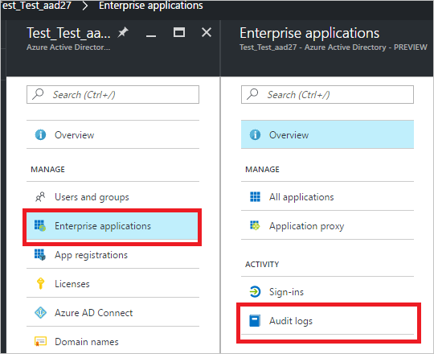

# Azure Active Directory 门户中的“审核活动”报告 

通过 Azure Active Directory (Azure AD) 中的报告，可以获取确定环境运行状况所需的信息。

Azure AD 中的报告体系结构由以下部分组成：

- **活动** 
    - **审核日志** - 针对 Azure AD 中的各种功能所做的所有更改进行日志记录，通过这些日志提供可跟踪性。 审核日志的示例包括对 Azure AD 中的任何资源（例如用户、应用、组、角色、策略、身份验证等）所做的更改。

本主题对审核活动进行了概述。
 
## 谁可以访问该数据？
- 安全管理员或安全读者角色中的用户
- 全局管理员
- 各用户（非管理员）可以查看自己的活动

## 审核日志

Azure Active Directory 中的审核日志为符合性提供系统活动的记录。  
所有审核数据的第一个入口点为 **Azure Active Directory** 的“活动”部分中的“审核日志”。

审核日志有一个默认列表视图，用于显示：

- 匹配项的日期和时间
- 活动的发起者/参与者（*谁*） 
- 活动（*内容*） 
- 目标

## 筛选审核日志

要将所报告数据的范围缩小到适当的级别，可以使用以下字段筛选审核数据：

- 日期范围
- 发起者（参与者/执行组件）
- 类别
- 活动资源类型
- 活动

“日期范围”筛选器用于定义已返回数据的时间范围。  
可能的值包括：

- 7 天
- 24 小时
- “自定义”

选择自定义时间范围时，可以配置开始时间和结束时间。

“发起者”筛选器用于定义参与者的名称或其通用主体名称 (UPN)。

“类别”筛选器用于选择下述筛选器之一：

- 全部
- 核心目录
- B2C
- 自助服务密码管理

“活动资源类型”筛选器用于选择下述筛选器之一：

- 全部 
- 应用程序
- 授权
- 键
- User
- 资源
- 组
- 角色
- Directory
- 身份验证

选择“组”作为“活动资源类型”时，会获得一个额外的筛选器类别，因此还可以提供“源”：

- Azure AD
- O365

“活动”筛选器基于类别以及所做的活动资源类型选择。 可以选择要查看的特定活动，也可以全选。 

若要获取所有审核活动的列表，可以使用图形 API https://graph.chinacloudapi.cn/$tenantdomain/activities/auditActivityTypes?api-version=beta，其中，$tenantdomain 为域名。

## 审核日志快捷方式

除了 **Azure Active Directory**，Azure 门户还提供了两个额外的进行数据审核的入口点：

- 用户
- 企业应用程序

### 用户审核日志

使用用户审核报表，可以获得如下问题的答案：

- 对用户应用了哪种类型的更新？

- 更改了多少用户？

- 更改了多少密码？

- 管理员在目录中做了什么？

- 添加了哪些组？

- 是否存在成员身份已更改的组？

- 是否已更改组的所有者？

- 向组或用户分配了哪些许可证？

如果只想查看与用户相关的审核数据，可以在“用户”的“活动”部分中的“审核日志”下方查找筛选视图。 此入口点已将“用户”作为预先选择的“活动资源类型”。

### 企业应用程序审核日志

通过基于应用程序的审核报表，可以获得如下问题的答案：

- 已添加或更新的应用程序有哪些？
- 已删除的应用程序有哪些？
- 应用程序的服务原则是否有变化？
- 应用程序的名称是否已更改？
- 哪些用户同意使用应用程序？

如果只想查看与应用程序相关的审核数据，可以在“企业应用程序”边栏选项卡的“活动”部分中的“审核日志”下方查找筛选视图。 

## 后续步骤

- 有关报告的概述，请参阅 [Azure Active Directory 报告](active-directory-reporting-azure-portal.md)。

- 有关所有审核活动的完整列表，请参阅 [Azure AD 审核活动参考](active-directory-reporting-activity-audit-reference.md)。

<!-- Update_Description: update metedata properties -->