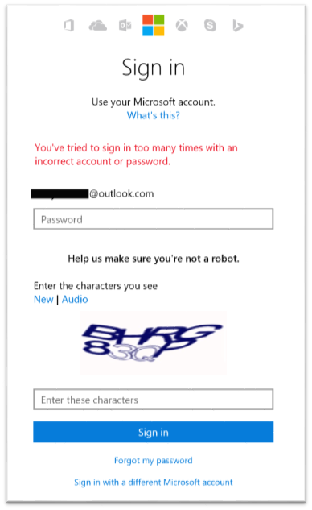

# Azure AD 密码安全性多层方法

本文介绍用户或管理员在保护 Azure Active Directory (Azure AD) 或 Microsoft 帐户时可遵循的一些最佳做法。

 > [!NOTE]
 > **是否因登录时遇到问题而浏览至此？** 如果是这样，[可按以下方式更改和重置密码](user-help/active-directory-passwords-update-your-own-password.md)。
 >
 > Azure AD 管理员可使用[在 Azure Active Directory 中重置用户密码](fundamentals/active-directory-users-reset-password-azure-portal.md)一文中的指南重置用户密码。
 >

## 密码要求

Azure AD 整合了以下常用功能用于保护密码：

- 密码长度要求
- 密码复杂性要求
- 常规和定期密码过期

有关 Azure Active Directory 中密码重置的信息，请参阅 [面向 IT 专业人员的 Azure AD 自助服务密码重置](user-help/active-directory-passwords-update-your-own-password.md)主题。

## Azure AD 密码保护

Azure AD 和 Microsoft 帐户系统利用行业认可的方法，保证安全保护用户和管理员的密码，包括：

- 动态阻止的密码
- 智能密码锁定

若要了解基于当前研究的密码管理，请参阅[密码指南](https://aka.ms/passwordguidance)白皮书。

### 动态阻止的密码

Azure AD 和 Microsoft 帐户通过动态阻止常用密码来保护密码。 Azure AD Identity Protection 团队将定期分析阻止的密码列表，防止用户选择常用的密码。 此服务适用于 Azure AD 和 Microsoft 帐户服务客户。

创建密码时，管理员有必要鼓励用户选择包含字母、数字、字符或单词的唯一组合的密码短语。 这样，用户密码基本上不可能遭到破解，同时便于记忆。

#### 密码漏洞

Microsoft 一直在努力，力求比网络罪犯先行一步。

Azure AD Identity Protection 团队会持续分析常用的密码。 网络罪犯也使用类似的策略发起攻击，例如，构建一个[彩虹表](https://en.wikipedia.org/wiki/Rainbow_table)来破解密码哈希。

Microsoft 会持续分析[数据破解](https://www.privacyrights.org/data-breaches)技巧以动态更新受禁密码列表，确保容易破解的密码在给 Azure AD 客户带来真正的威胁之前阻止这些密码。 有关我们目前在安全方面所做努力的详细信息，请参阅 [Microsoft 安全智能报告](https://www.microsoft.com/security/sir/default.aspx)。

### 智能密码锁定

当 Azure AD 检测到潜在的网络罪犯尝试侵入用户密码时，我们将使用智能密码锁定来锁定该用户帐户。 Azure AD 可以确定与特定登录会话关联的风险。 然后通过最新的安全数据，应用锁定语义来遏止网络威胁。

如果用户被锁定在 Azure AD 外部，其屏幕如下所示：

  

对于其他 Microsoft 帐户，其屏幕如下所示：

  

有关 Azure Active Directory 中密码重置的信息，请参阅 [面向 IT 专业人员的 Azure AD 自助服务密码重置](user-help/active-directory-passwords-update-your-own-password.md)主题。

  >[!NOTE]
  >如果是 Azure AD 管理员，可以使用 [Windows Hello](https://www.microsoft.com/windows/windows-hello) 来完全避免用户创建传统密码。
  >

## 后续步骤

- [如何更新自己的密码](user-help/active-directory-passwords-update-your-own-password.md)

<!-- Update_Description: link update -->