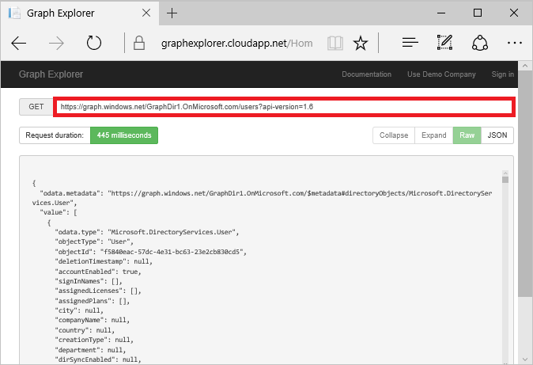

# <a name="quickstart-for-the-azure-ad-graph-api"></a>Azure AD 图形 API 快速入门
Azure Active Directory (AD) Graph API 通过 OData REST API 终结点提供对 Azure AD 的编程访问权限。 应用程序可以使用图形 API 对目录数据和对象执行创建、读取、更新和删除 (CRUD) 操作。 例如，可以使用 Graph API 创建新用户、查看或更新用户的属性、更改用户的密码、检查基于角色的访问的组成员身份、禁用或删除用户。 有关 Graph API 功能和应用方案的详细信息，请参阅 [Azure AD Graph API](https://msdn.microsoft.com/Library/Azure/Ad/Graph/api/api-catalog) 和 [Azure AD Graph API 先决条件](https://msdn.microsoft.com/library/hh974476.aspx)。 

> [!IMPORTANT]
> 强烈建议使用 [Microsoft Graph](https://developer.microsoft.com/zh-cn/graph/graph-explorer-china)（而非 Azure AD Graph API）访问 Azure Active Directory 资源。 目前，我们在集中开发 Microsoft Graph，未计划进一步改进 Azure AD Graph API。 Azure AD Graph API 仍可能适用的方案非常有限；有关详细信息，请参阅 Office 开发人员中心的 [Microsoft Graph or the Azure AD Graph](https://dev.office.com/blogs/microsoft-graph-or-azure-ad-graph)（Microsoft Graph 或 Azure AD Graph）博客文章。
> 
> 

## <a name="how-to-construct-a-graph-api-url"></a>如何构造图形 API URL
在 Graph API 中，若要访问要对其执行 CRUD 操作的目录数据和对象（即资源或实体），可以使用基于开放数据 (OData) 协议的 URL。 图形 API 中使用的 URL 包括四个主要部分：服务根、租户标识符、资源路径和查询字符串选项： `https://graph.chinacloudapi.cn/{tenant-identifier}/{resource-path}?[query-parameters]`。 以下面的 URL 为例： `https://graph.chinacloudapi.cn/contoso.com/groups?api-version=1.6`。

- **服务根**：在 Azure AD 图形 API 中，服务根始终是 https://graph.chinacloudapi.cn。
- **租户标识符**：此部分可以是已验证（注册）的域名，在前面示例中为 contoso.com。也可以是租户对象 ID 或者“myorganization”或“me”别名。 有关详细信息，请参阅[对 Graph API 中的实体和操作进行寻址](https://msdn.microsoft.com/Library/Azure/Ad/Graph/howto/azure-ad-graph-api-operations-overview)。
- **资源路径**：URL 的此部分标识要交互的资源（用户、组、特定用户或特定组，等等）。在上面的示例中，它是用于对资源集寻址的顶级“组”。 也可以对特定的实体寻址，例如“users/{objectId}”或“users/userPrincipalName”。
- **查询参数**：问号 (?) 用于分隔资源路径部分与查询参数部分。 需要对图形 API 中的所有请求提供“Api-version”查询参数。 Graph API 还支持以下 OData 查询选项：**$filter**、**$orderby**、**$expand**、**$top** 和 **$format**。 当前不支持以下查询选项：**$count**、**$inlinecount** 和 **$skip**。 有关详细信息，请参阅 [Azure AD 图形 API 支持的查询、筛选和分页选项](https://msdn.microsoft.com/Library/Azure/Ad/Graph/howto/azure-ad-graph-api-supported-queries-filters-and-paging-options)。

## <a name="graph-api-versions"></a>图形 API 版本
可以在“api-version”查询参数中指定图形 API 请求的版本。 对于版本 1.5 及更高版本，使用数字版本值：api-version=1.6。 对于早期版本，使用遵循 YYYY-MM-DD 格式的日期字符串；例如，api-version=2013-11-08。 对于预览功能，使用字符串“beta”；例如，api-version=beta。 若要详细了解图形 API 版本之间的差异，请参阅 [Azure AD 图形 API 版本控制](https://msdn.microsoft.com/Library/Azure/Ad/Graph/howto/azure-ad-graph-api-versioning)。

## <a name="graph-api-metadata"></a>图形 API 元数据
若要返回 Graph API 元数据文件，请在 URL 中的租户标识符后面添加“$metadata”段。例如，以下 URL 将返回演示公司元数据：`https://graph.chinacloudapi.cn/GraphDir1.partner.onmschina.cn/$metadata?api-version=1.6`。 可以在 Web 浏览器的地址栏中输入此 URL 来查看元数据。 返回的 CSDL 元数据文档描述了实体和复杂类型及其属性，以及请求的 Graph API 版本公开的函数和操作。 省略 api-version 参数将返回最新版本的元数据。

## <a name="common-queries"></a>常见查询
[Azure AD 图形 API 常见查询](https://msdn.microsoft.com/Library/Azure/Ad/Graph/howto/azure-ad-graph-api-supported-queries-filters-and-paging-options#CommonQueries) 列出了可与 Azure AD Graph 配合使用的常见查询，包括可用于访问目录中顶层资源的查询，以及用于在目录中执行操作的查询。

例如， `https://graph.chinacloudapi.cn/contoso.com/tenantDetails?api-version=1.6` 返回目录 contoso.com 的公司信息。

`https://graph.chinacloudapi.cn/contoso.com/users?api-version=1.6` 列出目录 contoso.com 中的所有用户对象。

## <a name="using-the-graph-explorer"></a>使用图形资源管理器
生成应用程序时，可以使用 Azure AD 图形 API 的图形资源管理器来查询目录数据。

下面是导航到 Graph 资源管理器，登录并输入 `https://graph.chinacloudapi.cn/GraphDir1.partner.onmschina.cn/users?api-version=1.6` 以显示已登录用户目录中的所有用户时会看到的输出：



**加载图形资源管理器**：若要加载该工具，请导航到 [https://graphexplorerchina.azurewebsites.net/](https://graphexplorerchina.azurewebsites.net/)。 单击“登录”，并使用 Azure AD 帐户凭据登录，以针对租户运行 Graph 资源资源器。 如果你针对自己的租户运行 Graph 资源资源器，则你或管理员需要在登录期间表示同意。 如果拥有 Office 365 订阅，则会自动拥有 Azure AD 租户。 用于登录 Office 365 的凭据事实上就是 Azure AD 帐户，可以在图形资源资源器上使用这些凭据。

**运行查询**：若要运行查询，请在请求文本框中键入查询，然后单击“获取”或单击 **Enter** 键。 结果将显示在响应框中。 例如，`https://graph.chinacloudapi.cn/myorganization/groups?api-version=1.6` 将列出已登录用户目录中的所有组对象。

请注意，图形资源管理器具有以下功能与限制：

- 对资源集的自动完成功能。 若要查看此功能，请单击请求文本框（公司 URL 出现的位置）。 可以从下拉列表中选择资源集。
- 支持“me”和“myorganization”寻址别名。 例如，可以使用 `https://graph.chinacloudapi.cn/me?api-version=1.6` 来返回登录用户的用户对象，或者使用 `https://graph.chinacloudapi.cn/myorganization/users?api-version=1.6` 来返回当前目录中的所有用户。
- 响应标头部分。 此部分可用来帮助排查运行查询时所发生的问题。
- 具有展开和折叠功能的 JSON 响应查看器。
- 不支持显示缩略图照片。

## <a name="using-fiddler-to-write-to-the-directory"></a>使用 Fiddler 写入目录
在本快速入门指南中，可以使用 Fiddler Web 调试器来练习对 Azure AD 目录执行“写入”操作。 若要了解更多信息并安装 Fiddler，请参阅 [http://www.telerik.com/fiddler](http://www.telerik.com/fiddler)。

以下示例使用 Fiddler Web 调试器在 Azure AD 目录中创建一个新的安全组“MyTestGroup”。

**获取访问令牌**：若要访问 Azure AD Graph，客户端需要先成功地向 Azure AD 进行身份验证。 有关详细信息，请参阅 [Azure AD 的身份验证方案](active-directory-authentication-scenarios.md)。

**编写和运行查询**：请完成以下步骤：

1. 打开 Fiddler Web 调试器并切换到“编辑器”选项卡。
2. 由于要创建新的安全组，因此请从下拉菜单中选择“发布”作为 HTTP 方法。 有关对组对象的操作和权限的详细信息，请参阅 [Azure AD Graph REST API 参考](https://msdn.microsoft.com/Library/Azure/Ad/Graph/api/api-catalog)中的[组](https://msdn.microsoft.com/Library/Azure/Ad/Graph/api/entity-and-complex-type-reference#GroupEntity)。
3. 在“发布”旁边的字段中，键入以下内容作为请求 URL：`https://graph.chinacloudapi.cn/mytenantdomain/groups?api-version=1.6`。
   
   > [!NOTE]
   > 必须将 mytenantdomain 替换成自己的 Azure AD 目录的域名。
   > 
   > 
4. 在紧靠在“发布”下拉列表下面的字段中，键入以下内容：
   
    ```
   Host: graph.chinacloudapi.cn
   Authorization: Bearer <your access token>
   Content-Type: application/json
   ```
   
   > [!NOTE]
   > 将 &lt;your access token&gt; 替换为你的 Azure AD 目录的访问令牌。
   > 
   > 
5. 在“请求正文”字段中键入以下内容： 
   
    ```
        {
            "displayName":"MyTestGroup",
            "mailNickname":"MyTestGroup",
            "mailEnabled":"false",
            "securityEnabled": true
        }
   ```
   
    有关创建组的详细信息，请参阅 [创建组](https://msdn.microsoft.com/Library/Azure/Ad/Graph/api/groups-operations#CreateGroup)。

有关 Graph 公开的 Azure AD 实体和类型的详细信息，以及有关可以使用 Graph 对它们执行的操作的信息，请参阅 [Azure AD Graph REST API 参考](https://msdn.microsoft.com/Library/Azure/Ad/Graph/api/api-catalog)。

## <a name="next-steps"></a>后续步骤
- 了解有关 [Azure AD 图形 API](https://msdn.microsoft.com/Library/Azure/Ad/Graph/api/api-catalog)
- 了解有关 [Azure AD 图形 API 权限范围](https://msdn.microsoft.com/Library/Azure/Ad/Graph/howto/azure-ad-graph-api-permission-scopes)


<!-- Update_Description: wording update -->