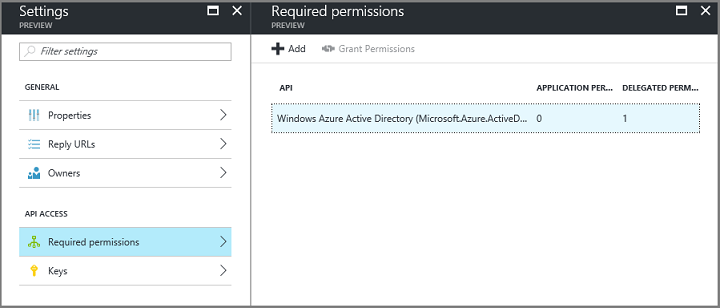
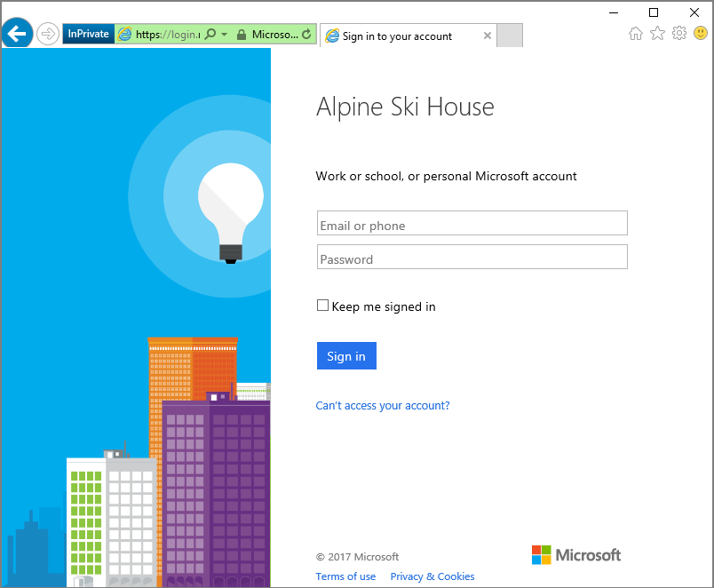

# <a name="integrating-applications-with-azure-active-directory"></a>将应用程序与 Azure Active Directory 集成
[!INCLUDE [active-directory-devguide](../../../includes/active-directory-devguide.md)]

企业开发人员和软件即服务 (SaaS) 提供商可以开发能够与 Azure Active Directory (Azure AD) 集成的商业云服务或业务线应用程序，以针对其服务提供安全的登录和授权。 若要将某个应用程序或服务与 Azure AD 进行集成，开发人员必须先将该应用程序注册到 Azure AD。

本文说明如何在 Azure AD 中添加、更新或删除应用程序的注册。 其中介绍了可与 Azure AD 集成的不同类型的应用程序，以及如何将应用程序配置为访问其他资源（例如 Web API 等等）。

若要详细了解表示已注册应用程序的两个 Azure AD 对象及其关系，请参阅[应用程序对象和服务主体对象](active-directory-application-objects.md)；若要详细了解利用 Azure Active Directory 开发应用程序时应使用的品牌准则，请参阅[适用于集成应用的品牌准则](active-directory-branding-guidelines.md)。

## <a name="adding-an-application"></a>添加应用程序
任何想要使用 Azure AD 功能的应用程序都必须先在 Azure AD 租户中注册。 此注册过程涉及到提供有关应用程序的 Azure AD 详细信息，例如，该应用程序所在位置的 URL、对用户进行身份验证后用于发送答复的 URL、用于标识应用程序的 URI，等等。

### <a name="to-register-a-new-application-using-the-azure-portal"></a>使用 Azure 门户注册新应用程序
1. 登录到 [Azure 门户](https://portal.azure.cn)。
2. 如果你的帐户有权访问多个租户，请在右上角单击该帐户，并将门户会话设置为所需的 Azure AD 租户。
3. 在左侧导航窗格中，依次单击“Azure Active Directory”服务、“应用注册”、“新建应用程序注册”。

   

4. 出现“创建”页后，请输入应用程序的注册信息： 

    - **名称：** 输入一个有意义的应用程序名称
    - **应用程序类型：** 
      - 为安装在设备本地的[客户端应用程序](active-directory-dev-glossary.md#client-application)选择“本机”。 此设置用于 OAuth 公共[本机客户端](active-directory-dev-glossary.md#native-client)。
      - 为安装在安全服务器上的[客户端应用程序](active-directory-dev-glossary.md#client-application)和[资源/API 应用程序](active-directory-dev-glossary.md#resource-server)选择“Web 应用/API”。 此设置用于 OAuth 机密性 [Web 客户端](active-directory-dev-glossary.md#web-client)和公共的[基于用户代理的客户端](active-directory-dev-glossary.md#user-agent-based-client)。 相同的应用程序还可以公开客户端和资源/API。
    - **登录 URL：** 对于“Web 应用/API”应用程序，请提供应用的基 URL。 例如，`http://localhost:31544` 可以是本地计算机上运行的 Web 应用的 URL。 用户将使用此 URL 登录到 Web 客户端应用程序。 
    - **重定向 URI：** 对于“本机”应用程序，请提供 Azure AD 返回令牌响应时所用的 URI。 输入特定于应用程序的值，例如 `http://MyFirstAADApp`

    

    如需 Web 应用程序或本机应用程序的特定示例，请查看[快速入门](active-directory-developers-guide.md#get-started)。

5. 完成后，单击“创建”。 Azure AD 会将唯一的应用程序 ID 分配给应用程序，同时你会转到应用程序的注册主页。 根据应用程序是 Web 应用程序还是本机应用程序，会提供不同的选项用于将更多功能添加到应用程序。 请参阅下一部分了解许可概述，以及有关在应用程序注册中启用更多配置功能（凭据、权限、使用户能够从其他租户登录）的详细信息。

  > [!NOTE]
  > 默认情况下，新注册的应用程序配置为**只**允许同一租户中的用户登录到应用程序。
  > 
  > 

## <a name="updating-an-application"></a>更新应用程序
将应用程序注册到 Azure AD 后，可能需要更新该应用程序才能访问 Web API、使其可在其他组织中使用等。 本部分介绍可以通过哪些不同的方法来进一步配置应用程序。 首先概述许可框架，在生成其他用户或应用程序需要使用的应用程序时，必须理解此概念。

### <a name="overview-of-the-consent-framework"></a>同意框架概述

使用 Azure AD 许可框架可以轻松开发多租户 Web 应用程序和本机客户端应用程序，包括多层应用程序。 这些应用程序允许与应用程序所注册到的租户不同的 Azure AD 租户中的用户帐户登录。 这些帐户除了需要访问你自己的 Web API 以外，可能还需要访问 Microsoft 图形 API 等 Web API（以访问 Azure Active Directory、Intune，以及 Office 365 中的服务）和其他 Microsoft 服务 API。 该框架基于某个用户或管理员，该用户或管理员允许某个应用程序在其目录中注册，这可能涉及到访问目录数据。

例如，如果某个 Web 客户端应用程序需要从 Office 365 中读取关于用户的日历信息，则该用户首先需要许可该客户端应用程序。 同意后，该客户端应用程序能够代表该用户调用 Microsoft Graph API，并根据需要使用日历信息。 [Microsoft 图形 API](https://graph.microsoft.io) 可用来访问 Office 365 中的数据（例如日历、来自 Exchange 的邮件、来自 SharePoint 的站点和列表、来自 OneDrive 的文档、来自 OneNote 的笔记本、来自 Planner 的任务、来自 Excel 的工作簿，等等）、Azure AD 中的用户和组以及更多 Azure 云服务中的其他数据对象。 

同意框架使用公共或机密客户端，建立在 OAuth 2.0 及其各种流程的基础之上，例如，代码授权和客户端凭据授权。 通过使用 OAuth 2.0，可以在 Azure AD 中生成多种不同类型的客户端应用程序（例如手机、平板电脑、服务器或 Web 应用程序），并获取对所需资源的访问权限。

有关将许可框架与 OAuth2.0 授权配合使用的详细信息，请参阅[使用 OAuth 2.0 和 Azure AD 授权访问 Web 应用程序](active-directory-protocols-oauth-code.md)及 [Azure AD 的身份验证方案](active-directory-authentication-scenarios.md)。 有关通过 Microsoft Graph 获取 Office 365 的授权访问权限的信息，请参阅[使用 Microsoft Graph 进行应用身份验证](https://graph.microsoft.io/docs/authorization/auth_overview)。

#### <a name="example-of-the-consent-experience"></a>同意体验示例

以下步骤说明应用程序开发人员和用户如何使用许可体验。

1. 假设某个 Web 客户端应用程序需要请求资源/API 的特定访问权限。 下一部分将介绍如何执行此配置，但实质上，配置时需使用 Azure 门户来声明权限请求。 这些配置与其他配置设置一样，将会成为应用程序的 Azure AD 注册的一部分：
   
    
    
2. 考虑已更新应用程序的权限，该应用程序正在运行，并且某个用户即将首次使用该应用程序。 首先，应用程序需要从 Azure AD 的 `/authorize` 终结点获取授权代码。 然后，可以使用该授权代码获取新的访问令牌和刷新令牌。

3. 如果用户尚未经过身份验证，Azure AD 的 `/authorize` 终结点会提示登录。
   
    

4. 用户登录后，Azure AD 将决定是否要向该用户显示同意页。 根据该用户（或其组织的管理员）是否已授予应用程序许可而决定。 如果尚未授予许可，Azure AD 会提示用户授予许可，并显示运行该应用程序所需的权限。 许可对话框中显示的权限集与在 Azure 门户中的“委托权限”中选择的权限集相匹配。
   
    

5. 用户授予许可后，授权代码会返回到应用程序，应用程序可凭此获取访问令牌和刷新令牌。 有关此流程的详细信息，请参阅[“Azure AD 的身份验证方案”中的“从 Web 应用程序到 Web API”部分](active-directory-authentication-scenarios.md#web-application-to-web-api)。

6. 作为管理员，还可以代表租户中的所有用户同意应用程序的委派权限。 管理许可可防止针对租户中的每个用户显示许可对话框，可在 [Azure 门户](https://portal.azure.cn)上的应用程序页中执行。 在应用程序的“设置”页，单击“所需权限”，再单击“授予权限”按钮。 

    
    
    > [!NOTE]
    > 使用 ADAL.js 的单页应用程序 (SPA) 目前要求使用“授予权限”按钮授予显式许可。 否则，在请求访问令牌时应用程序会失败。   

### <a name="configure-a-client-application-to-access-web-apis"></a>将客户端应用程序配置为访问 Web API
为使 Web/机密客户端应用程序能够参与要求身份验证的授权流程（以及获取访问令牌），必须建立安全凭据。 Azure 门户支持的默认身份验证方法为“客户端 ID + 机密密钥”。 本部分介绍需要执行哪些配置步骤来提供客户端凭据的机密密钥。

此外，在客户端可以访问资源应用程序公开的 Web API（例如 Microsoft 图形 API）之前，许可框架可确保客户端根据请求的权限获取所需的授权。 默认情况下，所有应用程序可以从“Azure Active Directory”（图形 API）和“Azure 服务管理 API”中选择权限。 此外，默认已选择[图形 API 的“登录并读取用户配置文件”权限](https://msdn.microsoft.com/Library/Azure/Ad/Graph/howto/azure-ad-graph-api-permission-scopes#PermissionScopeDetails)。 如果正在某个租户中注册客户端，并且该租户包含已订阅 Office 365 的帐户，则可以选择 SharePoint 与 Exchange Online 的 Web API 和权限。 可以从每个所需 Web API 的[两种类型的权限](active-directory-dev-glossary.md#permissions)中进行选择：

- 应用程序权限：客户端应用程序需要亲自直接访问 Web API（无用户上下文）。 此类型的权限需要管理员同意，并且不可用于本机客户端应用程序。

- 委托的权限：客户端应用程序需要以登录用户的身份访问 Web API，但访问权限受所选权限的限制。 除非权限需要管理员许可，否则用户可以授予此类型的权限。 

    > [!NOTE]
    > 将委托权限添加到应用程序不会自动向租户中的用户授予许可。 在运行时，用户仍必须手动许可添加的委托权限，除非管理员在 Azure 门户的应用程序页的“所需权限”部分中单击“授予权限”按钮。 

#### <a name="to-add-application-credentials-or-permissions-to-access-web-apis"></a>添加用于访问 Web API 的应用程序凭据或权限
1. 登录到 [Azure 门户](https://portal.azure.cn)。
2. 如果你的帐户有权访问多个租户，请在右上角单击该帐户，并将门户会话设置为所需的 Azure AD 租户。
3. 在左侧导航窗格中，依次单击“Azure Active Directory”服务、“应用注册”，并找到/单击想要配置的应用程序。

   

4. 随后会转到应用程序的注册主页，并打开应用程序的“设置”页。 若要添加 Web 应用程序凭据的机密密钥，请执行以下操作：
    - 在“设置”页上单击“密钥”部分。  
    - 添加密钥的说明。
    - 选择一年或两年持续时间。
    - 单击“保存” 。 保存配置更改后，最右边的列将包含密钥值。 **请务必复制密钥**以便在客户端应用程序代码中使用，因为退出此页后无可访问此密钥。

    

5. 添加从客户端访问资源 API 的权限
    - 在“设置”页上单击“所需权限”部分。 
    - 单击“添加”按钮。
    - 单击“选择 API”，选择所需的资源类型。
    - 浏览可用 API 列表，或使用搜索框从公开 Web API 的目录中的可用资源应用程序中进行选择。 单击感兴趣的资源，并单击“选择”。
    - 随后会转到“启用访问权限”页。 选择应用程序在访问 API 时所需的应用程序权限和/或委托权限。
    
    

    

6. 完成后，在“启用访问权限”页上单击“选择”按钮，并在“添加 API 访问权限”页上单击“完成”按钮。 随后会返回到“所需权限”页，其中的新资源已添加到 API 列表。

    > [!NOTE]
    > 单击“完成”按钮还会基于配置的“对其他应用程序的权限”自动为目录中的应用程序设置权限。  可以在应用程序“设置”页上查看这些应用程序权限。
    > 
    > 

### <a name="configuring-a-resource-application-to-expose-web-apis"></a>将资源应用程序配置为公开 Web API

可以开发一个 Web API，并通过公开访问[范围](active-directory-dev-glossary.md#scopes)和[角色](active-directory-dev-glossary.md#roles)使其可供其他客户端应用程序使用。 可以像提供其他 Microsoft Web API（包括图形 API 和 Office 365 API）一样提供正确配置的 Web API。 可通过[应用程序清单](active-directory-dev-glossary.md#application-manifest)公开访问范围和角色。应用程序清单是表示应用程序标识配置的 JSON 文件。 

以下部分说明如何通过修改资源应用程序的清单公开访问范围。

#### <a name="adding-access-scopes-to-your-resource-application"></a>将访问权限范围添加到资源应用程序

1. 登录到 [Azure 门户](https://portal.azure.cn)。
2. 如果你的帐户有权访问多个租户，请在右上角单击该帐户，并将门户会话设置为所需的 Azure AD 租户。

3. 在左侧导航窗格中，依次单击“Azure Active Directory”服务、“应用注册”，并找到/单击想要配置的应用程序。

   

4. 随后会转到应用程序的注册主页，并打开应用程序的“设置”页。 单击应用程序注册页中的“清单”切换到“编辑清单”页。 此时会打开一个基于 Web 的清单编辑器，可在其中**编辑**门户中的清单。 （可选）可以单击“下载”并在本地进行编辑，然后使用“上传”将清单重新应用到应用程序。

5. 本示例通过将以下 JSON 元素添加到 `oauth2Permissions` 集合，在资源/API 中公开一个名为 `Employees.Read.All` 的新范围。 现有的 `user_impersonation` 范围是在注册期间默认提供的。 `user_impersonation` 允许客户端应用程序使用登录用户的标识请求资源的访问权限。 请务必在现有 `user_impersonation` 范围元素的后面添加逗号，并根据资源的需求更改属性值。 

    ```json
    {
      "adminConsentDescription": "Allow the application to have read-only access to all Employee data.",
      "adminConsentDisplayName": "Read-only access to Employee records",
      "id": "2b351394-d7a7-4a84-841e-08a6a17e4cb8",
      "isEnabled": true,
      "type": "User",
      "userConsentDescription": "Allow the application to have read-only access to your Employee data.",
      "userConsentDisplayName": "Read-only access to your Employee records",
      "value": "Employees.Read.All"
    }
    ```
    > [!NOTE]
    > ID 值必须使用 GUID 生成工具（如 [guidgen](https://msdn.microsoft.com/library/ms241442%28v=vs.80%29.aspx)）或以编程方式生成。 此 ID 表示 Web API 公开的范围的唯一标识符。 为客户端配置访问 Web API 的适当权限后，Azure AD 将为它颁发 OAuth2.0 访问令牌。 当客户端调用 Web API 时，会出示该访问令牌，其中的范围 (scp) 声明设置为客户端应用程序注册中请求的权限。
    >
    > 以后可以根据需要公开其他范围。 请考虑 Web API 可能要公开与各种不同功能关联的多个范围。 在运行时，资源可以通过评估所收到的 OAuth 2.0 访问令牌中的范围 (`scp`) 声明，来控制对 Web API 的访问。
    > 

6. 完成后，单击“保存”。 现在，Web API 已配置为可供目录中的其他应用程序使用。  

    

#### <a name="verify-the-web-api-is-exposed-to-other-applications-in-your-tenant"></a>验证 Web API 是否已公开给租户中的其他应用程序
1. 返回到 Azure AD 租户，再次单击“应用注册”，然后找到/单击想要配置的客户端应用程序。

   

2. 重复[将客户端应用程序配置为访问 Web API](#configure-a-client-application-to-access-web-apis) 中所述的步骤 5。 执行到“选择 API”这一步时，请在搜索字段中输入资源的应用程序名称以搜索该资源，并单击“选择”。 

3. 在“启用访问权限”页上，应会看到客户端权限请求可用的新范围。

    

#### <a name="more-on-the-application-manifest"></a>有关应用程序清单的更多信息

应用程序清单实际上充当了用于更新应用程序实体的机制，它定义了 Azure AD 应用程序的标识配置的所有属性，包括本文所述的 API 访问权限范围。 有关应用程序实体及其架构的详细信息，请参阅[图形 API 应用程序实体文档](https://msdn.microsoft.com/Library/Azure/Ad/Graph/api/entity-and-complex-type-reference#application-entity)。 此文包含有关用于指定 API 权限的应用程序实体成员的完整参考信息，包括：  

- appRoles 成员，用于定义 Web API 的[应用程序权限](active-directory-dev-glossary.md#permissions)的 [AppRole](https://msdn.microsoft.com/Library/Azure/Ad/Graph/api/entity-and-complex-type-reference#approle-type) 实体集合。 
- oauth2Permissions 成员，用于定义 Web API 的[委托权限](active-directory-dev-glossary.md#permissions)的 [OAuth2Permission](https://msdn.microsoft.com/Library/Azure/Ad/Graph/api/entity-and-complex-type-reference#oauth2permission-type) 实体集合。

有关应用程序清单概念的一般详细信息，请参阅[了解 Azure Active Directory 应用程序清单](active-directory-application-manifest.md)。

### <a name="accessing-the-azure-ad-graph-and-office-365-via-microsoft-graph-apis"></a>通过 Microsoft Graph API 访问 Azure AD Graph 和 Office 365  

如前所述，除了在自己的应用程序上公开/访问 API 以外，还可以注册客户端应用程序以访问 Microsoft 资源公开的 API。 Microsoft 图形 API（在门户的资源/API 列表中称为“Microsoft Graph”）可供注册到 Azure AD 的所有应用程序使用。 如果要将客户端应用程序注册到包含已注册 Office 365 订阅的租户中，也可以访问各种 Office 365 资源公开的范围。

有关 Microsoft 图形 API 公开的范围的完整讨论，请参阅[权限范围 | Microsoft 图形 API 概念](https://graph.microsoft.io/docs/authorization/permission_scopes)一文。

> [!NOTE]
> 由于当前存在的限制，如果本机客户端应用程序使用“访问组织的目录”权限，则它们只能调用 Azure AD 图形 API。 此限制不适用于 Web 应用程序。
> 
> 

### <a name="configuring-multi-tenant-applications"></a>配置多租户应用程序

在 Azure AD 中注册应用程序时，可以希望应用程序只能由组织中的用户访问。 或者，可能还希望应用程序可由外部组织中的用户访问。 这两种应用程序分别称为单租户应用程序和多租户应用程序。 本部分介绍如何修改单租户应用程序的配置，使其成为多租户应用程序。

请务必注意单租户应用程序与多租户之间的差别：  

- 单租户应用程序预定在一家组织中使用。 它通常是企业开发人员编写的业务线 (LoB) 应用程序。 只有在与应用程序注册相同的租户中具有帐户的用户才能访问单租户应用程序。 因此，只需在一个目录中预配此类应用程序。
- 多租户应用程序预定在多家组织中使用。 它称为软件即服务 (SaaS) Web 应用程序，通常由独立软件供应商 (ISV) 编写。 必须在用户需要访问权限的每个租户中预配多租户应用程序。 对于除注册了应用程序以外的其他租户，需要经过用户或管理员的许可才能注册此类应用程序。 请注意，默认情况下，本机客户端应用程序都是多租户的，因为它们安装在资源所有者的设备上。 有关许可框架的详细信息，请参阅前面的[许可框架概述](#overview-of-the-consent-framework)部分。

使应用程序成为多租户应用程序需要对应用程序注册进行更改，同时还需要对 Web 应用程序本身进行更改。 以下部分介绍了这两项操作。

#### <a name="changing-the-application-registration-to-support-multi-tenant"></a>更改应用程序注册以支持多租户

如果正在编写一个要供组织外部的客户或合作伙伴使用的应用程序，则需要在 Azure 门户中更新应用程序定义。

> [!IMPORTANT]
> Azure AD 要求多租户应用程序的应用 ID URI 全局唯一。 应用 ID URI 是在协议消息中标识应用程序的方式之一。 就单租户应用程序而言，应用 ID URI 在该租户中保持唯一便已足够。 就多租户应用程序而言，该 URI 必须全局唯一，以便 Azure AD 能够在所有租户中找到该应用程序。 系统通过要求应用 ID URI 必须具有与已验证 Azure AD 租户域匹配的主机名，来强制实施全局唯一性。 例如，如果租户的名称为 contoso.onmicrosoft.com，则有效的应用 ID URI 为 https://contoso.partner.onmschina.cn/myapp。 如果租户具有已验证的域 contoso.com，则有效的应用 ID URI 也是 https://contoso.com/myapp。 如果应用程序 ID URI 不遵循此模式，则将应用程序设置为多租户就会失败。
> 

要使外部用户能够访问应用程序，请执行以下操作： 

1. 登录到 [Azure 门户](https://portal.azure.cn)。
2. 如果你的帐户有权访问多个租户，请在右上角单击该帐户，并将门户会话设置为所需的 Azure AD 租户。
3. 在左侧导航窗格中，依次单击“Azure Active Directory”服务、“应用注册”，并找到/单击想要配置的应用程序。 随后会转到应用程序的注册主页，并打开应用程序的“设置”页。
4. 在“设置”页中单击“属性”，并将“多租户”开关切换为“是”。

完成更改后，其他组织中的用户和管理员可以授权其用户登录到你的应用程序，使该应用程序能够访问其租户保护的资源。

#### <a name="changing-the-application-to-support-multi-tenant"></a>更改应用程序以支持多租户

对多租户应用程序的支持在很大程度上依赖于 Azure AD 许可框架。 许可是一种机制，可让其他租户中的用户向应用程序授予对用户租户所保护资源的访问权限。 这种体验称为“用户许可”。

Web 应用程序还可以：

- 让管理员“注册我的公司”。 这种体验称为“管理员许可”，使管理员能够代表其组织中的所有用户授予许可。 只有使用属于全局管理员角色的帐户进行身份验证的用户才能提供管理员许可；其他人会收到错误。

- 用户的注册体验。 预期会为用户提供一个“注册”按钮，单击该按钮可将浏览器重定向到 Azure AD OAuth2.0 `/authorize` 终结点或 OpenID Connect `/userinfo` 终结点。 这些终结点使应用程序可以检查 id_token，从而获取有关新用户的信息。 完成注册阶段后，用户会看到许可提示，与[许可框架概述](#overview-of-the-consent-framework)部分中所示的提示类似。

有关需要进行哪些应用程序更改才能支持多租户访问和登录/注册体验的详细信息，请参阅：

- [如何使用多租户应用程序模式将任何 Azure Active Directory (AD) 用户登录](active-directory-devhowto-multi-tenant-overview.md)
- [多租户代码示例](https://azure.microsoft.com/documentation/samples/?service=active-directory&term=multi-tenant)列表。 

### <a name="enabling-oauth-20-implicit-grant-for-single-page-applications"></a>为单页面应用程序启用 OAuth 2.0 隐式授权

通常将单页面应用程序 (SPA) 构建为一个在浏览器中运行的 JavaScript 重型前端，该前端调用应用程序的 Web API 后端来执行其业务逻辑。 对于托管在 Azure AD 中的 SPA，可以使用 OAuth 2.0 隐式授权对具有 Azure AD 的用户进行身份验证，并获取可用来保护从应用程序 JavaScript 客户端到其后端 Web API 的调用的令牌。 

用户授予同意之后，可以使用同一个身份验证协议来获取令牌以保护客户端与针对应用程序配置的其他 Web API 资源之间的调用。 若要了解有关隐式授权的详细信息，并确定其是否适合应用程序方案，请参阅[了解 Azure Active Directory 中的 OAuth2 隐式授权流](active-directory-dev-understanding-oauth2-implicit-grant.md)。

默认情况下，为应用程序禁用了 OAuth 2.0 隐式授权。 也可通过在应用程序的[应用程序清单](active-directory-application-manifest.md)中设置 `oauth2AllowImplicitFlow` 值，为应用程序启用 OAuth 2.0 隐式授权。

#### <a name="to-enable-oauth-20-implicit-grant"></a>启用 OAuth 2.0 隐式授权

> [!NOTE]
> 有关如何编辑应用程序清单的详细信息，请务必先阅读前一部分[将资源应用程序配置为公开 Web API](#configuring-a-resource-application-to-expose-web-apis)。
>

1. 登录到 [Azure 门户](https://portal.azure.cn)。
2. 如果你的帐户有权访问多个租户，请在右上角单击该帐户，并将门户会话设置为所需的 Azure AD 租户。
3. 在左侧导航窗格中，依次单击“Azure Active Directory”服务、“应用注册”，并找到/单击想要配置的应用程序。 随后会转到应用程序的注册主页，并打开应用程序的“设置”页。
4. 单击应用程序注册页中的“清单”切换到“编辑清单”页。 此时会打开一个基于 Web 的清单编辑器，可在其中**编辑**门户中的清单。 找到“oauth2AllowImplicitFlow”值并将其设置为“true”。 此值默认设置为“false”。
   
    ```json
    "oauth2AllowImplicitFlow": true,
    ```
5. 保存更新的清单。 保存后，Web API 即已配置为使用 OAuth 2.0 隐式授权来对用户进行身份验证。

## <a name="removing-an-application"></a>删除应用程序
本部分介绍如何从 Azure AD 租户中删除应用程序的注册。

### <a name="removing-an-application-authored-by-your-organization"></a>删除组织编写的应用程序
组织已注册的应用程序显示在租户的“应用注册”主页上的“我的应用”筛选器下。 这些应用程序是通过 Azure 门户手动注册的，或者通过 PowerShell 或图形 API 以编程方式注册的。 更具体地说，它们由租户中的应用程序与服务主体对象表示。 有关详细信息，请参阅[应用程序对象和服务主体对象](active-directory-application-objects.md)。

#### <a name="to-remove-a-single-tenant-application-from-your-directory"></a>从目录中删除单租户应用程序
1. 登录到 [Azure 门户](https://portal.azure.cn)。
2. 如果你的帐户有权访问多个租户，请在右上角单击该帐户，并将门户会话设置为所需的 Azure AD 租户。
3. 在左侧导航窗格中，依次单击“Azure Active Directory”服务、“应用注册”，并找到/单击想要配置的应用程序。 随后会转到应用程序的注册主页，并打开应用程序的“设置”页。
4. 在应用程序的注册主页中，单击“删除”。
5. 在确认消息中单击“是”  。

#### <a name="to-remove-a-multi-tenant-application-from-its-home-directory"></a>将多租户应用程序从其主目录中删除
1. 登录到 [Azure 门户](https://portal.azure.cn)。
2. 如果你的帐户有权访问多个租户，请在右上角单击该帐户，并将门户会话设置为所需的 Azure AD 租户。
3. 在左侧导航窗格中，依次单击“Azure Active Directory”服务、“应用注册”，并找到/单击想要配置的应用程序。 随后会转到应用程序的注册主页，并打开应用程序的“设置”页。
4. 在“设置”页中，选择“属性”并将“多租户”开关切换为“否”，以便先将应用程序更改为单租户，再单击“保存”。 应用程序的服务主体对象会保留在已许可该应用程序的所有组织的租户中。
5. 在应用程序的注册主页中单击“删除”按钮。
6. 在确认消息中单击“是”  。

### <a name="removing-a-multi-tenant-application-authorized-by-another-organization"></a>删除其他组织授权的多租户应用程序
在租户的“应用注册”主页上的“所有应用”筛选器下面显示的一部分应用程序（“所有应用”注册除外）是多租户应用程序。 从技术上讲，这些多租户应用程序来自另一个租户，并已在许可过程中注册到你的租户。 更具体地说，它们仅由租户中的服务主体对象表示，没有相应的应用程序对象。 有关应用程序对象与服务主体对象之间的差别的详细信息，请参阅 [Azure AD 中的应用程序对象和服务主体对象](active-directory-application-objects.md)。

若要删除多租户应用程序对目录的访问权限（在授予许可后），公司管理员必须删除该应用程序的服务主体。 管理员必须拥有全局管理员访问权限，并可以通过 Azure 门户或使用 [Azure AD PowerShell Cmdlet](http://go.microsoft.com/fwlink/?LinkId=294151) 删除访问权限。

## <a name="next-steps"></a>后续步骤
- 有关 Azure AD 中的身份验证工作原理的详细信息，请参阅 [Azure AD 的身份验证方案](active-directory-authentication-scenarios.md)。
- 有关应用可视化指南的提示，请参阅[集成应用的品牌准则](active-directory-branding-guidelines.md)。
- 有关应用程序的应用程序对象与服务主体对象之间关系的详细信息，请参阅[应用程序对象和服务主体对象](active-directory-application-objects.md)。
- 若要了解有关应用程序清单扮演的角色的详细信息，请参阅[了解 Azure Active Directory 应用程序清单](active-directory-application-manifest.md)
- 请参阅[Azure AD 开发人员术语表](active-directory-dev-glossary.md)了解 Azure Active Directory (AD) 开发人员某些核心概念的定义。
- 请访问 [Active Directory 开发人员指南](active-directory-developers-guide.md)，了解与所有开发人员相关内容的概述。

<!-- Update_Description: wording update -->
