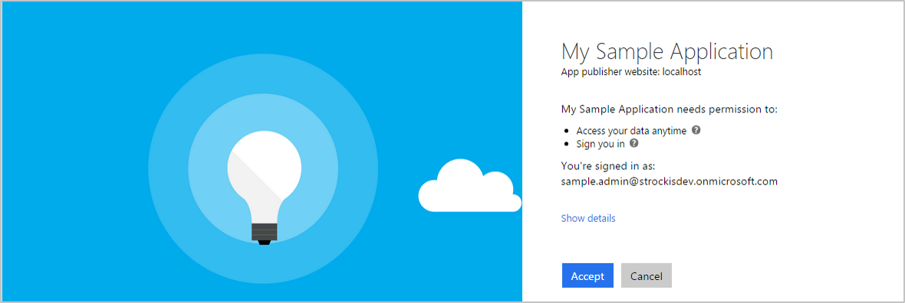

# Azure Active Directory v2.0 终结点中的范围、权限和许可
与 Azure Active Directory (Azure AD) 集成的应用遵循可让用户控制应用如何访问其数据的特定授权模型。此授权模型的 v2.0 实现已更新，其中更改了应用与 Azure AD 交互时必须采用的方式。本文介绍此授权模型的基本概念，包括范围、权限和许可。

> [!NOTE]
v2.0 终结点并不支持所有 Azure Active Directory 方案和功能。若要确定是否应使用 v2.0 终结点，请阅读 [v2.0 限制](./active-directory-v2-limitations.md)。
>
>

## 范围和权限
Azure AD 实现 [OAuth 2.0](./active-directory-v2-protocols.md) 授权协议。OAuth 2.0 是可让第三方应用代表用户访问 Web 托管资源的方法。任何与 Azure AD 集成的 Web 托管资源都具有一个资源标识符或*应用程序 ID URI*。例如，Microsoft 的部分 Web 托管资源包括：

- Office 365 统一邮件 API：`https://outlook.office.com`
- Azure AD 图形 API：`https://graph.chinacloudapi.cn`
- Microsoft Graph：`https://graph.microsoft.com`

这也适用于已与 Azure AD 集成的任何第三方资源。以上任意资源还可以定义一组可用于将该资源的功能划分成较小区块的权限。例如，[Microsoft Graph](https://graph.microsoft.io) 已定义执行以下任务及其他任务所需的权限：

- 读取用户的日历
- 写入用户的日历
- 以用户身份发送邮件

通过定义这种类型的权限，资源可以精细控制其数据以及数据的公开方式。第三方应用可从应用用户请求这些权限。只有在应用用户批准这些权限后，应用才能代表用户执行操作。通过将资源的功能分割成较小的权限集，可将第三方应用构建为只请求所需的特定权限来执行其功能。应用用户可以确切地知道应用将如何使用其数据，因此可以更加确信应用不会出现恶意行为。

在 Azure AD 和 OAuth 中，此类权限称为*范围*。有时也称为 *oAuth2Permissions*。在 Azure AD 中范围以字符串值表示。仍以 Microsoft Graph 为例，每个权限的范围值如下：

- 使用 `Calendar.Read` 读取用户的日历
- 使用 `Mail.ReadWrite` 写入用户的日历
- 使用 `Mail.Send` 以用户身份发送邮件

在对 v2.0 终结点的请求中指定范围，应用即可请求这些权限。

## OpenID Connect 范围
OpenID Connect 的 v2.0 实现有一些已明确定义的但未应用到特定资源的范围 - `openid`、`email`、`profile` 和 `offline_access`。

### openid
如果应用使用 [OpenID Connect](./active-directory-v2-protocols.md) 执行登录，则必须请求 `openid` 范围。`openid` 范围在工作帐户许可页上显示为“登录”权限，而在个人 Microsoft 帐户许可页上显示为“查看你的个人资料并使用你的 Microsoft 帐户连接到应用和服务”权限。应用可使用此权限以 `sub` 声明的形式接收用户的唯一标识符。它还会向应用提供对 UserInfo 终结点的访问权限。`openid` 范围可用于在 v2.0 令牌终结点获取 ID 令牌，该令牌可用于保护应用不同组件之间的 HTTP 调用。

### 电子邮件
`email` 范围可以连同 `openid` 范围和任何其他范围一起使用。它以 `email` 声明的形式向应用提供对用户主要电子邮件地址的访问权限。仅当某个电子邮件地址与用户帐户相关联（并非总是如此）时，`email` 声明才包含在令牌中。如果使用 `email` 范围，应用应该准备好处理 `email` 声明不存在于令牌中的情况。

### 个人资料
`profile` 范围可以连同 `openid` 范围和任何其他范围一起使用。它向应用提供对大量用户信息的访问权限。可访问的信息包括但不限于用户的名字、姓氏、首选用户名和对象 ID。有关特定用户的 id\_tokens 参数中可用个人资料声明的完整列表，请参阅 [v2.0 令牌参考](./active-directory-v2-tokens.md)。

### offline\_access
[`offline_access` 范围](http://openid.net/specs/openid-connect-core-1_0.html#OfflineAccess)可让应用长时间代表用户访问资源。在工作帐户许可页上，此范围显示为“随时访问你的数据”权限。在个人 Microsoft 帐户许可屏幕上，则显示为“随时访问你的信息”权限。用户批准 `offline_access` 范围后，应用即可接收来自 v2.0 令牌终结点的刷新令牌。刷新令牌的生存期较长。旧的访问令牌过期时，应用可以获取新的访问令牌。

如果应用未请求 `offline_access` 范围，则不会接收刷新令牌。这意味着，在 [OAuth 2.0 授权代码流](./active-directory-v2-protocols.md)中兑换授权代码时，只会从 `/token` 终结点接收访问令牌。访问令牌的有效期很短，通常在一小时后即会过期。到时，应用需将用户重定向回到 `/authorize` 终结点以获取新的授权代码。在此重定向期间，根据应用的类型，用户可能需要再次输入其凭据或重新许可权限。

有关如何获取和使用刷新令牌的详细信息，请参阅 [v2.0 协议参考](./active-directory-v2-protocols.md)。

## 请求单个用户的许可
在 [OpenID Connect 或 OAuth 2.0](./active-directory-v2-protocols.md) 授权请求中，应用可以使用 `scope` 查询参数来请求所需的权限。例如，当用户登录到应用时，应用将发送类似于以下示例的请求（添加了换行符以便于阅读）：

```
GET https://login.microsoftonline.com/common/oauth2/v2.0/authorize?
client_id=6731de76-14a6-49ae-97bc-6eba6914391e
&response_type=code
&redirect_uri=http%3A%2F%2Flocalhost%2Fmyapp%2F
&response_mode=query
&scope=
https%3A%2F%2Fgraph.microsoft.com%2Fcalendar.read%20
https%3A%2F%2Fgraph.microsoft.com%2Fmail.send
&state=12345
```

`scope` 参数是应用程序所请求的范围列表（以空格分隔）。将范围值追加到资源的标识符（应用程序 ID URI）可指示每个范围。在该请求示例中，应用需要相应的权限来读取用户的日历，以及以用户身分发送邮件。

在用户输入其凭据之后，v2.0 终结点将检查是否有匹配的*用户许可*记录。如果用户未曾许可所请求权限的任何一项，v2.0 终结点将请求用户授予请求的权限。

  

当用户批准权限时，则会记录许可，用户在以后登录帐户时无需再次许可。

## 请求整个租户的许可
组织购买应用程序的许可证或订阅时，通常想要为其员工完全预配该应用程序。在此过程中，管理员可以代表任何员工授予对该应用程序的许可。如果管理员授予对整个租户的许可，该组织的员工不会看到该应用程序的许可页。

若要请求租户中所有用户的许可，应用可使用管理员许可终结点。

## 管理员限制的范围
可将 Microsoft 生态系统中的某些高特权权限设置为*受管理员限制*。此类范围的示例包括以下权限：

- 使用 `Directory.Read` 读取组织的目录数据
- 使用 `Directory.ReadWrite` 将数据写入组织的目录
- 使用 `Groups.Read.All` 读取组织目录中的安全组

尽管使用者用户可以授予应用程序对此类数据的访问权限，但组织用户会受到限制，无法授予对同一敏感公司数据集的访问权限。如果应用程序向组织用户请求访问以下权限之一，用户会收到错误消息，指出他们未经授权，无法许可应用的权限。

如果应用需要访问组织的受管理员限制的范围，同样应该使用管理员许可终结点直接向公司管理员请求相关权限，如下所述。

管理员通过管理员许可终结点授予这些权限时，会代表租户中的所有用户授予许可。

## 使用管理员许可终结点
如果遵循以下步骤，应用可以收集租户中所有用户的权限，包括受管理员限制的范围。若要查看实现这些步骤的代码示例，请参阅[受管理员限制的范围示例](https://github.com/Azure-Samples/active-directory-dotnet-admin-restricted-scopes-v2)。

### 在应用注册门户中请求权限
1. 在[应用程序注册门户](https://apps.dev.microsoft.com)中转到你的应用程序，或[创建一个应用](./active-directory-v2-app-registration.md)（如果尚未创建）。
2. 找到“Microsoft Graph 权限”部分，然后添加应用所需的权限。
3. 请务必**保存**应用注册。

### 建议：让用户登录应用
在构建使用管理员许可终结点的应用程序时，应用通常需要一个页面或视图，使管理员能够批准应用的权限。此页面可以是应用注册流的一部分、应用设置的一部分，或者专用的“连接”流。在许多情况下，合理的结果是应用只在用户使用工作或学校 Microsoft 帐户登录之后才显示此“连接”视图。

将用户登录到应用时，可以识别管理员所属的组织，然后要求他们批准所需的权限。尽管在严格意义上不需要这样做，但这有助于为组织用户带来更直观的体验。若要让用户登录，请遵循 [v2.0 协议教程](./active-directory-v2-protocols.md)。

### 向目录管理员请求权限
准备好向组织管理员请求权限时，可将用户重定向到 v2.0 *管理员许可终结点*。

```
// Line breaks are for legibility only.

GET https://login.microsoftonline.com/{tenant}/adminconsent?
client_id=6731de76-14a6-49ae-97bc-6eba6914391e
&state=12345
&redirect_uri=http://localhost/myapp/permissions

// Pro Tip: Try pasting the below request in a browser!

https://login.microsoftonline.com/common/adminconsent?client_id=6731de76-14a6-49ae-97bc-6eba6914391e&state=12345&redirect_uri=http://localhost/myapp/permissions
```

| 参数 | 条件 | 说明 |
| --- | --- | --- |
| tenant |必选 |要向其请求权限的目录租户。可以使用 GUID 或友好的名称格式提供。 |
| client\_id |必选 |[应用程序注册门户](https://apps.dev.microsoft.com)为应用分配的应用程序 ID。 |
| redirect\_uri |必选 |要向其发送响应，供应用处理的重定向 URI。必须与在应用注册门户中注册的重定向 URI 之一完全匹配。 |
| state |建议 |同样随令牌响应返回的请求中所包含的值。可以是所需的任何内容的字符串。使用该状态可在身份验证请求出现之前，在应用中编码用户的状态信息，例如用户过去所在的页面或视图。 |

此时，Azure AD 将要求租户管理员登录，以完成请求。系统要求管理员批准在应用注册门户中针对应用请求的所有权限。

#### 成功的响应
如果管理员批准了应用的权限，成功响应如下所示：

```
GET http://localhost/myapp/permissions?tenant=a8990e1f-ff32-408a-9f8e-78d3b9139b95&state=state=12345&admin_consent=True
```

| 参数 | 说明 |
| --- | --- | --- |
| tenant |向应用程序授予所请求权限的目录租户（采用 GUID 格式）。 |
| state |同样随令牌响应返回的请求中所包含的值。可以是所需的任何内容的字符串。该 state 用于在身份验证请求出现之前，于应用中编码用户的状态信息，例如之前所在的页面或视图。 |
| admin\_consent |将设置为 **true**。 |

#### 错误响应
如果管理员未批准应用的权限，失败响应如下所示：

```
GET http://localhost/myapp/permissions?error=permission_denied&error_description=The+admin+canceled+the+request
```

| 参数 | 说明 |
| --- | --- | --- |
| error |可用于分类发生的错误类型与响应错误的错误码字符串。 |
| error\_description |可帮助开发人员识别错误根本原因的具体错误消息。 |

从管理员许可终结点收到成功响应后，应用便已获得所请求的权限。接下来，可以请求所需的资源令牌。

## 使用权限
用户许可应用的权限之后，应用即可获取访问令牌，这些令牌表示应用以某种身份访问资源的权限。访问令牌只能用于单个资源，但其内部编码了应用已获得的该资源的所有权限。若要获取访问令牌，应用可以对 v2.0 令牌终结点发出类似于下面的请求：

```
POST common/oauth2/v2.0/token HTTP/1.1
Host: https://login.microsoftonline.com
Content-Type: application/json

{
    "grant_type": "authorization_code",
    "client_id": "6731de76-14a6-49ae-97bc-6eba6914391e",
    "scope": "https://outlook.office.com/mail.read https://outlook.office.com/mail.send",
    "code": "AwABAAAAvPM1KaPlrEqdFSBzjqfTGBCmLdgfSTLEMPGYuNHSUYBrq..."
    "redirect_uri": "https://localhost/myapp",
    "client_secret": "zc53fwe80980293klaj9823"  // NOTE: Only required for web apps
}
```

可在资源的 HTTP 请求中使用生成的访问令牌。该令牌可靠地向资源指明，你的应用已获得适当权限，可执行特定的任务。

有关 OAuth 2.0 协议以及如何获取访问令牌的详细信息，请参阅 [v2.0 终结点协议参考](./active-directory-v2-protocols.md)。

<!---HONumber=Mooncake_0206_2017-->
<!--Update_Description: wording update-->