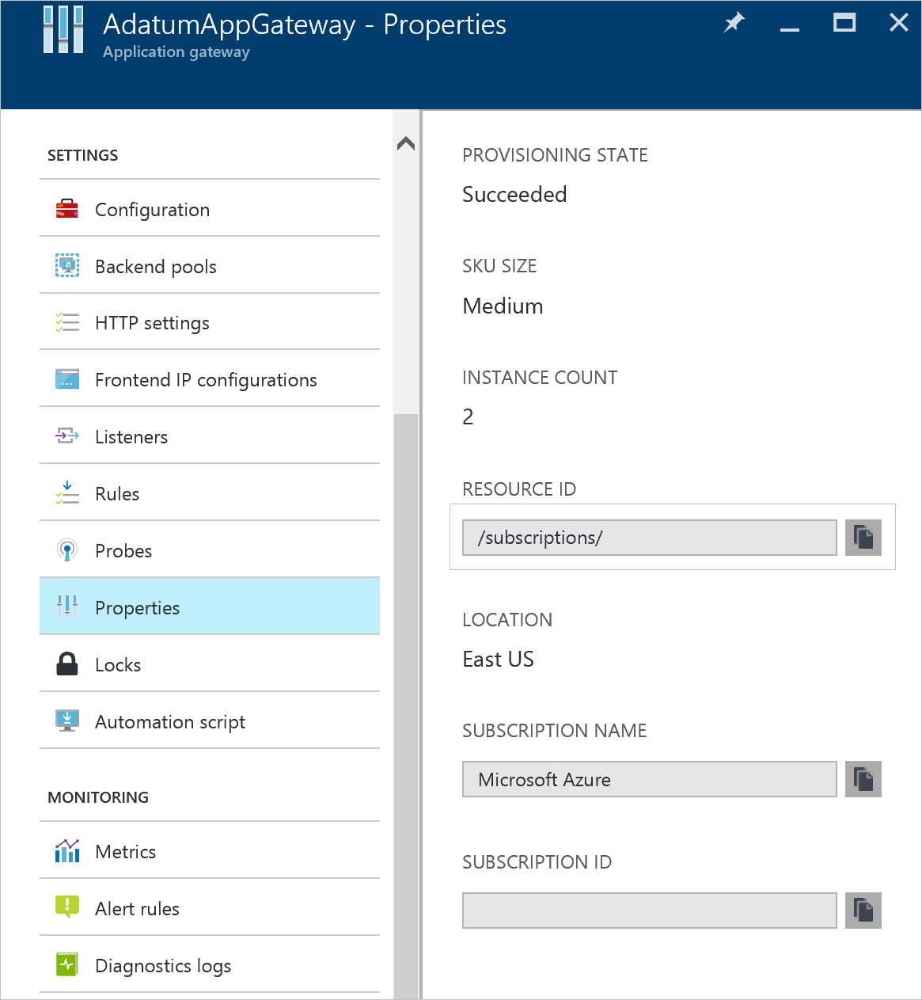

# <a name="back-end-health-diagnostic-logs-and-metrics-for-application-gateway"></a>应用程序网关的后端运行状况、诊断日志和指标

可以使用 Azure 应用程序网关通过以下方式监视资源：

* [后端运行状况](#back-end-health)：应用程序网关提供通过 Azure 门户和 PowerShell 监视后端池中的服务器运行状况的功能。

* [日志](#diagnostic-logs)：可以从某个资源通过日志来保存或使用访问情况等数据，以便进行监视。

## <a name="back-end-health"></a>后端运行状况

应用程序网关提供通过门户、PowerShell 和命令行界面 (CLI) 监视后端池各成员运行状况的功能。

后端运行状况报告反映了应用程序网关对后端实例进行的运行状况探测的输出。 如果探测成功且后端能够接收流量，则可认为后端运行状况正常， 否则不正常。

> [!IMPORTANT]
> 如果应用程序网关子网上存在网络安全组 (NSG)，则请在应用程序网关子网上打开端口范围 65503-65534，以便接收入站流量。 这些端口是后端运行状况 API 正常工作所必需的。

### <a name="view-back-end-health-through-the-portal"></a>通过门户查看后端运行状况

在门户中，后端运行状况是自动提供的。 在现有的应用程序网关中，选择“监视” > “后端运行状况”。 

后端池中的每个成员都列在此页上（不管其是 NIC、IP 还是 FQDN）。 会显示后端池名称、端口、后端 HTTP 设置名称以及运行状况。 运行状况的有效值为“正常”、“不正常”、“未知”。

> [!NOTE]
> 如果后端运行状况显示为“未知”，请确保未通过虚拟网络中的 NSG 规则、用户定义路由 (UDR) 或自定义 DNS 阻止对后端的访问。

![后端运行状况][10]

### <a name="view-back-end-health-through-powershell"></a>通过 PowerShell 查看后端运行状况

以下 PowerShell 代码显示了如何通过 `Get-AzureRmApplicationGatewayBackendHealth` cmdlet 查看后端运行状况：

```powershell
Get-AzureRmApplicationGatewayBackendHealth -Name ApplicationGateway1 -ResourceGroupName Contoso
```

### <a name="view-back-end-health-through-azure-cli-20"></a>通过 Azure CLI 2.0 查看后端运行状况

[!INCLUDE [azure-cli-2-azurechinacloud-environment-parameter](../../includes/azure-cli-2-azurechinacloud-environment-parameter.md)]

```azurecli
az network application-gateway show-backend-health --resource-group AdatumAppGatewayRG --name AdatumAppGateway
```

### <a name="results"></a>结果

以下代码片段演示了一个响应示例：

```json
{
"BackendAddressPool": {
    "Id": "/subscriptions/00000000-0000-0000-000000000000/resourceGroups/ContosoRG/providers/Microsoft.Network/applicationGateways/applicationGateway1/backendAddressPools/appGatewayBackendPool"
},
"BackendHttpSettingsCollection": [
    {
    "BackendHttpSettings": {
        "Id": "/00000000-0000-0000-000000000000/resourceGroups/ContosoRG/providers/Microsoft.Network/applicationGateways/applicationGateway1/backendHttpSettingsCollection/appGatewayBackendHttpSettings"
    },
    "Servers": [
        {
        "Address": "hostname.chinanorth.chinacloudapp.cn",
        "Health": "Healthy"
        },
        {
        "Address": "hostname.chinanorth.chinacloudapp.cn",
        "Health": "Healthy"
        }
    ]
    }
]
}
```

## 诊断日志 <a name="diagnostic-logging"></a>

可在 Azure 中使用不同类型的日志来对应用程序网关进行管理和故障排除。 可通过门户访问其中某些日志。 可从 Azure Blob 存储提取所有日志并在 Excel 和 Power BI 等各种工具中查看。 可从以下列表了解有关不同类型日志的详细信息：

* 活动日志：可以使用 Azure 活动日志（以前称为操作日志和审核日志）查看提交到 Azure 订阅的所有操作及其状态。 默认情况下会收集活动日志条目，可在 Azure 门户中查看这些条目。
* 访问日志：可以使用此日志来查看应用程序网关访问模式并分析重要信息，包括调用方的 IP、请求的 URL、响应延迟、返回代码、输入和输出字节数。每隔 300 秒会收集一次访问日志。 此日志包含每个应用程序网关实例的一条记录。 应用程序网关实例可以由 instanceId 属性标识。
* 防火墙日志：可以使用此日志来查看通过应用程序网关的检测或阻止模式（通过 Web 应用程序防火墙配置）记录的请求。

> [!NOTE]
> 日志仅适用于在 Azure Resource Manager 部署模型中部署的资源。 不能将日志用于经典部署模型中的资源。 若要更好地了解两种模型，请参阅[了解 Resource Manager 部署和经典部署](../azure-resource-manager/resource-manager-deployment-model.md)一文。

可以通过三个选项来存储日志：

* 存储帐户：如果日志存储时间较长并且需要根据情况进行查看，最好使用存储帐户。
* 事件中心：若要集成其他安全信息和事件管理 (SEIM) 工具以获取资源警报，最好使用事件中心。

### <a name="enable-logging-through-powershell"></a>通过 PowerShell 启用日志记录

每个 Resource Manager 资源都会自动启用活动日志记录。 必须启用访问日志记录才能开始收集通过这些日志提供的数据。 若要启用日志记录，请执行以下步骤：

1. 记下存储帐户的资源 ID，其中存储日志数据。 此值的形式为：/subscriptions/\<subscriptionId\>/resourceGroups/\<资源组名称\>/providers/Microsoft.Storage/storageAccounts/\<存储帐户名称\>。 可以使用订阅中的任何存储帐户。 可以使用 Azure 门户查找以下信息。

    

2. 记下应用程序网关的资源 ID（会为其启用日志记录）。 此值的形式为：/subscriptions/\<subscriptionId\>/resourceGroups/\<资源组名称\>/providers/Microsoft.Network/applicationGateways/\<应用程序网关名称\>。 可以使用门户查找以下信息。

    

3. 使用以下 PowerShell cmdlet 启用诊断日志记录：

    ```powershell
    Set-AzureRmDiagnosticSetting  -ResourceId /subscriptions/<subscriptionId>/resourceGroups/<resource group name>/providers/Microsoft.Network/applicationGateways/<application gateway name> -StorageAccountId /subscriptions/<subscriptionId>/resourceGroups/<resource group name>/providers/Microsoft.Storage/storageAccounts/<storage account name> -Enabled $true     
    ```

> [!TIP] 
>活动日志不需要单独的存储帐户。 使用存储来记录访问情况需支付服务费用。

### <a name="enable-logging-through-the-azure-portal"></a>通过 Azure 门户启用日志记录

1. 在 Azure 门户中找到资源，然后单击“诊断日志”。

   对于应用程序网关，可以使用三种日志：

   * 访问日志
   * 防火墙日志

2. 若要开始收集数据，请单击“启用诊断” 。

   ![启用诊断][1]

3. “诊断设置”边栏选项卡提供诊断日志的设置。

4. 选择现有的 Operations Management Suite (OMS) 工作区，或者创建一个新的。 本示例使用现有的工作区。

   ![OMS 工作区的选项][3]

5. 确认设置，然后单击“保存”。

   ![包含选择的“诊断设置”边栏选项卡][4]

### <a name="activity-log"></a>活动日志

默认情况下，Azure 生成活动日志。 日志在 Azure 事件日志存储中保留 90 天。 

### <a name="access-log"></a>访问日志

只有按照上述步骤在每个应用程序网关实例上启用了访问日志，才会生成该日志。 数据存储在启用日志记录时指定的存储帐户中。 应用程序网关的每次访问均以 JSON 格式记录下来，如以下示例所示：

|值  |说明  |
|---------|---------|
|instanceId     | 处理请求的应用程序网关实例。        |
|clientIP     | 请求的起始 IP。        |
|clientPort     | 请求的起始端口。       |
|httpMethod     | 请求所用的 HTTP 方法。       |
|requestUri     | 所收到请求的 URI。        |
|RequestQuery     | 服务器路由的项：发送请求的后端池实例。 </br> X-AzureApplicationGateway-LOG-ID：用于请求的相关性 ID， 可用于排查后端服务器上的流量问题。 </br>SERVER-STATUS：应用程序网关从后端接收的 HTTP 响应代码。       |
|UserAgent     | HTTP 请求标头中的用户代理。        |
|httpStatus     | 从应用程序网关返回到客户端的 HTTP 状态代码。       |
|httpVersion     | 请求的 HTTP 版本。        |
|receivedBytes     | 接收的数据包的大小（以字节为单位）。        |
|sentBytes| 发送的数据包的大小（以字节为单位）。|
|timeTaken| 处理请求并发送响应所需的时长（以毫秒为单位）。 此时长按特定的时间间隔（从应用程序网关接收第一个 HTTP 请求字节到完成响应发送操作所需的时间）来计算。 必须注意，“所用时间”字段通常包括请求和响应数据包在网络上传输的时间。 |
|sslEnabled| 与后端池的通信是否使用 SSL。 有效值为 on 和 off。|
```json
{
    "resourceId": "/SUBSCRIPTIONS/{subscriptionId}/RESOURCEGROUPS/PEERINGTEST/PROVIDERS/MICROSOFT.NETWORK/APPLICATIONGATEWAYS/{applicationGatewayName}",
    "operationName": "ApplicationGatewayAccess",
    "time": "2017-04-26T19:27:38Z",
    "category": "ApplicationGatewayAccessLog",
    "properties": {
        "instanceId": "ApplicationGatewayRole_IN_0",
        "clientIP": "191.96.249.97",
        "clientPort": 46886,
        "httpMethod": "GET",
        "requestUri": "/phpmyadmin/scripts/setup.php",
        "requestQuery": "X-AzureApplicationGateway-CACHE-HIT=0&SERVER-ROUTED=10.4.0.4&X-AzureApplicationGateway-LOG-ID=874f1f0f-6807-41c9-b7bc-f3cfa74aa0b1&SERVER-STATUS=404",
        "userAgent": "-",
        "httpStatus": 404,
        "httpVersion": "HTTP/1.0",
        "receivedBytes": 65,
        "sentBytes": 553,
        "timeTaken": 205,
        "sslEnabled": "off"
    }
}
```

### <a name="firewall-log"></a>防火墙日志

只有按照上述步骤为每个应用程序网关启用了防火墙日志，才会生成该日志。 此日志还需要在应用程序网关上配置 Web 应用程序防火墙。 数据存储在启用日志记录时指定的存储帐户中。 将记录以下数据：

|值  |说明  |
|---------|---------|
|instanceId     | 为其生成了防火墙数据的应用程序网关实例。 对于多实例应用程序网关，一个实例对应于一行。         |
|clientIp     |   请求的起始 IP。      |
|clientPort     |  请求的起始端口。       |
|requestUri     | 所收到请求的 URI。       |
|ruleSetType     | 规则集类型。 可用值为 OWASP。        |
|ruleSetVersion     | 所使用的规则集版本。 可用值为 2.2.9 和 3.0。     |
|ruleId     | 触发事件的规则 ID。        |
|message     | 触发事件的用户友好消息。 详细信息部分提供了更多详细信息。        |
|action     |  针对请求执行的操作。 可用值为 Blocked 和 Allowed。      |
|site     | 为其生成日志的站点。 目前仅列出 Global，因为规则是全局性的。|
|详细信息     | 触发事件的详细信息。        |
|details.message     | 规则的说明。        |
|details.data     | 在请求中找到的与规则匹配的特定数据。         |
|details.file     | 包含规则的配置文件。        |
|details.line     | 配置文件中触发了事件的行号。       |

```json
{
  "resourceId": "/SUBSCRIPTIONS/{subscriptionId}/RESOURCEGROUPS/{resourceGroupName}/PROVIDERS/MICROSOFT.NETWORK/APPLICATIONGATEWAYS/{applicationGatewayName}",
  "operationName": "ApplicationGatewayFirewall",
  "time": "2017-03-20T15:52:09.1494499Z",
  "category": "ApplicationGatewayFirewallLog",
  "properties": {
    "instanceId": "ApplicationGatewayRole_IN_0",
    "clientIp": "104.210.252.3",
    "clientPort": "4835",
    "requestUri": "/?a=%3Cscript%3Ealert(%22Hello%22);%3C/script%3E",
    "ruleSetType": "OWASP",
    "ruleSetVersion": "3.0",
    "ruleId": "941320",
    "message": "Possible XSS Attack Detected - HTML Tag Handler",
    "action": "Blocked",
    "site": "Global",
    "details": {
      "message": "Warning. Pattern match \"<(a|abbr|acronym|address|applet|area|audioscope|b|base|basefront|bdo|bgsound|big|blackface|blink|blockquote|body|bq|br|button|caption|center|cite|code|col|colgroup|comment|dd|del|dfn|dir|div|dl|dt|em|embed|fieldset|fn|font|form|frame|frameset|h1|head|h ...\" at ARGS:a.",
      "data": "Matched Data: <script> found within ARGS:a: <script>alert(\\x22hello\\x22);</script>",
      "file": "rules/REQUEST-941-APPLICATION-ATTACK-XSS.conf",
      "line": "865"
    }
  }
} 

```

### <a name="view-and-analyze-the-activity-log"></a>查看和分析活动日志

可使用以下任意方法查看和分析活动日志数据：

* Azure 工具：通过 Azure PowerShell、Azure CLI、Azure REST API 或 Azure 门户检索活动日志中的信息。 [使用 Resource Manager 的活动操作](../azure-resource-manager/resource-group-audit.md)一文中详细介绍了每种方法的分步说明。
* Power BI：如果尚无 [Power BI](https://powerbi.microsoft.com/pricing) 帐户，可免费试用。 使用[适用于 Power BI 的 Azure 活动日志内容包](https://powerbi.microsoft.com/documentation/powerbi-content-pack-azure-audit-logs/)，可借助预配置的仪表板（直接使用或进行自定义）分析数据。

### <a name="view-and-analyze-the-access-and-firewall-logs"></a>查看并分析访问日志和防火墙日志

可以连接到存储帐户并检索访问日志的 JSON 日志条目。 下载 JSON 文件后，可以将其转换为 CSV 并在 Excel、Power BI 或任何其他数据可视化工具中查看。

> [!TIP]
> 如果熟悉 Visual Studio 和更改 C# 中的常量和变量值的基本概念，则可以使用 GitHub 提供的[日志转换器工具](https://github.com/Azure-Samples/networking-dotnet-log-converter)。
> 
> 

## <a name="next-steps"></a>后续步骤

* [Visualize your Azure Activity Log with Power BI](http://blogs.msdn.com/b/powerbi/archive/2015/09/30/monitor-azure-audit-logs-with-power-bi.aspx)（使用 Power BI 直观显示 Azure 活动日志）博客文章。
* [View and analyze Azure Activity Logs in Power BI and more](https://azure.microsoft.com/blog/analyze-azure-audit-logs-in-powerbi-more/)（在 Power BI 和其他组件中查看和分析 Azure 活动日志）博客文章。

[1]: ./media/application-gateway-diagnostics/figure1.png
[2]: ./media/application-gateway-diagnostics/figure2.png
[3]: ./media/application-gateway-diagnostics/figure3.png
[4]: ./media/application-gateway-diagnostics/figure4.png
[5]: ./media/application-gateway-diagnostics/figure5.png
[6]: ./media/application-gateway-diagnostics/figure6.png
[7]: ./media/application-gateway-diagnostics/figure7.png
[8]: ./media/application-gateway-diagnostics/figure8.png
[9]: ./media/application-gateway-diagnostics/figure9.png
[10]: ./media/application-gateway-diagnostics/figure10.png