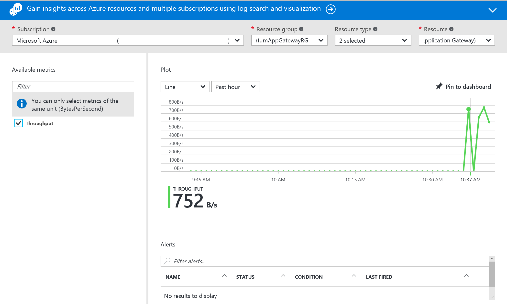

# 应用程序网关的指标

应用程序网关会将称为“指标”的数据点发布到 [Azure Monitor](/azure-monitor/overview)，使用户能够监视应用程序网关和后端实例的性能。 这些指标是一组有序时序数据中的数值，用于描述应用程序网关在特定时间的某种状况。 如果请求通过应用程序网关传送，则应用程序网关将会测量其指标并每隔 60 秒发送一次指标。 如果没有任何请求通过应用程序网关传送，或者指标没有数据，则不会报告指标。 有关详细信息，请参阅 [Azure Monitor 指标](/azure-monitor/platform/data-platform-metrics)。

## 应用程序网关 V2 SKU 支持的指标

### 计时指标

应用程序网关提供多个与请求和响应相关的内置计时指标，这些指标的度量单位均为毫秒。 

> [!NOTE]
>
> 如果应用程序网关中有多个侦听器，则请在比较不同的延迟指标时始终按“侦听器”  维度进行筛选，以便获得有意义的推理结果。

- **后端连接时间**

  与后端应用程序建立连接所花费的时间。 

  这包括网络延迟，以及后端服务器的 TCP 堆栈建立新连接所用的时间。 在使用 SSL 时，它还包括握手所用的时间。 

- **后端第一个字节响应时间**

  从开始与后端服务器建立连接，到收到响应标头的第一个字节的间隔时间。 

  此时间近似于“后端连接时间”、请求从应用程序网关抵达后端所用的时间、后端应用程序做出响应所用的时间（服务器生成内容并可能提取数据库查询所用的时间），以及响应的第一个字节从后端抵达应用程序网关所用的时间之和。 

- **后端最后一个字节响应时间**

  从开始与后端服务器建立连接，到收到响应正文的最后一个字节的间隔时间。 

  此时间近似于“后端第一字节响应时间”以及数据传输时间（此数字根据请求对象的大小和服务器网络延迟而有很大的不同）之和。 

- **应用程序网关总时间**

  接收、处理请求及发送其响应所花费的平均时间。 

  此间隔时间是根据从应用程序网关收到 HTTP 请求的第一个字节的时间，到将最后一个响应字节发送到客户端的时间计算的。 这包括应用程序网关花费的处理时间、“后端最后一个字节响应时间”、应用程序网关发送所有响应所用的时间，以及“客户端 RTT”。  

- **客户端 RTT**

  客户端与应用程序网关之间的平均往返时间。

这些指标可用于确定速度减慢的原因是与客户端网络、应用程序网关性能、后端网络和后端服务器 TCP 堆栈饱和、后端应用程序性能还是文件大小较大有关。

例如，如果“后端第一个字节响应时间”趋势存在高峰，但“后端连接时间”趋势稳定，则可以推断应用程序网关与后端之间存在网络延迟，但建立连接所用的时间是稳定的，而出现高峰的原因是后端应用程序的响应时间增大。   另一方面，如果“后端第一个字节响应时间”中的高峰与“后端连接时间”中的相应高峰相关联，则可以推断应用程序网关与后端服务器或后端服务器 TCP 堆栈之间的网络已饱和。   

如果观察到“后端最后一个字节响应时间”出现高峰，但“后端第一个字节响应时间”稳定，则可以推断出现此高峰的原因是请求的文件较大。  

同理，如果“应用程序网关总时间”出现高峰，但“后端最后一个字节响应时间”稳定，则可能表示应用程序网关出现性能瓶颈，或者客户端与应用程序网关之间的网络出现瓶颈。   此外，如果“客户端 RTT”也出现相应的高峰，则表示出现这种性能下降的原因是客户端与应用程序网关之间的网络有问题。 

### 应用程序网关指标

应用程序网关支持以下指标：

- **接收的字节数**

   应用程序网关从客户端收到的字节数

- **发送的字节数**

   应用程序网关向客户端发送的字节数

- **客户端 TLS 协议**

   与应用程序网关建立了连接的客户端发起的 TLS 和非 TLS 请求计数。 若要查看 TLS 协议分布，请按“TLS 协议”维度进行筛选。

- **当前容量单位数**

   消耗的容量单位数。 容量单位测量在固定价格的基础上按消耗量计收的费用。 容量单位有三个决定因素 - 计算单位、持久连接和吞吐量。 每个容量单位最多包括：1 个计算单位，或 2500 个持久连接，或 2.22-Mbps 吞吐量。

- **当前计算单位数**

   消耗的处理器容量计数。 影响计算单位的因素包括每秒 TLS 连接数、URL 重写计算和 WAF 规则处理。 

- **当前连接数**

   使用应用程序网关建立的当前连接计数

- **失败的请求数**

   应用程序网关已提供服务的失败请求计数。 可以进一步筛选请求计数，以显示每个/特定后端池 http 设置组合的计数。

- **响应状态**

   应用程序网关返回的 HTTP 响应状态。 可以进一步对响应状态代码分布进行归类来显示 2xx、3xx、4xx 和 5xx 类别的响应。

- **吞吐量**

   应用程序网关每秒提供的字节数

- **请求总数**

   应用程序网关已提供服务的成功请求计数。 可以进一步筛选请求计数，以显示每个/特定后端池 http 设置组合的计数。

- **Web 应用程序防火墙匹配的规则**

- **Web 应用程序防火墙触发的规则**

### 后端指标

应用程序网关支持以下指标：

- **后端响应状态**

  后端返回的 HTTP 响应状态代码计数。 这不包括应用程序网关生成的任何响应代码。 可以进一步对响应状态代码分布进行归类来显示 2xx、3xx、4xx 和 5xx 类别的响应。

- **正常的主机计数**

  由运行状况探测判定为正常的后端数。 可以按每个后端池进行筛选来显示特定后端池中的正常主机数。

- **不正常的主机计数**

  由运行状况探测判定为不正常的后端数。 可以按每个后端池进行筛选来显示特定后端池中的不正常主机数。

## 应用程序网关 V1 SKU 支持的指标

### 应用程序网关指标

应用程序网关支持以下指标：

- **CPU 使用率**

  显示分配给应用程序网关的 CPU 的使用率。  正常情况下，CPU 使用率不应经常超过 90%，因为这可能导致托管在应用程序网关后面的网站中出现延迟，并破坏客户端体验。 可以通过修改应用程序网关的配置（具体方法是：增加实例计数和/或移到更大的 SKU 大小）来间接控制或改进 CPU 使用率。

- **当前连接数**

  使用应用程序网关建立的当前连接计数

- **失败的请求数**

  应用程序网关已提供服务的失败请求计数。 可以进一步筛选请求计数，以显示每个/特定后端池 http 设置组合的计数。

- **响应状态**

  应用程序网关返回的 HTTP 响应状态。 可以进一步对响应状态代码分布进行归类来显示 2xx、3xx、4xx 和 5xx 类别的响应。

- **吞吐量**

  应用程序网关每秒提供的字节数

- **请求总数**

  应用程序网关已提供服务的成功请求计数。 可以进一步筛选请求计数，以显示每个/特定后端池 http 设置组合的计数。

- **Web 应用程序防火墙匹配的规则**

- **Web 应用程序防火墙触发的规则**

### 后端指标

应用程序网关支持以下指标：

- **正常的主机计数**

  由运行状况探测判定为正常的后端数。 可以按每个后端池进行筛选来显示特定后端池中的正常主机数。

- **不正常的主机计数**

  由运行状况探测判定为不正常的后端数。 可以按每个后端池进行筛选来显示特定后端池中的不正常主机数。

## 指标可视化

浏览到应用程序网关，并在“监视”下选择“指标”   。 若要查看可用值，请选择“指标”下拉列表  。

在下图中可以看到过去 30 分钟显示的三个指标的示例：

若要查看当前的指标列表，请参阅 [Azure Monitor 支持的指标](../azure-monitor/platform/metrics-supported.md)。

## 后续步骤

* 使用 [Azure Monitor 日志](../azure-monitor/insights/azure-networking-analytics.md)可视化计数器和事件日志。
* [Visualize your Azure Activity Log with Power BI](https://blogs.msdn.com/b/powerbi/archive/2015/09/30/monitor-azure-audit-logs-with-power-bi.aspx)（使用 Power BI 直观显示 Azure 活动日志）博客文章。
* [View and analyze Azure activity logs in Power BI and more](https://azure.microsoft.com/blog/analyze-azure-audit-logs-in-powerbi-more/)（在 Power BI 和其他组件中查看和分析 Azure 活动日志）博客文章。

[1]: ./media/application-gateway-diagnostics/figure1.png
[2]: ./media/application-gateway-diagnostics/figure2.png
[3]: ./media/application-gateway-diagnostics/figure3.png
[4]: ./media/application-gateway-diagnostics/figure4.png
[5]: ./media/application-gateway-diagnostics/figure5.png
[6]: ./media/application-gateway-diagnostics/figure6.png
[7]: ./media/application-gateway-diagnostics/figure7.png
[8]: ./media/application-gateway-diagnostics/figure8.png
[9]: ./media/application-gateway-diagnostics/figure9.png
[10]: ./media/application-gateway-diagnostics/figure10.png

<!-- Update_Description: wording update -->