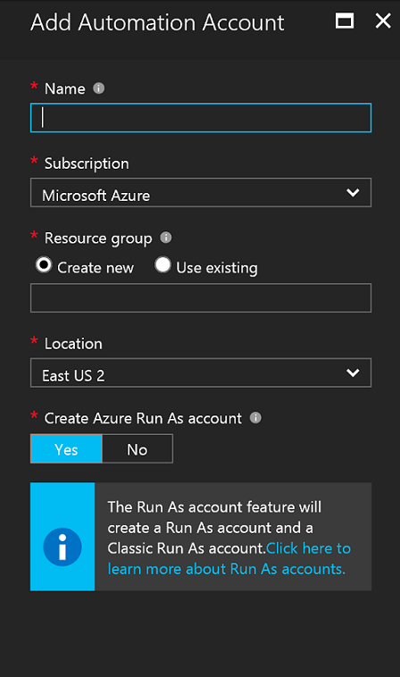
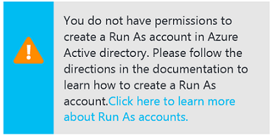
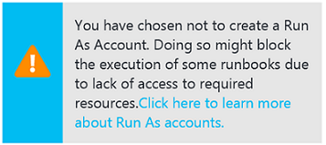

# 创建独立的 Azure 自动化帐户
本主题介绍如何通过 Azure 门户创建自动化帐户，其前提是，需要在不包括其他管理解决方案或不与 OMS Log Analytics 集成的情况下，评估和了解 Azure 自动化，以便对 Runbook 作业进行高级监视。  可以在将来随时添加这些管理解决方案或集成 Log Analytics。  使用自动化帐户，可以对在 Azure 资源管理器部署或 Azure 经典部署中管理资源的 Runbook 进行身份验证。

在 Azure 门户中创建自动化帐户时，还会自动创建以下帐户：

* 运行方式帐户（用于在 Azure Active Directory 中创建新的服务主体）、证书以及分配参与者基于角色的访问控制 (RBAC)（用于使用 Runbook 管理 Resource Manager 资源）。   
* 经典运行方式帐户（通过上传管理证书），用于使用 Runbook 管理经典资源。  

这样可以简化操作过程，并帮助你快速开始构建和部署 Runbook 来支持自动化需求。  

## 创建自动化帐户所需的权限
若要创建或更新自动化帐户，必须具有完成本主题所需的下述特定权限。   
 
* 若要创建自动化帐户，需将 AD 用户帐户添加到一个角色，该角色的权限相当于 Microsoft.Automation 资源的所有者角色，如 [Azure 自动化中基于角色的访问控制](automation-role-based-access-control.md)一文所述。  
* Azure AD 租户中的非管理员用户可以 [注册 AD 应用程序](../azure-resource-manager/resource-group-create-service-principal-portal.md#check-azure-subscription-permissions)，前提是应用注册设置已设置为 **是**。  如果“应用注册设置”设置为“否”，则执行此操作的用户必须是 Azure AD 中的全局管理员。 

如果你在被添加到订阅的全局管理员/共同管理员角色之前不是订阅的 Active Directory 实例的成员，则会将你作为来宾添加到 Active Directory。 在此情况下，“添加自动化帐户”边栏选项卡中会出现“你无权创建...”警告。 可以先从订阅的 Active Directory 实例中删除已添加到全局管理员/共同管理员角色的用户，然后重新添加，使其成为 Active Directory 中的完整用户。 若要验证这种情况，可在 Azure 门户的“Azure Active Directory”窗格中选择“用户和组”，选择“所有用户”，在选择特定的用户后再选择“配置文件”。 用户配置文件下的“用户类型”属性值不应等于“来宾”。

## 从 Azure 门户创建新的自动化帐户
在本部分中，请执行以下步骤，在 Azure 门户创建一个 Azure 自动化帐户。    

1. 以订阅管理员角色成员和订阅共同管理员的帐户登录 Azure 门户。
2. 单击“新建” 。      
3. 搜索“自动化”，并在搜索结果中选择“自动化与控制”。     
3. 在“自动化帐户”边栏选项卡中，单击“添加”。  

   > [!NOTE]
   > 如果在“添加自动化帐户”边栏选项卡中看到以下警告，是因为帐户不是订阅管理员角色成员和订阅共同管理员。  
   > 
   > 
4. 在“添加自动化帐户”边栏选项卡的“名称”框中，键入新自动化帐户的名称。
5. 如果有多个订阅，请为新帐户指定一个订阅，并指定一个新的或现有的**资源组**以及 Azure 数据中心**位置**。
6. 确认为“创建 Azure 运行方式帐户”选项选择了“是”值，并单击“创建”按钮。  
   
   > [!NOTE]
   > 如果通过选择“否”选项来选择不创建运行方式帐户，则“添加自动化帐户”边栏选项卡中会出现一条警告消息。  尽管该帐户是在 Azure 门户中创建的，但它在经典或资源管理器订阅目录服务中没有对应的身份验证标识，因此，无法访问订阅中的资源。  这会导致引用此帐户的任何 Runbook 无法进行身份验证，也无法针对这些部署模型中的资源执行任务。
   > 
   >  
   > 未创建服务主体时不会分配参与者角色。
   > 

7. 在 Azure 创建自动化帐户时，可以在菜单的“通知”下面跟踪进度。

### 包含的资源
成功创建自动化帐户后，系统会自动创建几个资源。  下表汇总了运行方式帐户的资源。 

| 资源 | 说明 |
| --- | --- |
| AzureAutomationTutorial Runbook |一个示例图形 Runbook，演示如何使用运行方式帐户进行身份验证并获取所有 Resource Manager 资源。 |
| AzureAutomationTutorialScript Runbook |一个示例 PowerShell Runbook，演示如何使用运行方式帐户进行身份验证并获取所有 Resource Manager 资源。 |
| AzureAutomationTutorialPython2 Runbook |一个示例 python runbook，演示如何使用运行方式帐户进行身份验证，然后列出指定订阅中存在的资源组。 |
| AzureRunAsCertificate |在创建自动化帐户期间自动创建的，或针对现有帐户使用以下 PowerShell 脚本创建的证书资产。  使用此证书，可以向 Azure 进行身份验证，以便通过 Runbook 管理 Azure 资源管理器资源。  此证书有一年的有效期。 |
| AzureRunAsConnection |在创建自动化帐户期间自动创建的，或针对现有帐户使用以下 PowerShell 脚本创建的连接资产。 |

下表汇总了经典运行方式帐户的资源。 

| 资源 | 说明 |
| --- | --- |
| AzureClassicAutomationTutorial Runbook |一个示例图形 Runbook，可以使用经典运行方式帐户（证书）获取订阅中的所有经典 VM，并输出 VM 名称和状态。 |
| AzureClassicAutomationTutorial 脚本 Runbook |一个示例 PowerShell Runbook，可以使用经典运行方式帐户（证书）获取订阅中的所有经典 VM，并输出 VM 名称和状态。 |
| AzureClassicRunAsCertificate |自动创建的证书资产，用于向 Azure 进行身份验证，以便从 Runbook 管理 Azure 经典资源。  此证书有一年的有效期。 |
| AzureClassicRunAsConnection |自动创建的连接资产，用于向 Azure 进行身份验证，以便从 Runbook 管理 Azure 经典资源。 |

## 后续步骤
* 若要了解有关图形创作的详细信息，请参阅 [Azure 自动化中的图形创作](automation-graphical-authoring-intro.md)。
* 若要开始使用 PowerShell Runbook，请参阅[我的第一个 PowerShell Runbook](automation-first-runbook-textual-powershell.md)。
* 若要开始使用 PowerShell 工作流 Runbook，请参阅 [我的第一个 PowerShell 工作流 Runbook](automation-first-runbook-textual.md)。
* 若要开始使用 Python2 runbook，请参阅[第一个 Python2 runbook](automation-first-runbook-textual-python2.md)。

