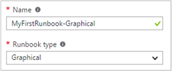
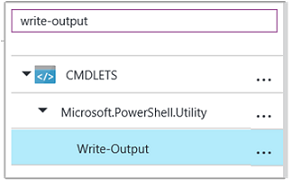
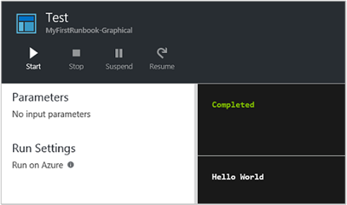
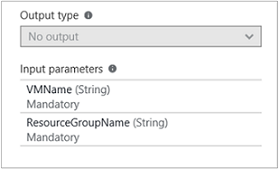

# <a name="my-first-graphical-runbook"></a>我的第一个图形 Runbook

> [!div class="op_single_selector"]
> * [图形](automation-first-runbook-graphical.md)
> * [PowerShell](automation-first-runbook-textual-powershell.md)
> * [PowerShell 工作流](automation-first-runbook-textual.md)
> * [Python](automation-first-runbook-textual-python2.md)
> 

本教程指导在 Azure 自动化中创建 [图形 Runbook](automation-runbook-types.md#graphical-runbooks)。 从一个可以测试和发布的简单 Runbook 开始，了解如何跟踪 Runbook 作业的状态。 然后，通过修改 Runbook 来实际管理 Azure 资源。在这种情况下，将启动 Azure 虚拟机。 为了完成本教程，我们将通过添加 Runbook 参数和条件链接来使该 Runbook 更可靠。

## <a name="prerequisites"></a>必备条件

要完成本教程，需要以下各项：

* Azure 订阅。 如果没有 Azure 订阅，可在开始之前创建一个 [1 元试用](https://www.azure.cn/pricing/1rmb-trial/)帐户。
* [自动化帐户](automation-offering-get-started.md) ，用来保存 Runbook 以及向 Azure 资源进行身份验证。 此帐户必须有权启动和停止虚拟机。
* Azure 虚拟机。 由于我们要停止并启动此虚拟机，因此它不应是用于生产的 VM。

## <a name="step-1---create-runbook"></a>步骤 1 - 创建 Runbook

首先创建一个输出文本 `Hello World` 的简单 Runbook。

1. 在 Azure 门户中，打开自动化帐户。 

    通过自动化帐户页面可快速查看此帐户中的资源。 应该已拥有某些资产。 其中的大多数资产都是自动包含在新自动化帐户中的模块。 此外，应准备好与订阅关联的凭据资产。
2. 在“过程自动化”下选择“Runbook”，打开 Runbook 列表。  
3. 选择“创建 Runbook”以创建新的 Runbook。 
4. 将该 Runbook 命名为 **MyFirstRunbook-Graphical**。
5. 在本例中，我们将创建一个[图形 Runbook](automation-graphical-authoring-intro.md)。 为“Runbook 类型”选择“图形”。  <br> <br>
6. 单击“创建”以创建 Runbook 并打开图形编辑器  。

## <a name="step-2---add-activities"></a>步骤 2 - 添加活动

编辑器左侧的库控件允许选择要添加到 Runbook 的活动。 添加 `Write-Output` cmdlet 以从 Runbook 输出文本。

1. 在“库”控件中，单击搜索字段并键入 `write-output`。 下图显示了搜索结果。 <br> 
1. 向下滚动到列表的底部。 右键单击“Write-Output”并选择“添加到画布”。   或者，可以单击 cmdlet 旁边的省略号图标 (...)，然后选择“添加到画布”。 
1. 单击画布上的 **Write-Output** 活动。 此操作会打开可用于配置活动的“配置控件”页。
1. “标签”字段默认为 cmdlet 的名称，但可将其更改为更友好的名称。  将其更改为 `Write Hello World to output`。
1. 单击“参数”为 cmdlet 参数提供值  。

   某些 cmdlet 有多个参数集。需要选择所用的参数集。 在本例中，仅为 `Write-Output` 设置了一个参数。

1. 选择 `InputObject` 参数。 将使用此参数来指定要发送到输出流的文本。
1. “数据源”下拉菜单提供了用于填充参数值的源。  在此菜单中选择“PowerShell 表达式”。  

   可以使用来自另一个活动、自动化资产或 PowerShell 表达式等源的输出。 在本例中，输出只是 `Hello World`。 可以使用 PowerShell 表达式并指定一个字符串。<br>

1. 在“表达式”字段中键入 **，然后单击“确定”两次以返回到画布。** `Hello World`
1. 通过单击“保存”  保存 Runbook。

## <a name="step-3---test-the-runbook"></a>步骤 3 - 测试 Runbook

在发布 Runbook 以使其可在生产环境中使用之前，应该对其进行测试，以确保它能正常工作。 测试 Runbook 会运行其草稿版，可以交互方式查看其输出。

1. 选择“测试窗格”打开“测试”窗格。 
1. 单击“启动”以启动测试  。 这应该是唯一的已启用选项。
1. 请注意已创建一个 [Runbook 作业](automation-runbook-execution.md)，其状态显示在窗格中。

   作业状态最初为 `Queued`，表示该作业正在等待云中的 Runbook 辅助角色变为可用状态。 在某个辅助角色认领该作业后，状态将更改为 `Starting`。 最后，在 Runbook 实际开始运行时，状态将变为 `Running`。

1. Runbook 作业完成后，“测试”窗格会显示其输出。 在本例中，你会看到 `Hello World`。

    
1. 关闭测试窗格以返回到画布。

## <a name="step-4---publish-and-start-the-runbook"></a>步骤 4 - 发布和启动 Runbook

创建的 Runbook 仍处于草稿模式。 必须先将它发布，然后才能在生产环境中运行它。 当发布 Runbook 时，可以用草稿版本覆盖现有的已发布版本。 在本例中，还没有已发布版本，因为刚刚创建 Runbook。

1. 选择“发布”以发布该 Runbook，并在出现提示时选择“是”   。
1. 向左滚动以在“Runbook”页上查看该 Runbook，请注意“创作状态”值设置为“已发布”。  
1. 往回向右滚动查看“MyFirstRunbook-Graphical”页  。

   使用顶部的选项可以立即启动 Runbook、计划将来的启动时间，或创建一个 [Webhook](automation-webhooks.md)，以便可以通过 HTTP 调用启动 Runbook。

1. 选择“启动”，并在出现提示时选择“是”   启动 runbook。
1. 此时将打开已创建的 Runbook 作业的“作业”窗格。 确认“作业状态”字段是否显示“已完成”。  
1. 单击“输出”打开“输出”页，在其中可以看到显示了 **。** `Hello World`
1. 关闭“输出”页。
1. 单击“所有日志”打开 Runbook 作业的“流”窗格  。 在输出流中应该只会看到 `Hello World`。 

    请注意，“流”窗格可能会显示 Runbook 作业的其他流，例如，详细和错误流（如果 Runbook 向其写入数据）。
1. 关闭“流”窗格和“作业”窗格以返回到“MyFirstRunbook-Graphical”页。
1. 若要查看 Runbook 的所有作业，请在“资源”下选择“作业”。   “作业”页将列出该 Runbook 创建的所有作业。 由于只运行了作业一次，因此只会列出一个作业。
1. 单击作业名称，打开在启动 Runbook 时出现过的同一个“作业”窗格。 使用此窗格查看为 Runbook 创建的任何作业的详细信息。

## <a name="step-5---create-variable-assets"></a>步骤 5 - 创建变量资产

我们已测试并发布了 Runbook，但到目前为止，它对于管理 Azure 资源还不能发挥任何作用。 在配置 Runbook 的身份验证之前，必须创建一个变量用于保存订阅 ID，设置身份验证活动，然后引用该变量。 包含对订阅上下文的引用可以轻松使用多个订阅。

1. 在导航窗格中复制“订阅”选项中的订阅 ID。 
1. 在“自动化帐户”页中的“共享资源”下选择“变量”。  
1. 选择“添加变量”  。
1. 在“新建变量”页上提供的字段中完成以下设置。

    * **名称** - 输入 `AzureSubscriptionId`。
    * **值** -- 输入订阅 ID。 
    * **类型** -- 保留所选的字符串。
    * **加密** -- 使用默认值。
1. 单击“创建”以创建该变量  。

## <a name="step-6---add-authentication"></a>步骤 6 - 添加身份验证

创建一个用于保存订阅 ID 的变量后，可将 Runbook 配置为使用订阅的运行方式凭据进行身份验证。 为此，可将 Azure 运行方式作为连接资产以及 **Connect-AzureRmAccount** cmdlet 添加到画布中。

>[!NOTE]
> **Add-AzureRmAccount** 现在是 **Connect-AzureRmAccount** 的别名。 搜索库项时，如果未看到 **Connect-AzureRmAccount**，则可以使用 **Add-AzureRmAccount**。

1. 导航到 Runbook，在“MyFirstRunbook-Graphical”页上选择“编辑”  。
1. 不再需要 `Write Hello World to output` 条目。 只需单击省略号图标，然后选择“删除”即可。 
1. 在“库”控件中，依次展开“资产”、“连接”。   选择“添加到画布”，将 `AzureRunAsConnection` 添加到画布。 
1. 在“库”控件中的搜索字段内，键入 `Add-AzureRmAccount`。
1. 将 `Add-AzureRmAccount` 添加到画布。
1. 将鼠标悬停在 `Get Run As Connection` 上方，直到在该形状的底部显示一个圆圈。 单击该圆圈并将箭头拖至 `Add-AzureRmAccount`，以构成一个链接。 Runbook 从 `Get Run As Connection` 开始运行，然后运行 `Add-AzureRmAccount`。<br> 
1. 在画布上选择 `Add-AzureRmAccount`。 在“配置”控件窗格的“标签”字段中键入“登录到 Azure”。  
1. 单击“参数”，此时会显示“活动参数配置”页。 
1. `Add-AzureRmAccount` cmdlet 有多个参数集。在提供参数值之前，需要选择其中的一个参数集。 单击“参数集”，然后选择“ServicePrincipalCertificate”   。
1. 此参数集的参数将显示在“活动参数配置”页上。 单击“APPLICATIONID”  。<br> 
1. 在“参数值”页中完成以下设置，然后单击“确定”。 

   * **数据源** -- 选择“活动输出”。 
   * 数据源列表 -- 选择“获取自动化连接”。 
   * **字段路径** -- 键入 `ApplicationId`。 需要指定字段路径的属性的名称，因为活动所输出的对象包含多个属性。

1. 单击“CERTIFICATETHUMBPRINT”，在“参数值”页上完成以下设置并单击“确定”。  

    * **数据源** -- 选择“活动输出”。 
    * 数据源列表 -- 选择“获取自动化连接”。 
    * **字段路径** -- 键入 `CertificateThumbprint`。
1. 单击“SERVICEPRINCIPAL”，在“参数值”页上为“数据源”字段选择“ConstantValue”，单击选项“True”，然后单击“确定”。     
1. 单击“ENVIRONMENTNAME”，在“参数值”页中，选择“ConstantValue”作为“数据源”，在文本框中输入“AzureChinaCloud”，然后单击“确定”     。
1. 单击“TENANTID”，在“参数值”页上完成以下设置。  完成后，单击“确定”两次。 

    * **数据源** -- 选择“活动输出”。  
    * 数据源列表 -- 选择“获取自动化连接”。 
    * **字段路径** -- 键入 `TenantId`。 
1. 在“库”控件中的搜索字段内，键入 `Set-AzureRmContext`。
1. 将 `Set-AzureRmContext` 添加到画布。
1. 在画布上选择 `Set-AzureRmContext`。 在“配置”控件窗格中的“标签”字段内，输入 `Specify Subscription Id`。 
1. 单击“参数”，此时会显示“活动参数配置”页  。
1. `Set-AzureRmContext` cmdlet 有多个参数集。在提供参数值之前，需要选择其中的一个参数集。 单击“参数集”，然后选择“SubscriptionId”。  
1. 此参数集的参数将显示在“活动参数配置”页上。 单击“SubscriptionID”。 
1. 在“参数值”页上，为“数据源”选择“ConstantValue”，将 SubscriptionId 写入文本框，然后单击“确定”两次。   
1. 将鼠标悬停在 `Login to Azure` 上方，直到在该形状的底部显示一个圆圈。 单击该圆圈并将箭头拖至 `Specify Subscription Id`。 此时，Runbook 看起来应该如下所示。

    

## <a name="step-7---add-activity-to-start-a-virtual-machine"></a>步骤 7 - 添加用于启动虚拟机的活动

现在，必须添加一个 `Start-AzureRmVM` 活动来启动虚拟机。 可以选取 Azure 订阅中的任何 VM。暂时可以在 cmdlet 中对虚拟机的名称进行硬编码。

1. 在“库”控件中的搜索字段内，键入 `Start-AzureRm`。
2. 将 `Start-AzureRmVM` 添加到画布，然后单击并将其拖到 `Specify Subscription Id` 下方。
1. 将鼠标悬停在 `Specify Subscription Id` 上方，直到在该形状的底部显示一个圆圈。 单击该圆圈并将箭头拖至 `Start-AzureRmVM`。
1. 选择 `Start-AzureRmVM`。 单击“参数”，并单击“参数集”查看该活动的集。  
1. 为参数集选择“ResourceGroupNameParameterSetName”。  “ResourceGroupName”和“名称”字段旁边出现了感叹号，表示它们是必需的参数。   请注意，需在这两个字段中输入字符串值。
1. 选择“名称”  。 为“数据源”字段选择“PowerShell 表达式”。   对于用于启动此 Runbook 的 VM，请键入带双引号的虚拟机名称。 单击“确定”。 
1. 选择“ResourceGroupName”  。 为“数据源”字段使用“PowerShell 表达式”值，并键入带双引号的资源组名称。   单击“确定”。 
1. 单击“测试”  窗格，以便测试 Runbook。
1. 单击“启动”开始测试。  完成后，请确保 VM 已启动。 此时，Runbook 看起来应该如下所示。

    

## <a name="step-8---add-additional-input-parameters"></a>步骤 8 - 添加其他输入参数

Runbook 当前会启动资源组中的、为 `Start-AzureRmVM` cmdlet 指定的 VM。 如果在启动 Runbook 时同时指定了 VM 名称和资源组，该 Runbook 会更有用。 将输入参数添加到 Runbook，以提供该功能。

1. 在“MyFirstRunbook-Graphical”页上单击“编辑”，打开图形编辑器  。
1. 依次选择“输入和输出”和“添加输入”，打开“Runbook 输入参数”窗格   。
1. 在提供的字段中完成以下设置，然后单击“确定”。 
   * **名称** -- 指定 `VMName`。
   * **类型** -- 保留字符串设置。
   * **必需** -- 将值更改为“是”。 
1. 创建名为 `ResourceGroupName` 的另一个必需输入参数，然后单击“确定”关闭“输入和输出”窗格。 <br> 
1. 选择 `Start-AzureRmVM` 活动，然后单击“参数”。 
1. 将“名称”的“数据源”字段更改为“Runbook 输入”。    然后选择“VMName”。 
1. 将“ResourceGroupName”的“数据源”字段更改为“Runbook 输入”，然后选择“ResourceGroupName”。    <br> 
1. 保存 Runbook 并打开“测试”窗格。 现在可以为在测试中使用的两个输入变量提供值。
1. 关闭“测试”窗格。
1. 单击“发布”以发布 Runbook 的新版本  。
1. 停止前面已启动的 VM。
1. 单击“启动”以启动 Runbook **ResourceGroupName** 。 键入要启动的 VM 的 `VMName` 和 `ResourceGroupName` 值。
1. Runbook 完成后，请确保 VM 已启动。

## <a name="step-9---create-a-conditional-link"></a>步骤 9 - 创建条件链接

现在可以修改该 Runbook，使之仅在 VM 尚未启动的情况下尝试启动 VM。 为此，请添加一个 Get-AzureRmVM cmdlet 来检索 VM 的实例级状态。  然后，可以添加名为 `Get Status` 的 PowerShell 工作流代码模块，并在其中包含一个 PowerShell 代码片段用于确定 VM 状态是正在运行还是已停止。 仅当当前运行状态是已停止时，`Get Status` 模块中的条件链接才运行 `Start-AzureRmVM`。 此过程结束后，Runbook 将使用 `Write-Output` cmdlet 来输出消息，以告知 VM 是否已成功启动。

1. 在图形编辑器中打开“MyFirstRunbook-Graphical”  。
1. 单击 `Specify Subscription Id` 与 `Start-AzureRmVM` 之间的链接，然后按“删除”删除该链接。 
1. 在“库”控件中的搜索字段内，键入 `Get-AzureRm`。
1. 将 `Get-AzureRmVM` 添加到画布。
1. 选择 `Get-AzureRmVM`，然后单击“参数集”以查看该 cmdlet 的集。  
1. **GetVirtualMachineInResourceGroupNameParamSet** 参数集。 “ResourceGroupName”和“名称”字段旁边出现了感叹号，表示必须为它们指定参数。   请注意，需在这两个字段中输入字符串值。
1. 在“名称”的“数据源”下，依次选择“Runbook 输入”、“VMName”。     单击“确定”。 
1. 在“ResourceGroupName”的“数据源”下，依次选择“Runbook 输入”、“ResourceGroupName”。     单击“确定”。 
1. 在“状态”的“数据源”下，依次选择“常量值”、“True”。     单击“确定”。 
1. 创建从 `Specify Subscription Id` 到 `Get-AzureRmVM` 的链接。
1. 在“库”控件中展开“Runbook 控件”，然后将“代码”添加到画布。    
1. 创建从 `Get-AzureRmVM` 到 `Code` 的链接。  
1. 单击 `Code`，然后在“配置”窗格中将标签更改为“获取状态”。 
1. 选择 `Code`，此时会显示“代码编辑器”页。  
1. 将以下代码片段粘贴到编辑器页中。

    ```powershell
     $StatusesJson = $ActivityOutput['Get-AzureRmVM'].StatusesText
     $Statuses = ConvertFrom-Json $StatusesJson
     $StatusOut =""
     foreach ($Status in $Statuses){
     if($Status.Code -eq "Powerstate/running"){$StatusOut = "running"}
     elseif ($Status.Code -eq "Powerstate/deallocated") {$StatusOut = "stopped"}
     }
     $StatusOut
     ```

1. 创建从 `Get Status` 到 `Start-AzureRmVM` 的链接。

      
1. 选择该链接，然后在“配置”窗格中，将“应用条件”更改为“是”。   请注意，该链接变为虚线，指示仅在条件解析为 True 时才会运行目标活动。  
1. 对于“条件表达式”，请键入 **。** `$ActivityOutput['Get Status'] -eq "Stopped"` 现在，仅当 VM 已停止时，`Start-AzureRmVM` 才会运行。
1. 在库控件中，展开 **Cmdlet** 节点，并展开 **Microsoft.PowerShell.Utility**。
1. 将 `Write-Output` 添加到画布两次。
1. 对于第一个 `Write-Output` 控件，请单击“参数”并将“标签”值更改为“通知 VM 已启动”。   
1. 对于“InputObject”，请将“数据源”更改为“PowerShell 表达式”，并键入表达式 **。**   `$VMName successfully started.`
1. 在第二个 `Write-Output` 控件中，单击“参数”并将“标签”值更改为“通知 VM 启动失败”。   
1. 对于“InputObject”，请将“数据源”更改为“PowerShell 表达式”，并键入表达式 **。**   `$VMName could not start`
1. 创建从 `Start-AzureRmVM` 到 `Notify VM Started` 和 `Notify VM Start Failed` 的链接。
1. 选择与 `Notify VM Started` 建立的链接，将“应用条件”设置为 true。 
1. 对于“条件表达式”，请键入 **。** `$ActivityOutput['Start-AzureRmVM'].IsSuccessStatusCode -eq $true` 现在，只有在 VM 已成功启动的情况下，此 `Write-Output` 控件才会运行。
1. 选择与 `Notify VM Start Failed` 建立的链接，将“应用条件”设置为 true。 
1. 对于“条件表达式”字段，请键入 **。** `$ActivityOutput['Start-AzureRmVM'].IsSuccessStatusCode -ne $true` 现在，仅当 VM 未成功启动时，此 `Write-Output` 控件才会运行。 Runbook 看起来应如下图所示。

    
1. 保存 Runbook 并打开“测试”窗格。
1. 在 VM 停止的情况下启动 Runbook，然后虚拟机应会启动。

## <a name="next-steps"></a>后续步骤

* 若要了解有关图形创作的详细信息，请参阅 [Azure 自动化中的图形创作](automation-graphical-authoring-intro.md)。
* 若要开始使用 PowerShell Runbook，请参阅[我的第一个 PowerShell Runbook](automation-first-runbook-textual-powershell.md)。
* 若要开始使用 PowerShell 工作流 Runbook，请参阅[我的第一个 PowerShell 工作流 Runbook](automation-first-runbook-textual.md)。