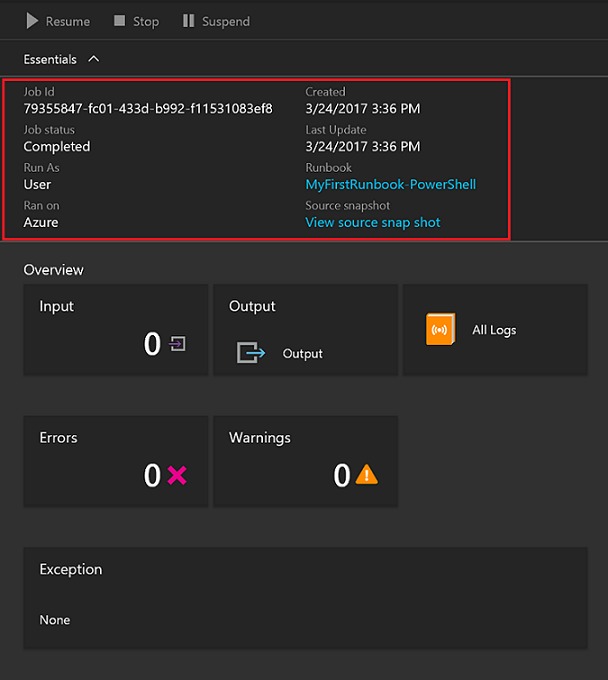
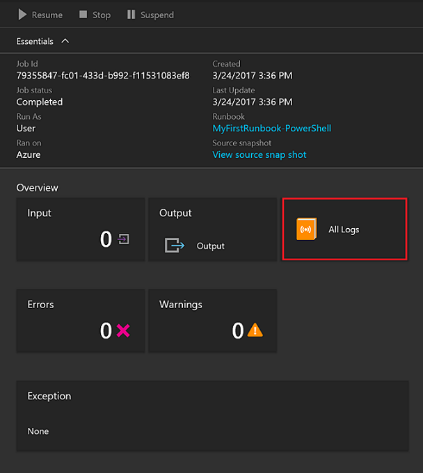
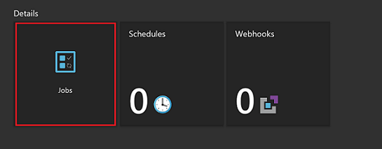

# <a name="my-first-powershell-runbook"></a>我的第一个 PowerShell Runbook

> [!div class="op_single_selector"]
> * [图形](automation-first-runbook-graphical.md)
> * [PowerShell](automation-first-runbook-textual-powershell.md)
> * [PowerShell 工作流](automation-first-runbook-textual.md)
> * [Python](automation-first-runbook-textual-python2.md)

本教程指导你在 Azure 自动化中创建 [PowerShell Runbook](automation-runbook-types.md#powershell-runbooks) 。 从一个简单的 Runbook 开始，将测试和发布该 Runbook，同时了解如何跟踪 Runbook 作业的状态。 然后，通过修改 Runbook 来实际管理 Azure 资源，这种情况下会启动 Azure 虚拟机。 最后，通过添加 Runbook 参数使此 Runbook 更稳健。

## <a name="prerequisites"></a>先决条件

若要完成本教程，需要满足以下先决条件：

* Azure 订阅。 如果没有订阅，可注册[试用版](https://www.azure.cn/pricing/1rmb-trial/?WT.mc_id=A261C142F)。
* [自动化帐户](automation-quickstart-create-account.md) ，用来保存 Runbook 以及向 Azure 资源进行身份验证。 此帐户必须有权启动和停止虚拟机。
* Azure 虚拟机。 停止和启动此虚拟机，因此它不应为生产用 VM。

## <a name="create-new-runbook"></a>创建新的 Runbook

首先创建一个输出文本 Hello World 的简单 Runbook。

1. 在 Azure 门户中，打开自动化帐户。
2. 在“流程自动化”下单击“Runbook”，打开 Runbook 的列表。
3. 通过单击“+ 添加 Runbook”按钮，并单击“创建新 Runbook”，创建一个新 Runbook。
4. 将该 Runbook 命名为 *MyFirstRunbook-PowerShell*。
5. 在本例中，将要创建一个 [PowerShell Runbook](automation-runbook-types.md#powershell-runbooks)，因此请选择“Powershell”作为“Runbook 类型”。
6. 单击“创建”以创建 Runbook 并打开文本编辑器  。

## <a name="add-code-to-the-runbook"></a>将代码添加到 Runbook

可以直接将代码键入 Runbook 中，或者通过“库”控件选择 cmdlet、Runbook 和资产，并使用任何相关的参数将它们添加到 Runbook。 在本演练中，将直接键入 Runbook。

1. Runbook 当前为空，请在脚本正文中键入 Write-Output "Hello World" 。

     

2. 通过单击“保存” 保存 Runbook。

## <a name="step-3---test-the-runbook"> </a> 测试 runbook

在发布 Runbook 使其可在生产中使用之前，需对其进行测试以确保其能正常工作。 测试 Runbook 时，可以运行其“草稿”版本并以交互方式查看其输出。

1. 单击“测试窗格”打开测试窗格  。
2. 单击“启动”以启动测试  。 这应该是唯一的已启用选项。
3. 创建一个 [Runbook 作业](automation-runbook-execution.md)并显示其状态。

   作业状态一开始为“排队”，表示正在等待云中的 runbook 辅助角色变为可用状态。 在某个辅助角色认领此作业后，作业状态将变为“正在启动”，然后当 Runbook 实际开始运行时，此状态将变为“正在运行”。  

4. Runbook 作业完成后，会显示其输出。 在此示例中，应会显示 Hello World。

     

5. 关闭测试窗格以返回到画布。

## <a name="publish-and-start-the-runbook"></a>发布和启动 Runbook

创建的 Runbook 仍处于“草稿”模式。 必须先将其发布，然后才能在生产环境中运行。  当发布 Runbook 时，可以用草稿版本覆盖现有的已发布版本。 在此示例中，由于刚创建了 Runbook，因此还没有已发布版本。

1. 单击“发布”以发布该 Runbook，并在出现提示时单击“是”。
2. 如果向左滚动以在“Runbook”窗格中查看该 Runbook，它会显示“已发布”的“创作状态”。
3. 向右滚动查看 **MyFirstRunbook-PowerShell**的窗格。  
   顶部的选项允许我们启动 Runbook、查看 Runbook、计划其在将来的某个时刻启动，或创建 [webhook](automation-webhooks.md) 以使其可以通过 HTTP 调用启动。
4. 由于要启动 Runbook，因此请单击“启动”，并在“启动 Runbook”页打开时单击“确定”。
5. 此时会为你创建的 Runbook 作业打开作业页。 可以关闭此窗格，但在此示例中，将它保持打开状态，以便查看该作业的进度。
6. 作业状态显示在“作业摘要”中并且与测试该 Runbook 时看到的状态相匹配。

   

7. 此 Runbook 状态显示“已完成”后，立即在“概述”下单击“输出”。 “输出”窗格打开后，可以看到 Hello World。

   

8. 关闭“输出”页。
9. 单击“所有日志”打开 Runbook 作业的“流”窗格。 应该只会在输出流中看到“Hello World”，但此输出也可以显示 tunbook 作业的其他流，例如，“详细”和“错误”（如果 runbook 向其写入）。

   

10. 关闭“流”页和“作业”页以返回到 MyFirstRunbook-PowerShell 页。
11. 在“详细信息”下单击“作业”打开此 Runbook 的“作业”窗格。 此页列出此 runbook 创建的所有作业。 由于只运行该作业一次，应该只会看到一个列出的作业。

     

12. 可以单击此作业，打开在启动 Runbook 时查看过的“作业”窗格。 这样便可以回溯并查看为特定 runbook 创建的任何作业的详细信息。

## <a name="add-authentication-to-manage-azure-resources"></a>添加身份验证来管理 Azure 资源

已经测试并发布 Runbook，但到目前为止它不执行任何有用的操作。 需要让其管理 Azure 资源。 除非使用在创建自动化帐户时自动创建的运行方式连接对其进行身份验证，否则无法执行此操作。 通过 Connect-azurermaccount cmdlet 使用运行方式连接。 如果要跨多个订阅管理资源，需要使用 -AzureRmContext 参数以及 [Get-AzureRmContext](https://docs.microsoft.com/powershell/module/azurerm.profile/get-azurermcontext)。

   ```powershell
   $connection = Get-AutomationConnection -Name AzureRunAsConnection
   Connect-AzureRmAccount -ServicePrincipal -Tenant $connection.TenantID `
   -EnvironmentName AzureChinaCloud `
-ApplicationID $connection.ApplicationID -CertificateThumbprint $connection.CertificateThumbprint

   $AzureContext = Select-AzureRmSubscription -SubscriptionId $connection.SubscriptionID

   Get-AzureRmVM -ResourceGroupName myResourceGroup -AzureRmContext $AzureContext
   ```

1. 通过单击 MyFirstRunbook-PowerShell 页上的“编辑”打开文本编辑器。
2. 由于不再需要 **Write-Output** 行，因此请直接删除它。
3. 键入（或者复制并粘贴）以下代码，对自动化运行方式帐户的身份验证进行处理：

   ```powershell
   $connection = Get-AutomationConnection -Name AzureRunAsConnection
   Connect-AzureRmAccount -ServicePrincipal -Tenant $connection.TenantID `
   -ApplicationId $connection.ApplicationID -CertificateThumbprint $connection.CertificateThumbprint -EnvironmentName "AzureChinaCloud"
   ```

   > [!IMPORTANT]
   > **Add-AzureRmAccount** 和 **Login-AzureRmAccount** 现在是 **Connect-AzureRMAccount** 的别名。 如果 **Connect-AzureRMAccount** cmdlet 不存在，则可以使用 **Add-AzureRmAccount** 或 **Login-AzureRmAccount**，也可以将自动化帐户中的模块更新为最新版本。

4. 单击“测试”窗格，以便测试 Runbook。
5. 单击“启动”以启动测试  。 完成后，你会收到类似于以下内容的输出，显示帐户中的基本信息。 此输出确认运行方式帐户有效。

   

## <a name="add-code-to-start-a-virtual-machine"></a>添加代码以启动虚拟机

现在 Runbook 正在向 Azure 订阅进行身份验证，你可以管理资源。 将添加一个命令，用于启动虚拟机。 可以在 Azure 订阅中选取任何虚拟机。而现在，需将该名称硬编码到 Runbook。

1. 在 Connect-AzureRmAccount 后面键入 Start-AzureRmVM -Name 'VMName' -ResourceGroupName 'NameofResourceGroup'（提供要启动的虚拟机的名称和资源组名称）。  

   ```powershell
   $connection = Get-AutomationConnection -Name AzureRunAsConnection
   Connect-AzureRmAccount -ServicePrincipal -Tenant $connection.TenantID `
   -ApplicationID $connection.ApplicationID -CertificateThumbprint $connection.CertificateThumbprint -EnvironmentName "AzureChinaCloud"
   Start-AzureRmVM -Name 'VMName' -ResourceGroupName 'ResourceGroupName'
   ```

2. 保存 Runbook，并单击“测试”窗格，以便可以测试 Runbook。
3. 单击“启动”以启动测试  。 一旦测试完成后，检查已启动的虚拟机。

## <a name="add-an-input-parameter"></a>添加输入参数

Runbook 当前会启动你在 Runbook 中硬编码的虚拟机，但如果在启动 Runbook 时指定虚拟机，它会更有用。 现在将输入参数添加到 Runbook，以提供该功能。

1. 将 *VMName* 和 *ResourceGroupName* 的参数添加到 Runbook，并将这些变量与 **Start-AzureRmVM** cmdlet 配合使用，如以下示例所示。

   ```powershell
   Param(
    [string]$VMName,
    [string]$ResourceGroupName
   )
   $connection = Get-AutomationConnection -Name AzureRunAsConnection
   Connect-AzureRmAccount -ServicePrincipal -Tenant $connection.TenantID `
   -ApplicationID $connection.ApplicationID -CertificateThumbprint $connection.CertificateThumbprint -EnvironmentName "AzureChinaCloud"
   Start-AzureRmVM -Name $VMName -ResourceGroupName $ResourceGroupName
   ```

1. 保存 Runbook 并打开“测试”窗格。 现在可以为会在测试中使用的两个输入变量提供值。
2. 关闭“测试”窗格。
3. 单击“发布”以发布 Runbook 的新版本  。
4. 停止在上一步中启动的虚拟机。
5. 单击“确定”启动 Runbook。 键入要启动的虚拟机的 **VMName** 和 **ResourceGroupName**。<br><br> <br>  
6. 一旦 Runbook 完成后，检查已启动的虚拟机。

## <a name="differences-from-powershell-workflow"></a>与 PowerShell 工作流的差异

PowerShell Runbook 与 PowerShell 工作流 Runbook 具有相同的生命周期、功能和管理，但存在一些差异和限制：

1. PowerShell Runbook 比 PowerShell 工作流 Runbook 的运行速度更快，因为没有编译步骤。
2. PowerShell 工作流 runbook 支持检查点。使用检查点，PowerShell 工作流 runbook 可以从 runbook 中的任意点恢复。 PowerShell runbook 仅可从开始处恢复。
3. PowerShell 工作流 runbook 支持并行和串行执行。 PowerShell runbook 仅可按顺序执行命令。
4. 在 PowerShell 工作流 runbook 中，活动、命令或脚本块可以有自己的运行空间。 在 PowerShell runbook 中，脚本内的所有内容都在单个运行空间中运行。 本机 PowerShell Runbook 和 PowerShell 工作流 Runbook 之间还存在一些 [语法差异](https://technet.microsoft.com/magazine/dn151046.aspx) 。

## <a name="next-steps"></a>后续步骤

* 若要开始使用图形 Runbook，请参阅 [我的第一个图形 Runbook](automation-first-runbook-graphical.md)
* 若要开始使用 PowerShell 工作流 Runbook，请参阅 [我的第一个 PowerShell 工作流 Runbook](automation-first-runbook-textual.md)
* 若要了解有关 Runbook 类型、其优点和限制的详细信息，请参阅 [Azure 自动化 Runbook 类型](automation-runbook-types.md)
* 有关 PowerShell 脚本支持功能的详细信息，请参阅 [Azure 自动化中的本机 PowerShell 脚本支持](https://azure.microsoft.com/blog/announcing-powershell-script-support-azure-automation-2/)
