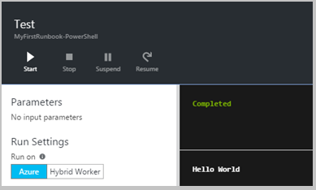
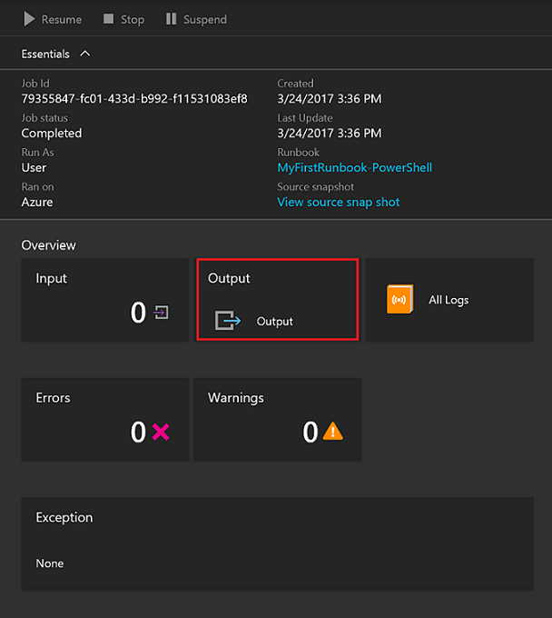
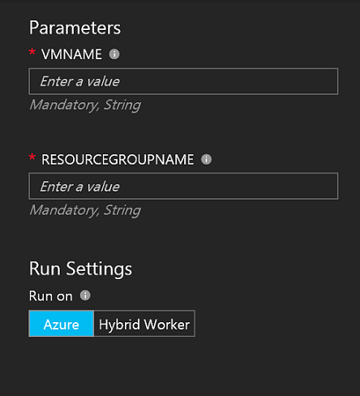

# <a name="my-first-powershell-runbook"></a>我的第一个 PowerShell Runbook

> [!div class="op_single_selector"]
> * [图形](automation-first-runbook-graphical.md)
> * [PowerShell](automation-first-runbook-textual-powershell.md)
> * [PowerShell 工作流](automation-first-runbook-textual.md)
> * [Python](automation-first-runbook-textual-python2.md)

本教程指导你在 Azure 自动化中创建 [PowerShell Runbook](automation-runbook-types.md#powershell-runbooks) 。 从一个可以测试和发布的简单 Runbook 开始，了解如何跟踪 Runbook 作业的状态。 然后，通过修改 Runbook 来实际管理 Azure 资源。在这种情况下，将启动 Azure 虚拟机。 为了完成本教程，我们将通过添加 Runbook 参数来使该 Runbook 更可靠。

## <a name="prerequisites"></a>先决条件

要完成本教程，需要以下各项：

* Azure 订阅。 如果没有订阅，可注册[试用版](https://www.azure.cn/pricing/1rmb-trial/?WT.mc_id=A261C142F)。
* [自动化帐户](automation-quickstart-create-account.md) ，用来保存 Runbook 以及向 Azure 资源进行身份验证。 此帐户必须有权启动和停止虚拟机。
* Azure 虚拟机。 由于我们要停止并启动此虚拟机，因此它不应是用于生产的 VM。

## <a name="differences-from-powershell-workflow-runbooks"></a>与 PowerShell 工作流 Runbook 的差异

PowerShell Runbook 与 PowerShell 工作流 Runbook 具有相同的生命周期、功能和管理方式。 但是，它们也存在一些差异和限制。

| 特征  | PowerShell Runbook | PowerShell 工作流 Runbook |
| ------ | ----- | ----- |
| Speed | 不使用编译步骤，因此运行速度较快。 | 运行速度更慢。 |
| 检查点 | 不支持检查点。 PowerShell Runbook 只能从头开始恢复操作。 | 使用检查点，使工作簿可以从任意位置恢复操作。 |
| 命令执行 | 仅支持串行执行。 | 同时支持串行和并行执行。|
| Runspace | 单个运行空间运行脚本中的所有内容。 | 一个单独的运行空间可用于活动、命令或脚本块。 |

除这些差异外，PowerShell Runbook 还与 PowerShell 工作流 Runbook 存在一些[语法差异](https://technet.microsoft.com/magazine/dn151046.aspx)。

## <a name="step-1---create-runbook"></a>步骤 1 - 创建 Runbook

首先创建一个输出文本 `Hello World` 的简单 Runbook。

1. 在 Azure 门户中，打开自动化帐户。
2. 在“过程自动化”下选择“Runbook”，打开 Runbook 列表。  
3. 选择“创建 Runbook”以创建新的 Runbook。 
4. 将该 Runbook 命名为 **MyFirstRunbook-PowerShell**。
5. 在本例中，我们将创建一个 [PowerShell Runbook](automation-runbook-types.md#powershell-runbooks)。 对于“Runbook 类型”，请选择“PowerShell”。  
6. 单击“创建”以创建 Runbook 并打开文本编辑器  。

## <a name="step-2---add-code-to-the-runbook"></a>步骤 2 - 将代码添加到 Runbook

可以直接将代码键入 Runbook 中，或者通过“库”控件选择 cmdlet、Runbook 和资产，并使用任何相关的参数将它们添加到 Runbook。 对于本教程，请直接在 Runbook 中键入代码。

1. Runbook 当前是空的。 在脚本正文中键入 `Write-Output "Hello World"`。

   

2. 通过单击“保存”  保存 Runbook。

## <a name="step-3---test-the-runbook"></a><a name="step-3---test-the-runbook"> </a> 步骤 3 - 测试 Runbook

在发布 Runbook 以使其可在生产环境中使用之前，应该对其进行测试，以确保它能正常工作。 测试 Runbook 会运行其草稿版，可以交互方式查看其输出。

1. 单击“测试窗格”打开测试窗格  。
2. 单击“启动”以启动测试  。 这应该是唯一的已启用选项。
3. 请注意，已创建了一个 [Runbook 作业](automation-runbook-execution.md)，其状态显示在窗格中。

   作业状态最初为 `Queued`，表示该作业正在等待云中的 Runbook 辅助角色变为可用状态。 在某个辅助角色认领该作业后，状态将更改为 `Starting`。 最后，在 Runbook 实际开始运行时，状态将变为 `Running`。

4. Runbook 作业完成后，“测试”窗格会显示其输出。 在本例中，你会看到 `Hello World`。

   

5. 关闭测试窗格以返回到画布。

## <a name="step-4---publish-and-start-the-runbook"></a>步骤 4 - 发布和启动 Runbook

创建的 Runbook 仍处于草稿模式。 必须先将它发布，然后才能在生产环境中运行它。 当发布 Runbook 时，可以用草稿版本覆盖现有的已发布版本。 在本例中，还没有已发布版本，因为刚刚创建 Runbook。

1. 单击“发布”以发布该 Runbook，并在出现提示时单击“是”   。
1. 向左滚动以在“Runbook”页上查看该 Runbook，请注意“创作状态”值设置为“已发布”。  
1. 向右滚动查看 **MyFirstRunbook-PowerShell**的窗格。
   
   使用顶部的选项可以立即启动 Runbook、计划将来的启动时间，或创建一个 [Webhook](automation-webhooks.md)，以便可以通过 HTTP 调用启动 Runbook。
1. 选择“启动”，并在出现提示时选择“是”   启动 runbook。 
1. 此时将打开已创建的 Runbook 作业的“作业”窗格。 可以关闭此窗格，不过，暂时最好是使其保持打开状态，以便可以查看作业的进度。 作业状态显示在“作业摘要”中，其中描述了测试 Runbook 时会出现的可能状态。 

   

1. Runbook 状态显示为 `Completed` 后，单击“输出”打开“输出”页，在其中可以看到显示了 `Hello World`。 

   

1. 关闭“输出”页。
1. 单击“所有日志”打开 Runbook 作业的“流”窗格  。 在输出流中应该只会看到 `Hello World`。

    请注意，“流”窗格可能会显示 Runbook 作业的其他流，例如，详细和错误流（如果 Runbook 向其写入数据）。

   

1. 关闭“流”窗格和“作业”窗格以返回到“MyFirstRunbook-PowerShell”页。 
1. 在“详细信息”下，单击“作业”打开此 Runbook 的“作业”页   。 此页面将列出你的 Runbook 创建的所有作业。 由于只运行了一次作业，因此你应当只会看到一个作业。

   

1. 单击作业名称，打开在启动 Runbook 时出现过的同一个“作业”窗格。 使用此窗格查看为 Runbook 创建的任何作业的详细信息。

## <a name="step-5---add-authentication-to-manage-azure-resources"></a>步骤 5 - 添加身份验证来管理 Azure 资源

已经测试并发布 Runbook，但到目前为止它不执行任何有用的操作。 需要让其管理 Azure 资源。 为此，Runbook 必须能够使用在创建自动化帐户时自动创建的运行方式帐户进行身份验证。

如以下示例中所示，运行方式帐户连接是使用 [Connect-AzureRmAccount](https://docs.microsoft.com/powershell/module/azurerm.profile/connect-azurermaccount?view=azurermps-6.13.0) cmdlet 建立的。 如果跨多个订阅管理资源，需要结合 `AzureRmContext` 参数使用 [Get-AzureRmContext](https://docs.microsoft.com/powershell/module/azurerm.profile/get-azurermcontext?view=azurermps-6.13.0)。

   ```powershell
   # Ensures you do not inherit an AzureRMContext in your runbook
   Disable-AzureRmContextAutosave -Scope Process

   $connection = Get-AutomationConnection -Name AzureRunAsConnection

   # Wrap authentication in retry logic for transient network failures
   $logonAttempt = 0
   while(!($connectionResult) -And ($logonAttempt -le 10))
   {
       $LogonAttempt++
       # Logging in to Azure...
       $connectionResult =    Connect-AzureRmAccount `
                                  -ServicePrincipal `
                                  -Tenant $connection.TenantID `
                                  -ApplicationId $connection.ApplicationID `
                                  -CertificateThumbprint $connection.CertificateThumbprint `
                  -EnvironmentName AzureChinaCloud

       Start-Sleep -Seconds 30
   }

   $AzureContext = Select-AzureRmSubscription -SubscriptionId $connection.SubscriptionID

   Get-AzureRmVM -ResourceGroupName myResourceGroup -AzureRmContext $AzureContext
   ```
1. 在“MyFirstRunbook-PowerShell”页上单击“编辑”打开文本编辑器。  
1. 不再需要 `Write-Output` 行。 请直接删除它。
1. 键入（或者复制并粘贴）以下代码，对自动化运行方式帐户的身份验证进行处理。

   ```powershell
   # Ensures you do not inherit an AzureRMContext in your runbook
   Disable-AzureRmContextAutosave -Scope Process

   $connection = Get-AutomationConnection -Name AzureRunAsConnection

   while(!($connectionResult) -And ($logonAttempt -le 10))
   {
       $LogonAttempt++
       # Logging in to Azure...
       $connectionResult =    Connect-AzureRmAccount `
                                  -ServicePrincipal `
                                  -Tenant $connection.TenantID `
                                  -ApplicationId $connection.ApplicationID `
                                  -CertificateThumbprint $connection.CertificateThumbprint `
                  -EnvironmentName AzureChinaCloud

       Start-Sleep -Seconds 30
   }
   ```

   > [!IMPORTANT]
   > **Add-AzureRmAccount** 和 **Login-AzureRmAccount** 现在是 **Connect-AzureRMAccount** 的别名。 如果 **Connect-AzureRMAccount** cmdlet 不存在，则可以使用 **Add-AzureRmAccount** 或 **Login-AzureRmAccount**，也可以将自动化帐户中的模块更新为最新版本。

1. 单击“测试”  窗格，以便测试 Runbook。
1. 单击“启动”以启动测试  。 完成后，你会看到类似于以下内容的输出，显示帐户中的基本信息。 此输出确认运行方式帐户有效。

   

## <a name="step-6---add-code-to-start-a-virtual-machine"></a>步骤 6 – 添加用于启动虚拟机的代码

现在 Runbook 正在向 Azure 订阅进行身份验证，你可以管理资源。 让我们添加一个命令，用于启动虚拟机。 可以在 Azure 订阅中选取任何虚拟机，但暂时只需在 Runbook 中对该名称进行硬编码。

1. 在 Runbook 脚本中，添加 [Start-AzureRmVM](https://docs.microsoft.com/powershell/module/azurerm.compute/start-azurermvm?view=azurermps-6.13.0) cmdlet 来启动虚拟机。 如下所示，该 cmdlet 启动名为 `VMName` 的虚拟机以及名为 `ResourceGroupName` 的资源组。

   ```powershell
   # Ensures you do not inherit an AzureRMContext in your runbook
   Disable-AzureRmContextAutosave -Scope Process

   $connection = Get-AutomationConnection -Name AzureRunAsConnection
   while(!($connectionResult) -And ($logonAttempt -le 10))
   {
       $LogonAttempt++
       # Logging in to Azure...
       $connectionResult =    Connect-AzureRmAccount `
                                  -ServicePrincipal `
                                  -Tenant $connection.TenantID `
                                  -ApplicationId $connection.ApplicationID `
                                  -CertificateThumbprint $connection.CertificateThumbprint `
                  -EnvironmentName AzureChinaCloud

       Start-Sleep -Seconds 30
   }

   Start-AzureRmVM -Name 'VMName' -ResourceGroupName 'ResourceGroupName'
   ```

1. 保存 Runbook，并单击“测试”窗格，以便可以测试 Runbook  。
1. 单击“启动”开始测试。  完成后，确保虚拟机已启动。

## <a name="step-7---add-an-input-parameter"></a>步骤 7 - 添加输入参数

Runbook 当前会启动已在 Runbook 中硬编码的虚拟机。 如果在启动 Runbook 时指定虚拟机，该 Runbook 将更有用。 将输入参数添加到 Runbook，以提供该功能。

1. 在文本编辑器中，修改 `Start-AzureRmVM` cmdlet 以便对参数 `VMName` 和 `ResourceGroupName` 使用变量。 

   ```powershell
   Param(
    [string]$VMName,
    [string]$ResourceGroupName
   )
   # Ensures you do not inherit an AzureRMContext in your runbook
   Disable-AzureRmContextAutosave -Scope Process

   $connection = Get-AutomationConnection -Name AzureRunAsConnection
   while(!($connectionResult) -And ($logonAttempt -le 10))
   {
       $LogonAttempt++
       # Logging in to Azure...
       $connectionResult =    Connect-AzureRmAccount `
                                  -ServicePrincipal `
                                  -Tenant $connection.TenantID `
                                  -ApplicationId $connection.ApplicationID `
                                  -CertificateThumbprint $connection.CertificateThumbprint `
                  -EnvironmentName AzureChinaCloud

       Start-Sleep -Seconds 30
   }

   Start-AzureRmVM -Name $VMName -ResourceGroupName $ResourceGroupName
   ```

1. 保存 Runbook 并打开“测试”窗格。 现在可以为在测试中使用的两个输入变量提供值。
1. 关闭“测试”窗格。
1. 单击“发布”以发布 Runbook 的新版本  。
1. 停止前面启动的虚拟机。
1. 单击“启动”以启动 Runbook **ResourceGroupName** 。 
1. 键入要启动的虚拟机的 VMNAME 和 RESOURCEGROUPNAME 值，然后单击“确定”。   <br><br> <br>
1. Runbook 完成后，确保虚拟机已启动。

## <a name="next-steps"></a>后续步骤

* 有关 PowerShell 的详细信息（包括语言参考和学习模块），请参阅 [PowerShell 文档](https://docs.microsoft.com/powershell/scripting/overview)。
* 若要开始使用图形 Runbook，请参阅[我的第一个图形 Runbook](automation-first-runbook-graphical.md)。
* 若要开始使用 PowerShell 工作流 Runbook，请参阅 [My first PowerShell Workflow runbook](automation-first-runbook-textual.md)（第一个 PowerShell 工作流 Runbook）。
* 若要详细了解 Runbook 的类型及其优势和限制，请参阅 [Azure 自动化 Runbook 类型](automation-runbook-types.md)。
* 有关 PowerShell 脚本支持功能的详细信息，请参阅 [Azure 自动化中的本机 PowerShell 脚本支持](https://azure.microsoft.com/blog/announcing-powershell-script-support-azure-automation-2/)。
