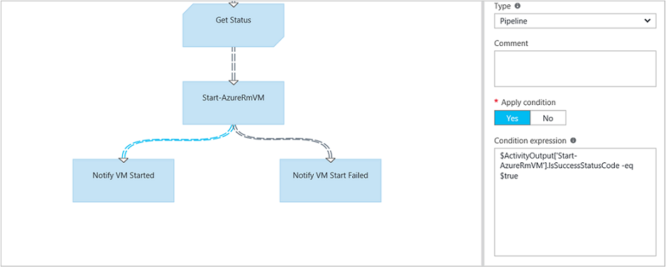
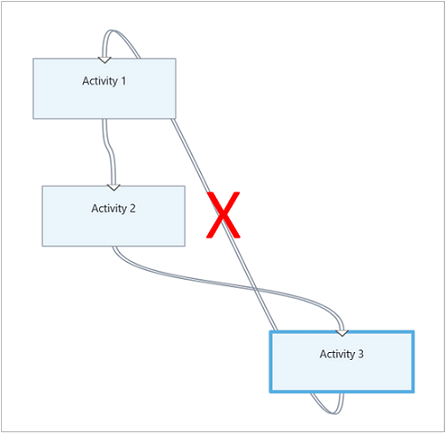
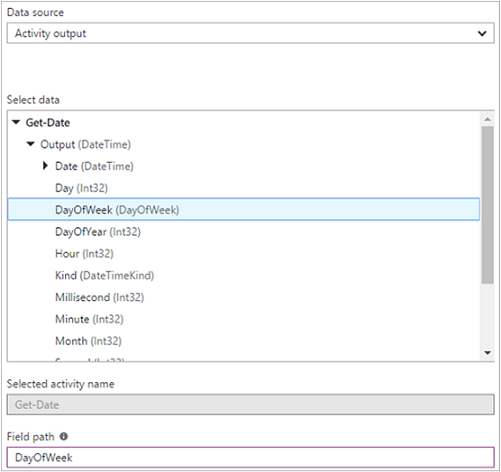
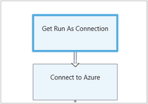

# <a name="graphical-authoring-in-azure-automation"></a>Azure 自动化中的图形创作

图形创作可以用来为 Azure 自动化创建 Runbook，不需要编写复杂的基础性的 Windows PowerShell 或 PowerShell 工作流代码。 可将活动从 cmdlet 和 Runbook 的库添加到画布，将它们链接到一起，然后对其进行配置以形成工作流。 如果你曾经使用过 System Center Orchestrator 或 Service Management Automation (SMA)，则应该很熟悉图形创作。 本文介绍在开始创建图形 Runbook 之前需要了解的概念。

## <a name="graphical-runbooks"></a>图形 Runbook

Azure 自动化中的所有 Runbook 都是 Windows PowerShell 工作流。 图形 Runbook 和图形 PowerShell 工作流 Runbook 生成由自动化辅助角色运行的 PowerShell 代码，但你无法查看或修改这些代码。 可将图形 Runbook 转换为图形 PowerShell 工作流 Runbook，反之亦然。 但是，无法将这些 Runbook 转换为文本 Runbook。 此外，自动化图形编辑器无法导入现有的文本 Runbook。

## <a name="overview-of-graphical-editor"></a>图形编辑器概述

通过创建或编辑图形 Runbook，可以在 Azure 门户中打开图形编辑器。


以下各节介绍图形编辑器中的控件。

### <a name="canvas"></a>画布

可以通过“画布”控件设计 Runbook。 可将“库”控件中的节点的活动添加到 Runbook，并将其通过链接进行连接，以定义 Runbook 的逻辑。 在画布底部，有一些控件可用于放大和缩小。

### <a name="library-control"></a>库控件

使用“库”控件可以选择要添加到 Runbook 的[活动](#activities)。 可将活动添加到画布，然后在画布中将其连接到其他活动。 “库”控件包含下表中定义的部分。

| 部分 | 说明 |
|:--- |:--- |
| Cmdlet |可以在 Runbook 中使用的所有 cmdlet。 Cmdlet 按模块组织。 所有安装在自动化帐户中的模块都可用。 |
| Runbook |自动化帐户中的 Runbook。 可将这些 Runbook 添加到画布中用作子 Runbook。 仅显示核心类型与所编辑 Runbook 相同的 Runbook。 对于图形 Runbook，仅显示基于 PowerShell 的 Runbook。 对于图形 PowerShell 工作流 Runbook，仅显示基于 PowerShell 工作流的 Runbook。 |
| 资产 |自动化帐户中能够在 Runbook 中使用的[自动化资产](https://docs.microsoft.com/previous-versions/azure/dn939988(v=azure.100))。 将资产添加到 Runbook 会添加一个可以获取所选资产的工作流活动。 在使用变量资产的情况下，可以选择是否添加用于获取变量或设置变量的活动。 |
| Runbook 控件 |可以在当前 Runbook 中使用的控件活动。 “交接点”活动采用多个输入，并会等到所有输入完成后才会继续执行工作流。 “代码”活动运行一行或多行 PowerShell 或 PowerShell 工作流代码，具体取决于图形 Runbook 类型。 可以将此活动用于自定义代码或通过其他活动难以实现的功能。 |

### <a name="configuration-control"></a>配置控件

可以在“配置”控件中提供在画布上选择的对象的详细信息。 此控件中的可用属性将取决于所选对象的类型。 在“配置”控件中选择一个选项时，它会打开用于提供额外信息的其他边栏选项卡。

### <a name="test-control"></a>测试控件

首次启动图形编辑器时，不显示“测试”控件。 它会在以交互方式测试图形 Runbook 时打开。

## <a name="activities"></a>活动

活动是 Runbook 的构建基块。 活动可以是 PowerShell cmdlet、子 Runbook 或工作流。 可以右键单击“库”控件中的活动并选择“添加到画布”，将此活动添加到 Runbook。  然后，可以通过单击拖放的方式将活动置于画布上你喜欢的任何位置。 活动在画布上的位置不会以任何方式影响 Runbook 的运行。 可以对 Runbook 进行任何形式的布局，只要觉得该布局最适合实现 Runbook 操作的可视化即可。


在画布上选择需要在“配置”边栏选项卡中配置其属性和参数的活动。 可将活动的标签更改为更具描述性的名称。 Runbook 仍会运行原始 cmdlet。 只需更改图形编辑器使用的显示名称。 请注意，该标签在 Runbook 中必须唯一。

### <a name="parameter-sets"></a>参数集

参数集用于定义会接受特定 cmdlet 的值的必需参数和可选参数。 所有 cmdlet 都有至少一个参数集，某些 cmdlet 具有多个集。 如果某个 cmdlet 有多个参数集，则必须选择要使用的参数集才能配置参数。 可以选择“参数集”并选择另一参数集，来更改活动使用的参数集。  在这种情况下，已配置的任何参数值将会丢失。

在以下示例中，[Get-AzureRmVM](https://docs.microsoft.com/powershell/module/azurerm.compute/get-azurermvm?view=azurermps-6.13.0) cmdlet 有三个参数集。 该示例使用名为 ListVirtualMachineInResourceGroupParamSet 的、包含单个可选参数的集来返回资源组中的所有虚拟机。 该示例还使用 GetVirtualMachineInResourceGroupParamSet 参数集来指定要返回的虚拟机。 此集有两个必需参数和一个可选参数。


#### <a name="parameter-values"></a>参数值

指定某个参数的值时，可以选择一个数据源，以便确定如何指定该值。 可用于特定参数的数据源将取决于该参数的有效值。 例如，对于不允许 Null 值的参数，Null 不会是可用选项。

| 数据源 | 说明 |
|:--- |:--- |
| 常量值 |键入参数的值。 此数据源仅适用于以下数据类型：Int32、Int64、String、Boolean、DateTime、Switch。 |
| 活动输出 |使用工作流中位于当前活动前面的某个活动的输出。 将列出所有有效的活动。 对于参数值，请仅使用生成输出的活动。 如果该活动输出的对象具有多个属性，可以在选择活动之后键入特定属性的名称。 |
| Runbook 输入 |选择一个 Runbook 输入参数作为活动参数的输入。 |
| 变量资产 |选择一个自动化变量作为输入。 |
| 凭据资产 |选择一个自动化凭据作为输入。 |
| 证书资产 |选择一个自动化证书作为输入。 |
| 连接资产 |选择一个自动化连接作为输入。 |
| PowerShell 表达式 |指定简单的 [PowerShell 表达式](#powershell-expressions)。 将先计算该表达式，然后再将活动和结果用于参数值。 可以使用变量来引用活动或 Runbook 输入参数的输出。 |
| 未配置 |清除以前配置的任何值。 |

#### <a name="optional-additional-parameters"></a>可选的其他参数

所有 cmdlet 都会有提供其他参数的选项。 这些参数是 PowerShell 通用参数或其他自定义参数。 图形编辑器将显示一个文本框，可在其中使用 PowerShell 语法提供参数。 例如，若要使用 *Verbose* 通用参数，应指定 `-Verbose:$True`。

### <a name="retry-activity"></a>重试活动

活动重试功能可让该活动运行多次，直到满足特定的条件，这非常类似于循环。 可以针对应该运行多次的活动或者容易出错和可能需要尝试一次以上才成功的活动使用此功能，或者测试活动的输出信息中是否存在有效数据。

对活动启用重试时，可以设置延迟和条件。 延迟是 Runbook 再次运行活动之前等待的时间（以秒或分钟为单位）。 如果未指定延迟，活动将在完成后立即再次运行。


重试条件是每次活动运行之后计算的 PowerShell 表达式。 如果该表达式求值为 True，则活动会再次运行。 如果表达式求值为 False，则活动不会再次运行，且 Runbook 会转到下一个活动。


重试条件可以使用名为 $RetryData 的变量提供活动重试相关信息的访问权限。 此变量具有下表中的属性。

| 属性 | 说明 |
|:--- |:--- |
| NumberOfAttempts |活动已运行的次数。 |
| 输出 |活动上次运行的输出。 |
| TotalDuration |活动首次开始之后的经过时间。 |
| StartedAt |首次启动活动时的时间（UTC 格式）。 |

下面是活动重试条件的示例。

```powershell
# Run the activity exactly 10 times.
$RetryData.NumberOfAttempts -ge 10
```

```powershell
# Run the activity repeatedly until it produces any output.
$RetryData.Output.Count -ge 1
```

```powershell
# Run the activity repeatedly until 2 minutes has elapsed.
$RetryData.TotalDuration.TotalMinutes -ge 2
```

配置活动的重试条件以后，该活动包含两个用于提醒你的可视提示。 一个提示显示在活动中，另一个提示在查看活动的配置时显示。


### <a name="workflow-script-control"></a>工作流脚本控件

工作流脚本控件是一种特殊的活动，它根据所要创作的图形 Runbook 的类型接受 PowerShell 或 PowerShell 工作流脚本。 此控件提供的功能可能无法通过其他方式使用。 它不能接受参数，但可以使用针对活动输出和 Runbook 输入参数的变量。 活动的任何输出都将添加到数据总线中。 一种例外情况是输出中没有传出链接，这种情况下，会将输出添加到 Runbook 的输出中。

例如，以下代码使用称为 $NumberOfDays 的 Runbook 输入变量执行日期计算。 然后，它会将计算出的日期时间值作为输出发送，供 Runbook 中的后续活动使用。

```powershell
$DateTimeNow = (Get-Date).ToUniversalTime()
$DateTimeStart = ($DateTimeNow).AddDays(-$NumberOfDays)}
$DateTimeStart
```

## <a name="links-and-workflow"></a>链接和工作流

图形 Runbook 中的链接用于连接两个活动。 它作为箭头显示在画布上，从源活动指向目标活动。 活动按箭头的方向运行，源活动完成后才会开始目标活动。

### <a name="link-creation"></a>创建链接

可以在两个活动之间创建链接，方法是选择源活动，然后单击形状底部的圆圈。 将箭头拖到目标活动，然后放开。


选择可在“配置”边栏选项卡中配置其属性的链接。 属性包括下表中描述的链接类型。

| 链接类型 | 说明 |
|:--- |:--- |
| 管道 |对于源活动中的每个对象输出，目标活动将运行一次。 如果源活动没有生成任何输出，目标活动不会运行。 源活动的输出可用作对象。 |
| 序列 |目标活动只会在收到来自源活动的输出时运行一次。 源活动的输出可用作对象数组。 |

### <a name="start-of-activity"></a>活动启动

图形 Runbook 会通过任何没有传入链接的活动启动。 通常只有一个活动充当 Runbook 的启动活动。 如果多个活动没有传入链接，则 Runbook 在启动时，将并行运行这些活动。 然后，它会在每个活动完成时，按链接来运行其他活动。

### <a name="link-conditions"></a>链接条件

指定链接的条件时，目标活动仅在该条件求值为 True 时才会运行。 通常会在条件中使用 $ActivityOutput 变量来检索源活动的输出。

对于管道链接，必须为单个对象指定条件。 Runbook 按源活动评估每个对象输出的条件。 然后，它针对符合条件的每个对象运行目标活动。 例如，通过 **Get-AzureRmVM** 源活动，可将以下语法用于条件管道链接，以便只检索名为 Group1 的资源组中的虚拟机。

```powershell
$ActivityOutput['Get Azure VMs'].Name -match "Group1"
```

对于序列链接，Runbook 只会评估条件一次，因为会返回包含源活动中所有对象的单个数组。 因此，Runbook 无法使用序列链接来筛选管道链接之类的对象。 序列链接只能确定是否运行了下一个活动。

以“启动 VM”Runbook 中的以下活动集为例：


该 Runbook 使用三个不同的序列链接来验证 *VMName* 和 *ResourceGroupName* 输入参数的值，以确定要采取的适当操作。 可能的操作为启动单个 VM、启动资源组中的所有 VM，或启动订阅中的所有 VM。 对于“连接到 Azure”和“获取单个 VM”之间的序列链接，下面是条件逻辑：

```powershell
<#
Both VMName and ResourceGroupName runbook input parameters have values
#>
(
(($VMName -ne $null) -and ($VMName.Length -gt 0))
) -and (
(($ResourceGroupName -ne $null) -and ($ResourceGroupName.Length -gt 0))
)
```

使用条件链接时，将通过条件来筛选该分支中从源活动到其他活动所提供的数据。 如果某个活动是多个链接的源，则每个分支中可供活动使用的数据将取决于连接到该分支的链接中的条件。

例如，以下 Runbook 中的 **Start-AzureRmVM** 活动会启动所有虚拟机。 它有两个条件链接。 如果 **Start-AzureRmVM** 活动成功完成，则第一个条件链接将使用表达式 `$ActivityOutput['Start-AzureRmVM'].IsSuccessStatusCode -eq $true` 进行筛选。 如果 **Start-AzureRmVm** 活动无法启动虚拟机，则第二个条件链接将使用表达式 `$ActivityOutput['Start-AzureRmVM'].IsSuccessStatusCode -ne $true` 进行筛选。



遵循第一个链接并使用 **Get-AzureVM** 返回的活动输出的任何活动只会检索运行 **Get-AzureVM** 时已启动的虚拟机。 遵循第二个链接的任何活动只会获取运行 **Get-AzureVM** 时已停止的虚拟机。 任何按第三个链接进行的活动都会获取所有虚拟机，不管这些虚拟机的运行状态如何。

### <a name="junctions"></a>交接点

一个交接点是一个特殊活动，它会一直等到所有传入分支完成为止。 这可以让 Runbook 并行运行多个活动，并确保在所有活动完成后再继续。

尽管一个接合点可以有无限数量的传入链接，但只有其中的一个链接可以成为管道。 传入序列链接的数目不受限制。 可以创建具有多个传入管道链接的接合点并保存 Runbook，但该 Runbook 在运行时会失败。

下面的示例是某个 Runbook 的一部分，该 Runbook 可以启动一组虚拟机，同时还会下载要应用到这些虚拟机的修补程序。 使用接合点是为了确保在 Runbook 继续之前两个进程都已完成。


### <a name="cycles"></a>循环

当目标活动链接回到其源活动，或者链接到最终会链接回到其源的另一活动时，即构成了一个循环。 图形创作目前不支持循环。 如果 Runbook 有一个周期，可以正常保存它，但在运行它时会收到一个错误。



### <a name="data-sharing-between-activities"></a>活动之间的数据共享

由活动通过传出链接输出的任何数据将会写入 Runbook 的数据总线。 Runbook 中的任何活动都可以使用数据总线上的数据来填充参数值或添加脚本代码。 一个活动可以访问工作流中任何以前的活动的输出。

数据写入数据总线的方式取决于活动的链接的类型。 对于管道链接而言，数据将作为多个对象输出。 对于序列链接而言，数据将以数组形式输出。 如果只有一个值，数据将以单元素数组的形式输出。

Runbook 可通过两种方式访问数据总线中的数据： 
* 使用活动输出数据源。
* 使用 PowerShell 表达式数据源。

第一种机制使用活动输出数据源来填充另一活动的参数。 如果输出是一个对象，则 Runbook 可以指定单个属性。



第二种数据访问机制在 PowerShell 表达式数据源中检索活动的输出，或者使用如下所示的语法通过 ActivityOutput 变量从工作流脚本活动检索活动的输出。 如果输出是一个对象，则 Runbook 可以指定单个属性。

```powershell
$ActivityOutput['Activity Label']
$ActivityOutput['Activity Label'].PropertyName
```

### <a name="checkpoints"></a>检查点

可以通过在任何活动中选择“检查点 Runbook”，在图形 PowerShell 工作流 Runbook 中设置[检查点](automation-powershell-workflow.md#checkpoints)。  这会导致在运行活动之后设置检查点。


检查点仅在图形 PowerShell 工作流 Runbook 中启用，在图形 Runbook 中不可用。 如果 Runbook 使用 Azure cmdlet，它应该使用 **Connect-AzureRmAccount** 活动来遵循任何已设置检查点的活动。 如果 Runbook 已挂起，并且必须在另一个辅助角色中从此检查点重启，则会使用 connect 操作。

## <a name="runbook-input-and-output"></a>Runbook 输入和输出

### <a name="runbook-input"></a>Runbook 输入

Runbook 要求通过 Azure 门户启动该 Runbook 的用户提供输入；如果当前 Runbook 用作子级，则要求从另一个 Runbook 提供输入。 例如，对于创建虚拟机的某个 Runbook，每次启动该 Runbook 时，用户都可能需要提供虚拟机名称等信息和其他属性。

Runbook 通过定义一个或多个输入参数来接受输入。 每次启动 Runbook 时，用户都要为这些参数提供值。 当用户使用 Azure 门户启动 Runbook 时，门户会提示该用户为该 Runbook 支持的每个输入参数提供值。

创作 Runbook 时，可以通过单击 Runbook 工具栏上的“输入和输出”按钮来访问其输入参数。  这种情况下将打开**输入和输出**控件，可以通过单击“添加输入”  在该控件中编辑现有输入参数或创建新的参数。


按下表中的属性定义每个输入参数：

| 属性 | 说明 |
|:--- |:--- |
| 名称 |参数的唯一名称。 此名称只能包含字母数字字符，不能包含空格。 |
| 说明 |针对输入参数的可选说明。 |
| 类型 |参数值应有的数据类型。 提示输入时，Azure 门户将针对每个参数的数据类型提供相应的控件。 |
| 必需 |用于指定是否必须为参数提供值的设置。 如果没有为每个没有定义默认值的必需参数提供值，则无法启动 Runbook。 |
| 默认值 |未提供值时为参数使用的值。 请将此值设置为 Null 或特定的值。 |

### <a name="runbook-output"></a>Runbook 输出

图形创作将会保存未与 [Runbook 输出](/automation/automation-runbook-output-and-messages)建立传出链接的任何活动所创建的数据。 输出与 Runbook 作业一起保存，在该 Runbook 作为子 Runbook 使用的情况下，还可供父 Runbook 使用。

## <a name="powershell-expressions"></a>PowerShell 表达式

图形创作的优势之一是，你只要稍微懂一点 PowerShell 就能生成 Runbook。 不过，目前确实需要熟悉一下 PowerShell 才能填充某些[参数值](#activities)和设置[链接条件](#links-and-workflow)。 本部分提供 PowerShell 表达式的快速简介。 [使用 Windows PowerShell 编写脚本](https://technet.microsoft.com/library/bb978526.aspx)中提供了 PowerShell 的完整详细信息。

### <a name="powershell-expression-data-source"></a>PowerShell 表达式数据源
可将 PowerShell 表达式用作数据源，使用 PowerShell 代码的结果来填充[活动参数](#activities)的值。 该表达式可以是执行某个简单函数的单行代码，或执行某个复杂逻辑的多行代码。 未分配给变量的任何命令输出都会输出到参数值。

例如，以下命令将输出当前日期。

```powershell
Get-Date
```

以下命令从当前日期创建字符串并将它分配给变量。 该代码将变量的内容发送到输出。

```powershell
$string = "The current date is " + (Get-Date)
$string
```

以下命令计算当前日期并返回表示当天是工作日还是周末的字符串。

```powershell
$date = Get-Date
if (($date.DayOfWeek = "Saturday") -or ($date.DayOfWeek = "Sunday")) { "Weekend" }
else { "Weekday" }
```

### <a name="activity-output"></a>活动输出

若要在 Runbook 中使用上一个活动的输出，请按以下语法使用 $ActivityOutput 变量。

```powershell
$ActivityOutput['Activity Label'].PropertyName
```

例如，某个活动中的属性需要虚拟机的名称。 在此情况下，Runbook 可以使用以下表达式。

```powershell
$ActivityOutput['Get-AzureVM'].Name
```

如果该属性需要虚拟机对象，而不仅仅是需要名称，则 Runbook 将使用以下语法返回整个对象。

```powershell
$ActivityOutput['Get-AzureVM']
```

Runbook 可以在更复杂的表达式中使用活动的输出，如下所示。 此表达式将文本串联到虚拟机名称。

```powershell
"The computer name is " + $ActivityOutput['Get-AzureVM'].Name
```

### <a name="conditions"></a>Conditions

使用 [比较运算符](https://technet.microsoft.com/library/hh847759.aspx) 来比较值或确定值是否与指定的模式匹配。 比较结果会返回 True 或 False 值。

例如，以下条件用于确定名为 **Get-AzureVM** 的活动中的虚拟机目前是否已停止。

```powershell
$ActivityOutput["Get-AzureVM"].PowerState –eq "Stopped"
```

以下条件检查同一虚拟机是否处于“已停止”以外的任何状态。

```powershell
$ActivityOutput["Get-AzureVM"].PowerState –ne "Stopped"
```

可以在 Runbook 中使用[逻辑运算符](https://technet.microsoft.com/library/hh847789.aspx)（例如 **-and** 或 **-or**）联接多个条件。 例如，以下条件检查上述示例中的虚拟机的状态是“已停止”还是“正在停止”。

```powershell
($ActivityOutput["Get-AzureVM"].PowerState –eq "Stopped") -or ($ActivityOutput["Get-AzureVM"].PowerState –eq "Stopping")
```

### <a name="hashtables"></a>哈希表

[哈希表](https://technet.microsoft.com/library/hh847780.aspx)是可用于返回一组值的名称/值对。 哈希表有时也称为字典。 某些活动的属性要求提供哈希表而不是简单值。

使用以下语法创建哈希表。 哈希表可以包含任意数目的条目，但每个条目由一个名称和值定义。

```powershell
@{ <name> = <value>; [<name> = <value> ] ...}
```

例如，以下表达式创建用作某个活动参数的数据源的哈希表，此参数要求提供 Internet 搜索值的哈希表。

```powershell
$query = "Azure Automation"
$count = 10
$h = @{'q'=$query; 'lr'='lang_ja';  'count'=$Count}
$h
```

以下示例使用名为 **Get Twitter Connection** 的活动的输出来填充哈希表。

```powershell
@{'ApiKey'=$ActivityOutput['Get Twitter Connection'].ConsumerAPIKey;
    'ApiSecret'=$ActivityOutput['Get Twitter Connection'].ConsumerAPISecret;
    'AccessToken'=$ActivityOutput['Get Twitter Connection'].AccessToken;
    'AccessTokenSecret'=$ActivityOutput['Get Twitter Connection'].AccessTokenSecret}
```

## <a name="authenticating-to-azure-resources"></a>通过 Azure 资源进行身份验证

Azure 自动化中用于管理 Azure 资源的 Runbook 将需要通过 Azure 进行身份验证。 [运行方式帐户](automation-create-runas-account.md)（也称为服务主体）是自动化 Runbook 在订阅中访问 Azure 资源管理器资源所用的默认机制。 可以通过在画布中添加使用 PowerShell [Get-AutomationConnection](https://technet.microsoft.com/library/dn919922%28v=sc.16%29.aspx) cmdlet 和 [Connect-AzureRmAccount](https://docs.microsoft.com/powershell/module/azurerm.profile/connect-azurermaccount) cmdlet 的 AzureRunAsConnection 连接资产，将此功能添加到图形 Runbook。 以下示例演示了此方案。



为“获取运行方式连接”活动 ( **Get-AutomationConnection**) 配置了名为 AzureRunAsConnection 的常量值数据源。 


下一个活动 **Connect-AzureRmAccount** 添加经过身份验证的、可在 Runbook 中使用的运行方式帐户。


>[!NOTE]
>对于 PowerShell Runbook，**Login-AzureRmAccount** 和 **Add-AzureRMAccount** 是 **Connect-AzureRmAccount** 的别名。 

对于参数字段 **APPLICATIONID**、**CERTIFICATETHUMBPRINT** 和 **TENANTID**，请指定字段路径属性的名称，因为该活动会输出具有多个属性的对象。 否则，在执行 Runbook 时，它会在尝试身份验证时发生失败。 这是你在通过运行方式帐户对 Runbook 进行身份验证时必须满足的最低要求。

某些订阅者会使用 [Azure AD 用户帐户](automation-create-aduser-account.md)创建一个自动化帐户来管理 Azure 经典部署或 Azure 资源管理器资源。 为使这些订阅者能够保持后向兼容，要在 Runbook 中使用的身份验证机制是结合一个[凭据资产](automation-credentials.md)运行 **Add-AzureAccount** cmdlet，该资产代表有权访问 Azure 帐户的 Active Directory 用户。

可通过以下方式将此功能添加到图形 Runbook：将一个凭据资产添加到画布，然后添加一个使用该凭据资产作为输入的 **Add-AzureAccount** 活动。 请参阅以下示例。


Runbook 在启动时以及在设置每个检查点之后都必须进行身份验证。 因此，必须在任一 Checkpoint-Workflow 活动后面使用 **Add-AzureAccount** 活动。 不需要使用其他凭据活动。


## <a name="exporting-and-importing-a-graphical-runbook"></a>导出和导入图形 Runbook

可以只导出图形 Runbook 的已发布版本。 如果该 Runbook 尚未发布，“导出”按钮将会禁用。  单击“导出”按钮时，Runbook 将下载到本地计算机。  文件名与带有“.graphrunbook”扩展名的 Runbook 名称相匹配。

添加 Runbook 时，可以选择“导入”选项来导入图形 Runbook 或图形 PowerShell 工作流 Runbook 文件。  选择要导入的文件时，可以保留同一个名称，或提供一个新名称。 “Runbook 类型”字段会在评估所选文件后显示 Runbook 的类型。  如果你尝试选择其他不正确的类型，图形编辑器会显示一条消息，指出可能会发生冲突，并且可能会在转换过程中出现语法错误。


## <a name="testing-a-graphical-runbook"></a>测试图形 Runbook

Azure 自动化中的每个图形 Runbook 都有草稿版和已发布版。 只能运行已发布版，同时只能编辑草稿版。 已发布版不受对草稿版所做的任何更改的影响。 当草稿版可供使用时，可将其发布，此时，草稿版会覆盖当前已发布版。

可以在 Azure 门户中测试 Runbook 的草稿版，同时保留已发布版不变。 或者，可以在发布新 Runbook 之前对其进行测试，以便在替换任何版本之前验证该 Runbook 是否正常工作。 测试 Runbook 会执行草稿版，并确保它执行的任何操作已完成。 不会创建任何作业历史记录，但“测试输出”窗格会显示输出。

打开 Runbook 进行编辑，然后单击“测试窗格”打开图形 Runbook 的“测试”控件。  “测试”控件会提示提供输入参数。可以单击“启动”来启动 Runbook。 

## <a name="publishing-a-graphical-runbook"></a>发布图形 Runbook

打开 Runbook 进行编辑，然后单击“发布”以发布图形 Runbook。  Runbook 的可能状态如下：

* 新 -- Runbook 尚未发布。 
* 已发布 -- Runbook 已发布。
* 编辑中 -- Runbook 在发布后已经过编辑，草稿版和已发布版不同。


可以选择还原到 Runbook 的已发布版。 此操作会丢弃自上次发布该 Runbook 以来所做的任何更改。 它会将 Runbook 的草稿版替换为已发布版。

## <a name="next-steps"></a>后续步骤

* 若要开始使用 PowerShell 工作流 Runbook，请参阅 [My first PowerShell Workflow runbook](automation-first-runbook-textual.md)（第一个 PowerShell 工作流 Runbook）。
* 若要开始使用图形 Runbook，请参阅[我的第一个图形 Runbook](automation-first-runbook-graphical.md)。
* 若要详细了解 Runbook 的类型及其优势和限制，请参阅 [Azure 自动化 Runbook 类型](automation-runbook-types.md)。
* 若要了解如何使用自动化运行方式帐户进行身份验证，请参阅[配置 Azure 运行方式帐户](automation-sec-configure-azure-runas-account.md)。
