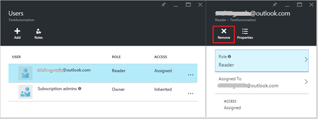

# <a name="role-based-access-control-in-azure-automation"></a>Azure 自动化中基于角色的访问控制

基于角色的访问控制 (RBAC) 可用于对 Azure 资源进行访问管理。 使用 [RBAC](../active-directory/role-based-access-control-configure.md)，可在团队中对职责进行分配，仅授予执行作业所需的对用户、组和应用程序的适当访问权限。 可以使用 Azure 门户、Azure 命令行工具或 Azure 管理 API 将基于角色的访问权限授予用户。

## <a name="roles-in-automation-accounts"></a>自动化帐户中的角色
在 Azure 自动化中，访问权限是通过将相应的 RBAC 角色分配给自动化帐户作用域的用户、组和应用程序来授予的。 以下是自动化帐户所支持的内置角色：

| **角色** | **说明** |
|:--- |:--- |
| 所有者 |“所有者”角色允许访问自动化帐户中的所有资源和操作，包括访问其他用户、组和应用程序以管理自动化帐户。 |
| 参与者 |“参与者”角色允许管理所有事项，修改其他用户对自动化帐户的访问权限除外。 |
| 读取器 |“读者”角色允许查看自动化帐户中的所有资源，但不能进行任何更改。 |
| 自动化运算符 |“自动化操作员”角色允许执行作业的启动、停止、暂停、恢复和计划等操作任务。 如果想要防止他人查看或修改自动化帐户资源（例如凭据资产和 Runbook），但仍允许所在组织的成员执行这些 Runbook，则可使用此角色。 |
|自动化作业操作员|自动化作业操作员角色允许针对某个自动化帐户中的所有 Runbook 创建和管理作业。|
|自动化 Runbook 操作员|可以通过自动化 Runbook 操作员角色读取 Runbook 属性 - 适用于创建 Runbook 的作业。|
| 用户访问管理员 |“用户访问管理员”角色允许管理用户对 Azure 自动化帐户的访问。 |

## <a name="role-permissions"></a>角色权限

下表描述授予每个角色的特定权限。 这可能包括授予权限的操作和限制权限的不操作。

### <a name="owner"></a>所有者

所有者可管理所有内容，包括访问权限。 下表显示了授予角色的权限：

|操作|说明|
|---|---|
|Microsoft.Automation/automationAccounts/|创建和管理所有类型的资源。|

### <a name="contributor"></a>参与者

参与者可管理访问权限以外的所有内容 下表显示了授予和拒绝角色的权限：

|**操作**  |**说明**  |
|---------|---------|
|Microsoft.Automation/automationAccounts/|创建和管理所有类型的资源|
|**无操作**||
|Microsoft.Authorization/*/Delete| 删除角色和角色分配。       |
|Microsoft.Authorization/*/Write     |  创建角色和角色分配。       |
|Microsoft.Authorization/elevateAccess/Action    | 拒绝创建用户访问管理员。       |

### <a name="reader"></a>读取器

读者可以查看自动化帐户中的所有资源，但不能进行任何更改。

|**操作**  |**说明**  |
|---------|---------|
|Microsoft.Automation/automationAccounts/read|查看自动化帐户中的所有资源。 |


### <a name="automation-operator"></a>自动化运算符

自动化运算符能够启动、停止、挂起和恢复作业。 下表显示了授予角色的权限：

|**操作**  |**说明**  |
|---------|---------|
|Microsoft.Authorization/*/read|读取授权。|
|Microsoft.Automation/automationAccounts/jobs/read|列出 runbook 的作业。|
|Microsoft.Automation/automationAccounts/jobs/resume/action|恢复已暂停的作业。|
|Microsoft.Automation/automationAccounts/jobs/stop/action|取消正在进行的作业。|
|Microsoft.Automation/automationAccounts/jobs/streams/read|读取作业流和输出。|
|Microsoft.Automation/automationAccounts/jobs/suspend/action|暂停正在进行的作业。|
|Microsoft.Automation/automationAccounts/jobs/write|创建作业。|
|Microsoft.Resources/subscriptions/resourceGroups/read      |读取角色和角色分配。         |
|Microsoft.Resources/deployments/*      |创建和管理资源组部署。         |
|Microsoft.Insights/alertRules/*      | 创建和管理警报规则。        |
|Microsoft.Support/* |创建和管理支持票证。|

### <a name="automation-runbook-operator"></a>自动化 Runbook 操作员

自动化 Runbook 操作员角色在 Runbook 范围授予。 自动化 Runbook 操作员可以查看 Runbook 的属性。  将此角色与“自动化作业操作员”角色组合使用时，操作员也可创建 Runbook 的作业。 下表显示了授予角色的权限：

> [!NOTE]
> 除非希望向操作员授予为帐户中的所有 Runbook 创建和管理作业的能力，否则不要设置“自动化操作员”角色。

|**操作**  |**说明**  |
|---------|---------|
|Microsoft.Automation/automationAccounts/runbooks/read     | 列出 runbook。        |
|Microsoft.Authorization/*/read      | 读取授权。        |
|Microsoft.Resources/subscriptions/resourceGroups/read      |读取角色和角色分配。         |
|Microsoft.Resources/deployments/*      | 创建和管理资源组部署。         |
|Microsoft.Insights/alertRules/*      | 创建和管理警报规则。        |
|Microsoft.Support/*      | 创建和管理支持票证。        |
### <a name="automation-job-operator"></a>自动化作业操作员

自动化作业操作员角色是在自动化帐户范围内授予的。 这将向操作员授予权限来为帐户中的所有 Runbook 创建和管理作业。 下表显示了授予角色的权限：


|**操作**  |**说明**  |
|---------|---------|
|Microsoft.Authorization/*/read|读取授权。|
|Microsoft.Automation/automationAccounts/jobs/read|列出 runbook 的作业。|
|Microsoft.Automation/automationAccounts/jobs/resume/action|恢复已暂停的作业。|
|Microsoft.Automation/automationAccounts/jobs/stop/action|取消正在进行的作业。|
|Microsoft.Automation/automationAccounts/jobs/streams/read|读取作业流和输出。|
|Microsoft.Automation/automationAccounts/jobs/suspend/action|暂停正在进行的作业。|
|Microsoft.Automation/automationAccounts/jobs/write|创建作业。|
|Microsoft.Resources/subscriptions/resourceGroups/read      |读取角色和角色分配。         |
|Microsoft.Resources/deployments/*      |创建和管理资源组部署。         |
|Microsoft.Insights/alertRules/*      | 创建和管理警报规则。        |
|Microsoft.Support/* |创建和管理支持票证。|
### <a name="user-access-administrator"></a>用户访问管理员

用户访问管理员可管理 Azure 资源的用户访问权限。 下表显示了授予角色的权限：

|**操作**  |**说明**  |
|---------|---------|
|*/read|读取所有资源。|
|Microsoft.Authorization/*|管理授权|
|Microsoft.Support/*|创建和管理支持票证|
## <a name="configure-rbac-for-your-automation-account-using-azure-portal"></a>使用 Azure 门户为自动化帐户配置 RBAC
1. 登录到 [Azure 门户](https://portal.azure.cn/)，然后从“自动化帐户”页打开自动化帐户。  
2. 单击右上角的“访问控制(IAM)”控件。 此时会打开“访问控制(IAM)”页，可以在其中添加新的用户、组和应用程序，以便管理自动化帐户并查看可以为自动化帐户配置的现有角色。
   
     

### <a name="add-a-new-user-and-assign-a-role"></a>添加新用户并分配角色
1. 在“访问控制(IAM)”页中，单击“添加”打开“添加权限”页，以便添加用户、组或应用程序并向其分配角色。  

2. 从可用角色列表中选择一个角色。 可以选择自动化帐户所支持的任何可用的内置角色，或者定义的任何自定义角色。

3. 在“选择”字段中键入要对其授予权限的用户的用户名。 从列表中选择用户，然后单击“保存”。
   
     
   
   现在，会看到添加到“用户”页且被分配了选定角色的用户。  
   
     
   
   也可以通过“角色”页向用户分配角色。 
4. 单击“访问控制(IAM)”页中的“角色”打开“角色”页。 在这里，可以查看角色的名称以及分配给该角色的用户和组的数目。
   
      
   
   > [!NOTE]
   > 基于角色的访问控制只能在自动帐户范围设置，不能在自动帐户下的任何资源上设置。

### <a name="remove-a-user"></a>删除用户
可以删除不管理自动化帐户或不再为组织工作的用户的访问权限。 下面是删除用户的步骤： 

1. 在“访问控制 (IAM)”页中，选择要删除的用户，然后单击“删除”。
2. 单击“分配详细信息”页中的“删除”按钮。
3. 单击“是”以确认删除  。

   

## <a name="role-assigned-user"></a>被分配了角色的用户

已分配角色的用户登录到 Azure 并选择其自动化帐户时，他们现在可以查看“目录”列表中列出的所有者的帐户。 为了查看被添加到的自动化帐户，该用户必须将默认目录切换成所有者的默认目录。

### <a name="user-experience-for-automation-operator-role"></a>自动化操作员角色的用户体验
已分配“自动化操作员”角色的用户在查看被分配到的自动化帐户时，只能查看在自动化帐户中创建的 Runbook、Runbook 作业和计划的列表，而不能查看其定义。 该用户可以启动、停止、暂停、恢复或计划 Runbook 作业。 该用户无法访问其他自动化资源，例如配置、混合辅助角色组或 DSC 节点。

  

用户具有查看和创建计划的访问权限，但没有任何其他资产类型的访问权限。

该用户也无权查看与 Runbook 关联的 webhook

  

## <a name="configure-rbac-for-your-automation-account-using-azure-powershell"></a>使用 Azure PowerShell 为自动化帐户配置 RBAC
还可以使用以下 [Azure PowerShell cmdlet](../active-directory/role-based-access-control-manage-access-powershell.md) 为自动化帐户配置基于角色的访问权限：

• [Get-AzureRmRoleDefinition](https://msdn.microsoft.com/library/mt603792.aspx) 列出 Azure Active Directory 中提供的所有 RBAC 角色。 可以使用此命令和 **Name** 属性来列出特定角色可以执行的所有操作。

```powershell-interactive
Get-AzureRmRoleDefinition -Name 'Automation Operator'
```

下面是示例输出：

```powershell
Name             : Automation Operator
Id               : d3881f73-407a-4167-8283-e981cbba0404
IsCustom         : False
Description      : Automation Operators are able to start, stop, suspend, and resume jobs
Actions          : {Microsoft.Authorization/*/read, Microsoft.Automation/automationAccounts/jobs/read, Microsoft.Automation/automationAccounts/jobs/resume/action, 
                   Microsoft.Automation/automationAccounts/jobs/stop/action...}
NotActions       : {}
AssignableScopes : {/}
``` 

• [Get-AzureRmRoleAssignment](https://msdn.microsoft.com/library/mt619413.aspx) 列出指定作用域的 Azure AD RBAC 角色分配。 在没有任何参数的情况下，此命令返回在订阅下进行的所有角色分配。 使用 **ExpandPrincipalGroups** 参数可列出针对指定用户和该用户所在组的访问权限分配。  
    **示例：** 使用以下命令列出自动化帐户中的所有用户及其角色。

```powershell-interactive
Get-AzureRMRoleAssignment -scope '/subscriptions/<SubscriptionID>/resourcegroups/<Resource Group Name>/Providers/Microsoft.Automation/automationAccounts/<Automation account name>'
```

下面是示例输出：

```powershell
RoleAssignmentId   : /subscriptions/00000000-0000-0000-0000-000000000000/resourceGroups/myResourceGroup/providers/Microsoft.Automation/automationAccounts/myAutomationAccount/provid
                     ers/Microsoft.Authorization/roleAssignments/cc594d39-ac10-46c4-9505-f182a355c41f
Scope              : /subscriptions/00000000-0000-0000-0000-000000000000/resourceGroups/myResourceGroup/providers/Microsoft.Automation/automationAccounts/myAutomationAccount
DisplayName        : admin@contoso.com
SignInName         : admin@contoso.com
RoleDefinitionName : Automation Operator
RoleDefinitionId   : d3881f73-407a-4167-8283-e981cbba0404
ObjectId           : 15f26a47-812d-489a-8197-3d4853558347
ObjectType         : User
```

• [New-AzureRmRoleAssignment](https://msdn.microsoft.com/library/mt603580.aspx) 为特定范围的用户、组和应用程序分配访问权限。  
    **示例：** 使用以下命令为“自动化帐户”范围中的用户分配“自动化操作员”角色。

```powershell-interactive
New-AzureRmRoleAssignment -SignInName <sign-in Id of a user you wish to grant access> -RoleDefinitionName 'Automation operator' -Scope '/subscriptions/<SubscriptionID>/resourcegroups/<Resource Group Name>/Providers/Microsoft.Automation/automationAccounts/<Automation account name>'
```

下面是示例输出：

```powershell
RoleAssignmentId   : /subscriptions/00000000-0000-0000-0000-000000000000/resourcegroups/myResourceGroup/Providers/Microsoft.Automation/automationAccounts/myAutomationAccount/provid
                     ers/Microsoft.Authorization/roleAssignments/25377770-561e-4496-8b4f-7cba1d6fa346
Scope              : /subscriptions/00000000-0000-0000-0000-000000000000/resourcegroups/myResourceGroup/Providers/Microsoft.Automation/automationAccounts/myAutomationAccount
DisplayName        : admin@contoso.com
SignInName         : admin@contoso.com
RoleDefinitionName : Automation Operator
RoleDefinitionId   : d3881f73-407a-4167-8283-e981cbba0404
ObjectId           : f5ecbe87-1181-43d2-88d5-a8f5e9d8014e
ObjectType         : User
```

• 使用 [Remove-AzureRmRoleAssignment](https://msdn.microsoft.com/library/mt603781.aspx) 从特定范围中删除指定用户、组或应用程序的访问权限。  
    **示例：** 使用以下命令从“自动化帐户”范围的“自动化操作员”角色中删除用户。

```powershell-interactive
Remove-AzureRmRoleAssignment -SignInName <sign-in Id of a user you wish to remove> -RoleDefinitionName 'Automation Operator' -Scope '/subscriptions/<SubscriptionID>/resourcegroups/<Resource Group Name>/Providers/Microsoft.Automation/automationAccounts/<Automation account name>'
```

在上述示例中，请将**登录 ID**、**订阅 ID**、**资源组名称**和**自动化帐户名称**替换为帐户详细信息。 出现提示时选择“是”  以在继续删除用户角色分配前确认。   

## <a name="next-steps"></a>后续步骤
* 有关为 Azure 自动化配置 RBAC 的不同方式的信息，请参阅 [使用 Azure PowerShell 管理 RBAC](../active-directory/role-based-access-control-manage-access-powershell.md)。
* 有关以不同方式启动 Runbook 的详细信息，请参阅 [启动 Runbook](automation-starting-a-runbook.md)
* 有关不同 Runbook 类型的信息，请参阅 [Azure 自动化 Runbook 类型](automation-runbook-types.md)

