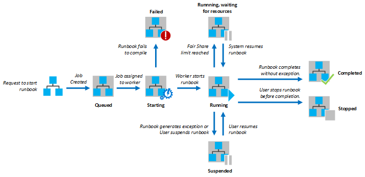

# <a name="runbook-execution-in-azure-automation"></a>在 Azure 自动化中执行 Runbook

在 Azure 自动化中启动 Runbook 时，会创建一个作业。 作业是 Runbook 的单一执行实例。 分配一个 Azure 自动化工作线程来运行每个作业。 尽管辅助角色由多个 Azure 帐户共享，但不同自动化帐户中的作业是相互独立的。 无法控制要由哪个辅助角色为作业请求提供服务。 一个 runbook 可以同时运行多个作业。 可以重用同一自动化帐户中的作业的执行环境。 同时运行的作业越多，就越可能将其分派到同一个沙盒中。 在同一沙盒进程中运行的作业可能会相互影响，一个示例就是运行 `Disconnect-AzureRMAccount` cmdlet。 运行此 cmdlet 将断开共享沙盒进程中的每个 Runbook 作业。 在 Azure 门户中查看 Runbook 列表时，列表中会列出为每个 Runbook 启动的所有作业的状态。 可以查看每个 runbook 的作业列表以跟踪每个作业的状态。 作业日志最长可存储 30 天。 有关不同作业状态的说明，请参阅[作业状态](#job-statuses)。

下图显示[图形 Runbook](automation-runbook-types.md#graphical-runbooks) 和 [PowerShell 工作流 Runbook](automation-runbook-types.md#powershell-workflow-runbooks) 的 Runbook 作业生命周期。



下图显示 [PowerShell Runbook](automation-runbook-types.md#powershell-runbooks) 的 Runbook 作业生命周期。


作业可以通过与 Azure 订阅建立连接来访问 Azure 资源。 仅当数据中心内的资源可从公有云访问时，作业才能访问这些资源。

## <a name="where-to-run-your-runbooks"></a>运行 runbook 的位置

Azure 自动化中的 Runbook 可以在 Azure 中的沙盒上运行。 沙盒是 Azure 中可以由多个作业使用的共享环境。 使用同一沙盒的作业受沙盒的资源限制约束。 大多数 runbook 都可在 Azure 沙盒中轻松运行。

## <a name="runbook-behavior"></a>Runbook 行为

Runbook 基于其内部定义的逻辑执行操作。 如果 Runbook 中断，则 Runbook 将在开始时重启。 这种行为要求 runbook 以某种方式进行编写，在此方式中，如果存在瞬态问题，runbook 支持重启。

### <a name="creating-resources"></a>创建资源

如果由脚本创建资源，则在尝试再次创建资源之前，应查看资源是否已经存在。 以下示例显示了一个基本示例：

```powershell
$vmName = "WindowsVM1"
$resourceGroupName = "myResourceGroup"
$myCred = Get-AutomationPSCredential "MyCredential"
$vmExists = Get-AzureRmResource -Name $vmName -ResourceGroupName $resourceGroupName

if(!$vmExists)
    {
    Write-Output "VM $vmName does not exists, creating"
    New-AzureRmVM -Name $vmName -ResourceGroupName $resourceGroupName -Credential $myCred
    }
else
    {
    Write-Output "VM $vmName already exists, skipping"
    }
```

### <a name="time-dependant-scripts"></a>时间依赖脚本

创作 runbook 时，应仔细考虑。 如前所述，需要以某种方式编写 runbook，使其可靠并且能够处理可能导致 runbook 重启或失败的瞬态错误。 如果 runbook 失败，它将重试。 如果 runbook 在时间约束内正常运行，则应在 runbook 中实现检查执行时间的逻辑，确保只在特定时间运行启动、关闭或横向扩展等操作。

### <a name="tracking-progress"></a>跟踪进程

实际上模块化创作 runbook 是很好的做法。 这意味着要在 runbook 中构造逻辑，以便能够轻松重用和重启。 跟踪 runbook 中的进程是很好的方法，该方法确保在出现问题时正确执行 runbook 中的逻辑。 跟踪 runbook 进程的一些可能方法是使用外部源（如存储帐户、数据库或共享文件）。 通过在外部跟踪状态，可在 runbook 中创建逻辑，该逻辑先检查 runbook 所执行的最后操作的状态，然后根据结果跳过或继续 runbook 中的特定任务。

### <a name="prevent-concurrent-jobs"></a>预防并发作业

如果同时运行多个作业，某些 runbook 可能会表现得很奇怪。 在此情况下，重要的是实现检查逻辑，查看 runbook 是否已有正在运行的作业。 以下示例显示了如何执行此行为的基本示例：

```powershell
# Authenticate to Azure
$connection = Get-AutomationConnection -Name AzureRunAsConnection
Connect-AzureRmAccount -EnvironmentName AzureChinaCloud -ServicePrincipal -Tenant $connection.TenantID `
-ApplicationID $connection.ApplicationID -CertificateThumbprint $connection.CertificateThumbprint

$AzureContext = Select-AzureRmSubscription -SubscriptionId $connection.SubscriptionID

# Check for already running or new runbooks
$runbookName = "<RunbookName>"
$rgName = "<ResourceGroupName>"
$aaName = "<AutomationAccountName>"
$jobs = Get-AzureRmAutomationJob -ResourceGroupName $rgName -AutomationAccountName $aaName -RunbookName $runbookName -AzureRmContext $AzureContext

# If then check to see if it is already running
$runningCount = ($jobs | ? {$_.Status -eq "Running"}).count

If (($jobs.status -contains "Running" -And $runningCount -gt 1 ) -Or ($jobs.Status -eq "New")) {
    # Exit code
    Write-Output "Runbook is already running"
    Exit 1
} else {
    # Insert Your code here
}
```

### <a name="using-executables-or-calling-processes"></a>使用可执行文件或调用进程

在 Azure 沙盒中运行的 Runbook 不支持调用进程（例如 .exe 或 subprocess.call）。 这是因为 Azure 沙盒是在容器中运行的共享进程，其可能无权访问所有底层 API。 适用于需要第三方软件或需要调用子进程的方案。

## <a name="job-statuses"></a>作业状态

下表描述了作业的各种可能状态。 PowerShell 具有两种类型的错误，终止性和非终止性错误。 终止性错误在发生时将 runbook 状态设置为“失败”。 非终止性错误允许在发生错误时继续运行脚本。 非终止错误的示例为：对不存在的路径使用 `Get-ChildItem` cmdlet。 PowerShell 发现路径不存在，然后引发错误，并继续转到下一文件夹。 此错误不会将 runbook 状态设置为“失败”，并且可能标记为“完成”。 若要强制 runbook 在发生非终止性错误时停止，可以使用 `-ErrorAction Stop` cmdlet。

| 状态 | 说明 |
|:--- |:--- |
| 已完成 |作业已成功完成。 |
| 已失败 |对于[图形 Runbook 和 PowerShell 工作流 Runbook](automation-runbook-types.md)，Runbook 未能编译。 对于 [PowerShell 脚本 runbook](automation-runbook-types.md)，runbook 未能启动或作业遇到异常。 |
| 失败，正在等待资源 |作业失败，因为它已达到 [公平份额](#fair-share) 限制三次，并且每次都已从同一个检查点或 Runbook 开始处启动。 |
| 已排队 |作业正在等待提供自动化工作线程的资源，以便能够启动。 |
| 正在启动 |作业已分配给辅助角色，并且系统正在将它启动。 |
| 正在恢复 |系统正在恢复已暂停的作业。 |
| 正在运行 |作业正在运行。 |
| 正在运行，正在等待资源 |作业已卸载，因为它已达到 [公平份额](#fair-share) 限制。 片刻之后，它会从其上一个检查点恢复。 |
| 已停止 |作业在完成之前已被用户停止。 |
| 正在停止 |系统正在停止作业。 |
| 已挂起 |作业已被用户、系统或 Runbook 中的命令暂停。 如果 runbook 没有检查点，它将从 runbook 的开端启动。 如果它有检查点，它将重新启动并从其上一个检查点继续。 只有发生异常时，系统才会将 Runbook 挂起。 默认情况下，ErrorActionPreference 设置为 **Continue**，表示出错时作业会保持运行。 如果此首选项变量设置为 **Stop**，则出错时作业会挂起。 仅适用于[图形 Runbook 和 PowerShell 工作流 Runbook](automation-runbook-types.md)。 |
| 正在暂停 |系统正在尝试按用户请求暂停作业。 Runbook 只有在达到其下一个检查点后才能挂起。 如果 Runbook 越过了最后一个检查点，则只有在完成后才能挂起。 仅适用于[图形 Runbook 和 PowerShell 工作流 Runbook](automation-runbook-types.md)。 |

## <a name="viewing-job-status-from-the-azure-portal"></a>从 Azure 门户查看作业状态

可以查看所有 runbook 作业的概述状态或在 Azure 门户中深入了解特定 runbook 作业的详细信息。 此外，还可配置与 Log Analytics 工作区的集成，以转发 runbook 作业状态和作业流。 有关与 Azure Monitor 日志集成的详细信息，请参阅[将作业状态和作业流从自动化转发到 Azure Monitor 日志](automation-manage-send-joblogs-log-analytics.md)。

### <a name="automation-runbook-jobs-summary"></a>自动化 Runbook 作业摘要

在所选的“自动化帐户”右侧，可在“作业统计信息”磁贴下看到所有 Runbook 作业的摘要。


此磁贴显示执行的所有作业的作业状态计数和图形表示形式。

单击磁贴可显示“作业”页，此页包括所有已执行作业的摘要列表。 此页显示状态、开始时间和完成时间。


可以通过选择“筛选作业”来筛选作业列表并筛选特定的 runbook 和作业状态，或从下拉列表中的时间范围中进行搜索。


或者，可通过从自动化帐户中的“runbook”页上选择特定的 runbook，并选择“作业”磁贴，来查看该 runbook 的作业摘要详情。 此操作将显示“作业”页，在此可以单击作业记录，查看作业详细信息和输出。


### <a name="job-summary"></a>作业摘要

可以查看为特定 Runbook 创建的所有作业的列表及其最新状态。 可以按作业状态以及上次对作业进行更改的日期范围筛选此列表。 单击作业的名称可以查看其详细信息和输出。 作业的详细视图包括提供给该作业的 Runbook 参数值。

可以使用以下步骤查看 Runbook 的作业。

1. 在 Azure 门户中，选择“自动化”，然后选择自动化帐户的名称。
2. 从中心选择“Runbook”，然后在“Runbook”页的列表中选择一个 Runbook。
3. 在所选 runbook 的页上，单击“作业”磁贴。
4. 单击列表中的一个作业，然后可在 runbook 作业详细信息页上查看其详细信息和输出。

## <a name="retrieving-job-status-using-windows-powershell"></a>使用 Windows PowerShell 检索作业状态

可以使用 [Get-AzureRmAutomationJob](https://docs.microsoft.com/powershell/module/azurerm.automation/get-azurermautomationjob) 检索为 Runbook 创建的作业和特定作业的详细信息。 如果在 Windows PowerShell 中使用 [Start-AzureRmAutomationRunbook](https://docs.microsoft.com/powershell/module/azurerm.automation/start-azurermautomationrunbook) 启动 Runbook，则会返回生成的作业。 使用 [Get-AzureRmAutomationJobOutput](https://docs.microsoft.com/powershell/module/azurerm.automation/get-azurermautomationjoboutput) 可以获取作业的输出。

以下示例命令检索示例 Runbook 的最后一个作业，并显示其状态、为 Runbook 参数提供的值以及作业的输出。

```azurepowershell
$job = (Get-AzureRmAutomationJob –AutomationAccountName "MyAutomationAccount" `
–RunbookName "Test-Runbook" -ResourceGroupName "ResourceGroup01" | sort LastModifiedDate –desc)[0]
$job.Status
$job.JobParameters
Get-AzureRmAutomationJobOutput -ResourceGroupName "ResourceGroup01" `
–AutomationAccountName "MyAutomationAcct" -Id $job.JobId –Stream Output
```

以下示例检索特定作业的输出并返回每个记录。 如果某个记录存在异常，则会写出该异常而不是记录的值。 此行为非常有用，因为异常可以提供在输出过程中无法正常记录的其他信息。

```azurepowershell
$output = Get-AzureRmAutomationJobOutput -AutomationAccountName <AutomationAccountName> -Id <jobID> -ResourceGroupName <ResourceGroupName> -Stream "Any"
foreach($item in $output)
{
    $fullRecord = Get-AzureRmAutomationJobOutputRecord -AutomationAccountName <AutomationAccountName> -ResourceGroupName <ResourceGroupName> -JobId <jobID> -Id $item.StreamRecordId
    if ($fullRecord.Type -eq "Error")
    {
        $fullRecord.Value.Exception
    }
    else
    {
    $fullRecord.Value
    }
}
```

## <a name="get-details-from-activity-log"></a>从活动日志中获取详细信息

可以从自动化帐户的活动日志中检索其他详细信息，例如启动了 Runbook 的人员或帐户。 以下 PowerShell 示例提供运行相关 Runbook 的最后一个用户：

```powershell
$SubID = "00000000-0000-0000-0000-000000000000"
$rg = "ResourceGroup01"
$AutomationAccount = "MyAutomationAccount"
$RunbookName = "Test-Runbook"
$JobResourceID = "/subscriptions/$subid/resourcegroups/$rg/providers/Microsoft.Automation/automationAccounts/$AutomationAccount/jobs"

Get-AzureRmLog -ResourceId $JobResourceID -MaxRecord 1 | Select Caller
```

## <a name="fair-share"></a>公平共享

为了在云中的所有 runbook 之间共享资源，Azure 自动化暂时卸载或停止已经运行三小时以上的所有作业。 [基于 PowerShell 的 Runbook](automation-runbook-types.md#powershell-runbooks) 和 [Python Runbook](automation-runbook-types.md#python-runbooks) 的作业将停止且不会重启，作业状态显示“已停止”。

另一种选择是通过使用子 runbook 来优化 runbook。 如果 runbook 在多个资源上遍历同一函数，例如在多个数据库上执行某个数据库操作，可将该函数移到[子 runbook](automation-child-runbooks.md)，并使用 [Start-AzureRMAutomationRunbook](https://docs.microsoft.com/powershell/module/azurerm.automation/start-azurermautomationrunbook) cmdlet 进行调用。 每个这样的子 Runbook 都会在单独的进程中并行执行，缩短了父 Runbook 完成操作所需的总时间。 如果有在子 Runbook 完成后执行的操作，可使用 Runbook 中的 [Get-AzureRmAutomationJob](https://docs.microsoft.com/powershell/module/azurerm.automation/Get-AzureRmAutomationJob) cmdlet 检查每个子 Runbook 的作业状态。

## <a name="next-steps"></a>后续步骤

* 若要详细了解可用于在 Azure 自动化中启动 Runbook 的不同方法，请参阅[在 Azure 自动化中启动 Runbook](automation-starting-a-runbook.md)

<!--Update_Description: wording update-->