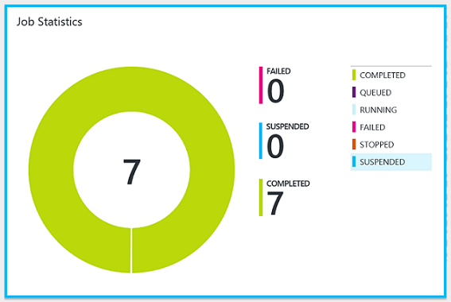
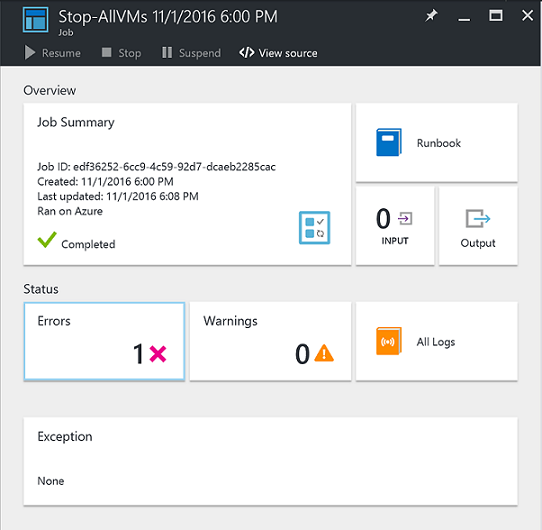

# 在 Azure 自动化中执行 Runbook
在 Azure 自动化中启动 Runbook 时，会创建一个作业。 作业是 Runbook 的单一执行实例。 分配一个 Azure 自动化工作线程来运行每个作业。 尽管工作线程由多个 Azure 帐户共享，但不同自动化帐户中的作业是相互独立的。 无法控制要由哪个工作线程为作业的请求提供服务。 一个 Runbook 可以同时运行多个作业。  可以重用同一自动化帐户中的作业的执行环境。 在 Azure 门户中查看 Runbook 列表时，列表中会列出为每个 Runbook 启动的所有作业的状态。 可以查看每个 Runbook 的作业列表以跟踪每个作业的状态。 有关不同作业状态的说明，请参阅[作业状态](#job-statuses)。

下图显示[图形 Runbook](automation-runbook-types.md#graphical-runbooks) 和 [PowerShell 工作流 Runbook](automation-runbook-types.md#powershell-workflow-runbooks) 的 Runbook 作业生命周期。

下图显示 [PowerShell Runbook](automation-runbook-types.md#powershell-runbooks) 的 Runbook 作业生命周期。

作业可以通过与 Azure 订阅建立连接来访问 Azure 资源。 仅当数据中心内的资源可从公有云访问时，作业才能访问这些资源。

## 作业状态
下表描述了作业的各种可能状态。

| 状态 | 说明 |
|:--- |:--- |
| 已完成 |作业已成功完成。 |
| 已失败 |对于[图形 Runbook 和 PowerShell 工作流 Runbook](automation-runbook-types.md)，Runbook 未能编译。  对于 [PowerShell 脚本 Runbook](automation-runbook-types.md)，Runbook 未能启动或作业遇到异常。 |
| 失败，正在等待资源 |作业失败，因为它已达到 [公平份额](#fair-share) 限制三次，并且每次都已从同一个检查点或 Runbook 开始处启动。 |
| 已排队 |作业正在等待提供自动化工作线程的资源，以便能够启动。 |
| 正在启动 |作业已分配给工作线程，并且系统正在将它启动。 |
| 正在恢复 |系统正在恢复已暂停的作业。 |
| 正在运行 |作业正在运行。 |
| 正在运行，正在等待资源 |作业已卸载，因为它已达到 [公平份额](#fair-share) 限制。 片刻之后，它会从其上一个检查点恢复。 |
| 已停止 |作业在完成之前已被用户停止。 |
| 正在停止 |系统正在停止作业。 |
| 已挂起 |作业已被用户、系统或 Runbook 中的命令暂停。 挂起的作业可以重新启动，并且从其上一个检查点恢复，如果没有检查点，则从 Runbook 的开始处恢复。 只有在出现异常时，系统才会挂起 Runbook。 默认情况下，ErrorActionPreference 设置为 **Continue**，表示出错时作业会保持运行。 如果此首选项变量设置为 **Stop**，则出错时作业会挂起。  仅适用于[图形 Runbook 和 PowerShell 工作流 Runbook](automation-runbook-types.md)。 |
| 正在暂停 |系统正在尝试按用户请求暂停作业。 Runbook 只有在达到其下一个检查点后才能挂起。 如果 Runbook 越过了最后一个检查点，则只有在完成后才能挂起。  仅适用于[图形 Runbook 和 PowerShell 工作流 Runbook](automation-runbook-types.md)。 |

## 从 Azure 门户查看作业状态
可以查看所有 runbook 作业的摘要状态，或深入到 Azure 门户中特定 runbook 作业的详细信息。

### 自动化 Runbook 作业摘要
在所选的“自动化帐户”右侧，可在“作业统计信息”磁贴下看到所选自动化帐户的所有 Runbook 作业的摘要。   。  此磁贴显示执行的所有作业的作业状态计数和图形表示形式。  

单击该磁贴会显示“作业”边栏选项卡，其中包括所有已执行作业的摘要列表，含有状态、作业执行以及开始时间和完成时间。       可以通过选择“筛选作业”来筛选作业列表并筛选特定的 Runbook 和作业状态，或从下拉列表中的日期/时间范围中进行搜索。   

或者，可通过从自动化帐户中的“Runbook”边栏选项卡上选择特定的 Runbook，并选择“作业”磁贴，以查看该 Runbook 的作业摘要详情。  这将显示“作业”边栏选项卡，在此可以单击作业记录，查看作业详细信息和输出。     

### 作业摘要
可以查看为特定 Runbook 创建的所有作业的列表及其最新状态。 可以按作业状态以及上次对作业进行更改的日期范围筛选此列表。 若要查看作业的详细信息和输出，请单击其名称。 作业的详细视图包括提供给该作业的 Runbook 参数值。

可以使用以下步骤查看 Runbook 的作业。

1. 在 Azure 门户中，选择“自动化”，然后选择自动化帐户的名称。
2. 从中心选择“Runbook”，然后在“Runbook”边栏选项卡的列表中选择一个 Runbook。
3. 在所选 Runbook 的边栏选项卡上，单击“作业”磁贴。
4. 单击列表中的一个作业，并在“Runbook 作业详细信息”边栏选项卡上查看其详细信息和输出。

## 使用 Windows PowerShell 检索作业状态
可以使用 [Get-AzureRmAutomationJob](https://msdn.microsoft.com/library/mt619440.aspx) 检索为 Runbook 创建的作业和特定作业的详细信息。 如果在 Windows PowerShell 中使用 [Start-AzureRmAutomationRunbook](https://msdn.microsoft.com/library/mt603661.aspx) 启动 Runbook，则会返回生成的作业。 使用 [Get-AzureRmAutomationJob](https://msdn.microsoft.com/library/mt619440.aspx)Output 可以获取作业的输出。

以下示例命令检索示例 Runbook 的最后一个作业，并显示其状态、为 Runbook 参数提供的值以及作业的输出。

    $job = (Get-AzureRmAutomationJob �AutomationAccountName "MyAutomationAccount" `
    �RunbookName "Test-Runbook" -ResourceGroupName "ResourceGroup01" | sort LastModifiedDate �desc)[0]
    $job.Status
    $job.JobParameters
    Get-AzureRmAutomationJobOutput -ResourceGroupName "ResourceGroup01" `
    �AutomationAccountName "MyAutomationAcct" -Id $job.JobId �Stream Output

## 公平共享
为了在云中的所有 Runbook 之间共享资源，Azure 自动化在任何作业运行三小时后都会将其暂时卸载。  在此期间，[基于 PowerShell 的 Runbook](automation-runbook-types.md#powershell-runbooks) 作业都将停止且不能重新启动。  作业状态显示“已停止”。  此类型的 Runbook 始终从头开始重新启动，因为它们不支持检查点。  

[基于 PowerShell 工作流的 Runbook](automation-runbook-types.md#powershell-workflow-runbooks) 会从上一个[检查点](https://docs.microsoft.com/system-center/sma/overview-powershell-workflows#bk_Checkpoints)进行恢复。  运行三小时后，Runbook 作业将由服务挂起，且其状态显示为“正在运行等待资源”。  沙盒变为可用时，Runbook 将通过自动化服务自动重新启动，并从上一个检查点恢复。  这是实现挂起/重新启动的正常 PowerShell 工作流行为。  如果 Runbook 再次超过三小时的运行时，将重复该过程，最多三次。  在第三次重新启动后，如果 Runbook 仍未在三小时内完成，则 Runbook 作业将失败，且作业状态显示为“失败，正在等待资源”。  在此情况下，会收到以下异常和失败。

*该作业无法继续运行，因为它已反复被系统从同一个检查点逐出。请确保 Runbook 在未保持其状态的情况下没有执行冗长的操作。*

这是为了在 Runbook 无限期运行而无法完成时保护服务，因为在不重新卸载的情况下，Runbook 无法到达下一个检查点。

如果该 Runbook 没有检查点或者作业在卸载之前尚未达到第一个检查点，则会从开始处重启。  

在创建 Runbook 时，应确保在两个检查点之间运行任何活动的时间不超过三个小时。 可能需要向 Runbook 添加检查点以确保它不会达到此三小时限制，或者需要将长时间运行的操作进行分解。 例如，Runbook 可能对大型 SQL 数据库执行了重新编制索引。 如果这一项操作未在公平份额限制内完成，则作业会卸载并从开始处重启。 在此情况下，你应该将重新编制索引操作拆分成多个步骤（例如，一次重新编制一个表的索引），然后在每项操作的后面插入一个检查点，使作业能够在上次操作后恢复并得以完成。

## 后续步骤
* 若要详细了解可用于在 Azure 自动化中启动 Runbook 的不同方法，请参阅[在 Azure 自动化中启动 Runbook](automation-starting-a-runbook.md)

<!--Update_Description: wording update-->