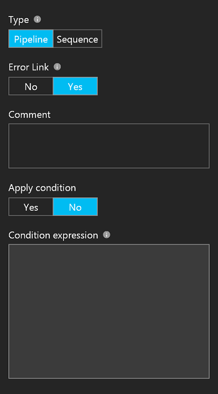
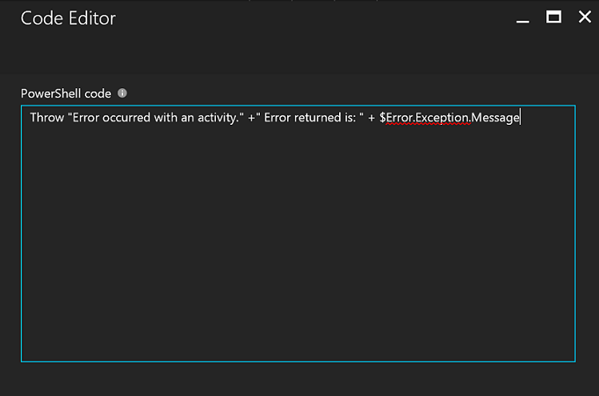

# Azure 自动化图形 Runbook 中的错误处理

进行 Runbook 设计时，需要考虑的关键原则是确定 Runbook 会遇到的不同情况。 这些情况可能包括：成功、意料之中的错误状态、意料之外的错误条件。

Runbook 应包含错误处理。 若要验证活动的输出或通过图形 Runbook 处理错误，可以使用 Windows PowerShell 代码活动、定义活动的输出链接的条件逻辑，或者应用其他方法。          

通常情况下，如果 Runbook 活动出现非终止错误，系统会无视该错误而处理后续的任何活动。 该错误可能会生成异常，但下一活动仍可运行。 根据设计，这是 PowerShell 处理错误的方式。    

可以在执行期间发生的 PowerShell 错误的类型包括“终止”或“非终止”。 终止性和非终止性错误的区别如下：

* **终止性错误**：执行期间发生的严重错误，会完全停止命令（或脚本执行）。 例子包括：cmdlet 不存在、阻止某个 cmdlet 运行的语法错误，或其他严重错误。

* **非终止错误**：在失败情况下仍允许继续执行的非严重错误。 示例包括：操作错误（例如“找不到文件”错误）、权限问题。

Azure 自动化图形 Runbook 已经过改进，能够包含错误处理。 用户现在可以将异常转为非终止错误并在活动之间创建错误链接。 Runbook 作者可以通过此过程捕获错误并管理已实现条件或意外条件。  

## 何时使用错误处理

只要有关键活动引发错误或异常，就必须阻止对 Runbook 中的下一活动进行处理，且必须对错误进行相应处理。 当 Runbook 支持业务或服务操作流程时，这相关关键。

对于每个可能产生错误的活动，Runbook 作者都可以添加一个指向任何其他活动的错误链接。  目标活动可以是任何类型，包括：代码活动、调用 cmdlet、调用其他 Runbook，等等。

此外，目标活动还可以有传出链接。 这些链接可以是常规链接或错误链接。 这意味着 Runbook 作者可以在不执行代码活动的情况下实现复杂的错误处理逻辑。 建议创建专用的具有常用功能的错误处理 Runbook，但该 Runbook 不是必需的。 在 PowerShell 代码活动中实现错误处理逻辑时，这并非唯一选项。  

例如，可以考虑让 Runbook 尝试启动 VM 并在其上安装应用程序。 VM 在未正常启动的情况下，会执行两项操作：

1. 发送有关此问题的通知。
2. 启动另一个 Runbook，后者会自动改为预配新的 VM。

一种解决方案是让一个错误链接指向处理步骤一操作的活动。 例如，可以将 **Write-Warning** cmdlet 连接到步骤二的一个活动，例如 **Start-AzureRmAutomationRunbook** cmdlet。

还可以将此行为通用化，使之能够在多个 Runbook 中使用，只需将这两个活动放入单独的错误处理 Runbook 中，并按照前面建议的指导原则操作即可。 在调用此错误处理 Runbook 之前，可以根据原始 Runbook 中的数据构造自定义消息，并将此消息作为参数传递给错误处理 Runbook。

## 如何使用错误处理

每个活动都有将异常转为非终止错误的配置设置。 默认情况下，此设置已禁用。 如果需要在某项活动中处理错误，则建议对该活动启用此设置。  

启用此配置可确保活动中的终止错误和非终止错误都作为非终止错误处理，并可通过错误链接进行处理。  

配置此设置后，请创建用于处理该错误的活动。 如果某个活动生成了任何错误，会遵循传出错误链接，但不遵循常规链接，即使活动同时生成了常规输出。   

在以下示例中，一个 Runbook 检索的变量包含虚拟机的计算机名称。 然后，该 Runbook 尝试使用下一活动启动虚拟机。           

**Get-AutomationVariable** 活动和 **Start-AzureRmVm** 已配置为将异常转换为错误。  如果在获取变量或启动 VM 时出现问题，会生成错误。   

错误链接从这些活动流向单个“错误管理”活动（代码活动）。 该活动是通过使用 *Throw* 关键字的简单 PowerShell 表达式（用于停止处理）以及 *$Error.Exception.Message*（用于获取描述当前异常的消息）配置的。   

## 后续步骤

* 若要详细了解图形 Runbook 中的链接和链接类型，请参阅 [Azure 自动化中的图形创作](automation-graphical-authoring-intro.md#links-and-workflow)。

* 若要详细了解 Runbook 执行方式、如何监视 Runbook 作业和其他技术详细信息，请参阅[跟踪 Runbook 作业](automation-runbook-execution.md)。
