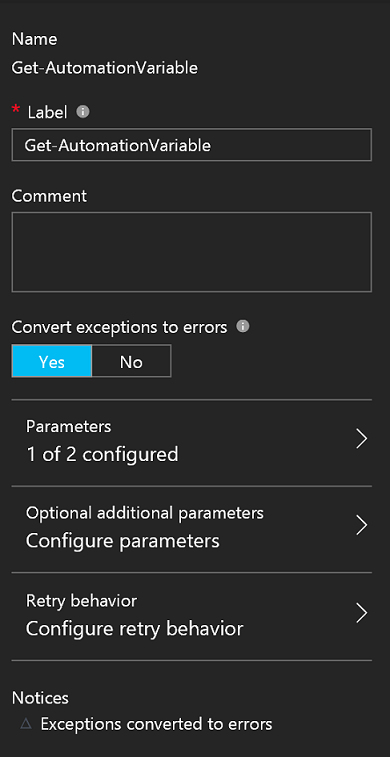

# Azure 自动化图形 Runbook 中的错误处理

对于 Azure 自动化图形 Runbook，需要考虑的一个关键设计原则是确定 Runbook 在执行期间可能会遇到的问题。 这些情况可能包括：成功、意料之中的错误状态、意料之外的错误条件。

通常情况下，如果 Runbook 活动出现的是非终止错误，则 Windows PowerShell 会无视该错误而继续处理后续的任何活动。 该错误可能会生成异常，但下一活动仍可运行。

图形 Runbook 应包含错误处理代码来处理执行问题。 若要验证某个活动的输出或对错误进行处理，可以使用 PowerShell 代码活动、定义活动的输出链接的条件逻辑，或者应用其他方法。

Azure 自动化图形 Runbook 已经过改进，能够包含错误处理。 用户现在可以将异常转为非终止错误并在活动之间创建错误链接。 此改进的流程使得 runbook 可以捕获错误并管理已实现条件或意外条件。 

## PowerShell 错误类型

在 runbook 执行期间可能会发生的 PowerShell 错误类型包括“终止”错误和“非终止”错误。
 
### 终止错误

执行期间发生的严重错误，会完全停止命令或脚本执行。 示例包括：cmdlet 不存在、阻止 cmdlet 运行的语法错误，以及其他严重错误。

### 非终止错误

可忽视错误情况并允许继续执行的非严重错误。 示例包括：操作错误（例如“找不到文件”错误）、权限问题。

## 何时使用错误处理

当关键活动引发错误或异常时，请在 runbook 中使用错误处理。 务必要阻止处理 runbook 中的下一个活动，并相应地处理错误。 当 Runbook 支持业务或服务操作流程时，对错误进行处理尤为重要。

对于每个可能产生错误的活动，你都可以添加一个指向任何其他活动的错误链接。 目标活动可以是任何类型，包括：代码活动、调用 cmdlet、调用其他 Runbook，等等。 目标活动还可以有传出链接（常规链接或错误链接）。 使用链接，Runbook 可以在不执行代码活动的情况下实现复杂的错误处理逻辑。

建议创建专用的具有常用功能的错误处理 Runbook，但不是必须这样做。 例如，可以考虑让 Runbook 尝试启动虚拟机并在其上安装应用程序。 如果 VM 未正常启动，则它会：

1. 发送有关此问题的通知。
2. 启动另一个 Runbook，后者会自动改为预配新的 VM。

一种解决方案是在 runbook 中添加一个错误链接，指向处理步骤一的活动。 例如，runbook 可以将 `Write-Warning` cmdlet 连接到步骤二的一个活动，例如 [Start-AzureRmAutomationRunbook](https://docs.microsoft.com/powershell/module/azurerm.automation/start-azurermautomationrunbook?view=azurermps-6.13.0) cmdlet。

还可以将此行为通用化，使之能够在多个 Runbook 中使用，只需将这两个活动放入单独的错误处理 Runbook 中即可。 原始 Runbook 在调用此错误处理 Runbook 之前，可以基于自己的数据构造自定义消息，然后将此消息作为参数传递给错误处理 Runbook。

## 如何使用错误处理

Runbook 中的每个活动都有将异常转为非终止错误的配置设置。 默认情况下，此设置已禁用。 建议在 runbook 在其中处理错误的任何活动上启用此设置。 此设置可确保 runbook 使用错误链接将活动中的终止错误和非终止错误都作为非终止错误进行处理。  

在启用此配置设置后，让你的 runbook 创建一个对错误进行处理的活动。 如果活动生成了任何错误，则遵循传出的错误链接。 不会遵循常规链接，即使活动也生成了常规输出。   

在以下示例中，Runbook 检索一个变量，该变量包含 VM 的计算机名称。 然后，该 Runbook 尝试使用下一活动启动 VM。           

配置 `Get-AutomationVariable` 活动和 [Start-AzureRmVm](https://docs.microsoft.com/powershell/module/azurerm.compute/start-azurermvm?view=azurermps-6.13.0) cmdlet 以将异常转换为错误。 如果在获取变量或启动 VM 时出现问题，则代码将生成错误。   。

错误链接从这些活动流向单个 `error management` 代码活动。 此活动配置有一个简单的 PowerShell 表达式，该表达式使用 `throw` 关键字停止处理，同时使用 `$Error.Exception.Message` 获取描述当前异常的消息。   

## 后续步骤

* 若要详细了解图形 Runbook 中的链接和链接类型，请参阅 [Azure 自动化中的图形创作](automation-graphical-authoring-intro.md#links-and-workflow)。

* 若要详细了解 Runbook 执行、Runbook 作业监视以及其他技术详细信息，请参阅 [Azure 自动化中的 Runbook 执行](automation-runbook-execution.md)。