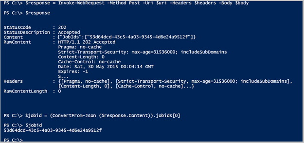

# <a name="starting-an-azure-automation-runbook-with-a-webhook"></a>使用 webhook 启动 Azure 自动化 runbook

外部服务可以使用 Webhook 在 Azure 自动化中通过单个 HTTP 请求启动特定的 Runbook。 外部服务包括 Azure DevOps Services、GitHub、Azure Monitor 日志和自定义应用程序。 此类服务可以使用 Webhook 来启动 Runbook，而无需使用 Azure 自动化 API 实施整个解决方案。 可将 Webhook 与[在 Azure 自动化中启动 Runbook](automation-starting-a-runbook.md) 中所述的其他 Runbook 启动方法进行比较。

> [!NOTE]
> 不支持使用 Webhook 启动 Python runbook。


## <a name="webhook-properties"></a>Webhook 属性

下表介绍了你必须为 Webhook 配置的属性。

| 属性 | 说明 |
|:--- |:--- |
| 名称 |Webhook 的名称。 可以提供所需的任何名称，因为该名称不会向客户端公开。 它只用来标识 Azure 自动化中的 Runbook。 最好是为 Webhook 提供一个名称，该名称需要与使用它的客户端相关。 |
| URL |Webhook 的 URL。 此 URL 是客户端通过 HTTP POST 调用的、用于启动链接到 Webhook 的 Runbook 的唯一地址。 它是在创建 Webhook 时自动生成的。 无法指定自定义 URL。 <br> <br> 该 URL 包含一个安全令牌，第三方系统可以使用该令牌调用 Runbook，而无需进一步执行身份验证。 因此，应将该 URL 视为密码。 出于安全原因，只能在创建 Webhook 时通过 Azure 门户查看该 URL。 请将保存在安全位置的 URL 记下来，供将来使用。 |
| 到期日期 | Webhook 的过期日期，此日期过后，该 Webhook 不再可用。 创建 Webhook 后，只要它没有过期，就可以修改过期日期。 |
| Enabled | 该设置指示在创建 Webhook 时是否默认启用它。 如果将此属性设置为“已禁用”，则任何客户端都不可以使用该 Webhook。 可以在创建 Webhook 时设置此属性，也可以在创建后随时设置它。 |

## <a name="parameters-used-when-the-webhook-starts-a-runbook"></a>Webhook 启动 Runbook 时使用的参数

Webhook 可以定义 Runbook 参数的值，启动 Runbook 时会使用这些值。 Webhook 必须包含所有 Runbook 必需参数的值，可以包含可选参数的值。 即使在创建 Webhook 后，也可以修改配置给 Webhook 的参数值。 链接到单个 Runbook 的多个 Webhook 可以使用不同的 Runbook 参数值。 客户端在使用 Webhook 启动 Runbook 时，无法重写在 Webhook 中定义的参数值。

若要从客户端接收数据，Runbook 支持名为 `WebhookData` 的单个参数。 此参数定义一个对象，该对象包含客户端在 POST 请求中加入的数据。


`WebhookData` 参数具有以下属性：

| 属性 | 说明 |
|:--- |:--- |
| `WebhookName` | Webhook 的名称。 |
| `RequestHeader` | 包含传入 POST 请求标头的哈希表。 |
| `RequestBody` | 传入 POST 请求的正文。 此正文保留任何数据格式，例如字符串、JSON、XML，或表单编码格式。 编写的 Runbook 必须能够与预期的数据格式配合工作。 |

无需配置 Webhook 即可支持 `WebhookData` 参数，且不需要 Runbook 接受此参数。 如果 Runbook 未定义该参数，则会忽略从客户端发送的请求的任何详细信息。

> [!NOTE]
> 调用 Webhook 时，客户端应始终存储任何参数值，以防调用失败。 如果出现网络中断或连接问题，应用程序将无法检索失败的 Webhook 调用。

如果在创建 Webhook 时为 `WebhookData` 指定了值，则会在 Webhook 使用客户端 POST 请求中的数据启动 Runbook 时重写该值。 即使应用程序未在请求正文中包含任何数据，也会发生这种情况。 

如果使用除 Webhook 以外的机制启动定义了 `WebhookData` 的 Runbook，则可为能够被 Runbook 识别的 `WebhookData` 提供值。 此值应是与 `WebhookData` 参数具有相同[属性](#webhook-properties)的对象，这样，Runbook 就可以正常使用此值，如同使用 Webhook 传递的实际 `WebhookData` 对象时一样。

例如，如果你从 Azure 门户启动以下 Runbook，并想要传递一些示例 Webhook 数据进行测试，则必须在用户界面中传递 JSON 格式的数据。


对于下一个 Runbook 示例，让我们为 `WebhookData` 定义以下属性：

* **WebhookName**：MyWebhook
* **RequestBody**：`*[{'ResourceGroup': 'myResourceGroup','Name': 'vm01'},{'ResourceGroup': 'myResourceGroup','Name': 'vm02'}]*`

现在，我们在 UI 中为 `WebhookData` 参数传递以下 JSON 对象。 以下示例使用了回车符和换行符，这与从 Webhook 传入的格式相匹配。

```json
{"WebhookName":"mywebhook","RequestBody":"[\r\n {\r\n \"ResourceGroup\": \"vm01\",\r\n \"Name\": \"vm01\"\r\n },\r\n {\r\n \"ResourceGroup\": \"vm02\",\r\n \"Name\": \"vm02\"\r\n }\r\n]"}
```


> [!NOTE]
> Azure 自动化将记录 Runbook 作业的所有输入参数的值。 因此，客户端在 Webhook 请求中提供的任何输入都会记录下来，并可供有权访问自动化作业的任何人使用。 因此，在 Webhook 调用中包括敏感信息时，应该特别小心。

## <a name="webhook-security"></a>Webhook 安全性

Webhook 的安全性取决于其 URL 的私密性。URL 中包含一个用于调用该 Webhook 的安全令牌。 如果请求是向正确的 URL 发出的，Azure 自动化不对请求执行任何身份验证。 因此，对于在不使用替代方式验证请求的情况下执行高敏感性操作的 Runbook，客户端不应使用 Webhook。

可以将逻辑包括在 Runbook 中，以确定它是否由 Webhook 调用。 让 Runbook 检查 `WebhookData` 参数的 `WebhookName` 属性。 该 Runbook 可以通过在 `RequestHeader` 和 `RequestBody` 属性中查找特定的信息来执行进一步的验证。

另一种策略是让 Runbook 在收到 Webhook 请求时对外部条件执行某种验证。 例如，假设每当有新的内容提交到 GitHub 存储库时，GitHub 将调用某个 Runbook。 该 Runbook 在继续之前，可以连接到 GitHub 来验证是否有新的提交内容。

## <a name="creating-a-webhook"></a>创建 Webhook

在 Azure 门户中使用以下过程来创建新的链接到 Runbook 的 Webhook。

1. 在 Azure 门户上的“Runbook”页中，单击 Webhook 要启动的 Runbook 以查看其详细信息。 确保 Runbook 的“状态”字段设置为“已发布”。  
2. 单击页面顶部的“Webhook”打开“添加 Webhook”页。 
3. 单击“创建新的 Webhook”打开“创建 Webhook”页。 
4. 填写 Webhook 的“名称”和“过期日期”字段，并指定是否要启用它。   有关这些属性的详细信息，请参阅 [Webhook 属性](#webhook-properties)。
5. 单击复制图标，并按 Ctrl+C 以复制 Webhook 的 URL。 然后，将其记录在某个安全的位置。 

    > [!NOTE]
    > 一旦创建 Webhook，就再也不能检索该 URL。

   

1. 单击“参数”  为 Runbook 参数提供值。 如果 Runbook 包含必需的参数，除非提供了值，否则无法创建 Webhook。
1. 单击“创建”以创建 Webhook  。

## <a name="using-a-webhook"></a>使用 Webhook

若要在创建 Webhook 后使用该 Webhook，客户端必须发出包含 Webhook URL 的 HTTP `POST` 请求。 语法为：

```http
http://<Webhook Server>/token?=<Token Value>
```

客户端从 `POST` 请求中接收以下返回代码之一。

| 代码 | 文本 | 说明 |
|:--- |:--- |:--- |
| 202 |已接受 |已接受该请求，并已成功将 Runbook 排队。 |
| 400 |错误的请求 |出于以下原因之一，未接受该请求： <ul> <li>Webhook 已过期。</li> <li>Webhook 已禁用。</li> <li>URL 中的令牌无效。</li>  </ul> |
| 404 |未找到 |出于以下原因之一，未接受该请求： <ul> <li>找不到 Webhook。</li> <li>找不到 Runbook。</li> <li>找不到帐户。</li>  </ul> |
| 500 |内部服务器错误 |URL 有效，但出现了错误。 请重新提交请求。 |

假设请求成功，Webhook 响应将包含 JSON 格式的作业 ID，如下所示。 响应包含单个作业 ID，但 JSON 格式支持将来可能的增强功能。

```json
{"JobIds":["<JobId>"]}
```

客户端无法从 Webhook 确定 Runbook 的作业何时完成或其完成状态。 可以使用作业 ID 并配合其他机制（例如 [Windows PowerShell](https://docs.microsoft.com/powershell/module/servicemanagement/azure/get-azureautomationjob) 或 [Azure 自动化 API](https://docs.microsoft.com/rest/api/automation/job)）找到此信息。

## <a name="renewing-a-webhook"></a><a name="renew-webhook"></a>续订 Webhook

创建 Webhook 后，其有效期为十年，此期限过后，它会自动过期。 Webhook 过期后，无法重新激活它。 只能删除然后重新创建它。 

对于尚未过期的 Webhook，可将其延期。 若要将 Webhook 延期：

1. 导航到包含该 Webhook 的 Runbook。 
2. 选择“资源” ****下的“Webhook”**** 。 
3. 单击要延期的 Webhook。 
4. 在“Webhook”页中，选择新的过期日期和时间，然后单击“保存”。 

## <a name="sample-runbook"></a>示例 Runbook

以下示例 Runbook 将接受 Webhook 数据，并启动请求正文中指定的虚拟机。 若要测试此 Runbook，请在自动化帐户中的“Runbook”下，单击“创建 Runbook”。   如果不知道如何创建 Runbook，请参阅[创建 Runbook](automation-quickstart-create-runbook.md)。

```powershell
param
(
    [Parameter (Mandatory = $false)]
    [object] $WebhookData
)

# If runbook was called from Webhook, WebhookData will not be null.
if ($WebhookData) {

    # Check header for message to validate request
    if ($WebhookData.RequestHeader.message -eq 'StartedbyContoso')
    {
        Write-Output "Header has required information"}
    else
    {
        Write-Output "Header missing required information";
        exit;
    }

    # Retrieve VMs from Webhook request body
    $vms = (ConvertFrom-Json -InputObject $WebhookData.RequestBody)

    # Authenticate to Azure by using the service principal and certificate. Then, set the subscription.

    Write-Output "Authenticating to Azure with service principal and certificate"
    $ConnectionAssetName = "AzureRunAsConnection"
    Write-Output "Get connection asset: $ConnectionAssetName"

    $Conn = Get-AutomationConnection -Name $ConnectionAssetName
            if ($Conn -eq $null)
            {
                throw "Could not retrieve connection asset: $ConnectionAssetName. Check that this asset exists in the Automation account."
            }
            Write-Output "Authenticating to Azure with service principal."
            Add-AzureRmAccount -EnvironmentName AzureChinaCloud -ServicePrincipal -Tenant $Conn.TenantID -ApplicationId $Conn.ApplicationID -CertificateThumbprint $Conn.CertificateThumbprint | Write-Output

        # Start each virtual machine
        foreach ($vm in $vms)
        {
            $vmName = $vm.Name
            Write-Output "Starting $vmName"
            Start-AzureRMVM -Name $vm.Name -ResourceGroup $vm.ResourceGroup
        }
}
else {
    # Error
    write-Error "This runbook is meant to be started from an Azure alert webhook only."
}
```

## <a name="testing-the-sample"></a>测试示例

以下示例使用 Windows PowerShell 并配合 Webhook 来启动 Runbook。 任何可以发出 HTTP 请求的语言都可以使用 Webhook。 此处使用 Windows PowerShell 作为示例。

Runbook 预期请求的正文中包含 JSON 格式的虚拟机列表。 Runbook 还将验证标头是否包含用于验证 Webhook 调用方是否有效的已定义消息。

```azurepowershell
$uri = "<webHook Uri>"

$vms  = @(
            @{ Name="vm01";ResourceGroup="vm01"},
            @{ Name="vm02";ResourceGroup="vm02"}
        )
$body = ConvertTo-Json -InputObject $vms
$header = @{ message="StartedbyContoso"}
$response = Invoke-WebRequest -Method Post -Uri $uri -Body $body -Headers $header
$jobid = (ConvertFrom-Json ($response.Content)).jobids[0]
```

以下示例显示了请求的正文，此正文可在 `WebhookData` 的 `RequestBody` 属性中提供给 Runbook 使用。 此值采用 JSON 格式，以便与请求正文中包含的格式兼容。

```json
[
    {
        "Name":  "vm01",
        "ResourceGroup":  "myResourceGroup"
    },
    {
        "Name":  "vm02",
        "ResourceGroup":  "myResourceGroup"
    }
]
```

下图显示了从 Windows PowerShell 发送的请求以及生成的响应。 作业 ID 是从响应中提取的，并转换为字符串。



## <a name="next-steps"></a>后续步骤

* 若要了解如何使用 Azure 自动化对 Azure 警报执行操作，请参阅[使用警报触发 Azure 自动化 Runbook](automation-create-alert-triggered-runbook.md)。
