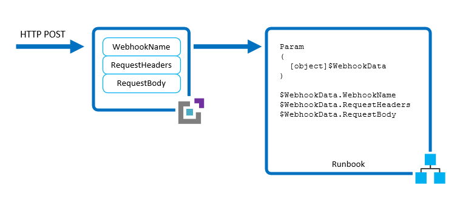
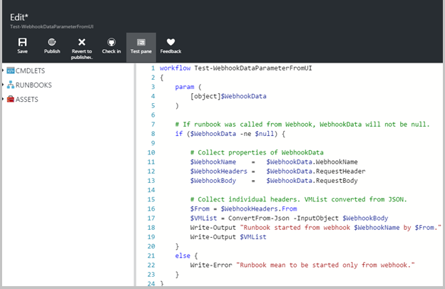

# 使用 webhook 启动 Azure 自动化 runbook
*Webhook* 可以用来在 Azure 自动化中通过单个 HTTP 请求来启动特定的 Runbook。 这样，外部服务（例如 Visual Studio Team Services、GitHub、Microsoft Operations Management Suite Log Analytics 或自定义应用程序）就可以在不通过 Azure 自动化 API 实现完整解决方案的情况下启动 Runbook。  

可以将 Webhook 与[在 Azure 自动化中启动 Runbook](automation-starting-a-runbook.md) 中其他启动 Runbook 的方法进行比较

## Webhook 详细信息
下表介绍了你必须为 Webhook 配置的属性。

| 属性 | 说明 |
|:--- |:--- |
| Name |可以提供用于 Webhook 的任何名称，因为该名称不会公开给客户端。  它只供你用来标识 Azure 自动化中的 Runbook。    最好是为 Webhook 提供一个与要使用该名称的客户端相关的名称。 |
| URL |Webhook 的 URL 是客户端通过 HTTP POST 来调用的唯一地址，用于启动链接到 Webhook 的 Runbook。  它是在创建 Webhook 时自动生成的。  不能指定自定义 URL。      URL 包含一个允许第三方系统调用 Runbook 的安全令牌，不需要进一步进行身份验证。 因此，应将其视为密码。  出于安全原因，只能在创建 Webhook 时通过 Azure 门户查看该 URL。 应该将保存在安全位置的 URL 记下来，供将来使用。 |
| 到期日期 |与证书一样，每个 Webhook 都有一个过期日期，到了过期日期 Webhook 不再可用。  创建 webhook 后，可以修改此到期日期。 |
| Enabled |Webhook 在创建后默认为启用。  如果将 Runbook 设置为“Disabled”，将没有客户端能够使用它。  可以在创建 Webhook 时设置 **Enabled** 属性，也可以在创建后随时设置它。 |

### parameters
Webhook 可以定义 Runbook 参数的值，当该 Webhook 启动 Runbook 时会用到这些值。 Webhook 必须包含 Runbook 的任何必需参数的值，可以包含可选参数的值。 即使在创建 Webhook 后，也可以修改配置给 Webhook 的参数值。 链接到单个 Runbook 的多个 Webhook 可以使用不同的参数值。

客户端在使用 Webhook 启动 Runbook 时，不能重写在 Webhook 中定义的参数值。  为了从客户端接收数据，Runbook 可能会接受名为 **$WebhookData** 且类型为 [object] 的单个参数，该参数会包含客户端包括在 POST 请求中的数据。

**$WebhookData** 对象将具有以下属性：

| 属性 | 说明 |
|:--- |:--- |
| WebhookName |Webhook 的名称。 |
| RequestHeader |包含传入 POST 请求标头的哈希表。 |
| RequestBody |传入 POST 请求的正文。  用于保留任何格式，如字符串、JSON、XML，或窗体编码的数据。 编写的 Runbook 必须能够与预期的数据格式配合工作。 |

不需配置 Webhook 即可支持 **$WebhookData** 参数，也不需要 Runbook 来接受它。  如果 Runbook 没有定义该参数，则会忽略从客户端发送的请求的任何详细信息。

如果在创建 Webhook 时为 $WebhookData 指定了值，则会在 Webhook 使用客户端 POST 请求中的数据启动 Runbook 时重写该值，即使该客户端的请求正文中不包含任何数据。  如果使用 Webhook 以外的方法启动包含 $WebhookData 的 Runbook，则可为能够被 Runbook 识别的 $WebhookData 提供值。  此值应该是与 $Webhookdata 具有相同[属性](#details-of-a-webhook)的对象，这样 Runbook 就可以正常地使用它，如同使用 Webhook 所传递的实际 WebhookData 一样。

例如，如果要从 Azure 门户启动以下 Runbook，并想要传递一些 WebhookData 示例进行测试。由于 WebhookData 为对象，因此应以 UI 中的 JSON 进行传递。

针对上述 Runbook，如果 WebhookData 参数具有以下属性：

1. WebhookName： *MyWebhook*
2. RequestHeader：rom=Test User
3. RequestBody：*[“VM1”, “VM2”]*

那么，应为 WebhookData 参数传递以下 UI 中的 JSON 值：  

* {"WebhookName":"MyWebhook", "RequestHeader":{"From":"Test User"}, "RequestBody":"[\"VM1\",\"VM2\"]"}

> [!NOTE]
> 所有输入参数的值都会通过 Runbook 作业进行记录。  这意味着，客户端在 Webhook 请求中提供的任何输入都会记录下来，并可供有权访问自动化作业的任何人使用。  因此，在 Webhook 调用中包括敏感信息时，应该特别小心。
>

## 安全性
Webhook 的安全性取决于其 URL 的私密性，可以通过 URL 中包含的安全令牌来调用它。 如果请求是向正确的 URL 发出的，Azure 自动化不对请求进行任何身份验证。 因此，不应将 Webhook 用于执行敏感性很高的功能却不使用替代方法来验证请求的 Runbook。

可以将逻辑包括在 Runbook 中，以便确定它是否是通过 Webhook 调用的，只需检查 $WebhookData 参数的 **WebhookName** 属性即可。 该 Runbook 还可以执行进一步的验证，只需在 **RequestHeader** 或 **RequestBody** 属性中查找特定信息即可。

另一种策略是让 Runbook 在收到 Webhook 请求时对外部条件执行某些验证。  例如，当有新的内容提交到 GitHub 存储库时，可通过 GitHub 调用 Runbook。  Runbook 在继续之前，可能会连接到 GitHub 来验证是否确实有新的提交内容。

## 创建 Webhook
在 Azure 门户中使用以下过程来创建新的链接到 Runbook 的 Webhook。

1. 在 Azure 门户的“Runbook”页中，单击需要通过 Webhook 来启动以查看其详细信息页的 Runbook。
2. 单击页面顶部的 **Webhook** 以打开“添加 Webhook”页。  
   
3. 单击“新建 Webhook”以打开“创建 Webhook”页。
4. 指定 Webhook 的**名称**、**到期日期**，以及是否应启用它。 有关这些属性的详细信息，请参阅 [Webhook 详细信息](#details-of-a-webhook)。
5. 单击复制图标，并按 Ctrl+C 以复制 Webhook 的 URL。  然后，将其记录在某个安全的位置。  **一旦创建 Webhook，就不能再次检索该 URL。**  
   
6. 单击“参数”  为 Runbook 参数提供值。  如果 Runbook 包含必需的参数，除非提供了相应的值，否则你无法创建 Webhook。
7. 单击“创建”以创建 Webhook  。

## 使用 Webhook
若要在创建 Webhook 后使用该 Webhook，客户端应用程序必须发出带 Webhook URL 的 HTTP POST。  Webhook 的语法采用以下格式。

    http://<Webhook Server>/token?=<Token Value>

客户端将从 POST 请求中接收以下返回代码之一。  

| 代码 | 文本 | 说明 |
|:--- |:--- |:--- |
| 202 |已接受 |已接受该请求，并已成功将 Runbook 排队。 |
| 400 |错误的请求 |出于以下原因之一，未接受该请求。 <ul> <li>Webhook 已过期。</li> <li>Webhook 已禁用。</li> <li>URL 中的令牌无效。</li>  </ul> |
| 404 |未找到 |出于以下原因之一，未接受该请求。 <ul> <li>找不到 Webhook。</li> <li>找不到 Runbook。</li> <li>找不到帐户。</li>  </ul> |
| 500 |内部服务器错误 |URL 有效，但出现了错误。  请重新提交请求。 |

假设请求成功，Webhook 响应包含 JSON 格式的作业 ID，如下所示。 它包含单个作业 ID，但 JSON 格式允许将来可能的增强功能。

    {"JobIds":["<JobId>"]}  

客户端无法从 Webhook 确定 Runbook 的作业何时完成或其完成状态。  可以使用作业 ID 并配合其他方法（例如 [Windows PowerShell](http://msdn.microsoft.com/library/azure/dn690263.aspx) 或 [Azure 自动化 API](https://msdn.microsoft.com/library/azure/mt163826.aspx)）来确定此信息。

### 示例
以下示例使用 Windows PowerShell 并配合 Webhook 来启动 Runbook。  请注意，任何可以发出 HTTP 请求的语言都可以使用 Webhook；Windows PowerShell 在这里仅用作示例。

Runbook 预期请求的正文中包含 JSON 格式的虚拟机列表。 我们还要在请求标头中包含有关启动 Runbook 的人员、启动日期和时间的信息。      

    $uri = "https://s1events.azure-automation.cn/webhooks?token=8ud0dSrSo%2fvHWpYbklW%3c8s0GrOKJZ9Nr7zqcS%2bIQr4c%3d"
    $headers = @{"From"="user@contoso.com";"Date"="05/28/2015 15:47:00"}

    $vms  = @(
                @{ Name="vm01";ServiceName="vm01"},
                @{ Name="vm02";ServiceName="vm02"}
            )
    $body = ConvertTo-Json -InputObject $vms

    $response = Invoke-RestMethod -Method Post -Uri $uri -Headers $headers -Body $body
    $jobid = ConvertFrom-Json $response

下图显示此请求中的标头信息（使用 [Fiddler](http://www.telerik.com/fiddler) 跟踪）。 这包括 HTTP 请求的标准标头，除此之外，还有我们添加的自定义“日期”和“时间”标头。  其中每个值都可以在 **WebhookData** 的 **RequestHeaders** 属性中提供给 Runbook 使用。

下图显示请求的正文（使用 [Fiddler](http://www.telerik.com/fiddler) 跟踪）可在 **WebhookData** 的 **RequestBody** 属性中提供给 Runbook 使用。 格式化为 JSON 是因为其格式是请求正文中包含的格式。     

下图显示了从 Windows PowerShell 发送的请求以及生成的响应。  作业 ID 从响应中提取，并转换为字符串。

以下示例 Runbook 将接受前面的示例请求，并启动请求正文中指定的虚拟机。

    workflow Test-StartVirtualMachinesFromWebhook
    {
        param (
            [object]$WebhookData
        )

        # If runbook was called from Webhook, WebhookData will not be null.
        if ($WebhookData -ne $null) {

            # Collect properties of WebhookData
            $WebhookName     =     $WebhookData.WebhookName
            $WebhookHeaders =     $WebhookData.RequestHeader
            $WebhookBody     =     $WebhookData.RequestBody

            # Collect individual headers. VMList converted from JSON.
            $From = $WebhookHeaders.From
            $VMList = ConvertFrom-Json -InputObject $WebhookBody
            Write-Output "Runbook started from webhook $WebhookName by $From."

            # Authenticate to Azure resources
            $Cred = Get-AutomationPSCredential -Name 'MyAzureCredential'
            Add-AzureAccount -Credential $Cred

            # Start each virtual machine
            foreach ($VM in $VMList)
            {
                $VMName = $VM.Name
                Write-Output "Starting $VMName"
                Start-AzureVM -Name $VM.Name -ServiceName $VM.ServiceName
            }
        }
        else {
            Write-Error "Runbook mean to be started only from webhook."
        }
    }

## 后续步骤
* 有关以不同方式启动 Runbook 的详细信息，请参阅 [启动 Runbook](automation-starting-a-runbook.md)
* 有关查看 Runbook 作业状态的信息，请参阅[在 Azure 自动化中执行 Runbook](automation-runbook-execution.md)。
