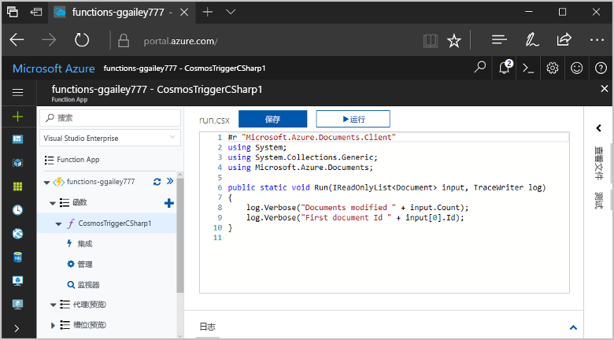
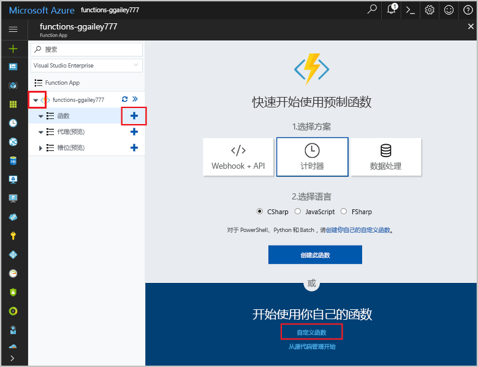
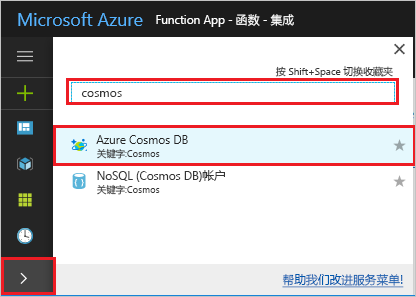
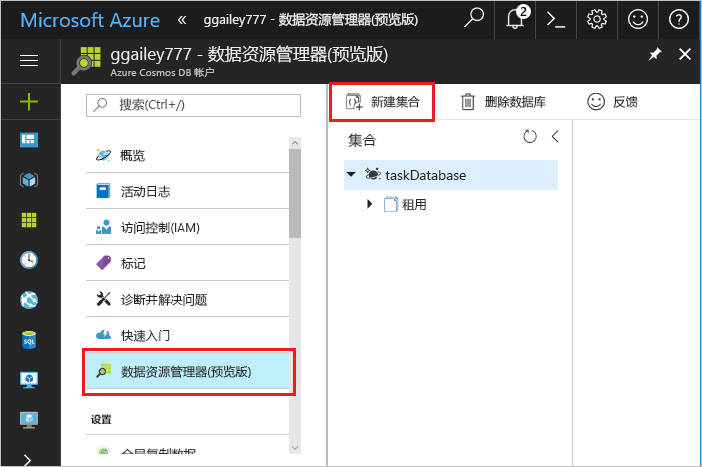
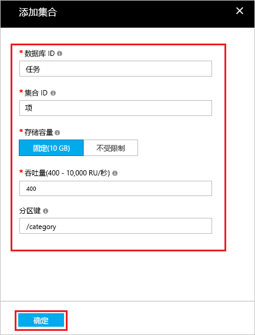
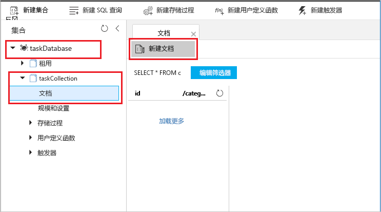

# 创建由 Azure Cosmos DB 触发的函数

了解如何创建在数据添加到 Azure Cosmos DB 或在其中更改数据时触发的函数。 

## 先决条件

完成本教程：

+ 如果没有 Azure 订阅，可在开始前创建一个[试用帐户](https://www.azure.cn/pricing/1rmb-trial)。

> [!NOTE]
> [!INCLUDE [SQL API support only](../../includes/functions-cosmosdb-sqlapi-note.md)]

## 创建 Azure Cosmos DB 帐户

在创建触发器之前，必须已拥有使用 SQL API 的 Azure Cosmos DB 帐户。

[!INCLUDE [cosmos-db-create-dbaccount](../../includes/cosmos-db-create-dbaccount.md)]

## 创建 Azure Function App

[!INCLUDE [Create function app Azure portal](../../includes/functions-create-function-app-portal.md)]

接下来，在新的 Function App 中创建一个函数。

## 创建 Azure Cosmos DB 触发器

1. 展开 Function App，单击“Functions”旁边的 + 按钮。 如果这是函数应用中的第一个函数，请依次选择“门户中”、“继续”。 否则，请转到第三步。

   

1. 依次选择“更多模板”、“完成并查看模板”。

    

1. 在搜索字段中，键入 `cosmos`，然后选择“Azure Cosmos DB 触发器”模板。

1. 如果系统提示，请选择“安装”以在函数应用中安装 Azure 存储扩展的任何依赖项。 安装成功后，选择“继续”。

    

1. 使用图像下面的表中指定的设置来配置新的触发器。

    

    | 设置      | 建议的值  | 说明                                |
    | ------------ | ---------------- | ------------------------------------------ |
    | **名称** | 默认 | 使用模板建议的默认函数名称。|
    | **Azure Cosmos DB 帐户连接** | 新设置 | 选择“新建”，选择你的**订阅**、你之前创建的**数据库帐户**，然后选择“选择”。 这将为帐户连接创建应用程序设置。 此设置由数据库连接的绑定使用。 |
    | 集合名称 | Items | 要监视的集合的名称。 |
    | **创建租赁集合（如果不存在）** | 已选中 | 集合不存在，因此创建集合。 |
    | **数据库名称** | 任务 | 数据库的名称和要监视的集合。 |

1. 单击“创建”创建你的 Azure Cosmos DB 触发函数。 创建函数后，将显示基于模板的函数代码。  

    

    此函数模板将文档的数量和第一个文档 ID 写入到日志中。

接下来，连接到 Azure Cosmos DB 帐户并在 `Tasks` 数据库中创建 `Items` 集合。

## 创建项集合

1. 在浏览器的新选项卡中打开 [Azure 门户](https://portal.azure.cn)的第二个实例。

1. 在门户左侧展开图标栏，在搜索字段中键入 `cosmos`，然后选择“Azure Cosmos DB”。

    

1. 选择你的 Azure Cosmos DB 帐户，然后选择“数据资源管理器”。 

1. 在“集合”中，选择“taskDatabase”并选择“新集合”。

    

1. 在“添加集合”中，使用图像下的表中所示的设置。 

    

    | 设置|建议的值|说明 |
    | ---|---|--- |
    | **数据库 ID** | 任务 |新数据库的名称。 它必须匹配函数绑定中定义的名称。 |
    | **集合 ID** | Items | 新集合的名称。 它必须匹配函数绑定中定义的名称。  |
    | **存储容量** | 固定 (10 GB)|使用默认值。 此值是数据库的存储容量。 |
    | **吞吐量** |400 RU| 使用默认值。 如果想要减少延迟，以后可以增加吞吐量。 |
    | **[分区键](../cosmos-db/partition-data.md)** | /category|一个分区键，用于将数据均匀分配到每个分区。 选择正确的分区键对于创建高性能集合而言很重要。 | 

1. 单击“确定”创建项集合。 创建该集合可能需要一点时间。

函数绑定中指定的集合存在后，可以通过将文档添加到此新集合来测试函数。

## 测试函数

1. 展开数据资源管理器中的新“taskCollection”集合，选择“文档”，然后选择“新建文档”。

    

1. 将新文档的内容替换为以下内容，然后选择“保存”。

        {
            "id": "task1",
            "category": "general",
            "description": "some task"
        }

1. 切换到包含门户中的函数的第一个浏览器选项卡。 展开函数日志并验证新的文档已触发该函数。 会看到 `task1` 文档 ID 值已写入日志。 

    

1. （可选）返回到文档进行更改，然后单击“更新”。 然后，回到函数日志，并验证此更新同样已触发该函数。

## 清理资源

[!INCLUDE [Next steps note](../../includes/functions-quickstart-cleanup.md)]

## 后续步骤

你已经创建一个函数，当在 Azure Cosmos DB 中添加或修改文档时会运行此函数。

[!INCLUDE [Next steps note](../../includes/functions-quickstart-next-steps.md)]

有关 Azure Cosmos DB 触发器的详细信息，请参阅[适用于 Azure Functions 的 Azure Cosmos DB 绑定](functions-bindings-cosmosdb.md)。

<!-- Update_Description: link update -->