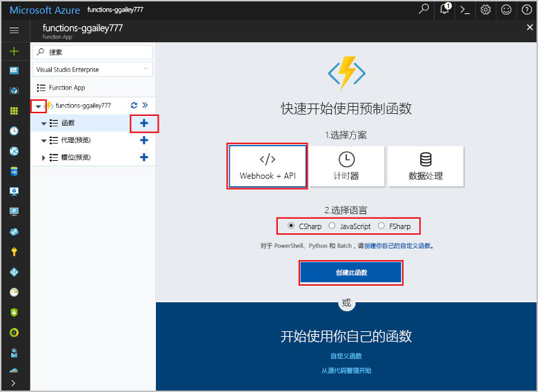
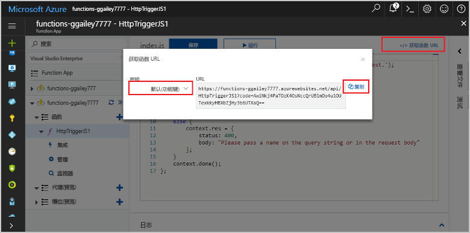
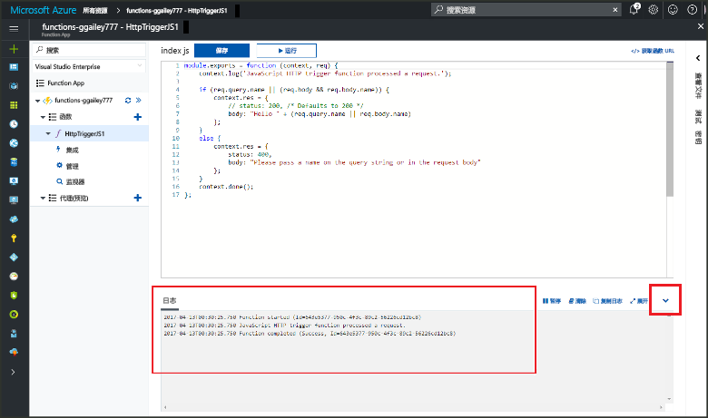

# 在 Azure 门户中创建第一个函数

Azure Functions 用于在无服务器环境中运行代码，无需先创建虚拟机 (VM) 或发布 Web 应用程序。 本文介绍如何使用 Azure Functions 在 Azure 门户中创建 HTTP 触发的“hello world”函数。

如果没有 Azure 订阅，可在开始前创建一个[试用帐户](https://www.azure.cn/pricing/1rmb-trial)。

如果你是 C# 开发人员，则请考虑[在 Visual Studio 2019 中创建第一个函数](functions-create-your-first-function-visual-studio.md)，而不要在门户中这样做。 

## 登录 Azure

使用 Azure 帐户登录到 [Azure 门户](https://portal.azure.cn)。

## 创建函数应用

必须使用 Function App 托管函数的执行。 函数应用可将函数分组为逻辑单元，以便更轻松地管理、部署、缩放和共享资源。

[!INCLUDE [Create function app Azure portal](../../includes/functions-create-function-app-portal.md)]

接下来，在新的函数应用中创建一个函数。

## 创建 HTTP 触发的函数

1. 展开新的函数应用，选择 **Functions** 旁边的 **+** 按钮，接着选择“门户中”  ，然后选择“继续”  。

    

1. 选择“WebHook + API”  ，然后选择“创建”  。

    

   此时将使用 HTTP 触发的函数的特定于语言模板创建函数。

现在，可以通过发送 HTTP 请求来运行新函数了。

## 测试函数

1. 在新函数中，选择右上角的“</> 获取函数 URL”  。 

1. 在“获取函数 URL”  对话框中，从下拉列表中选择“默认值(功能键)”  ，然后选择“复制”  。 

    

1. 将函数 URL 粘贴到浏览器的地址栏中。 将查询字符串值 `&name=<your_name>` 添加到该 URL 尾部，然后按 Enter 来运行请求。 

    以下示例显示了浏览器中的响应：

    

    请求 URL 包含通过 HTTP 访问函数默认所需的密钥。

1. 运行函数时，会在日志中写入跟踪信息。 若要查看上次执行的跟踪输出，请返回到门户中的函数，并选择屏幕底部的箭头以展开“日志”  。

   

## 清理资源

[!INCLUDE [Clean-up resources](../../includes/functions-quickstart-cleanup.md)]

## 后续步骤

[!INCLUDE [Next steps note](../../includes/functions-quickstart-next-steps.md)]

<!-- Update_Description: wording update -->