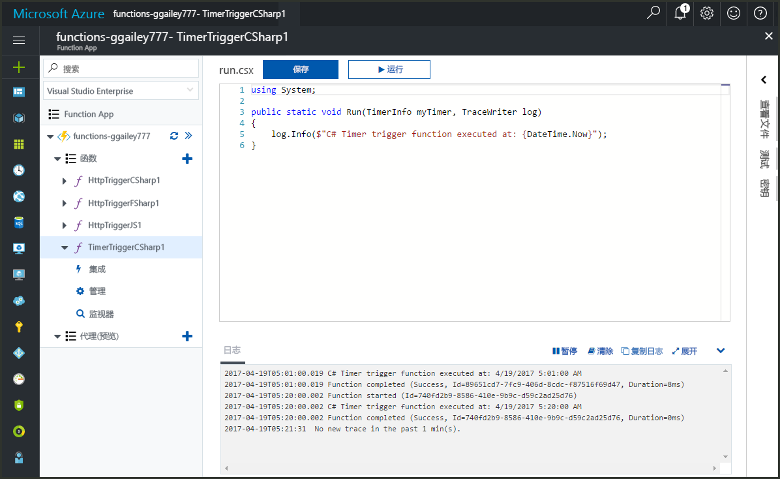
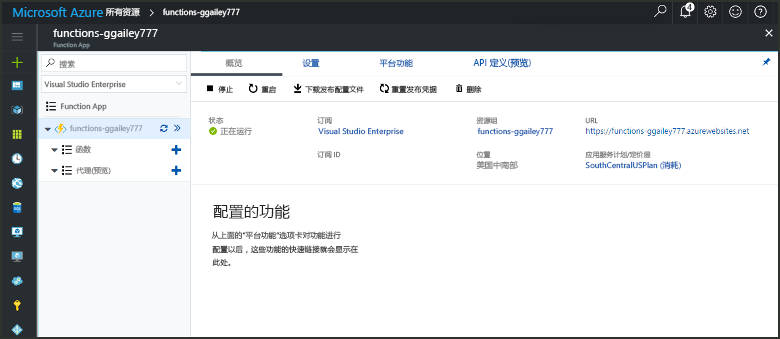
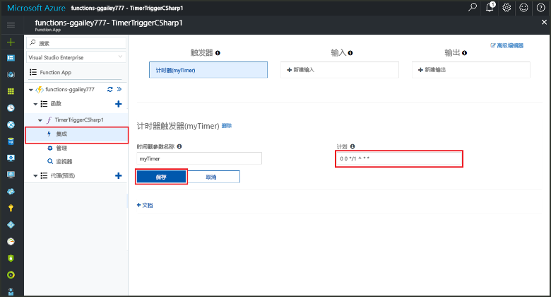

# 在 Azure 中创建由计时器触发的函数

了解如何使用 Azure Functions 创建根据所定义的计划运行的[无服务器](https://azure.microsoft.com/solutions/serverless/)函数。

## 先决条件

完成本教程：

+ 如果没有 Azure 订阅，可在开始前创建一个[试用帐户](https://www.azure.cn/pricing/1rmb-trial)。

## 创建 Azure Function App

[!INCLUDE [Create function app Azure portal](../../includes/functions-create-function-app-portal.md)]

接下来，在新的 Function App 中创建一个函数。

## 创建计时器触发的函数

1. 展开 Function App，单击“Functions”旁边的 + 按钮。 如果这是函数应用中的第一个函数，请依次选择“门户中”、“继续”。 否则，请转到第三步。

   

2. 依次选择“更多模板”、“完成并查看模板”。

    

3. 在搜索字段中，键入 `timer` 并使用图像下面的表中指定的设置来配置新的触发器。

    

    | 设置 | 建议的值 | 说明 |
    |---|---|---|
    | **名称** | 默认 | 定义计时器触发的函数的名称。 |
    | **计划** | 0 \*/1 \* \* \* \* | 六字段 [CRON 表达式](functions-bindings-timer.md#cron-expressions)，计划函数每分钟运行一次。 |

4. 单击**创建**。 将使用所选语言创建一个每分钟运行一次的函数。

5. 通过查看写入日志的跟踪信息来验证执行情况。

    

现在可以更改函数的计划，使之每小时运行一次，而不是每分钟运行一次。

## 更新计时器计划

1. 展开函数，并单击“集成”。 可在此处定义函数的输入和输出绑定，还可以设置计划。 

2. 输入新的小时**计划**值 `0 0 */1 * * *`，然后单击“保存”。  

    

    现在已获得一个每小时运行一次的函数。 

## 清理资源

[!INCLUDE [Next steps note](../../includes/functions-quickstart-cleanup.md)]

## 后续步骤

已创建一个按计划运行的函数。 有关计时器触发器的详细信息，请参阅[使用 Azure Functions 计划代码执行](functions-bindings-timer.md)。

[!INCLUDE [Next steps note](../../includes/functions-quickstart-next-steps.md)]

<!-- Update_Description: wording update -->
