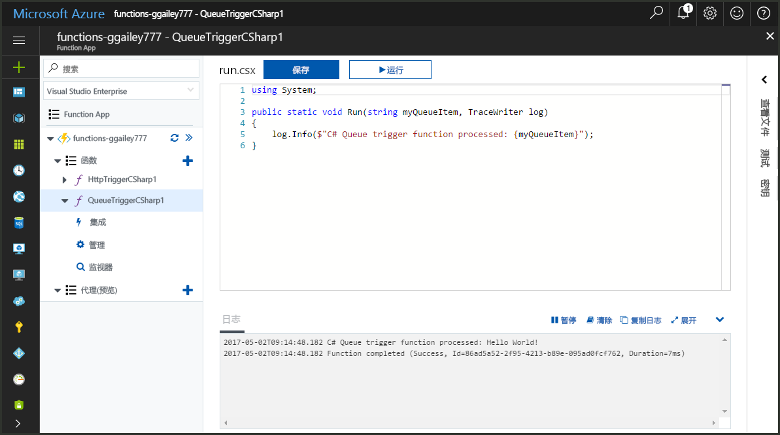
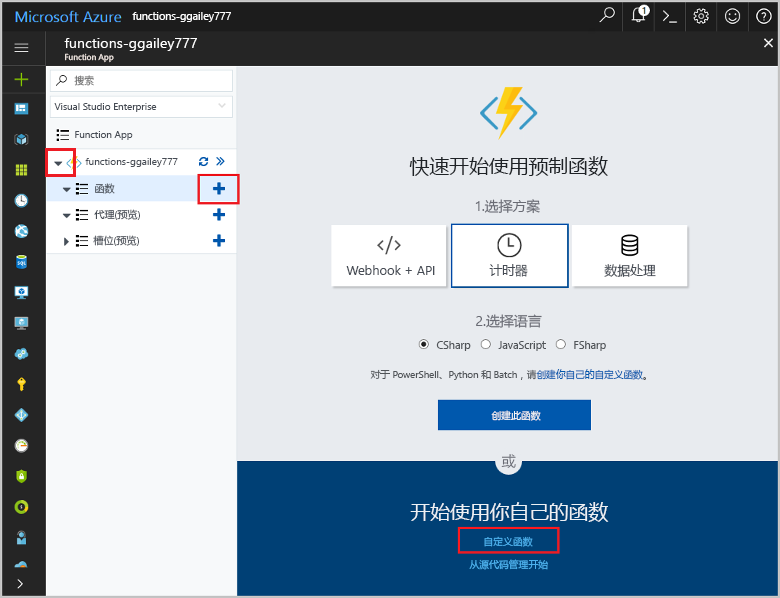
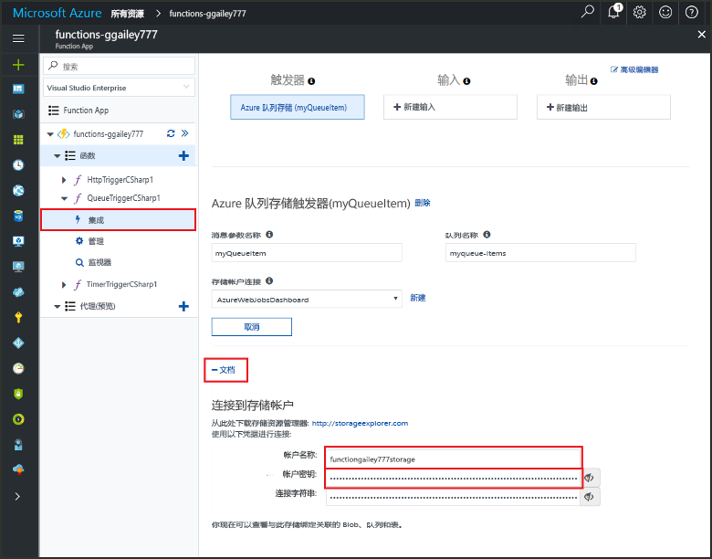
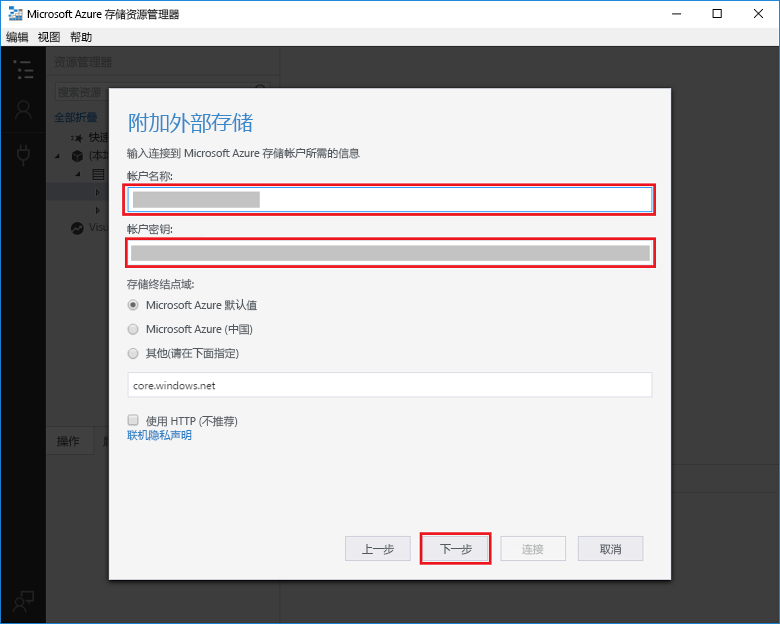
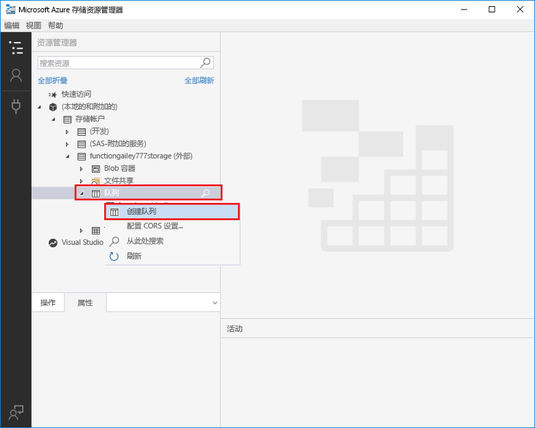
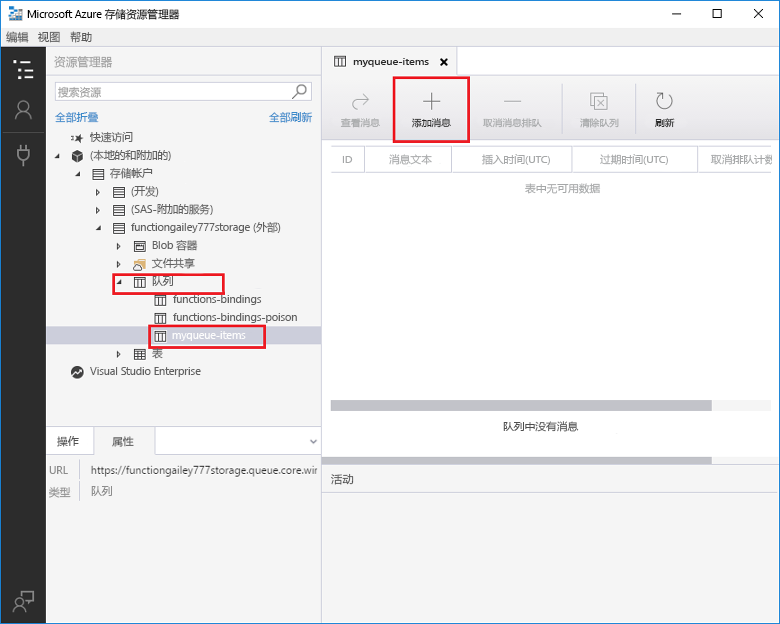

# 创建由 Azure 队列存储触发的函数

了解如何创建在将消息提交到 Azure 存储队列时触发的函数。

## 先决条件

- 下载并安装 [Azure 存储资源管理器](http://storageexplorer.com/)。

- Azure 订阅。 如果没有订阅，请在开始之前创建一个[试用帐户](https://www.azure.cn/pricing/1rmb-trial)。

## 创建 Azure Function App

[!INCLUDE [Create function app Azure portal](../../includes/functions-create-function-app-portal.md)]

接下来，在新的 Function App 中创建一个函数。

## 创建队列触发的函数

1. 展开 Function App，单击“Functions”旁边的 + 按钮。 如果这是函数应用中的第一个函数，请依次选择“门户中”、“继续”。 否则，请转到第三步。

   

1. 依次选择“更多模板”、“完成并查看模板”。

    

1. 在搜索字段中，键入 `queue`，然后选择“队列触发器”模板。

1. 如果系统提示，请选择“安装”以在函数应用中安装 Azure 存储扩展的任何依赖项。 安装成功后，选择“继续”。

    

1. 使用图像下的表中指定的设置。

    

    | 设置 | 建议的值 | 说明 |
    |---|---|---|
    | **名称** | 在 Function App 中唯一 | 此队列触发函数的名称。 |
    | **队列名称**   | myqueue-items    | 要连接到存储帐户中的队列的名称。 |
    | **存储帐户连接** | AzureWebJobStorage | 可以使用 Function App 已在使用的存储帐户连接，也可以创建一个新的存储帐户连接。  |    

1. 单击“创建”以创建函数。

接下来，连接到 Azure 存储帐户并创建 **myqueue-items** 存储队列。

## 创建队列

1. 在函数中，单击“集成”，展开“文档”，并复制**帐户名称**和**帐户密钥**。 在 Azure 存储资源管理器中使用这些凭据连接到存储帐户。 如果已连接存储帐户，请跳到步骤 4。

    

1. 运行 [Azure 存储资源管理器](http://storageexplorer.com/)工具，单击左侧的“连接”图标，选择“使用存储帐户名称和密钥”，并单击“下一步”。

    

1. 输入步骤 1 中的**帐户名称**和**帐户密钥**，单击“下一步”，并单击“连接”。

    

1. 展开附加的存储帐户，右键单击“队列”，单击“创建队列”，键入 `myqueue-items`，并按 Enter。

    

现在已有存储队列，可以通过将消息添加到队列来测试函数。

## 测试函数

1. 返回到 Azure 门户中，浏览到函数，展开页面底部的“日志”并确保日志流式处理未暂停。

1. 在存储资源管理器中，依次展开存储帐户、“队列”和 **myqueue-items**，然后单击“添加消息”。

    

1. 将“Hello World!” 消息键入到“消息文本”中，单击“确定”。

1. 等待几秒钟，返回到函数日志并验证是否已从队列中读取新消息。

    

1. 返回到存储资源管理器中，单击“刷新”，并验证该消息是否已处理且不再在队列中。

## 清理资源

[!INCLUDE [Next steps note](../../includes/functions-quickstart-cleanup.md)]

## 后续步骤

已创建将消息添加到存储队列时运行的函数。

[!INCLUDE [Next steps note](../../includes/functions-quickstart-next-steps.md)]

有关队列存储触发器的详细信息，请参阅 [Azure Functions 存储队列绑定](functions-bindings-storage-queue.md)。

<!-- Update_Description: wording update -->