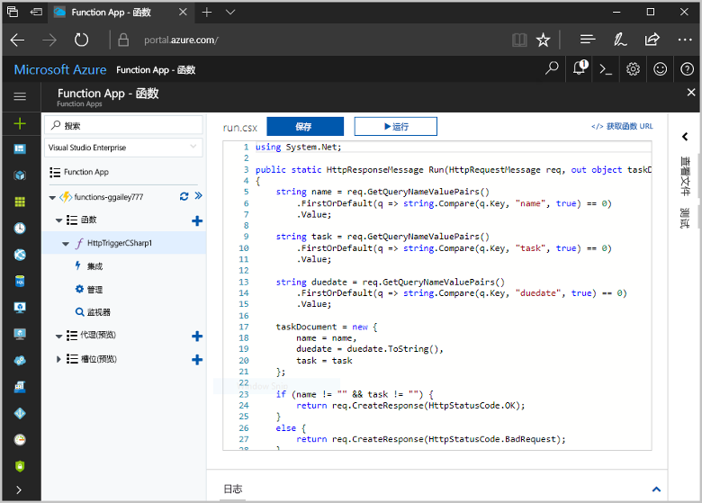
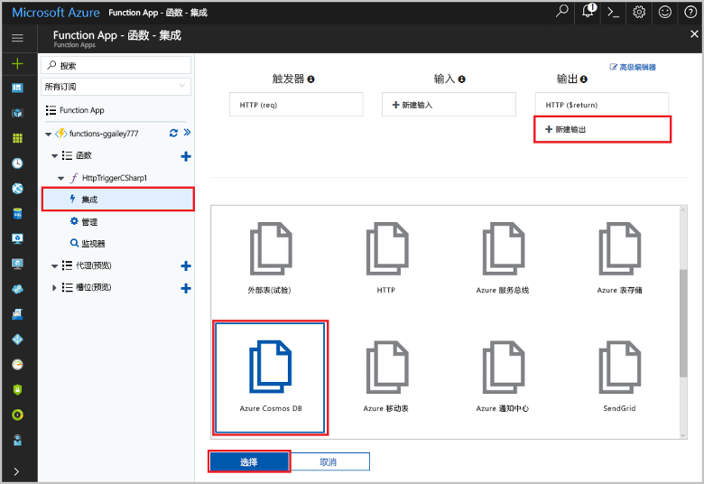
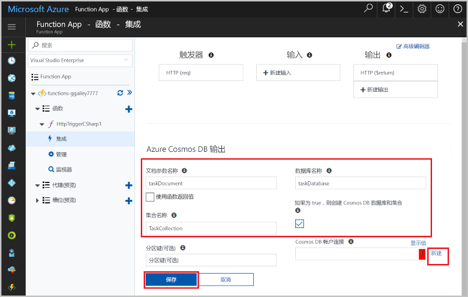
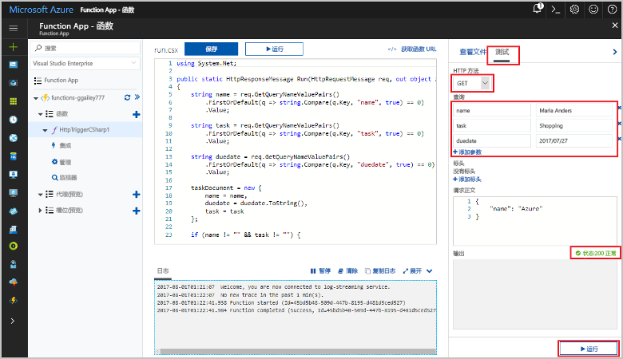
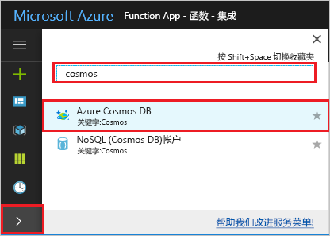
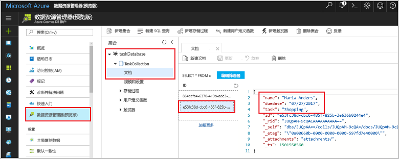

# <a name="store-unstructured-data-using-azure-functions-and-azure-cosmos-db"></a>使用 Azure Functions 和 Azure Cosmos DB 存储非结构化数据

[Azure Cosmos DB](https://azure.microsoft.com/services/cosmos-db/) 是存储非结构化数据和 JSON 数据的良好方式。 将 Cosmos DB 与 Azure Functions 结合使用，可以快速、轻松地存储数据，并且所需的代码也比在关系数据库中存储数据时所需的代码少得多。

> [!NOTE]
> 此时，Azure Cosmos DB 触发器、输入绑定和输出绑定仅可与 SQL API 和图形 API 帐户一起使用。

在 Azure Functions 中，输入和输出绑定提供从函数连接到外部服务数据的声明性方式。 本主题介绍如何更新现有的 C# 函数，以便添加输出绑定，在 Cosmos DB 文档中存储非结构化数据。 



## <a name="prerequisites"></a>先决条件

完成本教程：

[!INCLUDE [Previous quickstart note](../../includes/functions-quickstart-previous-topics.md)]

## <a name="add-an-output-binding"></a>添加输出绑定

1. 展开 Function App 和函数。

1. 在页面右上角选择“集成”和“+ 新建输出”。 选择“Azure Cosmos DB”，然后单击“选择”。

    

3. 根据表中的指定使用“Azure Cosmos DB 输出”设置： 

    

    | 设置      | 建议的值  | 说明                                |
    | ------------ | ---------------- | ------------------------------------------ |
    | 文档参数名称 | taskDocument | 引用代码中的 Cosmos DB 对象的名称。 |
    | **数据库名称** | taskDatabase | 用于保存文档的数据库的名称。 |
    | 集合名称 | TaskCollection | 数据库集合的名称。 |
    | 如果为 true，则创建 Cosmos DB 数据库和集合 | 已选中 | 集合不存在，因此创建集合。 |

4. 选择“Azure Cosmos DB 文档连接”标签旁边的“新建”，然后选择“+ 新建”。 

5. 按照表中的指定使用“新建帐户”设置： 

    

    | 设置      | 建议的值  | 说明                                |
    | ------------ | ---------------- | ------------------------------------------ |
    | **ID** | 数据库的名称 | Azure Cosmos DB 数据库的唯一 ID  |
    | **API** | SQL | 选择 SQL API。 此时，Azure Cosmos DB 触发器、输入绑定和输出绑定仅可与 SQL API 和图形 API 帐户一起使用。 |
    | **订阅** | Azure 订阅 | Azure 订阅  |
    | **资源组** | MyResourceGroup |  使用包含函数应用的现有资源组。 |
    | **位置**  | chinanorth | 选择一个靠近函数应用的位置，或者一个靠近的其他应用使用已存储文档的位置。  |

6. 单击“确定”创建该数据库。 创建数据库可能需要几分钟的时间。 创建数据库后，数据库连接字符串存储为函数应用设置。 此应用设置的名称插入 Azure Cosmos DB 帐户连接中。 
 
8. 设置连接字符串后，选择“保存”以创建绑定。

## <a name="update-the-function-code"></a>更新函数代码

将现有 C# 函数代码替换为以下代码：

```csharp
using System.Net;

public static HttpResponseMessage Run(HttpRequestMessage req, out object taskDocument, TraceWriter log)
{
    string name = req.GetQueryNameValuePairs()
        .FirstOrDefault(q => string.Compare(q.Key, "name", true) == 0)
        .Value;

    string task = req.GetQueryNameValuePairs()
        .FirstOrDefault(q => string.Compare(q.Key, "task", true) == 0)
        .Value;

    string duedate = req.GetQueryNameValuePairs()
        .FirstOrDefault(q => string.Compare(q.Key, "duedate", true) == 0)
        .Value;

    taskDocument = new {
        name = name,
        duedate = duedate.ToString(),
        task = task
    };

    if (name != "" && task != "") {
        return req.CreateResponse(HttpStatusCode.OK);
    }
    else {
        return req.CreateResponse(HttpStatusCode.BadRequest);
    }
}

```
此代码示例读取 HTTP 请求查询字符串，并将其分配到 `taskDocument` 对象中的字段。 `taskDocument` 绑定从此绑定参数发送对象数据，该参数将存储在已绑定文档数据库中。 该数据库在首次运行函数时创建。

## <a name="test-the-function-and-database"></a>测试函数和数据库

1. 展开右侧窗口，然后选择“测试”。 在“查询”下单击“+ 添加参数”，然后将以下参数添加到查询字符串：

    + `name`
    + `task`
    + `duedate`

2. 单击“运行”并验证是否返回 200 状态。

    

1. 在 Azure 门户左侧展开图标栏，在搜索字段中键入 `cosmos`，然后选择“Azure Cosmos DB”。

    

2. 选择你的 Azure Cosmos DB 帐户，然后选择“数据资源管理器”。 

3. 展开“集合”节点，选择新的文档，并确认该文档包含查询字符串值，以及一些其他的元数据。 

    

你已成功地将绑定添加到 HTTP 触发器，该触发器在 Azure Cosmos DB 中存储非结构化数据。

[!INCLUDE [Clean-up section](../../includes/clean-up-section-portal.md)]

## <a name="next-steps"></a>后续步骤

[!INCLUDE [functions-quickstart-next-steps](../../includes/functions-quickstart-next-steps.md)]

若要详细了解如何绑定到 Cosmos DB 数据库，请参阅 [Azure Functions Cosmos DB 绑定](functions-bindings-cosmosdb.md)。

