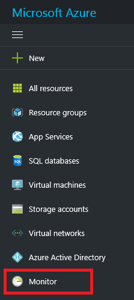

# <a name="view-activity-logs-to-audit-actions-on-resources"></a>查看活动日志，以便审核对资源的操作

通过活动日志，可以确定：

* 对订阅中的资源执行了什么操作
* 谁启动了该操作
* 操作何时发生
* 操作的状态
* 其他可能有助于研究操作的属性的值

活动日志包含针对资源执行的所有写入操作（PUT、POST、DELETE）。 它不包含读取操作 (GET)。 有关资源操作的列表，请参阅 [Azure 资源管理器资源提供程序操作](../role-based-access-control/resource-provider-operations.md)。 在进行故障排除或监视组织中的用户如何修改资源时，可以使用审核日志来查找错误。

活动日志可存储 90 天。 可以查询任何日期范围，只要开始日期不早于过去 90 天。

可以通过门户、PowerShell、Azure CLI、Insights REST API 或 [Insights .NET 库](https://www.nuget.org/packages/Microsoft.Azure.Insights/)检索活动日志中的信息。

[!INCLUDE [updated-for-az](../../includes/updated-for-az.md)]

## <a name="the-azure-portal"></a>Azure 门户

1. 若要通过门户查看活动日志，请选择“监视” 。

    

1. 选择“活动日志”。

    

1. 将显示最近操作的摘要。 系统会向这些操作应用一组默认的筛选器。

    

1. 若要快速运行一组预定义的筛选器，请选择“快速见解”并选择其中一个选项。

    

1. 若要专注于特定操作，请更改筛选器或应用新的筛选器。 例如，下图显示了“时间跨度”的新值，且“资源类型”设置为存储帐户。 

    

1. 如果稍后需要重新运行该查询，请选择“固定当前筛选器”。

    

1. 为筛选器命名。

    

1. 该筛选器将显示在仪表板中。

    

## <a name="powershell"></a>PowerShell

* 若要检索日志条目，请运行 **Get-AzLog** 命令。 可以提供附加参数来筛选条目列表。 如果未指定开始和结束时间，将返回最后七天的条目。

  ```azurepowershell
  Get-AzLog -ResourceGroup ExampleGroup
  ```

    以下示例演示了如何使用活动日志来调查在指定时间内执行的操作。 开始日期和结束日期以日期格式指定。

  ```azurepowershell
  Get-AzLog -ResourceGroup ExampleGroup -StartTime 2019-01-09T06:00 -EndTime 2019-01-15T06:00
  ```

    或者，可以使用 date 函数来指定日期范围，例如过去 14 天。

  ```azurepowershell
  Get-AzLog -ResourceGroup ExampleGroup -StartTime (Get-Date).AddDays(-14)
  ```

* 可以查看特定用户针对某个资源组执行的操作，即使该资源组不再存在。

  ```azurepowershell
  Get-AzLog -ResourceGroup deletedgroup -StartTime (Get-Date).AddDays(-14) -Caller someone@contoso.com
  ```

* 可以筛选失败的操作。

  ```azurepowershell
  Get-AzLog -ResourceGroup ExampleGroup -Status Failed
  ```

* 可以专注于一个错误，只需查看该条目的状态消息即可。

  ```azurepowershell
  ((Get-AzLog -ResourceGroup ExampleGroup -Status Failed).Properties[0].Content.statusMessage | ConvertFrom-Json).error
  ```

* 可以选择特定值来限制返回的数据。

  ```azurepowershell
  Get-AzLog -ResourceGroupName ExampleGroup | Format-table EventTimeStamp, Caller, @{n='Operation'; e={$_.OperationName.value}}, @{n='Status'; e={$_.Status.value}}, @{n='SubStatus'; e={$_.SubStatus.LocalizedValue}}
  ```

* 根据指定的开始时间，前面的命令可能会返回对该资源组执行的一长串操作。 可以提供搜索条件，以筛选所要查找的结果。 例如，可以按操作类型进行筛选。

  ```azurepowershell
  Get-AzLog -ResourceGroup ExampleGroup | Where-Object {$_.OperationName.value -eq "Microsoft.Resources/deployments/write"}
  ```

## <a name="azure-cli"></a>Azure CLI

* 若要检索日志条目，请运行带有偏移量（用于指示时间跨度）的 [az monitor activity-log list](https://docs.azure.cn/zh-cn/cli/monitor/activity-log?view=azure-cli-latest#az-monitor-activity-log-list) 命令。

  ```azurecli
  az monitor activity-log list --resource-group ExampleGroup --offset 7d
  ```

  以下示例演示了如何使用活动日志来调查在指定时间内执行的操作。 开始日期和结束日期以日期格式指定。

  ```azurecli
  az monitor activity-log list -g ExampleGroup --start-time 2019-01-01 --end-time 2019-01-15
  ```

* 可以查看特定用户针对某个资源组执行的操作，即使该资源组不再存在。

  ```azurecli
  az monitor activity-log list -g ExampleGroup --caller someone@contoso.com --offset 5d
  ```

* 可以筛选失败的操作。

  ```azurecli
  az monitor activity-log list -g demoRG --status Failed --offset 1d
  ```

* 可以专注于一个错误，只需查看该条目的状态消息即可。

  ```azurecli
  az monitor activity-log list -g ExampleGroup --status Failed --offset 1d --query [].properties.statusMessage
  ```

* 可以选择特定值来限制返回的数据。

  ```azurecli
  az monitor activity-log list -g ExampleGroup --offset 1d --query '[].{Operation: operationName.value, Status: status.value, SubStatus: subStatus.localizedValue}'
  ```

* 根据指定的开始时间，前面的命令可能会返回对该资源组执行的一长串操作。 可以提供搜索条件，以筛选所要查找的结果。 例如，可以按操作类型进行筛选。

  ```azurecli
  az monitor activity-log list -g ExampleGroup --offset 1d --query "[?operationName.value=='Microsoft.Storage/storageAccounts/write']"
  ```

## <a name="rest-api"></a>REST API

用于处理活动日志的 REST 操作是 [Insights REST API](https://msdn.microsoft.com/library/azure/dn931943.aspx)的一部分。 若要检索活动日志事件，请参阅 [列出订阅中的管理事件](https://msdn.microsoft.com/library/azure/dn931934.aspx)。

## <a name="next-steps"></a>后续步骤

* Azure 活动日志可以与 Power BI 一起使用，以便更深入地了解在订阅中执行的操作。 请参阅 [View and analyze Azure Activity Logs in Power BI and more](https://azure.microsoft.com/blog/analyze-azure-audit-logs-in-powerbi-more/)（在 Power BI 和其他组件中查看和分析 Azure 活动日志）。
* 若要了解如何设置安全策略，请参阅 [Azure 基于角色的访问控制](../role-based-access-control/role-assignments-portal.md)。
* 若要了解用于查看部署操作的命令，请参阅[查看部署操作](resource-manager-deployment-operations.md)。
* 若要了解如何防止对所有用户的资源执行删除操作，请参阅[使用 Azure Resource Manager 锁定资源](resource-group-lock-resources.md)。
* 若要查看可用于每个 Azure 资源管理器提供程序的操作的列表，请参阅 [Azure 资源管理器资源提供程序操作](../role-based-access-control/resource-provider-operations.md)

<!--Update_Description: update meta properties, wording update, update link-->


