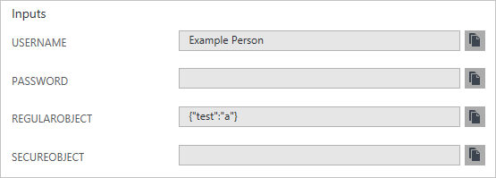

# <a name="understand-the-structure-and-syntax-of-azure-resource-manager-templates"></a>了解 Azure Resource Manager 模板的结构和语法
本主题介绍 Azure Resource Manager 模板的结构， 演示了模板的不同部分，以及可在相应部分使用的属性。 模板中包含可用于为部署构造值的 JSON 和表达式。 有关创建模板的分步教程，请参阅[创建第一个 Azure Resource Manager 模板](./resource-manager-create-first-template.md)。

将模板大小限制为 1 MB 以内，每个参数文件大小限制为 64 KB 以内。 通过迭代资源定义及变量和参数的值扩展模板后，1 MB 的限制适用于模板的最终状态。 

## <a name="template-format"></a>模板格式
使用最简单的结构时，模板包含以下元素：

```json
{
    "$schema": "http://schema.management.azure.com/schemas/2015-01-01/deploymentTemplate.json#",
    "contentVersion": "",
    "parameters": {  },
    "variables": {  },
    "resources": [  ],
    "outputs": {  }
}
```

| 元素名称 | 必选 | 说明 |
|:--- |:--- |:--- |
| $schema |是 |描述模板语言版本的 JSON 架构文件所在的位置。 使用前面的示例中显示的 URL。 |
| contentVersion |是 |模板的版本（例如 1.0.0.0）。 可为此元素提供任意值。 使用模板部署资源时，此值可用于确保使用正确的模板。 |
| 参数 |否 |执行部署以自定义资源部署时提供的值。 |
| variables |否 |在模板中用作 JSON 片段以简化模板语言表达式的值。 |
| 资源 |是 |已在资源组中部署或更新的资源类型。 |
| outputs |否 |部署后返回的值。 |

每个元素均包含可设置的属性。 下例包含一个模板的完整语法：

```json
{
    "$schema": "http://schema.management.azure.com/schemas/2015-01-01/deploymentTemplate.json#",
    "contentVersion": "",
    "parameters": {  
        "<parameter-name>" : {
            "type" : "<type-of-parameter-value>",
            "defaultValue": "<default-value-of-parameter>",
            "allowedValues": [ "<array-of-allowed-values>" ],
            "minValue": <minimum-value-for-int>,
            "maxValue": <maximum-value-for-int>,
            "minLength": <minimum-length-for-string-or-array>,
            "maxLength": <maximum-length-for-string-or-array-parameters>,
            "metadata": {
                "description": "<description-of-the parameter>" 
            }
        }
    },
    "variables": {  
        "<variable-name>": "<variable-value>",
        "<variable-name>": { 
            <variable-complex-type-value> 
        }
    },
    "resources": [
      {
          "apiVersion": "<api-version-of-resource>",
          "type": "<resource-provider-namespace/resource-type-name>",
          "name": "<name-of-the-resource>",
          "location": "<location-of-resource>",
          "tags": "<name-value-pairs-for-resource-tagging>",
          "comments": "<your-reference-notes>",
          "dependsOn": [
              "<array-of-related-resource-names>"
          ],
          "properties": "<settings-for-the-resource>",
          "copy": {
              "name": "<name-of-copy-loop>",
              "count": "<number-of-iterations>"
          },
          "resources": [
              "<array-of-child-resources>"
          ]
      }
    ],
    "outputs": {
        "<outputName>" : {
            "type" : "<type-of-output-value>",
            "value": "<output-value-expression>"
        }
    }
}
```

本主题稍后将更详细地介绍模板的各个节。

## <a name="expressions-and-functions"></a>表达式和函数
模板的基本语法为 JSON。 但是，表达式和函数扩展了模板中可用的 JSON 值。  表达式在 JSON 字符串文本中编写，其中第一个和最后一个字符分别是 `[` 和 `]` 括号。 部署模板时会计算表达式的值。 尽管编写为字符串文本，但表达式的计算结果可以是不同的 JSON 类型，例如数组或整数，具体取决于实际的表达式。  若要使用一个括号 `[` 在开头括住文本字符串但不将其解释为表达式，请额外添加一个括号，使字符串以 `[[` 开头。

通常，你会将表达式与函数一起使用，以执行用于配置部署的操作。 如同在 JavaScript 中一样，函数调用的格式为 `functionName(arg1,arg2,arg3)`。 使用点和 [index] 运算符引用属性。

以下示例演示如何在构造值时使用一些函数：

```json
"variables": {
    "location": "[resourceGroup().location]",
    "usernameAndPassword": "[concat(parameters('username'), ':', parameters('password'))]",
    "authorizationHeader": "[concat('Basic ', base64(variables('usernameAndPassword')))]"
}
```

有关模板函数的完整列表，请参阅 [Azure Resource Manager 模板函数](./resource-group-template-functions.md)。 

## <a name="parameters"></a>参数
在模板的 parameters 节中，你可以指定在部署资源时能够输入的值。 提供针对特定环境（例如开发、测试和生产环境）定制的参数值可以自定义部署。 无需在模板中提供参数，但如果没有参数，模板始终部署具有相同名称、位置和属性的相同资源。

使用以下结构定义参数：

```json
"parameters": {
    "<parameter-name>" : {
        "type" : "<type-of-parameter-value>",
        "defaultValue": "<default-value-of-parameter>",
        "allowedValues": [ "<array-of-allowed-values>" ],
        "minValue": <minimum-value-for-int>,
        "maxValue": <maximum-value-for-int>,
        "minLength": <minimum-length-for-string-or-array>,
        "maxLength": <maximum-length-for-string-or-array-parameters>,
        "metadata": {
            "description": "<description-of-the parameter>" 
        }
    }
}
```

| 元素名称 | 必选 | 说明 |
|:--- |:--- |:--- |
| parameterName |是 |参数的名称。 必须是有效的 JavaScript 标识符。 |
| type |是 |参数值的类型。 请参阅允许类型的列表（此表后面）。 |
| defaultValue |否 |参数的默认值，如果没有为参数提供任何值。 |
| allowedValues |否 |用来确保提供正确值的参数的允许值数组。 |
| minValue |否 |int 类型参数的最小值，此值是包容性的。 |
| maxValue |否 |int 类型参数的最大值，此值是包容性的。 |
| minLength |否 |字符串、secureString 和数组类型参数的最小长度（含）。 |
| maxLength |否 |字符串、secureString 和数组类型参数的最大长度（含）。 |
| 说明 |否 |通过门户向用户显示的参数的说明。 |

允许的类型和值是：

* **字符串**
* **secureString**
* **int**
* **bool**
* **对象** 
* **secureObject**
* **array**

若要将某个参数指定为可选，请提供 defaultValue（可以为空字符串）。 

如果在模板中指定的参数名称与部署模板时所用命令中的参数匹配，则可能会对提供的值造成混淆。 Resource Manager 解决此混淆问题的方式是将后缀 **FromTemplate** 添加到模板参数。 例如，如果在模板中包括名为 **ResourceGroupName** 的参数，则该参数会与 [New-AzureRmResourceGroupDeployment][deployment2cmdlet] cmdlet 中的 **ResourceGroupName** 参数冲突。 在部署期间，系统会提示用户提供 **ResourceGroupNameFromTemplate** 的值。 通常，不应将参数命名为与用于部署操作的参数的名称相同以避免这种混乱。

> [!NOTE]
> 所有密码、密钥和其他机密信息应使用 **secureString** 类型。 若要将敏感数据传入 JSON 对象，请使用 **secureObject** 类型。 部署资源后，无法读取 secureString 或 secureObject 类型的模板参数。 
> 
> 例如，部署历史记录中的以下条目将显示字符串和对象的值，但不会显示 secureString 和 secureObject 的值。
>
>   
>

以下示例演示如何定义参数：

```json
"parameters": {
    "siteName": {
        "type": "string",
        "defaultValue": "[concat('site', uniqueString(resourceGroup().id))]"
    },
    "hostingPlanName": {
        "type": "string",
        "defaultValue": "[concat(parameters('siteName'),'-plan')]"
    },
    "skuName": {
        "type": "string",
        "defaultValue": "F1",
        "allowedValues": [
          "F1",
          "D1",
          "B1",
          "B2",
          "B3",
          "S1",
          "S2",
          "S3",
          "P1",
          "P2",
          "P3",
          "P4"
        ]
    },
    "skuCapacity": {
        "type": "int",
        "defaultValue": 1,
        "minValue": 1
    }
}
```

若要了解如何在部署过程中输入参数值，请参阅 [Deploy an application with Azure Resource Manager template](./resource-group-template-deploy.md)（使用 Azure Resource Manager 模板部署应用程序）。 

## <a name="variables"></a>变量
在 variables 节中构造可在整个模板中使用的值。 不需要定义变量，但使用变量可以减少复杂的表达式，从而简化模板。

使用以下结构定义变量：

```json
"variables": {
    "<variable-name>": "<variable-value>",
    "<variable-name>": { 
        <variable-complex-type-value> 
    }
}
```

以下示例演示如何定义从两个参数值构造出的变量：

```json
"variables": {
    "connectionString": "[concat('Name=', parameters('username'), ';Password=', parameters('password'))]"
}
```

下一个示例演示一个属于复杂的 JSON 类型的变量，以及从其他变量构造出的变量：

```json
"parameters": {
    "environmentName": {
        "type": "string",
        "allowedValues": [
          "test",
          "prod"
        ]
    }
},
"variables": {
    "environmentSettings": {
        "test": {
            "instancesSize": "Small",
            "instancesCount": 1
        },
        "prod": {
            "instancesSize": "Large",
            "instancesCount": 4
        }
    },
    "currentEnvironmentSettings": "[variables('environmentSettings')[parameters('environmentName')]]",
    "instancesSize": "[variables('currentEnvironmentSettings').instancesSize]",
    "instancesCount": "[variables('currentEnvironmentSettings').instancesCount]"
}
```

## <a name="resources"></a>资源
在 resources 节，可以定义部署或更新的资源。 此节可能比较复杂，因为用户必须了解要部署哪些类型才能提供正确的值。 

使用以下结构定义资源：

```json
"resources": [
  {
      "apiVersion": "<api-version-of-resource>",
      "type": "<resource-provider-namespace/resource-type-name>",
      "name": "<name-of-the-resource>",
      "location": "<location-of-resource>",
      "tags": "<name-value-pairs-for-resource-tagging>",
      "comments": "<your-reference-notes>",
      "dependsOn": [
          "<array-of-related-resource-names>"
      ],
      "properties": "<settings-for-the-resource>",
      "copy": {
          "name": "<name-of-copy-loop>",
          "count": "<number-of-iterations>"
      },
      "resources": [
          "<array-of-child-resources>"
      ]
  }
]
```

| 元素名称 | 必选 | 说明 |
|:--- |:--- |:--- |
| apiVersion |是 |用于创建资源的 REST API 版本。 |
| type |是 |资源的类型。 此值是资源提供程序的命名空间和资源类型（例如 **Microsoft.Storage/storageAccounts**）的组合。 |
| 名称 |是 |资源的名称。 该名称必须遵循 RFC3986 中定义的 URI 构成部分限制。 此外，向第三方公开资源名称的 Azure 服务将验证名称，以确保它不是尝试窃取另一个身份。 |
| location |多种多样 |提供的资源支持的地理位置。 可以选择任何可用位置，但通常选取靠近用户的位置。 通常还会将彼此交互的资源置于同一区域。 大多数资源类型需要一个位置，但某些类型 （如角色分配）不需要位置。 请参阅[在 Azure Resource Manager 模板中设置资源位置](./resource-manager-template-location.md)。 |
| 标记 |否 |与资源关联的标记。 请参阅[标记 Azure Resource Manager 模板中的资源](./resource-manager-template-tags.md)。 |
| 注释 |否 |用于描述模板中资源的注释 |
| dependsOn |否 |部署此资源之前必须部署的资源。 Resource Manager 将评估资源之间的依赖关系，并按正确的顺序部署资源。 如果资源不相互依赖，则可并行部署资源。 该值可以是资源名称或资源唯一标识符的逗号分隔列表。 在此模板中仅部署列出的资源。 此模板中未定义的资源必须已存在。 避免添加不必要的依赖项，因为这些依赖项可能会降低部署速度并创建循环依赖项。 有关设置依赖项的指导，请参阅[在 Azure Resource Manager 模板中定义依赖项](./resource-group-define-dependencies.md)。 |
| 属性 |否 |特定于资源的配置设置。 properties 的值与创建资源时，在 REST API 操作（PUT 方法）的请求正文中提供的值相同。 |
| 复制 |否 |如果需要多个实例，则为要创建的资源数。 有关详细信息，请参阅[在 Azure Resource Manager 中创建多个资源实例](./resource-group-create-multiple.md)。 |
| 资源 |否 |依赖于所定义的资源的子资源。 只能提供父资源的架构允许的资源类型。 子资源的完全限定类型包含父资源类型，例如 **Microsoft.Web/sites/extensions**。 不隐式表示对父资源的依赖。 必须显式定义该依赖关系。 |

resources 节包含要部署的资源数组。 在每个资源内，还可以定义子资源数组。 因此，resources 节的结构可能类似于：

```json
"resources": [
  {
      "name": "resourceA",
  },
  {
      "name": "resourceB",
      "resources": [
        {
            "name": "firstChildResourceB",
        },
        {   
            "name": "secondChildResourceB",
        }
      ]
  },
  {
      "name": "resourceC",
  }
]
```      

有关定义子资源的详细信息，请参阅[在 Resource Manager 模板中设置子资源的名称和类型](./resource-manager-template-child-resource.md)。

## <a name="outputs"></a>Outputs
在 Outputs 节中，可以指定从部署返回的值。 例如，可能会返回用于访问已部署资源的 URI。

以下示例演示了输出定义的结构：

```json
"outputs": {
    "<outputName>" : {
        "type" : "<type-of-output-value>",
        "value": "<output-value-expression>"
    }
}
```

| 元素名称 | 必选 | 说明 |
|:--- |:--- |:--- |
| outputName |是 |输出值的名称。 必须是有效的 JavaScript 标识符。 |
| type |是 |输出值的类型。 输出值支持的类型与模板输入参数相同。 |
| value |是 |要求值并作为输出值返回的模板语言表达式。 |

以下示例演示了 Outputs 节中返回的值。

```json
"outputs": {
    "siteUri" : {
        "type" : "string",
        "value": "[concat('http://',reference(resourceId('Microsoft.Web/sites', parameters('siteName'))).hostNames[0])]"
    }
}
```

有关如何处理输出的详细信息，请参阅 [Sharing state in Azure Resource Manager templates](./best-practices-resource-manager-state.md)（在 Azure Resource Manager 模板中共享状态）。

## <a name="next-steps"></a>后续步骤
* 若要查看许多不同类型的解决方案的完整模型，请参阅 [Azure Quickstart Templates](https://azure.microsoft.com/zh-cn/documentation/templates/)（Azure 快速入门模板）。
* 有关用户可以使用的来自模板中的函数的详细信息，请参阅 [Azure Resource Manager Template Functions](./resource-group-template-functions.md)（Azure Resource Manager 模板函数）。
* 若要在部署期间合并多个模板，请参阅 [Using linked templates with Azure Resource Manager](./resource-group-linked-templates.md)（将已链接的模板与 Azure Resource Manager 配合使用）。
* 你可能需要使用不同资源组中的资源。 使用跨多个资源组共享的存储帐户或虚拟网络时，此方案很常见。 有关详细信息，请参阅 [resourceId 函数](./resource-group-template-functions.md#resourceid)。

[deployment2cmdlet]: https://docs.microsoft.com/zh-cn/powershell/resourcemanager/azurerm.resources/v3.2.0/new-azurermresourcegroupdeployment
