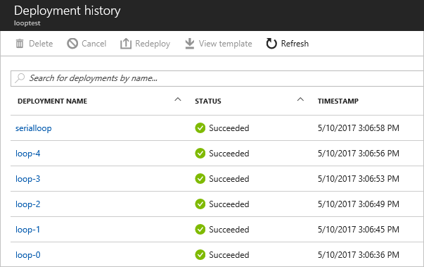

# <a name="deploy-multiple-instances-of-a-resource-or-property-in-azure-resource-manager-templates"></a>在 Azure Resource Manager 模板中部署资源或属性的多个实例
本主题演示如何在您的 Azure Resource Manager 模板中进行迭代操作，以创建多个资源实例。

## <a name="resource-iteration"></a>资源迭代
若要创建某个资源类型的多个实例，请向该资源类型添加 `copy` 元素。 在 copy 元素中，为此循环指定迭代次数和名称。 计数值必须是不超过 800 的正整数。 Resource Manager 将并行创建资源。 因此，创建顺序是不确定的。 若要在序列中创建迭代的资源，请参阅[串行复制](#serial-copy)。 

要多次创建的资源将采用以下格式：

```json
{
    "$schema": "https://schema.management.azure.com/schemas/2015-01-01/deploymentTemplate.json#",
    "contentVersion": "1.0.0.0",
    "resources": [
        {
            "apiVersion": "2016-01-01",
            "type": "Microsoft.Storage/storageAccounts",
            "name": "[concat(copyIndex(),'storage', uniqueString(resourceGroup().id))]",
            "location": "[resourceGroup().location]",
            "sku": {
                "name": "Standard_LRS"
            },
            "kind": "Storage",
            "properties": {},
            "copy": {
                "name": "storagecopy",
                "count": 3
            }
        }
    ],
    "outputs": {}
}
```

请注意，每个资源的名称都包括 `copyIndex()` 函数，用于返回循环中的当前迭代。 `copyIndex()` 从零开始。 因此，以下示例：

```json
"name": "[concat('storage', copyIndex())]",
```

将创建以下名称：

* storage0
* storage1
* storage2。

若要偏移索引值，可以在 copyIndex() 函数中传递一个值。 要执行的迭代次数仍被指定在 copy 元素中，但 copyIndex 的值已按指定的值发生了偏移。 因此，以下示例：

```json
"name": "[concat('storage', copyIndex(1))]",
```

将创建以下名称：

* storage1
* storage2
* storage3

处理数组时可以使用复制操作，因为可对数组中的每个元素执行迭代操作。 可以对数组使用 `length` 函数来指定迭代计数，并使用 `copyIndex` 来检索数组中的当前索引。 因此，以下示例：

```json
"parameters": { 
  "org": { 
     "type": "array", 
     "defaultValue": [ 
         "contoso", 
         "fabrikam", 
         "coho" 
      ] 
  }
}, 
"resources": [ 
  { 
      "name": "[concat('storage', parameters('org')[copyIndex()])]", 
      "copy": { 
         "name": "storagecopy", 
         "count": "[length(parameters('org'))]" 
      }, 
      ...
  } 
]
```

将创建以下名称：

* storagecontoso
* storagefabrikam
* storagecoho

## <a name="serial-copy"></a>串行复制

使用 copy 元素创建某种资源类型的多个实例时，默认情况下，Resource Manager 并行部署这些实例。 但是，你可能希望将资源指定为按顺序部署。 例如，在更新生产环境时，可能需要错开更新，使任何一次仅更新一定数量。

Resource Manager 在 copy 元素上提供了相关的属性，使用这些属性可以按顺序部署多个实例。 在 copy 元素中，将 `mode` 设置为 **serial**，将 `batchSize` 设置为一次要部署的实例数。 在串行模式下，Resource Manager 将在循环中创建早前实例的依赖项，以便在前一个批处理完成之前它不会启动一个批处理。

```json
"copy": {
    "name": "iterator",
    "count": "[parameters('numberToDeploy')]",
    "mode": "serial",
    "batchSize": 2
},
```

mode 属性也接受 **parallel**（它是默认值）。

若要在不创建实际资源的情况下测试串行复制，请使用以下模板部署空的嵌套模板：

```json
{
  "$schema": "https://schema.management.azure.com/schemas/2015-01-01/deploymentTemplate.json#",
  "contentVersion": "1.0.0.0",
  "parameters": {
    "numberToDeploy": {
      "type": "int",
      "minValue": 2,
      "defaultValue": 5
    }
  },
  "resources": [
    {
      "apiVersion": "2015-01-01",
      "type": "Microsoft.Resources/deployments",
      "name": "[concat('loop-', copyIndex())]",
      "copy": {
        "name": "iterator",
        "count": "[parameters('numberToDeploy')]",
        "mode": "serial",
        "batchSize": 1
      },
      "properties": {
        "mode": "Incremental",
        "template": {
          "$schema": "http://schema.management.azure.com/schemas/2015-01-01/deploymentTemplate.json#",
          "contentVersion": "1.0.0.0",
          "parameters": {},
          "variables": {},
          "resources": [],
          "outputs": {
          }
        }
      }
    }
  ],
  "outputs": {
  }
}
```

在部署历史记录中，请注意，嵌套部署将按顺序处理。



对于更现实的方案，以下示例将从嵌套模板一次部署 Linux VM 的两个实例：

```json
{
    "$schema": "https://schema.management.azure.com/schemas/2015-01-01/deploymentTemplate.json#",
    "contentVersion": "1.0.0.0",
    "parameters": {
        "adminUsername": {
            "type": "string",
            "metadata": {
                "description": "User name for the Virtual Machine."
            }
        },
        "adminPassword": {
            "type": "securestring",
            "metadata": {
                "description": "Password for the Virtual Machine."
            }
        },
        "dnsLabelPrefix": {
            "type": "string",
            "metadata": {
                "description": "Unique DNS Name for the Public IP used to access the Virtual Machine."
            }
        },
        "ubuntuOSVersion": {
            "type": "string",
            "defaultValue": "16.04.0-LTS",
            "allowedValues": [
                "12.04.5-LTS",
                "14.04.5-LTS",
                "15.10",
                "16.04.0-LTS"
            ],
            "metadata": {
                "description": "The Ubuntu version for the VM. This will pick a fully patched image of this given Ubuntu version."
            }
        }
    },
    "variables": {
        "templatelink": "https://raw.githubusercontent.com/rjmax/Build2017/master/Act1.TemplateEnhancements/Chapter03.LinuxVM.json"
    },
    "resources": [
        {
            "apiVersion": "2015-01-01",
            "name": "[concat('nestedDeployment',copyIndex())]",
            "type": "Microsoft.Resources/deployments",
            "copy": {
                "name": "myCopySet",
                "count": 4,
                "mode": "serial",
                "batchSize": 2
            },
            "properties": {
                "mode": "Incremental",
                "templateLink": {
                    "uri": "[variables('templatelink')]",
                    "contentVersion": "1.0.0.0"
                },
                "parameters": {
                    "adminUsername": {
                        "value": "[parameters('adminUsername')]"
                    },
                    "adminPassword": {
                        "value": "[parameters('adminPassword')]"
                    },
                    "dnsLabelPrefix": {
                        "value": "[parameters('dnsLabelPrefix')]"
                    },
                    "ubuntuOSVersion": {
                        "value": "[parameters('ubuntuOSVersion')]"
                    },
                    "index":{
                        "value": "[copyIndex()]"
                    }
                }
            }
        }
    ]
}
```

## <a name="depend-on-resources-in-a-loop"></a>依赖于循环中的资源
可以使用 `dependsOn` 元素指定一个资源在另一个资源之后部署。 若要部署的资源依赖于循环中的资源集合，请在 dependsOn 元素中提供 copy 循环的名称。 以下示例演示了如何在部署虚拟机之前部署三个存储帐户。 此处并未显示完整的虚拟机定义。 请注意，copy 元素的名称设置为 `storagecopy`，而虚拟机的 dependsOn 元素也设置为 `storagecopy`。

```json
{
    "$schema": "https://schema.management.azure.com/schemas/2015-01-01/deploymentTemplate.json#",
    "contentVersion": "1.0.0.0",
    "parameters": {},
    "resources": [
        {
            "apiVersion": "2016-01-01",
            "type": "Microsoft.Storage/storageAccounts",
            "name": "[concat(copyIndex(),'storage', uniqueString(resourceGroup().id))]",
            "location": "[resourceGroup().location]",
            "sku": {
                "name": "Standard_LRS"
            },
            "kind": "Storage",
            "properties": {},
            "copy": {
                "name": "storagecopy",
                "count": 3
            }
        },
        {
            "apiVersion": "2015-06-15", 
            "type": "Microsoft.Compute/virtualMachines", 
            "name": "[concat('VM', uniqueString(resourceGroup().id))]",  
            "dependsOn": ["storagecopy"],
            ...
        }
    ],
    "outputs": {}
}
```

## <a name="create-multiple-instances-of-a-child-resource"></a>创建子资源的多个实例
不能对子资源使用 copy 循环。 若要创建子资源的多个实例，而该子资源通常在其他资源中定义为嵌套资源，则必须将该资源创建为顶级资源。 可以通过 type 和 name 属性定义与父资源的关系。

例如，假设用户通常会将某个数据集定义为数据工厂中的子资源。

```json
"resources": [
{
    "type": "Microsoft.DataFactory/datafactories",
    "name": "exampleDataFactory",
    ...
    "resources": [
    {
        "type": "datasets",
        "name": "exampleDataSet",
        "dependsOn": [
            "exampleDataFactory"
        ],
        ...
    }
}]
```

若要创建数据集的多个实例，请将数据集移出数据工厂。 数据集必须与数据工厂位于同一层级，但仍属数据工厂的子资源。 可以通过 type 和 name 属性保留数据集和数据工厂之间的关系。 由于类型不再可以从其在模板中的位置推断，因此必须按以下格式提供完全限定的类型： `{resource-provider-namespace}/{parent-resource-type}/{child-resource-type}`。

若要与数据工厂的实例建立父/子关系，提供的数据集的名称应包含父资源名称。 使用以下格式： `{parent-resource-name}/{child-resource-name}`。  

以下示例演示实现过程：

```json
"resources": [
{
    "type": "Microsoft.DataFactory/datafactories",
    "name": "exampleDataFactory",
    ...
},
{
    "type": "Microsoft.DataFactory/datafactories/datasets",
    "name": "[concat('exampleDataFactory', '/', 'exampleDataSet', copyIndex())]",
    "dependsOn": [
        "exampleDataFactory"
    ],
    "copy": { 
        "name": "datasetcopy", 
        "count": "3" 
    } 
    ...
}]
```

## <a name="next-steps"></a>后续步骤
* 若要了解有关模板区段的信息，请参阅[创作 Azure Resource Manager 模板](resource-group-authoring-templates.md)。
* 若要了解如何部署模板，请参阅 [使用 Azure Resource Manager 模板部署应用程序](resource-group-template-deploy.md)。
