# 使用门户创建可访问资源的 Azure Active Directory 应用程序和服务主体

当代码需要访问或修改资源时，必须设置 Azure Active Directory (AD) 应用程序。 可以将所需的权限分配给 AD 应用程序。 这种方法优于在自己的凭据下运行应用，因为可以将自己未拥有的权限分配给应用标识。 通常情况下，这些权限仅限于应用需执行的操作。

本文介绍了如何通过门户执行这些步骤。 重点介绍单租户应用程序，其中应用程序只应在一个组织内运行。 通常会将单租户应用程序作为在组织中运行的业务线应用程序使用。

<!-- Not Available on MSI (Managed Service Identity) -->

## 所需的权限

若要完成本文，必须拥有足够的权限向 Azure AD 租户注册应用，并将应用程序分配给 Azure 订阅中的角色。 请确保拥有适当的权限来执行这些步骤。

### 检查 Azure Active Directory 权限

1. 选择“Azure Active Directory” 。

    

1. 在 Azure Active Directory 中，选择“用户设置”。

    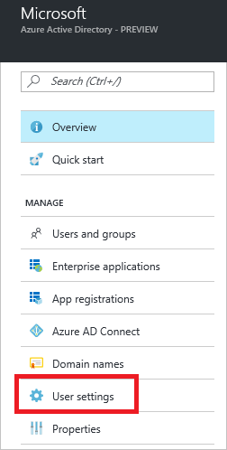

1. 检查“应用注册”  设置。 如果设置为“是” ，则非管理员用户可以注册 AD 应用。 此设置意味着 Active AD 租户中的任何用户都可以注册应用。 可继续转到 [检查 Azure 订阅权限](#check-azure-subscription-permissions)。

    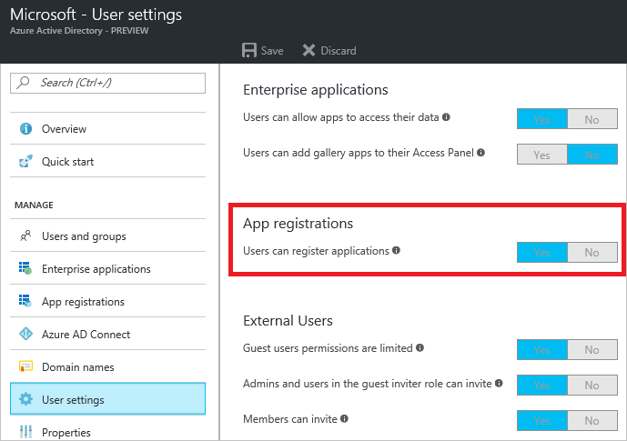

1. 如果应用注册设置已设置为“否”，则只有[全局管理员](../active-directory/users-groups-roles/directory-assign-admin-roles.md)可以注册应用。 检查帐户是否为 Active AD 租户的管理员。 选择“概述”并查看用户信息。 如果将帐户分配到“用户”角色，但（前面步骤中设置的）应用注册设置仅限于管理员用户，请要求管理员为你分配“全局管理员”角色或允许用户注册应用。

    

### 检查 Azure 订阅权限

在 Azure 订阅中，帐户必须具有 `Microsoft.Authorization/*/Write` 访问权限才能向角色分配 AD 应用。 通过[所有者](../role-based-access-control/built-in-roles.md#owner)角色或[用户访问管理员](../role-based-access-control/built-in-roles.md#user-access-administrator)角色授权此操作。 如果帐户分配到“参与者”  角色，则权限不足。 尝试将服务主体分配到角色时，将收到错误。

检查订阅权限的方法如下：

1. 在右上角选择自己的帐户，然后选择“我的权限”。

    

1. 从下拉列表中选择订阅。 选择“单击此处查看此订阅的完整访问详细信息”。

    

1. 查看分配到的角色，确定你是否拥有足够的权限来向角色分配 AD 应用。 如果没有，请要求订阅管理员将你添加到用户访问管理员角色。 在下图中，用户分配到了“所有者”角色，这意味着该用户具有足够的权限。

    

## 创建 Azure Active Directory 应用程序

1. 通过 [Azure 门户](https://portal.azure.cn)登录 Azure 帐户。
1. 选择“Azure Active Directory” 。

    

1. 选择“应用注册” 。

    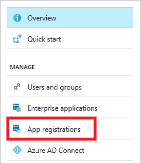

1. 选择“新建应用程序注册”。

    

1. 为应用提供名称和 URL。 选择“Web 应用/API”作为要创建的应用程序的类型。 无法创建原生应用程序的凭据，因此这种类型不适用于自动化应用程序。 设置这些值后，选择“创建”。
    <!-- Not Available on [Native application](../active-directory/manage-apps/application-proxy-configure-native-client-application.md) -->
    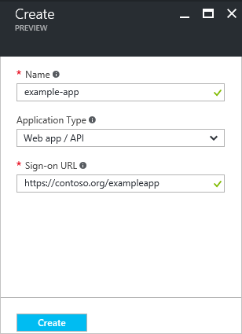

已创建应用程序。

## 获取应用程序 ID 和身份验证密钥

以编程方式登录时，需要使用应用程序的 ID 和身份验证密钥。 若要获取这些值，请使用以下步骤：

1. 从 Azure Active Directory 中的“应用注册”，选择应用程序。

    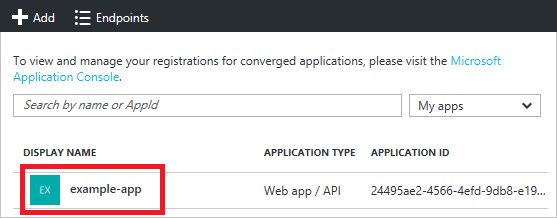

1. 复制“应用程序 ID”并将其存储在应用程序代码中。 某些[示例应用程序](#log-in-as-the-application)将此值作为客户端 ID。

    

1. 若要生成身份验证密钥，请选择“设置”。

   

1. 若要生成身份验证密钥，请选择“密钥”。

    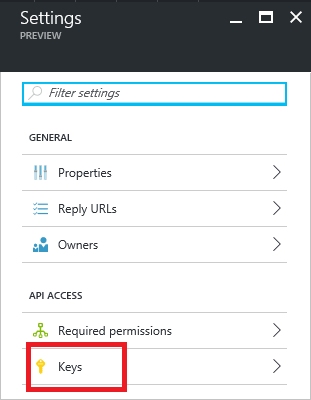

1. 提供密钥说明和密钥持续时间。 完成后，选择“保存” 。

    

   保存密钥后, 会显示密钥的值。 复制此值，因为稍后不能检索密钥。 提供密钥值及应用程序 ID 登录为该应用程序。 将密钥值存储在应用程序可检索的位置。

   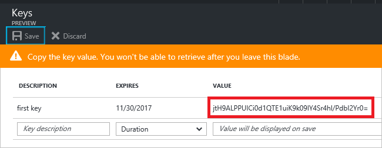

## 获取租户 ID

以编程方式登录时，需要随身份验证请求传递租户 ID。

1. 选择“Azure Active Directory”。

    

1. 若要获取租户 ID，请选择 Azure AD 租户的“属性”。

    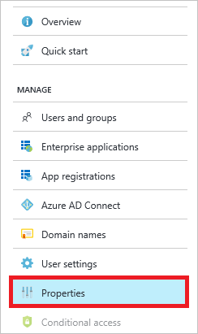

1. 复制“目录 ID” 。 此值即为租户 ID。

    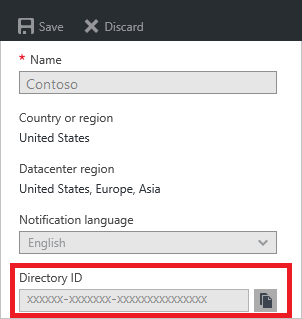

## 将应用程序分配到角色

要访问订阅中的资源，必须将应用程序分配到角色。 决定哪个角色表示应用程序的相应权限。 若要了解有关可用角色的信息，请参阅 [RBAC：内置角色](../role-based-access-control/built-in-roles.md)。

可将作用域设置为订阅、资源组或资源级别。 较低级别的作用域会继承权限。 例如，将某个应用程序添加到资源组的“读取者”角色意味着该应用程序可以读取该资源组及其包含的所有资源。

1. 导航到要将应用程序分配到的作用域级别。 例如，若要在订阅范围内分配角色，选择“订阅” 。 可改为选择资源组或资源。

    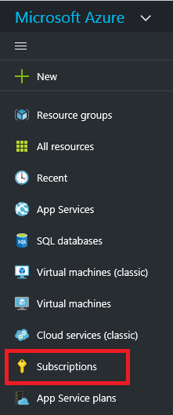

1. 选择要将应用程序分配到的特定订阅（资源组或资源）。

    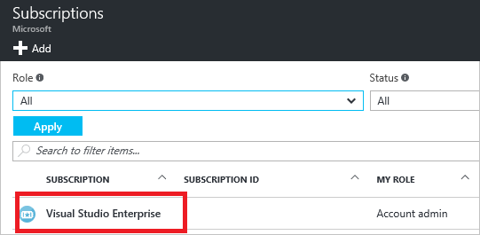

1. 选择“访问控制(IAM)”。

    

1. 选择“设置” （应用程序对象和服务主体对象）。

    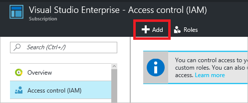

1. 选择要分配到应用程序的角色。 为了允许应用程序执行诸如**重新启动**、**启动**和**停止**实例之类的操作，必须选择**参与者**角色。 下图显示“读者”  角色。

    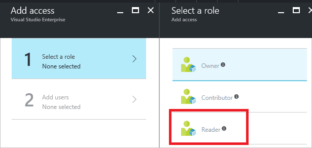

1. 默认情况下，可用选项中不显示 Azure Active Directory 应用程序。 若要查找应用程序，必须在搜索字段中输入其名称。 选择它。

    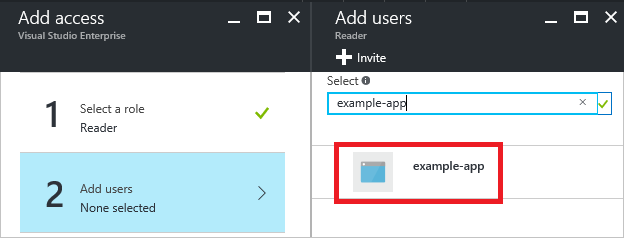

1. 选择“保存”完成角色分配。 该应用程序会显示在分配到该范围角色的用户列表中。

## 后续步骤
* 若要设置多租户应用程序，请参阅 [使用 Azure Resource Manager API 进行授权的开发人员指南](resource-manager-api-authentication.md)。
* 若要了解如何指定安全策略，请参阅 [Azure 基于角色的访问控制](../role-based-access-control/role-assignments-portal.md)。  
* 有关可对用户授予或拒绝的可用操作的列表，请参阅 [Azure 资源管理器资源提供程序操作](../role-based-access-control/resource-provider-operations.md)。

<!--Update_Description: update meta properties, wording update -->