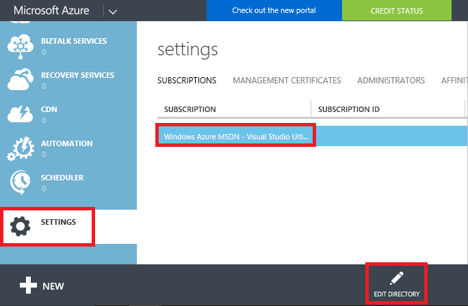
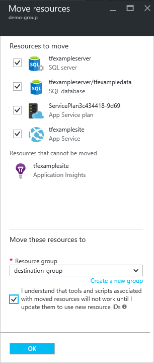
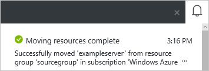

# 将资源移到新资源组或订阅中
<a id="move-resources-to-new-resource-group-or-subscription" class="xliff"></a>
本主题说明如何将资源移到新订阅或同一订阅的新资源组中。 可以使用门户、PowerShell、Azure CLI 或 REST API 移动资源。 本主题中的移动操作无需任何 Azure 支持的协助即可供使用。

移动资源时，源组和目标组将被锁定，直到移动操作完成。 在完成移动之前，将阻止对资源组执行写入和删除操作。 此锁意味着用户无法添加、更新或删除资源组中的资源，但并不意味着资源处于冻结状态。 例如，如果将 SQL Server 及其数据库移到新的资源组中，使用数据库的应用程序体验不到停机， 仍可读取和写入到数据库。 

您不能更改该资源的位置。 移动资源仅能够将其移动到新的资源组。 新的资源组可能有不同的位置，但这不会更改该资源的位置。

<!-- Not Available [Switch your Azure subscription to another offer](../billing/billing-how-to-switch-azure-offer.md) -->
> [!NOTE]
> 本文介绍如何在现有 Azure 帐户产品/服务中移动资源。
> 
> 

## 移动资源前需查看的清单
<a id="checklist-before-moving-resources" class="xliff"></a>
移动资源之前需执行的一些重要步骤。 验证这些条件可以避免错误。

1. 源订阅与目标订阅必须在同一个 [Azure Active Directory 租户](../active-directory/develop/active-directory-howto-tenant.md)中。 若要检查这两个订阅是否具有相同的租户 ID，请使用 Azure PowerShell 或 Azure CLI。

    对于 Azure PowerShell，请使用：

    ```powershell
    (Get-AzureRmSubscription -SubscriptionName "Example Subscription").TenantId
    ```

    对于 Azure CLI 2.0，请使用：

    ```azurecli
    az account show --subscription "Example Subscription" --query tenantId
    ```

    如果源和目标订阅的租户 ID 不相同，则可以尝试更改订阅的目录。 但是，此选项仅可供使用 Microsoft 帐户（而非组织帐户）登录的服务管理员使用。 若要尝试更改目录，请登录到[经典管理门户](https://manage.windowsazure.cn/)，选择“设置”，然后选择订阅。 如果“编辑目录”图标可用，请选择它以更改关联的 Azure Active Directory。 

     

    如果该图标不可用，必须联系技术支持将资源移到新租户。

2. 服务必须支持移动资源的功能。 本主题列出了哪些服务允许移动资源，哪些服务不允许移动资源。
3. 必须针对要移动的资源的资源提供程序注册目标订阅。 否则，会收到错误，指明 **未针对资源类型注册订阅**。 将资源移到新的订阅时，可能会遇到此问题，但该订阅从未配合该资源类型使用。 若要了解如何检查注册状态和注册资源提供程序，请参阅 [Resource providers and types](resource-manager-supported-services.md)（资源提供程序和类型）。

## 致电支持人员的时机
<a id="when-to-call-support" class="xliff"></a>
可通过本主题所示的自助服务操作移动大部分资源。 使用自助服务操作：

* 移动 Resource Manager 资源。
* 根据 [经典部署限制](#classic-deployment-limitations)移动经典资源。 

有以下需要时，请致电支持人员：

* 将资源移到新 Azure 帐户（和 Azure Active Directory 租户）。
* 移动经典资源，但遇到限制问题。

## <a name="services-that-support-move"></a>允许移动的服务
就目前而言，支持移动到新资源组和订阅的服务包括：

* API 管理
* 应用服务应用（Web 应用）- 请参阅[应用服务限制](#app-service-limitations)
* 自动化
* 批处理
* CDN
* 云服务 - 请参阅 [经典部署限制](#classic-deployment-limitations)
* 认知服务
* DocumentDB
* 事件中心
* HDInsight 群集 - 请参阅 [HDInsight 限制](#hdinsight-limitations)
* IoT 中心
* 密钥保管库 
* 负载均衡器
* 媒体服务
* 通知中心
* Power BI
* Redis 缓存
* 计划程序
* 服务总线
* Service Fabric
* 存储
* 存储（经典）- 请参阅[经典部署限制](#classic-deployment-limitations)
* 流分析
* SQL 数据库服务器 - 数据库和服务器必须位于同一个资源组中。 移动 SQL 服务器时，也会移动其所有数据库。
* 流量管理器
* 虚拟机 - 不支持移到新的订阅（当其证书存储在密钥保管库中时）
* 虚拟机（经典）- 请参阅[经典部署限制](#classic-deployment-limitations)
* 虚拟网络 - 当前无法移动对等虚拟网络，直到禁用了 VNet 对等互连为止。 禁用后，即可成功移动虚拟网络，然后可启用 VNet 对等互连。 此外，如果虚拟网络包含具有资源导航链接的任何子网，则虚拟网络不能移到其他订阅。 例如，当 Microsoft.Cache redis 资源部署到虚拟网络子网时，此子网具有资源导航链接。

## 不支持移动的服务
<a id="services-that-do-not-enable-move" class="xliff"></a>
目前不支持移动资源的服务包括：

* AD 混合运行状况服务
* 应用程序网关

* Express Route
* 开发测试实验室 - 支持移至同一订阅中的新资源组，但不支持跨订阅移动。
* 恢复服务保管库：也不会移动与恢复服务保管库关联的计算、网络和存储资源，请参阅 [恢复服务限制](#recovery-services-limitations)。
* “安全”
* 证书存储在密钥保管库中的虚拟机
* 带托管磁盘的虚拟机
* 虚拟网络（经典）- 请参阅[经典部署限制](#classic-deployment-limitations)

## <a name="app-service-limitations"></a>应用服务限制
使用应用服务应用时，你不能只移动应用服务计划。 若要移动应用服务应用，可以使用以下选项：

* 将该资源组中的应用服务计划以及所有其他应用服务资源移到尚无应用服务资源的新资源组。 这一要求意味着，与应用服务计划不关联的应用服务资源也必须移动。 
* 将应用移到另一个资源组中，但保留原始资源组中的所有应用服务计划。

即使应用服务计划不与应用位于同一资源组中，应用也可以正常运行。

例如，如果你的资源组包含：

* **web-a**，与 **plan-a** 相关联
* **web-b**，与 **plan-b** 相关联

你的选项包括：

* 移动 **web-a**、**plan-a**、**web-b** 和 **plan-b**
* 移动 **web-a** 和 **web-b**
* 移动 **web-a**
* 移动 **web-b**

所有其他组合都涉及保留在移动应用服务计划时不能保留的资源类型（任何应用服务资源类型）。

如果你的 Web 应用与其应用服务计划位于不同的资源组中，而你想要将二者都移到新的资源组，则必须分两步执行移动操作。 例如：

* **web-a** 位于 **web-group** 中
* **plan-a** 位于 **plan-group** 中
* 想要让 **web-a** 和 **plan-a** 位于 **combined-group** 中

若要完成此移动操作，可按以下顺序执行两个独立的移动操作：

1. 将 **web-a** 移到 **plan-group** 中
2. 将 **web-a** 和 **plan-a** 移到 **combined-group** 中。

可将应用服务证书移动到新的资源组或订阅，且不会出现任何问题。 但是，如果 Web 应用包含在外部购买并上传到应用的 SSL 证书，则必须在移动 Web 应用前删除该证书。 例如，可以执行以下步骤：

1. 从 Web 应用删除上传的证书
2. 移动 Web 应用
3. 将证书上传到 Web 应用

## <a name="recovery-services-limitations"></a>恢复服务限制
不支持移动用于使用 Azure Site Recovery 设置灾难恢复的存储、网络或计算资源。

例如，假设已设置将本地计算机复制到存储帐户 (Storage1)，并且想要受保护的计算机在故障转移到 Azure 之后显示为连接到虚拟网络 (Network1) 的虚拟机 (VM1)。 不能在同一订阅中的资源组之间或在订阅之间移动这些 Azure 资源 - Storage1、VM1 和 Network1。

## <a name="hdinsight-limitations"></a>HDInsight 限制

可以将 HDInsight 群集移到新订阅或资源组。 但是，不能跨订阅移动链接到 HDInsight 群集的网络资源（例如虚拟网络、NIC 或负载均衡器）。 此外，也无法将已附加到群集的虚拟机的 NIC 移至新资源组。

将 HDInsight 群集移至新订阅时，请先移动其他资源（例如存储帐户）。 然后移动 HDInsight 群集本身。

## <a name="classic-deployment-limitations"></a>经典部署限制
移动通过经典模型部署的资源时，其选项各不相同，具体取决于是在订阅内移动资源，还是将资源移到新的订阅。

### 同一订阅
<a id="same-subscription" class="xliff"></a>
在同一订阅内将资源从一个资源组移动到另一个资源组时，存在以下限制：

* 不能移动虚拟网络（经典）。
* 虚拟机（经典）必须与云服务一起移动。
* 移动云服务时，必须移动其所有虚拟机。
* 一次只能移动一项云服务。
* 一次只能移动一个存储帐户（经典）。
* 存储帐户（经典）与虚拟机或云服务不能在同一操作中移动。

若要将经典资源移到同一订阅内的新资源组，请通过[门户](#use-portal)、[Azure PowerShell](#use-powershell)、[Azure CLI](#use-azure-cli) 或 [REST API](#use-rest-api) 使用标准移动操作。 使用的操作应与移动 Resource Manager 资源时所用的操作相同。

### 新订阅
<a id="new-subscription" class="xliff"></a>
将资源移动到新订阅时，存在以下限制：

* 必须在同一操作中移动订阅中的所有经典资源。
* 目标订阅不得包含任何其他经典资源。
* 只能通过独立的适用于经典移动的 REST API 来请求移动。 将经典资源移到新订阅时，不能使用标准的 Resource Manager 移动命令。

若要将经典资源移动到新订阅，请使用特定于经典资源的 REST 操作。 若要使用 REST，请执行以下步骤：

1. 检查源订阅是否可以参与跨订阅移动。 使用以下操作：

    ```HTTP
    POST https://management.chinacloudapi.cn/subscriptions/{sourceSubscriptionId}/providers/Microsoft.ClassicCompute/validateSubscriptionMoveAvailability?api-version=2016-04-01
    ```

    在请求正文中包括：

    ```json
    {
        "role": "source"
    }
    ```

    验证操作的响应格式如下：

    ```json
    {
        "status": "{status}",
        "reasons": [
        "reason1",
        "reason2"
        ]
    }
    ```

2. 检查目标订阅是否可以参与跨订阅移动。 使用以下操作：

    ```HTTP
    POST https://management.chinacloudapi.cn/subscriptions/{destinationSubscriptionId}/providers/Microsoft.ClassicCompute/validateSubscriptionMoveAvailability?api-version=2016-04-01
    ```

    在请求正文中包括：

    ```json
    {
        "role": "target"
    }
    ```

    响应的格式与源订阅验证的响应格式相同。
3. 如果两个订阅都通过了验证，可使用以下操作将所有经典资源从一个订阅移动到另一个订阅：

    ```HTTP
    POST https://management.chinacloudapi.cn/subscriptions/{subscription-id}/providers/Microsoft.ClassicCompute/moveSubscriptionResources?api-version=2016-04-01
    ```

    在请求正文中包括：

    ```json
    {
        "target": "/subscriptions/{target-subscription-id}"
    }
    ```

此操作可能需要运行几分钟。 

## <a name="use-portal"></a>使用门户
若要移动资源，请选择包含这些资源的资源组，然后选择“移动”  按钮。


选择是要将资源移到新资源组还是移到新订阅。

选择要移动的资源和目标资源组。 确认需要更新这些资源的脚本，选择“确定” 。 如果在上一步中已选择“编辑订阅”图标，则还必须选择目标订阅。



在“通知” 中，可以看到移动操作正在运行。


操作完成后，你会获得结果通知。



## <a name="use-powershell"></a>使用 PowerShell
若要将现有资源移到另一个资源组或订阅，请使用 `Move-AzureRmResource` 命令。

第一个示例演示如何将一个资源移到新的资源组。

```powershell
$resource = Get-AzureRmResource -ResourceName ExampleApp -ResourceGroupName OldRG
Move-AzureRmResource -DestinationResourceGroupName NewRG -ResourceId $resource.ResourceId
```

第二个示例演示如何将多个资源移到新的资源组。

```powershell
$webapp = Get-AzureRmResource -ResourceGroupName OldRG -ResourceName ExampleSite
$plan = Get-AzureRmResource -ResourceGroupName OldRG -ResourceName ExamplePlan
Move-AzureRmResource -DestinationResourceGroupName NewRG -ResourceId $webapp.ResourceId, $plan.ResourceId
```

若要移到新订阅，请包含 `DestinationSubscriptionId` 参数的值。

系统将要求确认是否想要移动指定的资源。

```powershell
Confirm
Are you sure you want to move these resources to the resource group
'/subscriptions/{guid}/resourceGroups/newRG' the resources:

/subscriptions/{guid}/resourceGroups/destinationgroup/providers/Microsoft.Web/serverFarms/exampleplan
/subscriptions/{guid}/resourceGroups/destinationgroup/providers/Microsoft.Web/sites/examplesite
[Y] Yes  [N] No  [S] Suspend  [?] Help (default is "Y"): y
```

## <a name="use-azure-cli"></a>使用 Azure CLI 2.0
若要将现有资源移到另一个资源组或订阅，请使用 `az resource move` 命令。 提供要移动的资源的资源 ID。 可以使用以下命令获取资源 ID：

```azurecli
az resource show -g sourceGroup -n storagedemo --resource-type "Microsoft.Storage/storageAccounts" --query id
```

以下示例说明如何将存储帐户移动到新的资源组。 在 `--ids` 参数中，提供要移动的资源 ID 的空格分隔列表。

```azurecli
az resource move --destination-group newgroup --ids "/subscriptions/{guid}/resourceGroups/sourceGroup/providers/Microsoft.Storage/storageAccounts/storagedemo"
```

若要移到新订阅，请提供 `--destination-subscription-id` 参数。

## 使用 Azure CLI 1.0
<a id="use-azure-cli-10" class="xliff"></a>
若要将现有资源移到另一个资源组或订阅，请使用 `azure resource move` 命令。 提供要移动的资源的资源 ID。 可以使用以下命令获取资源 ID：

```azurecli
azure resource list -g sourceGroup --json
```

会返回以下格式：

```azurecli
[
  {
    "id": "/subscriptions/{guid}/resourceGroups/sourceGroup/providers/Microsoft.Storage/storageAccounts/storagedemo",
    "name": "storagedemo",
    "type": "Microsoft.Storage/storageAccounts",
    "location": "chinaeast",
    "tags": {},
    "kind": "Storage",
    "sku": {
      "name": "Standard_RAGRS",
      "tier": "Standard"
    }
  }
]
```

以下示例说明如何将存储帐户移动到新的资源组。 在 `-i` 参数中，提供要移动的资源 ID 的逗号分隔列表。

```azurecli
azure resource move -i "/subscriptions/{guid}/resourceGroups/sourceGroup/providers/Microsoft.Storage/storageAccounts/storagedemo" -d "destinationGroup"
```

系统将要求确认是否想要移动指定的资源。

## <a name="use-rest-api"></a>使用 REST API
若要将现有资源移到另一个资源组或订阅中，请运行：

```HTTP
POST https://management.chinacloudapi.cn/subscriptions/{source-subscription-id}/resourcegroups/{source-resource-group-name}/moveResources?api-version={api-version}
```

在请求正文中，指定目标资源组和要移动的资源。 有关移动 REST 操作的详细信息，请参阅 [移动资源](https://msdn.microsoft.com/library/azure/mt218710.aspx)。

## 后续步骤
<a id="next-steps" class="xliff"></a>
* 若要了解管理订阅所需的 PowerShell cmdlet，请参阅[将 Azure PowerShell 与 Resource Manager 配合使用](powershell-azure-resource-manager.md)。
* 若要了解管理订阅所需的 Azure CLI 命令，请参阅[将 Azure CLI 与 Resource Manager 配合使用](xplat-cli-azure-resource-manager.md)。
* 若要了解管理订阅所需的门户功能，请参阅[使用 Azure 门户管理资源](resource-group-portal.md)。
* 若要了解如何向资源应用逻辑组织，请参阅[使用标记组织资源](resource-group-using-tags.md)。