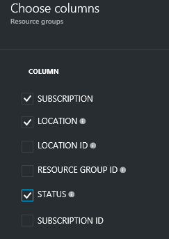
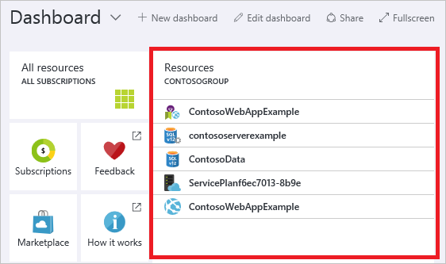
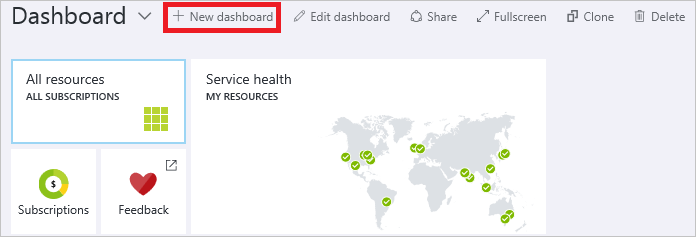
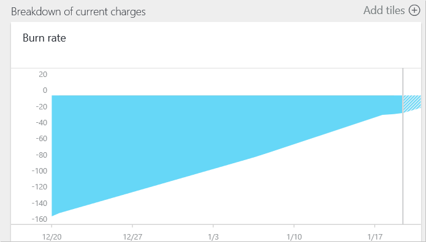
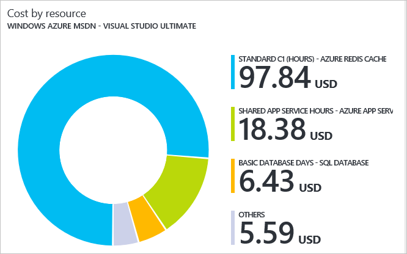

# 通过门户管理 Azure 资源

本文说明如何将 [Azure 门户](https://portal.azure.cn)与 [Azure 资源管理器](resource-group-overview.md)配合使用来管理 Azure 资源。 若要了解如何通过门户部署资源，请参阅[使用资源管理器模板和 Azure 门户部署资源](resource-group-template-deploy-portal.md)。

##  管理资源组

资源组是用于保存 Azure 解决方案相关资源的容器。 资源组可以包含解决方案的所有资源，也可以只包含想要作为组来管理的资源。 根据对组织有利的原则，决定如何将资源分配到资源组。 通常可将共享相同生命周期的资源添加到同一资源组，以便将其作为一个组轻松部署、更新和删除。 

资源组存储与资源有关的元数据。 因此，当指定资源组的位置时，也就指定了元数据的存储位置。 出于合规性原因，可能需要确保数据存储在某一特定区域。

1. 若要查看订阅中的所有资源组，请选择“资源组”。

    
2. 若要创建空资源组，请选择“添加” 。

    
3. 提供新资源组的名称和位置。 选择“创建” 。

    
4. 可能需要选择“刷新”  以查看最近创建的资源组。

    
5. 若要自定义显示的资源组信息，请选择“列” 。

    
6. 选择要添加的列，并选择“更新” 。

    
7. 要了解如何将资源部署到新资源组，请参阅 [Deploy resources with Resource Manager templates and Azure portal](resource-group-template-deploy-portal.md)（使用资源管理器模板和 Azure 门户部署资源）。
8. 为了快速访问资源组，可以将资源组固定到仪表板上。

    
9. 仪表板显示资源组及其资源。 可以选择资源组或其任何资源以导航到该项目。

    

## 标记资源
可以将标记应用到资源组和资源，以按照逻辑组织资产。 有关使用标记的信息，请参阅[使用标记组织 Azure 资源](resource-group-using-tags.md)。

[!INCLUDE [resource-manager-tag-resource](../../includes/resource-manager-tag-resources.md)]

## 监视资源
选择一个资源时，门户会显示用于监视该资源类型的默认图形和表。

1. 选择资源，并注意“监视”  部分。 它包括与资源类型相关的图形。 下图显示存储帐户的默认监视数据。

    
2. 选择某一部分上方的省略号 (...) 即可将该部分固定到仪表板上。 还可以自定义该部分的大小，或完全删除它。 下图显示如何固定、自定义或删除 CPU 和内存部分。

    
3. 将该部分固定到仪表板后，会在仪表板上看到摘要。 并且，选择它后可立即看到关于该数据的详细信息。

    
4. 若要完全自定义通过门户监视的数据，请导航到默认仪表板，并选择“新建仪表板” 。

    
5. 指定新仪表板的名称，然后将磁贴拖动到仪表板上。 这些磁贴通过不同选项进行筛选。

    

    若要了解如何使用仪表板，请参阅[在 Azure 门户中创建和共享仪表板](../azure-portal/azure-portal-dashboards.md)。

##  管理资源
在门户中查看某一资源时，可以看到用于管理该特定资源的选项。

通过这些选项，可以执行一些操作，如启动和停止虚拟机，或重新配置虚拟机的属性。

## 移动资源
如果需要将资源移到另一个资源组或另一个订阅，请参阅[将资源移到新的资源组或订阅](resource-group-move-resources.md)。

## 锁定资源
可以锁定订阅、资源组或资源，以防止组织中的其他用户意外删除或修改关键资源。 有关详细信息，请参阅 [使用 Azure Resource Manager 锁定资源](resource-group-lock-resources.md)。

[!INCLUDE [resource-manager-lock-resources](../../includes/resource-manager-lock-resources.md)]

## 查看订阅和成本
可以查看有关订阅的信息以及所有资源的汇总成本。 选择“订阅”以及要查看的订阅。 可能只有一个可供选择的订阅。

可以看到消耗率。

以及按资源类型划分的成本明细。

## 导出模板
设置资源组后，你可能想要查看资源组的 Resource Manager 模板。 导出模板有两个好处：

1. 由于模板包含所有完整的基础结构，因此将来可以轻松地自动完成解决方案的部署。
2. 可以查看代表解决方案的 JavaScript 对象表示法 (JSON)，以此熟悉模板语法。

有关分步指导，请参阅[从现有资源导出 Azure Resource Manager 模板](resource-manager-export-template.md)。

## 删除资源组或资源
删除资源组会删除其包含的所有资源。 也可以删除资源组中的单个资源。 删除资源组时要格外小心。 该资源组可能包含其他资源组中的资源所依赖的资源。

## 后续步骤
* 若要查看活动日志，请参阅[使用 Resource Manager 进行审核操作](resource-group-audit.md)。
* 若要查看有关部署的详细信息，请参阅[查看部署操作](resource-manager-deployment-operations.md)。
* 若要通过门户部署资源，请参阅[使用 Resource Manager 模板和 Azure 门户部署资源](resource-group-template-deploy-portal.md)。
* 若要管理对资源的访问，请参阅[使用角色分配管理对 Azure 订阅资源的访问](../active-directory/role-based-access-control-configure.md)。
* 有关企业可如何使用 Resource Manager 有效管理订阅的指南，请参阅 [Azure 企业基架 - 出于合规目的监管订阅](resource-manager-subscription-governance.md)。

<!--Update_Description: update meta properties, wording update -->