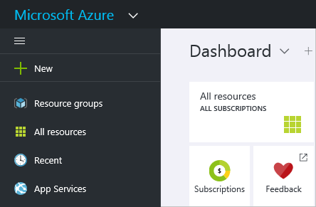
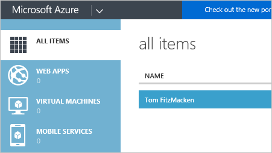

# <a name="azure-resource-manager-vs-classic-deployment-understand-deployment-models-and-the-state-of-your-resources"></a>Azure Resource Manager 与经典部署：了解部署模型和资源状态
本主题介绍 Azure Resource Manager 部署模型和经典部署模型、资源的状态，以及使用不同模型来部署资源的原因。 Resource Manager 部署模型和经典部署模型代表两种不同的 Azure 解决方案部署和管理方式。 可以通过两种不同的 API 集使用这两种模型，已部署的资源可能包含重大差异。 这两个模型不是完全兼容的。 本主题介绍这些差异。

为了简化资源部署和管理，Azure 建议对所有新资源使用 Resource Manager。 Azure 建议在可能情况下，通过 Resource Manager 重新部署现有资源。

如果不熟悉 Resource Manager，请先查看 [Azure Resource Manager 概述](./resource-group-overview.md)中定义的术语。

## <a name="history-of-the-deployment-models"></a>部署模型的历史
Azure 最初只提供经典部署模型。 在此模型中，每个资源彼此独立；无法将相关的资源组合在一起。 因此，必须手动跟踪构成解决方案或应用程序的资源 ，并记得以协调的方式管理。 部署解决方案有两种方式：通过经典门户单独创建每个资源；或创建一个脚本，以正确的顺序部署所有资源。 若要删除解决方案，必须逐个删除每个资源。 无法轻松应用和更新相关资源的访问控制策略。 最后，无法将标记应用到资源，因此无法使用有助于监视资源和管理计费的术语来标记资源。

Azure 在 2014 年引入了 Resource Manager，增加了资源组这一概念。 资源组是一种容器，专门容纳共享同一生命周期的资源。 Resource Manager 部署模型具有几大优点：

* 用户可以采用群组形式部署、管理和监视解决方案的所有服务，无需单独处理。
* 可以在解决方案的整个生命周期内重复部署该解决方案，确保以一致的状态部署资源。
* 可以将访问控制应用到资源组中的所有资源。将新资源添加到资源组时，会自动应用这些策略。
* 可以将标记应用到资源，以逻辑方式组织订阅中的所有资源。
* 可以使用 JavaScript 对象表示法 (JSON) 来定义解决方案的基础结构。 JSON 文件称为 Resource Manager 模板。
* 可以定义各资源之间的依赖关系，使其按正确的顺序进行部署。

添加 Resource Manager 时，所有资源都追溯性地添加到默认资源组。 如果现在通过经典部署创建资源，无论部署时指定资源组与否，资源都会在该服务默认的资源组中自动创建。 但是，资源位于资源组内并不意味着其已转换为 Resource Manager 模型。 下一部分会介绍每个服务如何处理这两种部署模型。 

## <a name="understand-support-for-the-models"></a>了解对模型的支持
确定用于资源的部署模型时，请注意以下三种方案：

1. 服务支持 Resource Manager 且只提供单个类型。
2. 服务支持 Resource Manager，但提供两个类型 - 一个用于 Resource Manager 部署，一个用于经典部署。 此方案只适用于虚拟机、存储帐户和虚拟网络。
3. 服务不支持 Resource Manager。

若要查明服务是否支持 Resource Manager，请参阅 [Resource Manager 支持的提供程序](./resource-manager-supported-services.md)。

如果要使用的服务不支持 Resource Manager，则必须继续使用经典部署。

如果服务支持 Resource Manager 且 **不是** 虚拟机、存储帐户或虚拟网络，则可以直接使用 Resource Manager。

对于虚拟机、存储帐户和虚拟网络，如果资源是通过经典部署创建的，则必须继续通过经典操作对其进行操作。 如果虚拟机、存储帐户或虚拟网络是通过 Resource Manager 部署创建的，则必须继续使用 Resource Manager 操作。 如果订阅包含通过 Resource Manager 部署和经典部署创建的各种资源，则可能不容易进行这种区分。 此资源组合会产生意外的结果，因为资源不支持相同的操作。

在某些情况下，Resource Manager 命令可以检索通过经典部署创建的资源信息，或者执行管理任务（例如将经典资源移到另一个资源组）， 但这些情况并不意味着该类型支持 Resource Manager 操作。 例如，假设某个资源组包含使用经典部署创建的虚拟机。 如果运行以下 Resource Manager PowerShell 命令：

```powershell
Get-AzureRmResource -ResourceGroupName ExampleGroup -ResourceType Microsoft.ClassicCompute/virtualMachines
```

这会返回虚拟机：

```powershell
Name              : ExampleClassicVM
ResourceId        : /subscriptions/{guid}/resourceGroups/ExampleGroup/providers/Microsoft.ClassicCompute/virtualMachines/ExampleClassicVM
ResourceName      : ExampleClassicVM
ResourceType      : Microsoft.ClassicCompute/virtualMachines
ResourceGroupName : ExampleGroup
Location          : chinanorth
SubscriptionId    : {guid}
```

但是，Resource Manager cmdlet **Get-AzureRmVM** 仅返回通过 Resource Manager 部署的虚拟机。 以下命令不返回通过经典部署创建的虚拟机。

```powershell
Get-AzureRmVM -ResourceGroupName ExampleGroup
```

只有通过 Resource Manager 创建的资源才支持标记。 您不能将标记应用到经典资源。

## <a name="resource-manager-characteristics"></a>Resource Manager 的特征
为了更好地理解这两个模型，请看看 Resource Manager 类型的特征：

* 通过 [Azure 门户](https://portal.azure.cn/)创建。

    

    对于计算、存储和网络资源，你可以选择使用 Resource Manager 或经典部署。 选择“Resource Manager”。

    
* 使用 Azure PowerShell cmdlet 的 Resource Manager 版本创建。 这些命令采用 *Verb-AzureRmNoun*格式。

    ```powershell
    New-AzureRmResourceGroupDeployment
    ```
* 通过用于 REST 操作的 [Azure Resource Manager REST API](https://docs.microsoft.com/rest/api/resources/) 创建。
* 通过在 **arm** 模式下运行的 Azure CLI 命令创建。

    ```azurecli
    azure config mode arm
    azure group deployment create 
    ```
* 资源类型的名称中不包括 **(经典)**。 下图显示了**存储帐户**类型。

    

## <a name="classic-deployment-characteristics"></a>经典部署特性
您也可能知道经典部署模型就是服务管理模型。

在经典部署模型中创建的资源具有以下共同特性：

* 通过[经典门户](https://manage.windowsazure.cn)创建

    

    或者，通过 Azure 门户创建，然后指定**经典**部署（适用于计算、存储和网络）。

     
* 通过 Azure PowerShell cmdlet 的服务管理版本创建。 这些命令名称采用 *Verb-AzureNoun*格式。

    ```powershell
    New-AzureVM 
    ```
* 通过用于 REST 操作的 [服务管理 REST API](https://msdn.microsoft.com/zh-cn/library/azure/ee460799.aspx) 创建。
* 通过在 **asm** 模式下运行的 Azure CLI 命令创建。

    ```azurecli
    azure config mode asm
    azure vm create 
    ```
* 资源类型的名称中包括 **(经典)**。 下图显示了**存储帐户(经典)** 类型。

    

可以使用 Azure 门户来管理通过经典部署创建的资源。

## <a name="changes-for-compute-network-and-storage"></a>对计算、网络和存储的更改
下图显示通过 Resource Manager 部署的计算、网络和存储资源。


请注意资源之间的以下关系：

* 所有资源存在于一个资源组中。
* 虚拟机依赖在存储资源提供程序中定义的具体存储帐户，在 Blob 存储中存储其磁盘（必需）。
* 虚拟机引用在网络资源提供程序中定义的具体 NIC（必需）和在计算资源提供程序中定义的可用性集（可选）。
* NIC 引用虚拟机的指定 IP 地址（必需）、虚拟机的虚拟网络的子网（必需）和网络安全组（可选）。
* 虚拟网络内的子网引用网络安全组（可选）。
* 负载均衡器实例引用后端 IP 地址池，包括虚拟机的 NIC（可选），并引用负载均衡器的公共或专用 IP 地址（可选）。

以下是经典部署的组件及其关系：


托管虚拟机的经典解决方案包括：

* 一项必不可少的云服务，用作宿主虚拟机的容器（计算）。 虚拟机自动配备一个网络接口卡 (NIC) 以及由 Azure 分配的 IP 地址。 此外，云服务包含一个外部负载均衡器实例、一个公共 IP 地址以及若干默认终结点，以支持远程桌面、针对 Windows 虚拟机的远程 PowerShell 流量和针对 Linux 虚拟机的 Secure Shell (SSH) 流量。
* 一个必不可少的存储帐户，存储虚拟机的 VHD，包括操作系统、临时文件和附加的数据磁盘（存储）。
* 一个可选的虚拟网络，用作额外的容器，可以在其中创建子网结构并指定虚拟机所在的子网（网络）。

下表说明了计算、网络和存储资源提供程序交互方式的变化：

| 项目 | 经典 | Resource Manager |
| --- | --- | --- |
| 面向虚拟机的云服务 |云服务是一个容器，用于容纳要求平台可用性和负载均衡的虚拟机。 |使用新模型，云服务不再是创建虚拟机所必需的对象。 |
| 虚拟网络 |对于虚拟机来说，虚拟网络是可选的。 虚拟网络（如果包括）不能通过 Resource Manager 进行部署。 |虚拟机需要已通过 Resource Manager 部署的虚拟网络。 |
| 存储帐户 |虚拟机需要一个存储帐户，存储操作系统、临时文件和附加数据磁盘的 VHD。 |虚拟机需要一个存储帐户，在 Blob 存储中存储其磁盘。 |
| 可用性集 |通过在虚拟机上配置相同的“AvailabilitySetName”来指出平台的可用性。 容错域的最大数量为 2。 |可用性集是 Microsoft.Compute 提供程序提供的一个资源。 要求高可用性的虚拟机必须包含在可用性集中。 现在，容错域的最大数量为 3。 |
| 地缘组 |创建虚拟网络需要地缘组。 但是，随着区域虚拟网络的引入，便不再需要地缘组了。 |为了简单起见，地缘组概念不再存在于通过 Azure Resource Manager 提供的 API 中。 |
| 负载均衡 |云服务的创建为部署的虚拟机提供了一个隐式负载均衡器。 |负载均衡器是 Microsoft.Network 提供程序提供的一个资源。 需要负载均衡的虚拟机的主网络接口应该引用负载均衡器。 负载均衡器既可以是内部的，也可以是外部的。 负载均衡器实例引用后端 IP 地址池，包括虚拟机的 NIC（可选），引用负载均衡器的公共或专用 IP 地址（可选）。 [了解详细信息。](../virtual-network/resource-groups-networking.md) |
| 虚拟 IP 地址 |虚拟机添加到云服务后，云服务获得默认 VIP（虚拟 IP 地址）。 虚拟 IP 地址是与隐式负载均衡器相关联的地址。 |公共 IP 地址是 Microsoft.Network 提供程序提供的一个资源。 公共 IP 地址既可以是静态（保留）的，也可以是动态的。 可以将动态公共 IP 分配到一个负载均衡器。 可以使用安全组保护公共 IP。 |
| 保留 IP 地址 |可以在 Azure 中保留一个 IP 地址并将其与一个云服务关联在一起，以确保该 IP 地址具有粘性。 |可以在“静态”模式下创建公共 IP 地址，并且该地址提供与“保留 IP 地址”相同的功能。 目前，静态公共 IP 只能分配到一个负载均衡器。 |
| 每个 VM 一个公共 IP 地址 (PIP) |公共 IP 地址也可以直接关联到 VM。 |公共 IP 地址是 Microsoft.Network 提供程序提供的一个资源。 公共 IP 地址既可以是静态（保留）的，也可以是动态的。 但是，目前只有动态公共 IP 可分配到网络接口，使每个 VM 获得一个公共 IP。 |
| 终结点 |需要在虚拟机上配置输入终结点，用于打开某些端口的连接。 这是通过设置输入终结点来连接到虚拟机的一个常见模式。 |可以在负载均衡器上配置入站 NAT 规则，实现在具体端口上启用终结点以连接到虚拟机的相同功能。 |
| DNS 名称 |云服务会得到一个隐式的全局唯一 DNS 名称。 例如： `mycoffeeshop.chinacloudapp.cn`。 |DNS 名称是可在一个公共 IP 地址资源上指定的可选参数。 FQDN 采用的格式为 `<domainlabel>.<region>.chinacloudapp.cn`。 |
| 网络接口 |作为虚拟机的网络配置定义主网络接口和辅助网络接口及其属性。 |网络接口是 Microsoft.Network 提供程序提供的一个资源。 网络接口的生命周期与虚拟机无关。 它引用虚拟机的分配 IP 地址（必需）、虚拟机虚拟网络的子网（必需）和网络安全组（可选）。 |

若要了解如何从不同部署模型连接虚拟网络，请参阅[从门户中的不同部署模型中连接虚拟网络](../vpn-gateway/vpn-gateway-connect-different-deployment-models-portal.md)。

## <a name="migrate-from-classic-to-resource-manager"></a>从经典部署迁移到 Resource Manager 部署
如果已准备好将资源从经典部署迁移到 Resource Manager 部署，请参阅：

1. [有关平台支持的从经典部署模型到 Azure Resource Manager 部署模型的迁移的技术深入探讨](../virtual-machines/virtual-machines-windows-migration-classic-resource-manager-deep-dive.md)
2. [平台支持的从经典部署模型到 Azure Resource Manager 部署模型的 IaaS 资源迁移](../virtual-machines/virtual-machines-windows-migration-classic-resource-manager.md)
3. [使用 Azure PowerShell 将 IaaS 资源从经典部署模型迁移到 Azure Resource Manager 部署模型](../virtual-machines/virtual-machines-windows-ps-migration-classic-resource-manager.md)
4. [使用 Azure CLI 将 IaaS 资源从经典部署模型迁移到 Azure Resource Manager 部署模型](../virtual-machines/virtual-machines-linux-cli-migration-classic-resource-manager.md)

## <a name="frequently-asked-questions"></a>常见问题
**能否使用 Azure Resource Manager 创建一个虚拟机，将其部署在使用经典部署创建的虚拟网络中？**

此操作不受支持。 不能使用 Azure Resource Manager 将虚拟机部署到使用经典部署创建的虚拟网络中。

**可以使用 Azure Resource Manager 从使用 Azure 服务管理 API 创建的用户映像创建虚拟机吗？**

此操作不受支持。 但是，可以从使用服务管理 API 创建的存储帐户将 VHD 文件复制并添加到通过 Azure Resource Manager 创建的新帐户中。

**对订阅的配额有何影响？**

通过 Azure Resource Manager 创建的虚拟机、虚拟网络和存储帐户的配额与其他配额是分开的。 每个订阅将获取配额以使用新的 API 创建资源。 可以在[此处](../azure-subscription-service-limits.md)了解有关额外配额的详细信息。

**可以通过 Resource Manager API 继续使用自动化脚本来预配虚拟机、虚拟网络、存储帐户吗？**

已经构建的所有自动化和脚本继续适用于在 Azure 服务管理模式下创建的现有虚拟机和虚拟网络。 然而，必须更新这些脚本以使用新的架构，通过 Resource Manager 模式来创建相同的资源。

**在哪里可以找到 Azure Resource Manager 模板的示例？**

可以在 [Azure Resource Manager 快速入门模板](https://azure.microsoft.com/zh-cn/documentation/templates/)中找到一系列综合的初学者模板。

## <a name="next-steps"></a>后续步骤
* 若要演练如何创建用于定义虚拟机、存储帐户和虚拟网络的模板，请参阅 [Resource Manager 模板演练](resource-manager-template-walkthrough.md)。
* 若要查看用于部署模板的命令，请参阅[使用 Azure Resource Manager 模板部署应用程序](./resource-group-template-deploy.md)。
