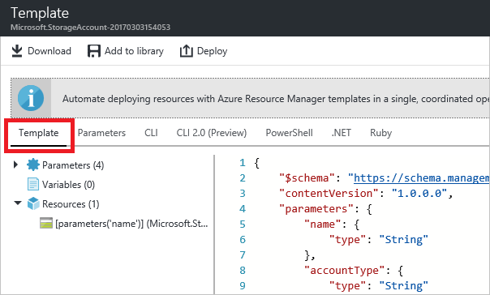

# 从现有资源导出 Azure 资源管理器模板
本文介绍如何从订阅中的现有资源导出 Resource Manager 模板。 可以使用该生成的模板更好地了解模板语法。

可以通过两种方式来导出模板：

* 可以导出用于部署的实际模板。 导出的模板中包括的所有参数和变量与原始模板中显示的完全一样。 在已通过门户部署资源的情况下，若需了解如何通过模板来创建这些资源，则可使用此方法。 此模板可随时使用。 
* 可以导出**已生成的表示资源组当前状态的模板**。 导出的模板不以任何已用于部署的模板为依据。 它创建的模板是资源组的“快照”或“备份”。 导出的模板会有许多硬编码的值，其参数可能没有定义的那么多。 使用此选项可将资源重新部署到同一资源组。 若要将此模板用于其他资源组，可能需要对其进行大幅修改。

本文通过门户展示了这两种方法。

## 部署资源
让我们开始将资源部署到 Azure，以便将其用作模板导出。 如果订阅中已有要导出到模板的资源组，则可跳过此部分。 本文剩余部分假定你已部署了本部分中介绍的 Web 应用和 SQL 数据库解决方案。 如果使用其他解决方案，则体验可能会稍有不同，但导出模板的步骤是相同的。 

1. 在 [Azure 门户](https://portal.azure.cn)中，选择“创建资源”。

    
2. 搜索“Web 应用 + SQL”，并在可用选项中选择它。

    

3. 选择“创建” 。

    

4. 为 Web 应用和 SQL 数据库提供所需值。 选择“创建” 。

    

部署可能需要一分钟的时间。 部署完成后，订阅将包含解决方案。

## 在部署历史记录中查看模板
1. 转到新资源组的资源组。 可以看到，门户中显示了上次部署的结果。 选择此链接。

    
2. 可以看到该组的部署历史记录。 在本例中，门户可能只列出了一个部署。 选择此部署。

    
3. 门户会显示部署摘要。 摘要包括此部署及其操作的状态，以及为参数提供的值。 若要查看用于部署的模板，请选择“查看模板”。

    
4. Resource Manager 检索以下七个文件：

    1. **模板** - 定义解决方案基础结构的模板。 通过门户创建存储帐户时，Resource Manager 使用模板来部署该存储帐户，并保存该模板供将来参考。
    2. **参数** - 可用于在部署过程中传入值的参数文件。 它包含你在首次部署时提供的值。 重新部署模板时，可以更改这其中的任何值。
    3. **CLI** - 可用于部署模板的 Azure CLI 脚本文件。
    4. **PowerShell** - 可用于部署该模板的 Azure PowerShell 脚本文件。
    5. **.NET** - 可用于部署该模板的 .NET 类。
    6. **Ruby** - 可用于部署模板的 Ruby 类。

    默认情况下，门户会显示模板。

    

事实上，创建 Web 应用和 SQL 数据库时使用的就是此模板。 请注意，可以使用该模板包含的参数在部署时提供不同的值。 若要详细了解模板的结构，请参阅 [Authoring Azure Resource Manager templates](resource-group-authoring-templates.md)（创作 Azure Resource Manager 模板）。

## 从资源组导出模板
如果已手动更改了资源或将资源添加到多个部署中，则从部署历史记录中检索模板不能反映资源组的当前状态。 本部分介绍如何导出反映资源组当前状态的模板。 它用作资源组的快照，可用来重新部署到同一资源组。 若要将导出的模板用于其他解决方案，必须大幅修改它。

> [!NOTE]
> 无法导出包含超过 200 项资源的资源组模板。
> 
> 

1. 若要查看资源组的模板，请选择“自动化脚本”。

    

    资源管理器会评估资源组中的资源，并为这些资源生成一个模板。 并非所有资源类型都支持导出模板功能。 可能会出现一个错误，指出导出存在问题。 [修复导出问题](#fix-export-issues) 部分介绍了如何处理这些问题。
2. 将会再次出现六个可用于重新部署解决方案的文件。 但是，这一次模板稍有不同。 请注意，生成的模板包含的参数少于前一部分的模板所包含的。 另外，在此模板中，许多值（例如位置和 SKU 值）是硬编码的，并不接受参数值。 在重用该模板之前，可能需要对其进行编辑，以便更好地使用参数。 

3. 可通过几个选项继续使用此模板。 可以下载模板，并通过 JSON 编辑器在本地使用该模板。 
    <!-- Not Available on Add library and work on it through the portal-->

    如果习惯使用 [VS Code](https://code.visualstudio.com/) 或 [Visual Studio](vs-azure-tools-resource-groups-deployment-projects-create-deploy.md) 等 JSON 编辑器，建议本地下载模板，并使用相应编辑器。 若要在本地使用，请选择“下载”。

    

    <!-- Not Available on  **Add to library**.--> <!-- Not Available on  When adding a template to the library-->
   <!-- Not Available on  select **More services**, type **Templates** to filter results, select **Templates**-->
<!-- Not Available on  Select the template with the name you saved-->

<!-- Not Available on  ## Customize the template-->
<!-- Not Available on Template(Preview)-->

## 修复导出问题
并非所有资源类型都支持导出模板功能。 仅当从资源组导出（而不是从部署历史记录导出）时，才会看到导出问题。 如果上一个部署能够准确地代表资源组的当前状态，则应从部署历史记录而非资源组中导出模板。 只有在已更改资源组且更改未在单个模板中定义时，才应从资源组导出。

若要解决导出问题，请手动将缺少的资源添加回模板中。 错误消息内指出了无法导出的资源类型。 请在[模板引用](https://docs.microsoft.com/zh-cn/azure/templates/)中查找该资源类型。 例如，若要手动添加虚拟网络网关，请参阅 [Microsoft.Network/virtualNetworkGateways 模板引用](https://docs.microsoft.com/zh-cn/azure/templates/microsoft.network/virtualnetworkgateways)。 模板参考文档中提供了用于将资源添加到模板的 JSON。

获取资源的 JSON 格式后，需要获取资源值。 可以在 REST API 中对资源类型使用 GET 操作，从而查看资源值。 例如，若要获取虚拟网络网关值，请参阅[虚拟网络网关 - Get](https://docs.microsoft.com/rest/api/network-gateway/virtualnetworkgateways/get)。

## 后续步骤

* 可通过 [PowerShell](resource-group-template-deploy.md)、[Azure CLI](resource-group-template-deploy-cli.md) 或 [REST API](resource-group-template-deploy-rest.md) 部署模板。
* 若要了解如何通过 PowerShell 导出模板，请参阅[使用 PowerShell 导出 Azure 资源管理器模板](resource-manager-export-template-powershell.md)。
* 若要了解如何通过 Azure CLI 导出模板，请参阅[使用 Azure CLI 导出 Azure 资源管理器模板](resource-manager-export-template-cli.md)。

<!--Update_Description: update meta properties, update link, wording update -->