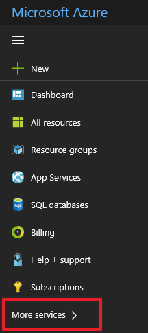

# <a name="azure-resource-providers-and-types"></a>Azure 资源提供程序和类型

部署资源时，经常需要检索有关资源提供程序和类型的信息。 在本文中，学习如何：

* 查看 Azure 中的所有资源提供程序
* 检查资源提供程序的注册状态
* 注册资源提供程序
* 查看资源提供程序的资源类型
* 查看资源类型的有效位置
* 查看资源类型的有效 API 版本

可以通过 Azure 门户、Azure PowerShell 或 Azure CLI 执行这些步骤。

## <a name="azure-portal"></a>Azure 门户

查看所有资源提供程序和订阅的注册状态：

1. 登录到 [Azure 门户](https://portal.azure.cn)。
2. 选择“所有服务”。

    
3. 在“所有服务”框中，输入“订阅”，然后选择“订阅”。
4. 从订阅列表中选择订阅进行查看。
5. 选择“资源提供程序”并查看可用的资源提供程序列表。

    

6. 通过注册资源提供程序，将订阅配置为使用资源提供程序。 注册的作用域始终是订阅。 默认情况下，将自动注册许多资源提供程序。 但可能需要手动注册某些资源提供程序。 若要注册资源提供程序，必须具备为资源提供程序执行 `/register/action` 操作的权限。 此操作包含在“参与者”和“所有者”角色中。 若要注册资源提供程序，请选择“注册”。 在上一屏幕截图中，针对 **Microsoft.Batch** 突出显示了“注册”链接。

   <!--MOONCAKE CUSTOMIZED: Microsoft.Batch to replace Microsoft.Blueprint--> 

    当订阅中仍有某个资源提供程序的资源类型时，不能注销该资源提供程序。

查看特定资源提供程序的信息：

1. 登录到 [Azure 门户](https://portal.azure.cn)。
2. 选择“所有服务”。

    

3. 在“所有服务”框中，输入“资源浏览器”，然后选择“资源浏览器”。
4. 通过选择向右箭头来展开“提供程序”。

    

5. 展开要查看的资源提供程序和资源类型。

    

6. 所有区域都支持 Resource Manager，但部署的资源可能无法在所有区域中受到支持。 此外，订阅可能存在一些限制，以防止用户使用某些支持该资源的区域。 资源浏览器将显示该资源类型的有效位置。

    

7. API 版本对应于资源提供程序发布的 REST API 操作版本。 资源提供程序启用新功能时，会发布 REST API 的新版本。 资源浏览器将显示该资源类型的有效 API 版本。

    

## <a name="azure-powershell"></a>Azure PowerShell

[!INCLUDE [updated-for-az](../../includes/updated-for-az.md)]

若要查看 Azure 中的所有资源提供程序和订阅的注册状态，请使用：

```azurepowershell
Get-AzResourceProvider -ListAvailable | Select-Object ProviderNamespace, RegistrationState
```

这会返回类似于下面的结果：

```powershell
ProviderNamespace                RegistrationState
-------------------------------- ------------------
Microsoft.ClassicCompute         Registered
Microsoft.ClassicNetwork         Registered
Microsoft.ClassicStorage         Registered
Microsoft.CognitiveServices      Registered
...
```

通过注册资源提供程序来配置订阅，以供资源提供程序使用。 注册的作用域始终是订阅。 默认情况下，将自动注册许多资源提供程序。 但可能需要手动注册某些资源提供程序。 若要注册资源提供程序，必须具备为资源提供程序执行 `/register/action` 操作的权限。 此操作包含在“参与者”和“所有者”角色中。

```azurepowershell
Register-AzResourceProvider -ProviderNamespace Microsoft.Batch
```

这会返回类似于下面的结果：

```powershell
ProviderNamespace : Microsoft.Batch
RegistrationState : Registering
ResourceTypes     : {batchAccounts, operations, locations, locations/quotas}
Locations         : {China North, China East, China East 2, China North 2}
```

当订阅中仍有某个资源提供程序的资源类型时，不能注销该资源提供程序。

若要查看特定资源提供程序的信息，请使用：

```azurepowershell
Get-AzResourceProvider -ProviderNamespace Microsoft.Batch
```

这会返回类似于以下的结果：

```powershell
{ProviderNamespace : Microsoft.Batch
RegistrationState : Registered
ResourceTypes     : {batchAccounts}
Locations         : {China North, China East, China East 2, China North 2}

...
```

若要查看资源提供程序的资源类型，请使用：

```azurepowershell
(Get-AzResourceProvider -ProviderNamespace Microsoft.Batch).ResourceTypes.ResourceTypeName
```

返回：

```powershell
batchAccounts
operations
locations
locations/quotas
```

API 版本对应于资源提供程序发布的 REST API 操作版本。 资源提供程序启用新功能时，会发布 REST API 的新版本。

若要获取资源类型的可用 API 版本，请使用：

```azurepowershell
((Get-AzResourceProvider -ProviderNamespace Microsoft.Batch).ResourceTypes | Where-Object ResourceTypeName -eq batchAccounts).ApiVersions
```

返回：

```powershell
2017-05-01
2017-01-01
2015-12-01
2015-09-01
2015-07-01
```

所有区域都支持 Resource Manager，但部署的资源可能无法在所有区域中受到支持。 此外，订阅可能存在一些限制，以防止用户使用某些支持该资源的区域。

若要获取资源类型支持的位置，请使用：

```azurepowershell
((Get-AzResourceProvider -ProviderNamespace Microsoft.Batch).ResourceTypes | Where-Object ResourceTypeName -eq batchAccounts).Locations
```

返回：

```powershell
China North
China East
China East 2
China North 2
```

## <a name="azure-cli"></a>Azure CLI

若要查看 Azure 中的所有资源提供程序和订阅的注册状态，请使用：

```azurecli
az provider list --query "[].{Provider:namespace, Status:registrationState}" --out table
```

这会返回类似于下面的结果：

```azurecli
Provider                         Status
-------------------------------- ----------------
Microsoft.ClassicCompute         Registered
Microsoft.ClassicNetwork         Registered
Microsoft.ClassicStorage         Registered
Microsoft.CognitiveServices      Registered
...
```

通过注册资源提供程序来配置订阅，以供资源提供程序使用。 注册的作用域始终是订阅。 默认情况下，将自动注册许多资源提供程序。 但可能需要手动注册某些资源提供程序。 若要注册资源提供程序，必须具备为资源提供程序执行 `/register/action` 操作的权限。 此操作包含在“参与者”和“所有者”角色中。

```azurecli
az provider register --namespace Microsoft.Batch
```

这将返回“注册正在进行中”的信息。

当订阅中仍有某个资源提供程序的资源类型时，不能注销该资源提供程序。

若要查看特定资源提供程序的信息，请使用：

```azurecli
az provider show --namespace Microsoft.Batch
```

这会返回类似于以下的结果：

```azurecli
{
    "id": "/subscriptions/####-####/providers/Microsoft.Batch",
    "namespace": "Microsoft.Batch",
    "registrationsState": "Registering",
    "resourceTypes:" [
        ...
    ]
}
```

若要查看资源提供程序的资源类型，请使用：

```azurecli
az provider show --namespace Microsoft.Batch --query "resourceTypes[*].resourceType" --out table
```

返回：

```azurecli
Result
---------------
batchAccounts
operations
locations
locations/quotas
```

API 版本对应于资源提供程序发布的 REST API 操作版本。 资源提供程序启用新功能时，会发布 REST API 的新版本。

若要获取资源类型的可用 API 版本，请使用：

```azurecli
az provider show --namespace Microsoft.Batch --query "resourceTypes[?resourceType=='batchAccounts'].apiVersions | [0]" --out table
```

返回：

```azurecli
Result
---------------
2017-05-01
2017-01-01
2015-12-01
2015-09-01
2015-07-01
```

所有区域都支持 Resource Manager，但部署的资源可能无法在所有区域中受到支持。 此外，订阅可能存在一些限制，以防止用户使用某些支持该资源的区域。

若要获取资源类型支持的位置，请使用：

```azurecli
az provider show --namespace Microsoft.Batch --query "resourceTypes[?resourceType=='batchAccounts'].locations | [0]" --out table
```

返回：

```azurecli
Result
---------------
China North
China East
China East 2
China North 2
...
```

## <a name="next-steps"></a>后续步骤

* 若要了解如何创建 Resource Manager 模板，请参阅[创作 Azure Resource Manager 模板](resource-group-authoring-templates.md)。 

<!--Not Available on [Template reference](https://docs.microsoft.com/zh-cn/azure/templates/)-->

* 若要了解如何部署资源，请参阅[使用 Azure Resource Manager 模板部署应用程序](resource-group-template-deploy.md)。
* 若要查看资源提供程序的操作，请参阅 [Azure REST API](https://docs.microsoft.com/rest/api/)。

<!--Update_Description: update meta properties, wording update -->