# <a name="creating-and-deploying-azure-resource-groups-through-visual-studio"></a>通过 Visual Studio 创建和部署 Azure 资源组

使用 Visual Studio 可以创建一个项目，用于将基础结构和代码部署到 Azure。 例如，可以为应用定义 Web 主机、网站和数据库，并将该基础结构与代码一起部署。 Visual Studio 许多不同的入门模板用于部署常见方案。 本文部署 Web 应用和 SQL 数据库。  

本文介绍如何使用[装有 Azure 开发和 ASP.NET 工作负荷的 Visual Studio 2017](https://docs.azure.cn/zh-cn/dotnet/dotnet-tools?view=azure-dotnet)。 如果使用 Visual Studio 2015 Update 2 以及用于 .NET 2.9 的 Azure SDK，或者将 Visual Studio 2013 与 Azure SDK 2.9 配合使用，则体验大致相同。

## <a name="create-azure-resource-group-project"></a>创建 Azure 资源组项目

在本部分，我们将使用“Web 应用 + SQL”模板创建 Azure 资源组项目。

1. 在 Visual Studio 中，依次选择“文件”、“新建项目”，选择 **C#** 或 **Visual Basic**（选择哪种语言对以后的阶段没有任何影响，因为这些项目仅包含 JSON 和 PowerShell 的内容）。 然后选择“云”和“Azure 资源组”项目。

    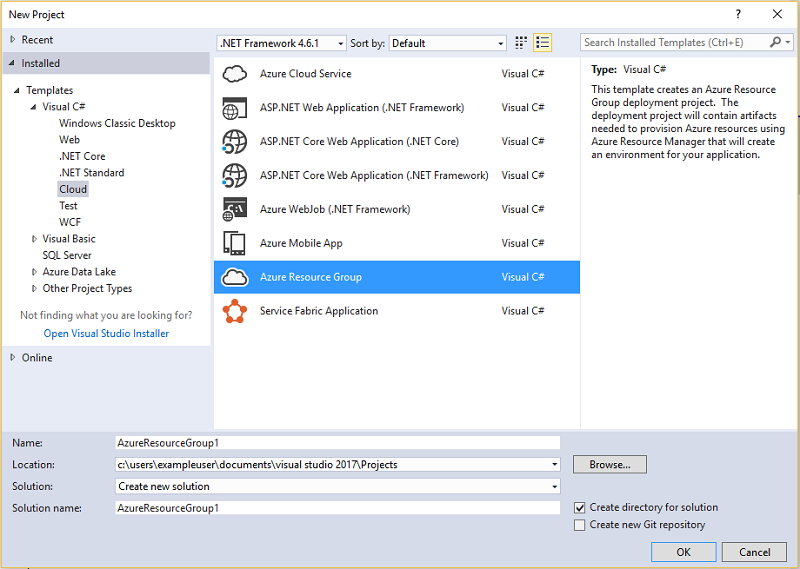
2. 选择要部署到 Azure Resource Manager 的模板。 可以看到，系统根据要部署的项目类型提供了许多不同的选项。 就本文来说，请选择“Web 应用 + SQL”模板。

    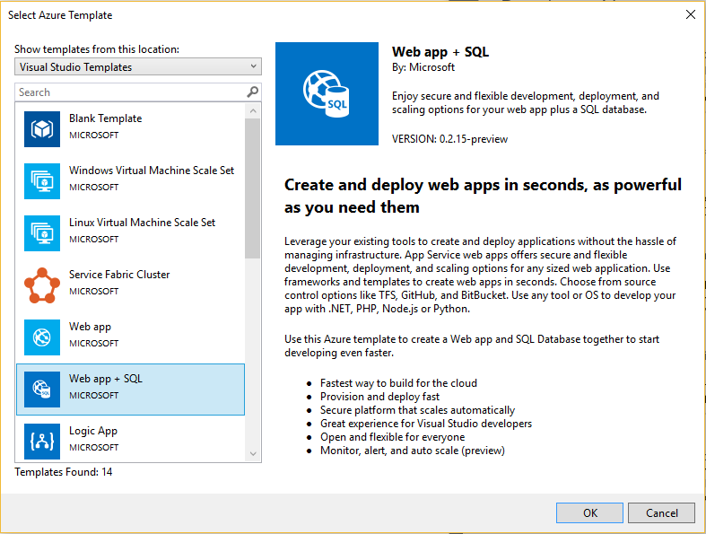

    选择的模板只是起点；可以根据方案添加和删除资源。

   > [!NOTE]
   > Visual Studio 会在线检索可用模板的列表。 该列表可能会更改。
   > 
   > 

    Visual Studio 将创建 Web 应用和 SQL 数据库的资源组部署项目。
3. 若要查看创建的内容，请浏览部署项目中的节点。

    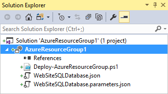

    由于针对本示例选择了“Web 应用 + SQL”模板，因此会看到以下文件。 

    | 文件名 | 说明 |
    | --- | --- |
    | Deploy-AzureResourceGroup.ps1 |一个 PowerShell 脚本，运行 PowerShell 命令以部署到 Azure 资源管理器。<br />**请注意** Visual Studio 使用此 PowerShell 脚本来部署模板。 对此脚本进行任何更改都会影响 Visual Studio 中的部署，因此请务必小心。 |
    | WebSiteSQLDatabase.json |Resource Manager 模板，定义要部署到 Azure 的基础结构，以及在部署期间可以提供的参数。 它还定义各资源之间的依赖关系，以便 Resource Manager 按正确的顺序部署资源。 |
    | WebSiteSQLDatabase.parameters.json |包含模板所需值的参数文件。 需要传入这些参数值来自定义每个部署。 |

    所有资源组部署项目都包含这些基本文件。 其他项目可能包含其他文件以支持其他功能。

## <a name="customize-the-resource-manager-template"></a>自定义资源管理器模板
可以通过修改 JSON 模板（描述要部署的资源）来自定义部署项目。 JSON 是“JavaScript 对象表示法”的缩写，是一种易于使用的序列化数据格式。 JSON 文件使用在每个文件顶部引用的架构。 如果想要了解该架构，可以下载并分析它。 架构定义所允许的元素、字段的类型和格式，以及属性的可能值。 若要了解资源管理器模板的元素，请参阅[创作 Azure 资源管理器模板](resource-group-authoring-templates.md)。

若要使用模板，请打开 **WebSiteSQLDatabase.json**。

Visual Studio 编辑器提供了工具来帮助编辑 Resource Manager 模板。 “JSON 大纲”窗口可让你轻松查看模板中定义的元素。


在大纲中选择任一元素会转到模板的该部分，并且突出显示相应的 JSON。


可以按以下方式添加资源：选择“JSON 大纲”窗口顶部的“添加资源”按钮，或者右键单击“资源”并选择“添加新资源”。


对于本教程，请选择“存储帐户”并指定其名称  。 提供一个长度不超过 11 个字符并且仅包含数字和小写字母的名称。


请注意，不仅会添加资源，而且还添加存储帐户类型的参数，以及存储帐户名称的变量。


**storageType** 参数是使用允许的类型和默认类型预定义的。 可以保留或根据方案编辑这些值。 如果不希望任何人通过此模板部署 **Premium_LRS** 存储帐户，请将它从允许的类型中删除。 

```json
"storageType": {
  "type": "string",
  "defaultValue": "Standard_LRS",
  "allowedValues": [
    "Standard_LRS",
    "Standard_ZRS",
    "Standard_GRS",
    "Standard_RAGRS"
  ]
}
```

Visual Studio 还提供 intellisense，帮助你了解在编辑模板时可用的属性。 例如，若要编辑应用服务计划的属性，请导航到 **HostingPlan** 资源，并为 **properties** 添加值。 请注意，Intellisense 显示可用的值，并提供该值的描述。


可以将 **numberOfWorkers** 设置为 1。

```json
"properties": {
  "name": "[parameters('hostingPlanName')]",
  "numberOfWorkers": 1
}
```

## <a name="deploy-the-resource-group-project-to-azure"></a>将资源组部署到 Azure
现在已准备好部署项目。 部署 Azure 资源组项目时，请将其部署到 Azure 资源组。 资源组是共享同一生命周期的资源的逻辑分组。

1. 在部署项目节点的快捷菜单中，选择“部署” > “新建”。

    

    此时显示“部署到资源组”对话框  。

    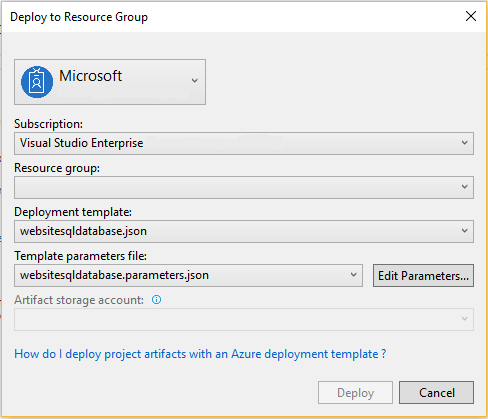
2. 在“资源组”下拉框中，选择现有资源组或创建新资源组。 若要创建资源组，请打开“资源组”下拉框，然后选择“新建”。

    

    此时会显示“创建资源组”对话框。 指定组的名称和位置，然后选择“创建”按钮。

    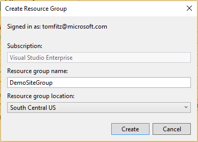
3. 选择“编辑参数”  按钮，编辑部署的参数。

    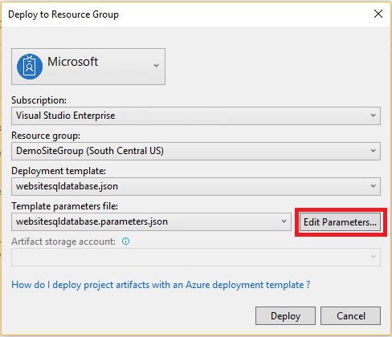
4. 提供空值参数的值，并选择“保存”按钮。 空值参数为 **hostingPlanName**、**administratorLogin**、**administratorLoginPassword** 和 **databaseName**。

    **hostingPlanName** 指定要创建的 [应用服务计划](../app-service/overview-hosting-plans.md) 的名称。 

    **administratorLogin** 指定 SQL Server 管理员的用户名。 请勿使用常用的管理员名称，如 **sa** 或 **admin**。 

    **administratorLoginPassword** 指定 SQL Server 管理员的密码。 “在参数文件中以纯文本格式保存密码”选项不安全；所以，请勿选择此选项。 由于不以纯文本格式保存密码，因此在部署过程中需要再次提供此密码。 

    **databaseName** 指定要创建的数据库的名称。 

    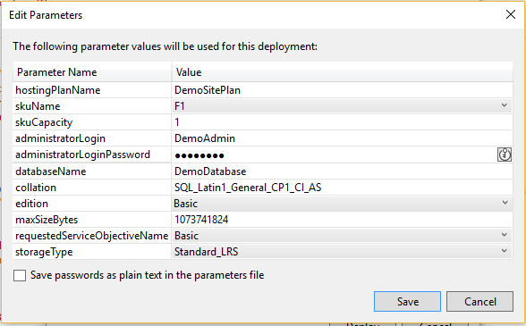
5. 选择“部署”按钮将项目部署到 Azure。 PowerShell 控制台会在 Visual Studio 实例外部打开。 出现密码输入提示时，在 PowerShell 控制台中输入 SQL Server 管理员密码。 **PowerShell 控制台可能隐藏在其他项目后面或最小化到任务栏。** 查找此控制台，选择它以提供密码。

    > [!NOTE]
    > Visual Studio 可能会要求安装 Azure PowerShell cmdlet。 如果出现提示，请安装 Azure PowerShell cmdlet。 需要安装 Azure PowerShell 模块才能成功部署资源组。 项目中的 PowerShell 脚本不使用新的 [Azure PowerShell Az 模块](https://docs.microsoft.com/powershell/azure/new-azureps-module-az)。 
    >
    > 有关详细信息，请参阅[安装和配置 Azure PowerShell 模块](https://docs.microsoft.com/powershell/azure/azurerm/install-azurerm-ps)。
    > 
    > 
6. 部署可能需要几分钟的时间。 在“输出”  窗口中，可以看到部署的状态。 完成部署后，最后一条消息指示部署成功，其内容与下面的消息类似：

        ... 
        18:00:58 - Successfully deployed template 'websitesqldatabase.json' to resource group 'DemoSiteGroup'.
7. 在浏览器中，打开 [Azure 门户](https://portal.azure.cn/)并登录到帐户。 要查看资源组，请选择“资源组”，并选择已部署到的资源组。

    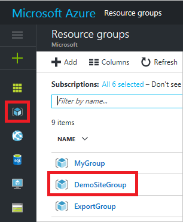
8. 将显示所有已部署的资源。 请注意，存储帐户的名称并不完全是添加资源时指定的名称。 存储帐户必须是唯一的。 模板自动向所提供的名称添加一个字符串，以便提供唯一名称。 

    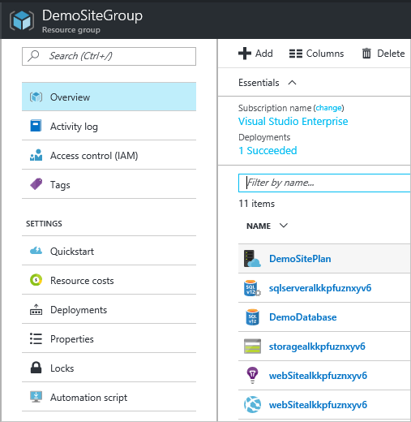
9. 如果做了更改并想要重新部署项目，可以从 Azure 资源组项目的快捷菜单中选择现有资源组。 在快捷菜单中，选择“部署”，然后选择已部署的资源组。

    

## <a name="deploy-code-with-your-infrastructure"></a>将代码与基础结构一起部署
此时，已为应用部署基础结构，但尚未在项目中部署实际代码。 本文说明如何在部署期间部署 Web 应用和 SQL 数据库表。 如果是部署虚拟机而不是 Web 应用，需要在部署过程中，在计算机上运行一些代码。 为 Web 应用部署代码的过程与设置虚拟机的过程几乎相同。

1. 将项目添加到 Visual Studio 解决方案。 右键单击解决方案，选择“添加” > “新建项目”。

    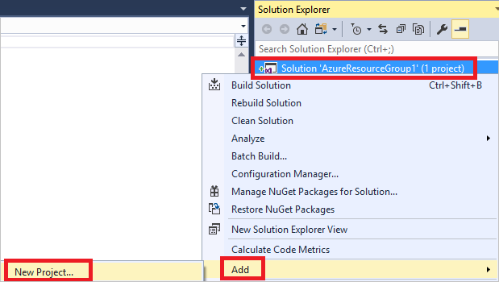
2. 添加 **ASP.NET Web 应用程序**。 

    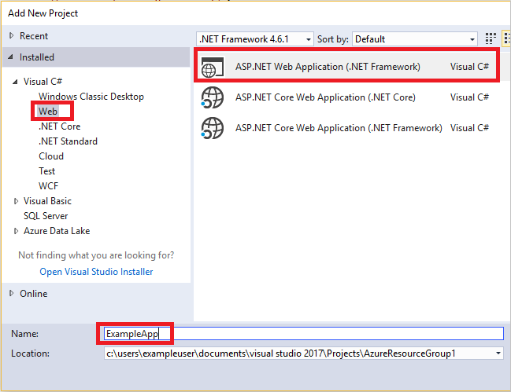
3. 选择“MVC”。

    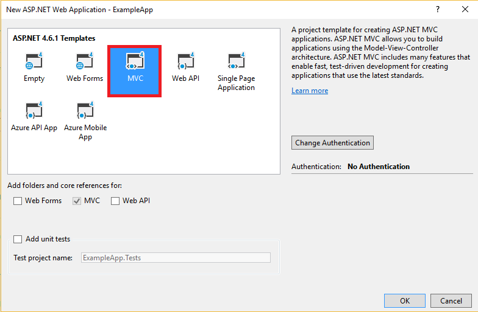
4. Visual Studio 创建 Web 应用后，会在解决方案中看到这两个项目。

    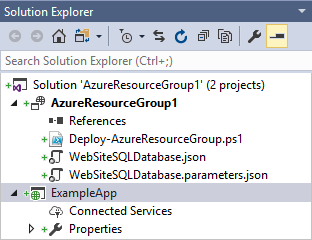
5. 现在，需要确保资源组项目与此新项目之间建立链接。 返回到资源组项目 (AzureResourceGroup1)。 右键单击“引用”，选择“添加引用”。

    
6. 选择创建的 Web 应用项目。

    

    通过添加引用，可以将 Web 应用项目链接到资源组项目中，并自动设置三个重要属性。 可以在“属性”  窗口中看到这些用于引用的属性。

    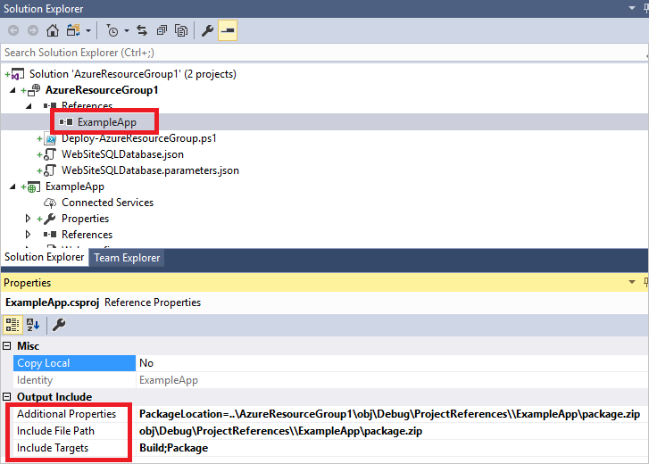

    属性包括：

    * “其他属性”包含要推送到 Azure 存储的 Web 部署包暂存位置。 请记下文件夹 (ExampleApp) 和文件 (package.zip)。 用户需要知道这些值，因为在部署应用时需提供这些值作为参数。 
    * “包含文件路径”包含创建包所在的路径。 “包含目标”包含部署执行的命令。 
    * 默认值“生成并打包”可让部署生成并创建 Web 部署包 (package.zip)。  

    不需要使用发布配置文件，因为部署将从属性中获取所需的信息来创建包。
7. 返回到 WebSiteSQLDatabase.json，向模板添加资源。

    
8. 这次请选择“适用于 Web 应用的 Web 部署” 。 

    
9. 将资源组项目重新部署到资源组。 这次还有一些新的参数。 不需要为 **_artifactsLocation** 或 **_artifactsLocationSasToken** 提供值，因为 Visual Studio 会自动生成这些值。 但是，必须将文件夹和文件名称设置为包含部署包的路径（在下图中显示为 **ExampleAppPackageFolder** 和 **ExampleAppPackageFileName**）。 提供之前在引用属性中看到的值（**ExampleApp** 和 **package.zip**）。

    

    对于“项目存储帐户” ，请选择部署此资源组时所用的帐户。
10. 部署完成后，请在门户中选择 Web 应用。 选择 URL，浏览到站点。

     
11. 请注意已成功部署默认的 ASP.NET 应用程序。

     

## <a name="add-an-operations-dashboard-to-your-deployment"></a>将操作仪表板添加到部署
并不仅限于通过 Visual Studio 界面提供的资源。 可将自定义资源添加到模板来自定义部署。 若要显示如何添加资源，请添加一个操作仪表板来管理部署的资源。

1. 打开 WebsiteSqlDeploy.json 文件，在存储帐户资源后但在资源节的右 `]` 前添加以下 JSON。

    ```json
    ,{
      "properties": {
        "lenses": {
          "0": {
            "order": 0,
            "parts": {
              "0": {
                "position": {
                  "x": 0,
                  "y": 0,
                  "colSpan": 4,
                  "rowSpan": 6
                },
                "metadata": {
                  "inputs": [
                    {
                      "name": "resourceGroup",
                      "isOptional": true
                    },
                    {
                      "name": "id",
                      "value": "[resourceGroup().id]",
                      "isOptional": true
                    }
                  ],
                  "type": "Extension/HubsExtension/PartType/ResourceGroupMapPinnedPart"
                }
              },
              "1": {
                "position": {
                  "x": 4,
                  "y": 0,
                  "rowSpan": 3,
                  "colSpan": 4
                },
                "metadata": {
                  "inputs": [],
                  "type": "Extension[azure]/HubsExtension/PartType/MarkdownPart",
                  "settings": {
                    "content": {
                      "settings": {
                        "content": "__Customizations__\n\nUse this dashboard to create and share the operational views of services critical to the application performing. To customize simply pin components to the dashboard and then publish when you're done. Others will see your changes when you publish and share the dashboard.\n\nYou can customize this text too. It supports plain text, __Markdown__, and even limited HTML like images  and <a href='https://azure.microsoft.com' target='_blank'>links</a> that open in a new tab.\n",
                        "title": "Operations",
                        "subtitle": "[resourceGroup().name]"
                      }
                    }
                  }
                }
              }
            }
          }
        },
        "metadata": {
          "model": {
            "timeRange": {
              "value": {
                "relative": {
                  "duration": 24,
                  "timeUnit": 1
                }
              },
              "type": "MsPortalFx.Composition.Configuration.ValueTypes.TimeRange"
            }
          }
        }
      },
      "apiVersion": "2015-08-01-preview",
      "name": "[concat('ARM-',resourceGroup().name)]",
      "type": "Microsoft.Portal/dashboards",
      "location": "[resourceGroup().location]",
      "tags": {
        "hidden-title": "[concat('OPS-',resourceGroup().name)]"
      }
    }
    ```

2. 重新部署资源组。 在 Azure 门户中查看仪表板，可以看到，共享的仪表板已添加到所选列表。

    

3. 选择仪表板。

    

    可以使用 RBAC 组管理对仪表板的访问权限。 部署后，还可以自定义仪表板的外观。 但是，如果重新部署资源组，则模板中的仪表板将重置为其默认状态。
    
    <!--Not Available on [Programmatically create Azure Dashboards](../azure-portal/azure-portal-dashboards-create-programmatically.md)-->

## <a name="next-steps"></a>后续步骤

在本快速入门中，你学习了如何使用 Visual Studio 创建和部署模板。 下一教程介绍如何从模板参考中查找信息，以便创建加密的 Azure 存储帐户。

> [!div class="nextstepaction"]
> [创建加密的存储帐户](./resource-manager-tutorial-create-encrypted-storage-accounts.md)

<!--Update_Description: update meta properties, wording update， update link -->