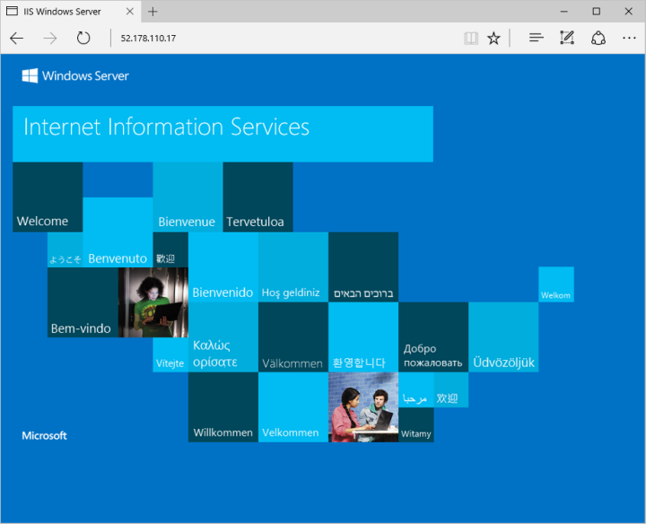

# <a name="quickstart-create-a-windows-server-virtual-machine-by-using-azure-cli-in-azure-stack"></a>快速入门：在 Azure Stack 中使用 Azure CLI 创建 Windows Server 虚拟机

*适用于：Azure Stack 集成系统和 Azure Stack 开发工具包*

可以使用 Azure CLI 创建 Windows Server 2016 虚拟机。 请按照本文中的步骤创建和使用虚拟机。 本文还提供了以下步骤：

* 通过远程客户端连接到虚拟机。
* 安装 IIS Web 服务器并查看默认主页。
* 清理资源。

## <a name="prerequisites"></a>先决条件

* 确保 Azure Stack 操作员已将 **Windows Server 2016** 映像添加到 Azure Stack 市场。

* Azure Stack 需要使用特定版本的 Azure CLI 来创建和管理资源。 如果未针对 Azure Stack 配置 Azure CLI，请遵循[安装和配置 Azure CLI](azure-stack-version-profiles-azurecli2.md) 的步骤。

## <a name="create-a-resource-group"></a>创建资源组

资源组是一个逻辑容器，可以在其中部署和管理 Azure Stack 资源。 从 Azure Stack 环境中，运行 [az group create](/cli/group#az-group-create) 命令来创建资源组。

>[!NOTE]
 代码示例中为所有变量都分配了值。 但是，如果愿意，也可以分配新值。

以下示例在本地位置创建名为 myResourceGroup 的资源组。

```cli
az group create --name myResourceGroup --location local
```

## <a name="create-a-virtual-machine"></a>创建虚拟机

可以使用 [az vm create](/cli/vm#az-vm-create) 命令创建虚拟机 (VM)。 以下示例创建名为 myVM 的 VM。 此示例使用 Demouser 作为管理用户名，使用 Demouser@123 作为用户密码。 将这些值更改为适合你的环境的值。

```cli
az vm create \
  --resource-group "myResourceGroup" \
  --name "myVM" \
  --image "Win2016Datacenter" \
  --admin-username "Demouser" \
  --admin-password "Demouser@123" \
  --use-unmanaged-disk \
  --location local
```

创建 VM 时，输出中的 **PublicIPAddress** 参数包含虚拟机的公用 IP 地址。 记下此地址，因为需要使用它来访问虚拟机。

## <a name="open-port-80-for-web-traffic"></a>为 Web 流量打开端口 80

由于此 VM 将用来运行 IIS Web 服务器，因此需要为 Internet 流量打开端口 80。

使用 [az vm open-port](/cli/vm#open-port) 命令打开端口 80。

```cli
az vm open-port --port 80 --resource-group myResourceGroup --name myVM
```

## <a name="connect-to-the-virtual-machine"></a>连接到虚拟机

使用以下命令创建到虚拟机的远程桌面连接。 将“Public IP Address”替换为你的虚拟机的 IP 地址。 出现提示时，输入用于虚拟机的用户名和密码。

```
mstsc /v <Public IP Address>
```

## <a name="install-iis-using-powershell"></a>使用 PowerShell 安装 IIS

现在，你已登录到虚拟机，可以使用 PowerShell 来安装 IIS 了。 在虚拟机上启动 PowerShell 并运行以下命令：

```powershell
Install-WindowsFeature -name Web-Server -IncludeManagementTools
```

## <a name="view-the-iis-welcome-page"></a>查看 IIS 欢迎页

可以使用所选的 Web 浏览器查看默认 IIS 欢迎页。 请使用前面部分中记录的公用 IP 地址来访问默认页面。



## <a name="clean-up-resources"></a>清理资源

清理不再需要的资源。 可以使用 [az group delete](/cli/group#az-group-delete) 命令来删除资源组、虚拟机和所有相关的资源。

```cli
az group delete --name myResourceGroup
```

## <a name="next-steps"></a>后续步骤

在本快速入门中，你已部署了一台基本的 Windows Server 虚拟机。 有关 Azure Stack 虚拟机的详细信息，请转到 [Azure Stack 中虚拟机的注意事项](azure-stack-vm-considerations.md)。

<!-- Update_Description: wording update -->