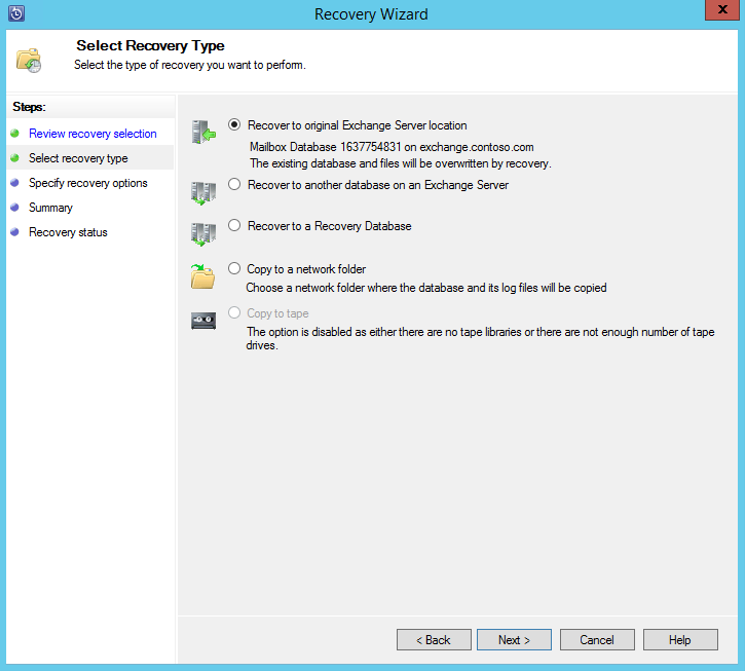

# 使用 System Center 2012 R2 DPM 将 Exchange Server 备份到 Azure 备份
本文说明如何配置 System Center 2012 R2 Data Protection Manager (DPM) 服务器，以便将 Microsoft Exchange 服务器备份到 Azure 备份。  

## 更新
若要在 Azure 备份中成功注册 DPM 服务器，必须安装 System Center 2012 R2 DPM 的最新更新汇总和 Azure 备份代理的最新版本。 从 [Microsoft 目录](http://catalog.update.microsoft.com/v7/site/Search.aspx?q=System%20Center%202012%20R2%20Data%20protection%20manager)获取最新的更新汇总。

> [!NOTE]
> 对于本文中的示例，会安装 Azure 备份代理 2.0.8719.0 版，并在 System Center 2012 R2 DPM 上安装更新汇总 6。
>
>

## 先决条件
继续下一步之前，请确保符合使用 Azure 备份保护工作负荷的所有[先决条件](backup-azure-dpm-introduction.md#prerequisites)。 这些先决条件包括：

- Azure 网站上已创建备份保管库。
- 代理和保管库凭据已下载到 DPM 服务器。
- DPM 服务器上已安装代理。
- DPM 服务器已使用保管库凭据注册。
- 若要保护 Exchange 2016，请升级到 DPM 2012 R2 UR9 或更高版本

## DPM 保护代理
若要在 Exchange Server 上安装 DPM 保护代理，请遵循以下步骤：

1. 确保已正确配置防火墙。 请参阅[配置代理的防火墙异常](https://technet.microsoft.com/library/Hh758204.aspx)。
2. 通过在 DPM 管理员控制台中单击“管理”>“代理”>“安装”，在 Exchange 服务器上安装代理。 有关详细步骤，请参阅[安装 DPM 保护代理](https://technet.microsoft.com/library/hh758186.aspx?f=255&MSPPError=-2147217396)。

## 为 Exchange Server 创建保护组
1. 在 DPM 管理员控制台中，单击“保护”，然后单击工具功能区上的“添加”，打开“创建新保护组”向导。
2. 在向导的“**欢迎**”屏幕上单击“**下一步**”。
3. 在“**选择保护组类型**”屏幕上，选择“**服务器**”并单击“**下一步**”。
4. 选择想要保护的 Exchange Server 数据库，并单击“**下一步**”。

   > [!NOTE]
   > 如果要保护 Exchange 2013，请检查 [Exchange 2013 先决条件](https://technet.microsoft.com/library/dn751029.aspx)。
   >
   >

    下例中选择了Exchange 2010 数据库。

    
5. 选择数据保护方法。

    为保护组命名，并选择以下两个选项：

   - 我想要使用磁盘提供短期保护。
   - 我想要使用在线保护。
6. 单机“下一步”
7. 如果想要检查 Exchange Server 数据库的完整性，请选择“**运行 Eseutil 以检查数据完整性**”选项。

    选择此选项后，会在 DPM 服务器上运行备份一致性检查，以避免由于在 Exchange Server 上运行 **eseutil** 命令而产生的 I/O 流量。

   > [!NOTE]
   > 若要使用此选项，必须将 Ese.dll 和 Eseutil.exe 文件复制到 DPM 服务器上的 C:\Program Files\Microsoft System Center 2012 R2\DPM\DPM\bin 目录。 否则会触发以下错误：  
   > 
   >
   >
8. 单机“下一步”
9. 选择“**复制备份**”的数据库，并单击“**下一步**”。

   > [!NOTE]
   > 如果未针对数据库的至少一个 DAG 副本选择“完全备份”，则不会截断日志。
   >
   >
10. 配置“**短期备份**”的目标，并单击“**下一步**”。
11. 检查可用磁盘空间，并单击“**下一步**”。
12. 选择 DPM 服务器创建初始复制的时间，然后单击“下一步”。
13. 选择一致性检查选项，并单击“**下一步**”。
14. 选择要备份到 Azure 数据库，并单击“**下一步**”。 例如：

    
15. 定义“**Azure 备份**”的计划，并单击“**下一步**”。 例如：

    

    > [!NOTE]
    > 请注意，在线恢复点基于快速完全恢复点。 因此，必须将在线恢复点安排在针对快速完全恢复点指定的时间之后。
    >
    >
16. 配置“**Azure 备份**”的保留策略，并单击“**下一步**”。
17. 选择在线复制选项并单击“**下一步**”。

    如果有大型数据库，通过网络创建初始备份所需的时间会很长。 可以通过创建脱机备份避免此问题。  

    
18. 确认设置，并单击“**创建组**”。
19. 单击“**关闭**”。

## 恢复 Exchange 数据库
1. 若要恢复 Exchange 数据库，请在 DPM 管理员控制台中单击“恢复”。
2. 找到要恢复的 Exchange 数据库。
3. 从“*恢复时间*”下拉列表中选择在线恢复点。
4. 单击“**恢复**”启动“**恢复向导**”。

在线恢复点有五种恢复类型：

- **恢复到原始 Exchange Server 位置：**数据将恢复到原始 Exchange Server。
- **恢复到 Exchange Server 上的其他数据库：**数据将恢复到其他 Exchange Server 上的其他数据库。
- **恢复到恢复数据库：**数据将恢复到 Exchange 恢复数据库 (RDB)。
- **复制到网络文件夹：**数据将恢复到网络文件夹。
- **复制到磁带：**如果 DPM 服务器上安装并配置了磁带库或独立的磁带机，则恢复点将复制到可用的磁带。

    

## 后续步骤
- [Azure 备份常见问题](backup-azure-backup-faq.md)

<!--Update_Description: update metadata properties-->