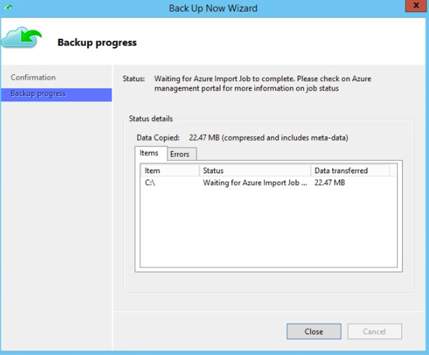

# <a name="offline-backup-workflow-in-azure-backup"></a>Azure 备份中的脱机备份工作流
Azure 备份有多个可提升效率的内置功能，能在数据初始完整备份到 Azure 期间节省网络和存储成本。 初始完整备份通常会传输大量数据，且需要较多网络带宽，相比之下，后续备份只传输差异/增量部分。 通过脱机种子设定，Azure 备份可以使用磁盘将脱机备份数据上传到 Azure。

Azure 备份脱机种子设定过程与 [Azure 导入/导出服务](../storage/common/storage-import-export-service.md)紧密集成，允许使用磁盘将初始备份数据传输到 Azure。 如果要通过高延迟、低带宽网络传输 TB 量级的初始备份数据，可以使用脱机种子设定工作流将一个或多个硬盘驱动器中的初始备份副本传送到 Azure 数据中心。 下图提供了工作流中步骤的概述。

  

脱机备份过程涉及以下步骤：

1. 不是通过网络发送备份数据，而是将备份数据写入暂存位置。
2. 使用 AzureOfflineBackupDiskPrep 实用工具将暂存位置中的数据写入一个或多个 SATA 磁盘。
3. 在准备过程中，AzureOfflineBackupDiskPrep 实用工具将创建 Azure 导入作业。 将 SATA 驱动器寄送到最近的 Azure 数据中心，并引用导入作业来连接活动。
4. 在 Azure 数据中心，磁盘上的数据将复制到 Azure 存储帐户。
5. Azure 备份将备份数据从存储帐户复制到恢复服务保管库，并计划增量备份。

## <a name="supported-configurations"></a>支持的配置 
以下 Azure 备份功能或工作负荷支持使用脱机备份。

> [!div class="checklist"]
> * 使用世纪互联 Azure 恢复服务 (MARS) 代理（也称 Azure 备份代理）备份文件和文件夹。 
> * 使用 System Center Data Protection Manager (SC DPM) 备份所有工作负荷和文件 
> * 使用世纪互联 Azure 备份服务器备份所有工作负荷和文件 <br/>

   > [!NOTE]
   > 使用 Azure 备份代理完成的系统状态备份不支持脱机备份。 

[!INCLUDE [backup-upgrade-mars-agent.md](../../includes/backup-upgrade-mars-agent.md)]

## <a name="prerequisites"></a>先决条件

  > [!NOTE]
  > 以下先决条件和工作流仅适用于使用[最新的 MARS 代理](https://aka.ms/azurebackup_agent)脱机备份文件和文件夹。 若要使用 System Center DPM 或 Azure 备份服务器执行工作负荷脱机备份，请参阅[此文](backup-azure-backup-server-import-export-.md)。 

在启动脱机备份工作流之前，需满足以下先决条件： 
* 创建[恢复服务保管库](backup-azure-recovery-services-vault-overview.md)。 若要创建保管库，请参阅[此文](tutorial-backup-windows-server-to-azure.md#create-a-recovery-services-vault)中的步骤
* 确保 Windows Server/Windows 客户端上只安装了[最新版本的 Azure 备份代理](https://aka.ms/azurebackup_agent)（如果适用），并已向恢复服务保管库注册了计算机。
* 运行 Azure 备份代理的计算机上需要 Azure PowerShell 3.7.0。 建议你下载并[安装 Azure PowerShell 3.7.0 版](https://github.com/Azure/azure-powershell/releases/tag/v3.7.0-March2017)。
* 在运行 Azure 备份代理的计算机上，确保已安装 Azure Edge 或 Internet Explorer 11，并已启用 JavaScript。 
* 在恢复服务保管库所在的同一订阅中创建 Azure 存储帐户。 
* 确保拥有创建 Azure Active Directory 应用程序的[所需权限](../azure-resource-manager/resource-group-create-service-principal-portal.md)。 脱机备份工作流在与 Azure 存储帐户关联的订阅中创建一个 Azure Active Directory 应用程序。 该应用程序的目标是为 Azure 备份提供 Azure 导入服务的安全受限访问权限，以便完成脱机备份工作流。 
* 将 Microsoft.ImportExport 资源提供程序注册到包含 Azure 存储帐户的订阅。 若要注册资源提供程序：
    1. 在主菜单中，单击“订阅”。
    2. 如果有多个订阅，请选择用于脱机备份的订阅。 如果只使用一个订阅，则屏幕上会显示该订阅。
    3. 在订阅菜单中，单击“资源提供程序”查看提供程序列表。
    4. 在提供程序列表中，向下滚动到“Microsoft.ImportExport”。 如果“Status”为“NotRegistered”，请单击“注册”。
    
* 创建了一个暂存位置，它可以是计算机上的网络共享或任何其他内部或外部驱动器，并且有足够的磁盘空间来保存初始副本。 例如，如果尝试备份 500 GB 文件服务器，请确保暂存区域至少有 500 GB 空间。 （由于压缩，实际使用量更少）。
* 将磁盘寄送到 Azure 时，请仅使用 2.5 英寸 SSD，或者 2.5 英寸或 3.5 英寸 SATA II/III 内部硬盘驱动器。 可以使用容量最高为 10 TB 的硬盘驱动器。 查看 [Azure 导入/导出服务文档](../storage/common/storage-import-export-requirements.md#supported-hardware)，了解服务支持的最新驱动器集。
* SATA 驱动器必须连接到一台计算机（称为“副本计算机”），在这台计算机中完成将备份数据从暂存位置复制到 SATA 驱动器。 请确保已在副本计算机上启用 BitLocker。

## <a name="workflow"></a>工作流
本部分介绍如何完成脱机备份工作流，以便将数据传送到 Azure 数据中心，并上传到 Azure 存储。 如有关于导入服务或流程的任何方面的问题，请参阅[导入服务概述文档](../storage/common/storage-import-export-service.md)。

## <a name="initiate-offline-backup"></a>启动脱机备份
1. 在 MARS 代理中计划备份时，将看到以下屏幕。

    

    输入的说明如下：

    * **暂存位置**：初始备份副本写入到的临时存储位置。 暂存位置可以是在网络共享或本地计算机。 如果副本计算机与源计算机不同，建议指定暂存位置的完整网络路径。
    * **Azure 资源管理器存储帐户**：任一 Azure 订阅中的资源管理器类型存储帐户的名称。
    * **Azure 存储容器**：Azure 存储帐户中目标存储 Blob 的名称，在备份数据复制到恢复服务保管库之前将其导入该账户。
    * **Azure 订阅 ID**：在其中创建了 Azure 存储帐户的 Azure 订阅的 ID。
    * **Azure 导入作业名称**：Azure 导入服务和 Azure 备份在跟踪磁盘上发送到 Azure 的数据的传输活动时使用的唯一名称。 

   在屏幕上提供输入，然后单击“下一步”。 保存提供的“暂存位置”和“Azure 导入作业名称”值，因为准备磁盘时需要使用这些信息。

2. 根据提示登录到 Azure 订阅。 只有在登录后，Azure 备份才能创建 Azure Active Directory 应用程序，并提供所需的权限来访问 Azure 导入服务。

    

3. 完成工作流，然后在 Azure 备份代理控制台中单击“立即备份”。

    

4. 在向导的“确认”页上，单击“备份”。 初始备份将写入到设置过程中指定的暂存区域。

   

    操作完成后，暂存位置已准备就绪，可用于准备磁盘。

   

## <a name="prepare-sata-drives-and-ship-to-azure"></a>准备 SATA 驱动器并寄送到 Azure
*AzureOfflineBackupDiskPrep* 实用工具会准备送到最近 Azure 数据中心的 SATA 驱动器。 Azure 备份代理安装目录中提供了此实用工具（路径如下）：

   *\21Vianet Azure Recovery Services Agent\Utils\\*

1. 请转到该目录，将 **AzureOfflineBackupDiskPrep** 目录复制到连接了 SATA 驱动器的另一台计算机上。 在连接了 SATA 驱动器的计算机上，请确保：

   * 副本计算机可使用在 **启动脱机备份** 工作流中提供的相同网络路径，访问脱机种子设定工作流的暂存位置。
   * 已在副本计算机上启用 BitLocker。
   * Azure PowerShell 3.7.0 已安装。
   * 已安装最新的兼容浏览器（Microsoft Edge 或 Internet Explorer 11），并已启用 JavaScript。 
   * 副本计算机可以访问 Azure 门户。 必要时，副本计算机可与源计算机相同。

     > [!IMPORTANT] 
     > 如果源计算机是虚拟机，则复制计算机必须是与源计算机不同的物理服务器或客户端计算机。

2. 在副本计算机上打开提升的命令提示符，以 AzureOfflineBackupDiskPrep 实用工具的目录作为当前目录并运行以下命令：

    ```.\AzureOfflineBackupDiskPrep.exe s:<Staging Location Path>```

    | 参数 | 说明 |
    | --- | --- |
    | s:&lt;*Staging Location Path*&gt; |必需的输入，用于提供在**启动脱机备份**工作流中所输入的暂存位置路径。 |
    | p:&lt;*Path to PublishSettingsFile*&gt; |可选的输入，用于提供在**启动脱机备份**工作流中所输入的 **Azure 发布设置**文件路径。 |

    运行该命令时，该实用工具将请求选择需要准备的驱动器对应的 Azure 导入作业。 如果只有一个与提供的暂存位置关联的导入作业，会显示如下所示的屏幕。

     <br/>

3. 输入想要准备传输到 Azure 的已装载磁盘的驱动器号（不要包含尾部的冒号）。 
4. 出现提示时，确认格式化驱动器。
5. 系统会提示登录到 Azure 订阅。 提供凭据。

     <br/>

    工具随后便开始准备磁盘和复制备份数据。 可能需要工具的提示附加其他磁盘，以免提供的磁盘没有足够空间来容纳备份数据。 <br/>

    成功结束该工具的执行时，命令提示符会提供三段信息：
   1. 准备好提供的一个或多个磁盘，以便寄送到 Azure。 
   2. 你会收到已创建导入作业的确认。 导入作业使用提供的名称。
   3. 该工具会显示 Azure 数据中心的寄送地址。

      <br/>

6. 结束命令的执行时，可以更新寄送信息。

7. 将磁盘寄送到工具提供的地址，保留跟踪号码供日后参考。

   > [!IMPORTANT] 
   > 两个 Azure 导入作业不能同时拥有相同的追踪号码。 确保使用一个包裹寄送实用工具在单次 Azure 导入作业中准备的驱动器，该包裹有一个唯一的跟踪号。 请勿在一个包裹中混合不同 Azure 导入作业中准备的驱动器。


## <a name="update-shipping-details-on-the-azure-import-job"></a>更新 Azure 导入作业中的寄送详细信息

以下过程更新 Azure 导入作业的寄送详细信息。 此信息包括以下各项的详细信息：
* 将磁盘递送到 Azure 的快递公司名称
* 磁盘的回件寄送详细信息

1. 登录到 Azure 订阅。
2. 在主菜单中单击“所有服务”，然后在“所有服务”对话框中键入“输入”。 看到“导入/导出作业”时，请单击它。
    <br/>

    此时会打开“导入/导出作业”菜单的列表，并显示所选订阅中的所有导入/导出作业列表。 

3. 如果有多个订阅，请务必选择用于导入备份数据的订阅。 然后选择新建的导入作业，以打开其详细信息。

    <br/>

4. 在导入作业的“设置”菜单中，单击“管理寄送信息”并输入回件寄送详细信息。

    <br/>

5. 在收到快递公司提供的跟踪号后，请单击 Azure 导入作业概述页中的横幅，并输入以下详细信息：

   > [!IMPORTANT] 
   > 确保快递公司信息和跟踪号在创建 Azure 导入作业后的两周内更新。 在两周内未确认此信息可能导致删除作业被删除，且不处理驱动器。

   <br/>

   

### <a name="time-to-process-the-drives"></a>处理驱动器的时间 
处理 Azure 导入作业的时间各不相同，具体取决于不同的因素，例如寄送时间、作业类型、要复制的数据的类型和大小，以及所提供磁盘的大小。 Azure 导入/导出服务没有 SLA，但在收到磁盘之后，该服务力求在 7 到 10 天内完成将备份数据复制到 Azure 存储帐户。 

### <a name="monitoring-azure-import-job-status"></a>监视 Azure 导入作业状态
可以在 Azure 门户中导航到“导入/导出作业”页并选择自己的作业，来监视导入作业的状态。 有关导入作业状态的详细信息，请参阅[存储导入导出服务](../storage/common/storage-import-export-service.md)一文。

### <a name="complete-the-workflow"></a>完成工作流
成功完成导入作业后，存储帐户中的初始备份数据可供使用。 在进行到下一步计划的备份时，Azure 备份将数据的内容从存储帐户复制到恢复服务保管库，如下所示： 

   <br/>

在执行下一次计划的备份时，Azure 备份会执行增量备份。

### <a name="cleaning-up-resources"></a>清理资源
完成初始备份后，可以安全删除已导入到 Azure 存储容器的数据，以及暂存位置中的备份数据。

## <a name="next-steps"></a>后续步骤
* 如有任何关于 Azure 导入/导出工作流的问题，请参阅 [Use the 21Vianet Azure Import/Export service to transfer data to Blob storage](../storage/common/storage-import-export-service.md)（使用世纪互联 Azure 导入/导出服务可将数据传输到 Blob 存储中）。
* 如有工作流方面的任何问题，请参阅 Azure 备份 [FAQ](backup-azure-backup-faq.md) （常见问题）的“脱机备份”部分。


<!-- Update_Description: wording update -->