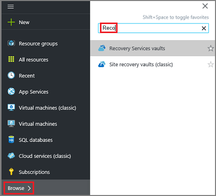
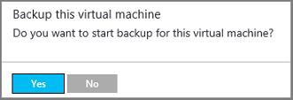

# 管理 Azure 虚拟机备份

本文指导管理 VM 备份，并说明门户仪表板中提供的备份警报信息。 本文中的指导的适用范围是将 VM 用于恢复服务保管库。 本文不介绍如何创建虚拟机，也不说明如何保护虚拟机。 如需在 Azure 中使用恢复服务保管库保护 Azure 资源管理器部署的 VM 的入门指导，请参阅[初步了解：将 VM 备份到恢复服务保管库](backup-azure-vms-first-look-arm.md)。

## 管理保管库和受保护的虚拟机
在 Azure 门户中，恢复服务保管库仪表板可用于访问有关保管库的信息，包括：

- 最新备份快照，即最新还原点
- 备份策略
- 所有备份快照的总大小
- 通过保管库进行保护的虚拟机的数目

进行虚拟机备份时，许多管理任务一开始都是在仪表板中打开保管库。 但是，由于保管库可用来保护多个项（或多个 VM），因此若要查看特定 VM 的详细信息，请打开保管库项仪表板。 以下过程演示了如何先打开*保管库仪表板*，再继续打开*保管库项仪表板*。 两个过程都提供了“提示”，指出如何使用“固定到仪表板”命令将保管库和保管库项添加到 Azure 仪表板。 可以使用“固定到仪表板”来创建保管库或项目的快捷方式。 也可以通过快捷方式执行常用命令。

> [!TIP]
> 如果打开了多个仪表板和边栏选项卡，则可使用窗口底部的深蓝色滑块来回滑动 Azure 仪表板。
>
>

### 在仪表板中打开恢复服务保管库：
1. 登录到 [Azure 门户](https://portal.azure.cn/)。
2. 在“中心”菜单中，单击“**浏览**”，并在资源列表中，键入“**恢复服务**”。 开始键入时，会根据输入筛选该列表。 单击“**恢复服务保管库**”。

    

    此时显示恢复服务保管库列表。

    

   > [!TIP]
   > 如果将保管库固定到 Azure 仪表板，则打开 Azure 门户即可访问该保管库。 要将某个保管库固定到仪表板，可在保管库列表中，右键单击该保管库，选择“固定到仪表板”。
   >
   >
3. 从保管库列表中，选择要打开其仪表板的保管库。 选择保管库后，会打开保管库仪表板和“设置”边栏选项卡。 在下图中，突出显示了“**Contoso-vault**”仪表板。

    

### 打开保管库项仪表板
在前面的过程中，打开了保管库仪表板。 打开保管库项仪表板的步骤：

1. 在保管库仪表板上的“**备份项**”磁贴中，单击“**Azure 虚拟机**”。

    

    “**备份项**”边栏选项卡列出每个项的上次备份作业。 在本示例中，有一个受此保管库保护的虚拟机：demovm-markgal。  

    

   > [!TIP]
   > 为了访问方便，可将保管库项目固定到 Azure 仪表板。 要固定某个保管库项目，可在保管库项目列表中，右键单击该项目，并选择“固定到仪表板”。
   >
   >
2. 在“**备份项**”边栏选项卡中，单击打开保管库项仪表板所需的项。

    

    此时会打开保管库项仪表板及其“**设置**”边栏选项卡。

    

    在保管库项仪表板中，可以完成许多关键性的管理任务，例如：

   - 更改策略或创建新的备份策略
   - 查看还原点及其一致性状态
   - 虚拟机的按需备份
   - 停止保护虚拟机
   - 恢复对虚拟机的保护
   - 删除备份数据（或恢复点）
   - [还原备份磁盘](backup-azure-arm-restore-vms.md#restore-backed-up-disks)

以下过程的起点是保管库项仪表板。

## 管理备份策略
1. 在“[保管库项仪表板](backup-azure-manage-vms.md#open-a-vault-item-dashboard)”中，单击“**所有设置**”以打开“**设置**”边栏选项卡。

    
2. 在“**设置**”边栏选项卡中，单击“**备份策略**”以打开该边栏选项卡。

    备份频率和保留期范围详细信息显示在边栏选项卡中。

    
3. 在“**选择备份策略**”菜单中执行以下操作：

   - 要更改策略，请选择其他策略，并单击“**保存**”。 新策略立即应用于保管库。
   - 若要创建策略，请选择“新建”。

     

     有关创建备份策略的说明，请参阅[定义备份策略](backup-azure-manage-vms.md#defining-a-backup-policy)。

[!INCLUDE [backup-create-backup-policy-for-vm](../../includes/backup-create-backup-policy-for-vm.md)]

> [!NOTE]
> 在管理备份策略时，请务必遵循[最佳做法](backup-azure-vms-introduction.md#best-practices)以获得最佳的备份性能
>
>

## 虚拟机的按需备份
为虚拟机配置保护后，可以对它执行按需备份。 如果初始备份已挂起，则按需备份会在恢复服务保管库中创建虚拟机的完整副本。 如果初始备份已完成，按需备份仅将以前快照的更改发送到恢复服务保管库。 也就是说，后续备份始终是增量备份。

> [!NOTE]
> 按需备份的保留期范围是在策略中针对“每日”备份点指定的保留期值。 如果没有选择“每日”备份点，则使用“每周”备份点。
>
>

若要触发虚拟机的按需备份，请执行以下操作：

- 在“[保管库项仪表板](backup-azure-manage-vms.md#open-a-vault-item-dashboard)”中，单击“**立即备份**”。

    

    门户会确认需要启动按需备份作业。 单击“**是**”启动备份作业。

    

    备份作业将创建恢复点。 恢复点保留期范围与在虚拟机的关联策略中指定的保留期范围相同。 若要跟踪作业进度，请在保管库仪表板中，单击“**备份作业**”磁贴。  

## 停止保护虚拟机
如果选择停止保护虚拟机，系统会询问你是否需要保留恢复点。 可以通过两种方法来停止保护虚拟机：

- 停止所有将来的备份作业并删除所有恢复点，或
- 停止所有将来的备份作业，但保留恢复点

将恢复点保留在存储空间中需支付相关费用。 不过，保留恢复点的好处是，可以根据需要在以后还原虚拟机。 如需了解保留恢复点的成本，请参阅[定价详细信息](https://www.azure.cn/pricing/details/backup/)。 如果选择删除所有恢复点，则无法还原虚拟机。

若要停止保护虚拟机，请执行以下操作：

1. 在“[保管库项仪表板](backup-azure-manage-vms.md#open-a-vault-item-dashboard)”中，单击“**停止备份**”。

    

    此时会打开“停止备份”边栏选项卡。

    
2. 在“**停止备份**”边栏选项卡中，选择是保留还是删除备份数据。 信息框提供了所做选择的详细信息。

    
3. 如果选择保留备份数据，则可跳到步骤 4。 如果选择删除备份数据，则请确认要停止备份作业并删除恢复点 - 键入项的名称。

    

    如果不能确定项名称，将鼠标悬停在感叹号上面即可查看该名称。 另外，项的名称位于边栏选项卡顶部的“停止备份”下。
4. （可选）提供**原因**或**注释**。
5. 若要停止当前项的备份作业，请单击“停止备份”按钮

    可以通过通知消息了解到备份作业已停止。

    

## 恢复对虚拟机的保护
如果在停止对虚拟机的保护时选择了“**保留备份数据**”选项，则可恢复对虚拟机的保护。 如果选择了“**删除备份数据**”选项，则不能恢复对虚拟机的保护。

恢复对虚拟机的保护的步骤

1. 在“[保管库项仪表板](backup-azure-manage-vms.md#open-a-vault-item-dashboard)”中，单击“**恢复备份**”。

    

    “备份策略”边栏选项卡随即打开。

   > [!NOTE]
   > 重新保护虚拟机时，可以选择一个不同的策略，而不是最初用于保护虚拟机的策略。
   >
   >
2. 按[管理备份策略](backup-azure-manage-vms.md#manage-backup-policies)中的步骤为虚拟机分配策略。

    对虚拟机应用备份策略以后，会看到以下消息。

    

## 删除备份数据
可以在“**停止备份**”作业过程中删除与虚拟机关联的备份数据，也可以在备份作业完成后随时删除。 甚至还可以等待数天或数周再删除恢复点。 与还原恢复点不同，在删除备份数据时，不能选择要删除的特定恢复点。 如果选择删除备份数据，则会删除与该项关联的所有恢复点。

以下过程假设虚拟机的备份作业已停止或禁用。 仅当已禁用备份作业后，才能在保管库项仪表板中使用“**恢复备份**”和“**删除备份**”选项。

若要删除*已禁用备份*的虚拟机上的备份数据，请执行以下操作：

1. 在[保管库项仪表板](backup-azure-manage-vms.md#open-a-vault-item-dashboard)中，单击“**删除备份**”。

    

    此时会打开“删除备份数据”边栏选项卡。

    
2. 键入项的名称，以便确认需要删除恢复点。

    

    如果不能确定项名称，将鼠标悬停在感叹号上面即可查看该名称。 另外，项的名称位于边栏选项卡顶部的“删除备份数据”下。
3. （可选）提供**原因**或**注释**。
4. 若要删除当前项的备份数据，请单击“停止备份”按钮

    可以通过通知消息了解到备份数据已删除。

## 后续步骤
有关如何从恢复点重新创建虚拟机的信息，请查看 [Restore Azure VMs](backup-azure-arm-restore-vms.md)（还原 Azure VM）。 如果需要有关如何保护虚拟机的信息，请参阅[初步了解：将 VM 备份到恢复服务保管库](backup-azure-vms-first-look-arm.md)。 有关监视事件的信息，请参阅[监视 Azure 虚拟机备份的警报](backup-azure-monitor-vms.md)。

<!--Update_Description: wording update -->