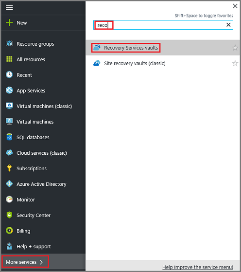

# <a name="monitor-and-manage-recovery-services-vaults"></a>监视和管理恢复服务保管库

本文介绍如何使用恢复服务保管库的“概述”仪表板来监视和管理恢复服务保管库。  从列表中打开恢复服务保管库时，将打开所选保管库的“概述”仪表板。  仪表板提供有关该保管库的各种详细信息。 其中的磁贴显示：严重和警告性警报的状态、正在进行的和失败的备份作业，以及本地冗余存储 (LRS) 和异地冗余存储 (GRS) 使用量。  如果将 Azure VM 备份到保管库，则[“备份预检查状态”磁贴将显示所有严重或警告项](https://azure.microsoft.com/blog/azure-vm-backup-pre-checks/)。  下图是 **Contoso-vault** 的“概述”仪表板。  “备份项”磁贴显示有九个项已注册到保管库。 


本文的先决条件是：一个 Azure 订阅、一个恢复服务保管库，并且至少为该保管库配置了一个备份项。

[!INCLUDE [learn-about-deployment-models](../../includes/learn-about-deployment-models-rm-include.md)]


## <a name="open-a-recovery-services-vault"></a>打开恢复服务保管库

若要监视警报或查看有关某个恢复服务保管库的管理数据，请打开该保管库。

1. 使用 Azure 订阅登录到 [Azure 门户](https://portal.azure.cn/) 。

2. 在门户中，单击“所有服务”  。

   

3. 在“所有服务”对话框中，键入“恢复服务”。   开始键入时，会根据输入筛选该列表。 当“恢复服务保管库”选项出现时，请单击它，以打开订阅中恢复服务保管库的列表。 

     <br/>

4. 在保管库列表中，单击某个保管库打开其“概述”仪表板。  

     <br/>

    “概述”仪表板使用磁贴来提供警报和备份作业数据。

## <a name="monitor-backup-jobs-and-alerts"></a>监视备份作业和警报

恢复服务保管库的“概述”仪表板提供磁贴来显示“监视”和“使用情况”信息。  “监视”部分的磁贴显示“严重”和“警告”警报，以及“正在进行”和“失败”的作业。 单击特定的警报或作业可打开已根据该作业或警报进行筛选的“备份警报”或“备份作业”菜单。


“监视”部分显示预定义的“备份警报”和“备份作业”查询的结果。   “监视”磁贴提供有关以下项的最新信息：

* 备份作业的“严重”和“警告”警报（过去 24 小时）
* Azure VM 的预检查状态 - 有关预检查状态的完整信息，请参阅[有关备份预检查状态的博客文章](https://azure.microsoft.com/blog/azure-vm-backup-pre-checks/)。
* 正在进行的备份作业，以及失败的作业（过去 24 小时）。

“使用情况”磁贴提供：

* 为保管库配置的备份项数。
* 保管库消耗的 Azure 存储量（按 LRS 和 GRS 划分）。

单击磁贴（“备份存储”除外）可打开关联的菜单。 在上图中，“备份警报”磁贴显示了三个“严重”警报。 在“备份警报”磁贴中单击“严重”警报行会打开根据“严重”警报筛选的“备份警报”。


上图中的“备份警报”菜单按以下条件筛选：“状态”为“活动”，“严重性”为“严重”，时间为前 24 小时。

## <a name="manage-backup-alerts"></a>管理备份警报

若要访问“备份警报”菜单，请在恢复服务保管库菜单中单击“备份警报”。 


“备份警报”报告列出保管库的警报。 


### <a name="alerts"></a>警报

“备份警报”列表显示已筛选的警报的选定信息。 在“备份警报”菜单中，可根据“严重”或“警告”警报进行筛选。

| 警报级别 | 生成警报的事件 |
| ----------- | ----------- |
| 关键 | 出现以下情况时，会收到严重警报：备份作业失败、恢复作业失败，以及在服务器上停止保护但保留了数据时。|
| 警告 | 出现以下情况时，会收到警告性警报：备份作业完成但出现警告，例如，由于出现损坏问题，有 100 个以下的文件未备份；或者成功备份了 1,000,000 个以上的文件。 |
| 信息性 | 目前未使用信息性警报。 |

### <a name="viewing-alert-details"></a>查看警报详细信息

“备份警报”报告跟踪每条警报的八项详细信息。 使用“选择列”按钮可以编辑报告中的详细信息。 


默认情况下，除“最近发生时间”以外所有的详细信息会显示在报告中。 

* 警报
* 备份项
* 受保护的服务器
* 严重性
* 持续时间
* 创建时间
* 状态
* 最近发生时间

### <a name="change-the-details-in-alerts-report"></a>更改警报报告中的详细信息

1. 若要更改报告信息，请在“备份警报”菜单中单击“选择列”。  

   

   此时会打开“选择列”菜单。 

2. 在“选择列”菜单中，选择要在报告中显示的详细信息。 

    

3. 单击“完成”以保存更改，并关闭“选择列”菜单。 

   如果做了更改但不想要保留更改，请单击“重置”以将选定的设置还原到上次保存的配置。 

### <a name="change-the-filter-in-alerts-report"></a>更改警报报告中的筛选器

使用“筛选器”菜单可以更改警报的“严重性”、“状态”、“开始时间”和“结束时间”。  

> [!NOTE]
> 编辑“备份警报”筛选器不会更改保管库“概述”仪表板中的“严重”或“警告”警报。
>  

1. 若要更改“备份警报”筛选器，请在“备份警报”菜单中单击“筛选器”。 

   

   此时会显示“筛选器”菜单。

   

2. 编辑“严重性”、“状态”、“开始时间”或“结束时间”，然后单击“完成”以保存更改。 

## <a name="configuring-notifications-for-alerts"></a>配置警报的通知

配置通知可在发生“警告”或“严重”警报时生成电子邮件。 可以每隔一小时或者在发生特定的警报时发送电子邮件警报。

   

电子邮件通知默认已**打开**。 单击“关闭”会停止电子邮件通知。 

如果不想要分组，或者没有许多可能生成警报的项，请在“通知”控件上选择“按警报”。   每个警报均会发送一条通知（默认设置），此外还会立即发送解决方法电子邮件。

如果选择“每小时摘要”，则会向收件人发送一封电子邮件，解释过去一小时生成的未解决警报。  在该小时结束时，会发送解决方法电子邮件。

选择用于生成电子邮件的警报严重性（“严重”或“警告”）。 当前没有“信息”警报。

## <a name="manage-backup-items"></a>管理备份项

恢复服务保管库保存许多类型的备份数据。 [详细了解](backup-overview.md#what-can-i-back-up)可以备份的内容。 若要管理各种服务器、计算机、数据库和工作负荷，请单击“备份项”磁贴查看保管库的内容。 


此时会打开已按“备份管理类型”组织的“备份项”列表。


若要浏览特定类型的受保护实例，请在“备份管理类型”列中单击该项。 例如，上图的保管库中保护了两个 Azure 虚拟机。 单击“Azure 虚拟机”会打开此保管库中受保护虚拟机的列表。 


虚拟机列表包含有用的数据：关联的资源组、以前的[备份预检查](https://azure.microsoft.com/blog/azure-vm-backup-pre-checks/)、上次备份状态，以及最近还原点的日期。 单击最后一列中的省略号会打开用于触发常见任务的菜单。 列中提供的有用数据根据备份类型的不同而异。


## <a name="manage-backup-jobs"></a>管理备份作业

保管库仪表板中的“备份作业”磁贴显示过去 24 小时“正在进行”或“失败”的作业数。  磁贴提供“备份作业”菜单的概览。


若要查看有关作业的其他详细信息，请单击“正在进行”或“失败”，打开根据该状态筛选的“备份作业”菜单。  

### <a name="backup-jobs-menu"></a>“备份作业”菜单

“备份作业”菜单显示有关“项类型”、“操作”、“状态”、“开始时间”和“持续时间”的信息。   

若要打开“备份作业”菜单，请在保管库的主菜单中单击“备份作业”。  


此时会打开备份作业的列表。


“备份作业”菜单显示过去 24 小时针对所有备份类型执行的所有操作的状态。 使用“筛选器”可更改筛选器。  后续部分将介绍筛选器。

若要更改筛选器：

1. 在保管库的“备份作业”菜单中单击“筛选器”。 

   

    此时会打开“筛选器”菜单。

   

2. 选择筛选器设置，并单击“完成”。  筛选的列表会根据新设置刷新。

#### <a name="item-type"></a>项类型

“项类型”是受保护实例的备份管理类型。 有四种类型，请参阅以下列表。 可以查看所有项类型，或查看一个项类型。 不能选择两个或三个项类型。 可用的“项类型”包括：

* 所有项类型
* Azure 虚拟机
* 文件和文件夹
* Azure 存储
* Azure 工作负荷

#### <a name="operation"></a>操作

可以查看一个操作或所有操作。 不能选择两个或三个操作。 可用的操作包括：

* 所有操作
* 注册
* 配置备份
* Backup
* 还原
* 禁用备份
* 删除备份数据

#### <a name="status"></a>状态

可以查看所有状态或一种状态。 不能选择两种或三种状态。 可用的状态包括：

* 所有状态
* 已完成
* 正在进行
* 已失败
* 已取消
* 已完成但出现警告

#### <a name="start-time"></a>开始时间

查询的开始日期和时间。 默认值为 24 小时。

#### <a name="end-time"></a>结束时间

查询的结束日期和时间。

### <a name="export-jobs"></a>导出作业

使用“导出作业”可以创建一个包含所有“作业”菜单信息的电子表格。  该电子表格包含一个工作表，其中保存了所有作业的摘要，每个作业有单独的工作表。

若要将作业信息导出到电子表格，请单击“导出作业”。  服务使用保管库名称和日期创建电子表格，但你可以更改名称。

## <a name="monitor-backup-usage"></a>监视备份使用情况

仪表板中的“备份存储”磁贴显示 Azure 中消耗的存储量。 具体提供以下存储使用情况：

* 与保管库关联的 Cloud LRS 存储使用情况
* 与保管库关联的 Cloud GRS 存储使用情况

## <a name="frequently-asked-questions"></a>常见问题

### <a name="how-long-does-it-take-for-the-azure-backup-agent-job-status-to-reflect-in-the-portal"></a>多长时间后，门户中会反映 Azure 备份代理作业状态？
最长可能需要 15 分钟，Azure 门户才会反映 Azure 备份代理作业状态。

### <a name="when-a-backup-job-fails-how-long-does-it-take-to-raise-an-alert"></a>备份作业失败后，需要多长时间才会引发警报？
Azure 备份失败后，会在 20 分钟内引发警报。

### <a name="is-there-a-case-where-an-email-wont-be-sent-if-notifications-are-configured"></a>是否存在配置了通知却不发送电子邮件的情况？
是的。 在以下情况下，不会发送通知：

* 已将通知配置为每小时发送，并且在一小时内引发并解决了警报
* 取消了作业
* 由于原始备份作业正在进行，另一个备份作业失败

## <a name="troubleshooting-monitoring-issues"></a>排查监视问题

**问题：** Azure 备份代理的作业和/或警报未在门户中出现。

**故障排除步骤：** ```OBRecoveryServicesManagementAgent``` 进程将作业和警报数据发送到 Azure 备份服务。 此进程偶尔会被阻塞或关闭。

1. 若要验证此进程是否未运行，请打开“任务管理器”  并检查 ```OBRecoveryServicesManagementAgent``` 是否正在运行。

2. 如果此进程未运行，请打开“控制面板”  ，并浏览服务列表。 启动或重启 **Microsoft Azure 恢复服务管理代理**。

    有关详细信息，请浏览位于以下位置的日志：<br/>
   `<AzureBackup_agent_install_folder>\Microsoft Azure Recovery Services Agent\Temp\GatewayProvider*` 例如：<br/>
   `C:\Program Files\Microsoft Azure Recovery Services Agent\Temp\GatewayProvider0.errlog`

## <a name="next-steps"></a>后续步骤
* [从 Azure 还原 Windows Server 或 Windows 客户端](backup-azure-restore-windows-server.md)
* 访问 [Azure 备份论坛](https://go.microsoft.com/fwlink/p/?LinkId=290933)

<!-- Update_Description: wording update -->