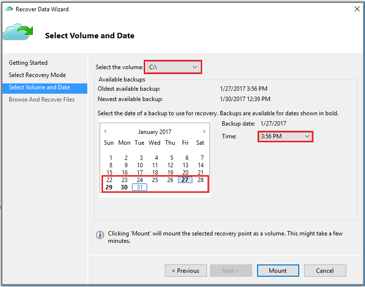
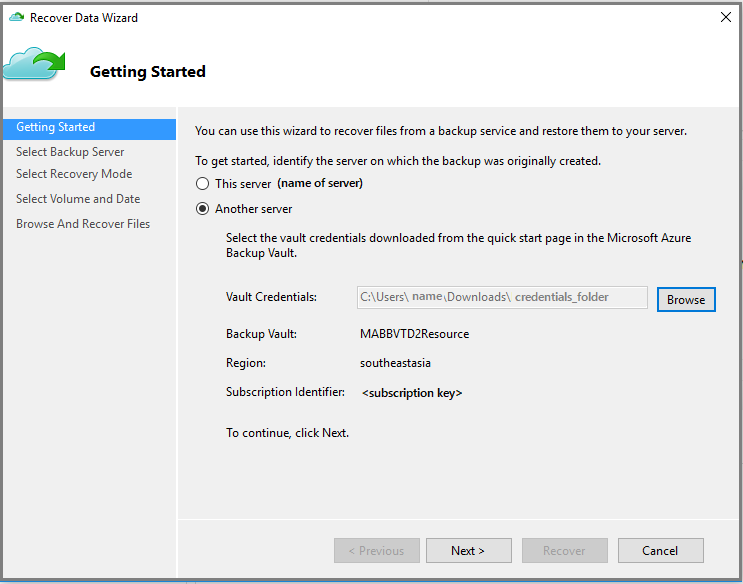

# 使用 Resource Manager 部署模型将文件还原到 Windows Server 或 Windows 客户端计算机

本文介绍如何从备份保管库还原数据。 若要还原数据，请在 Azure 恢复服务 (MARS) 代理中使用“恢复数据”向导。 还原数据时，可以采用以下方式：

- 将数据还原到备份时所在的同一台计算机。
- 将数据还原到备用计算机。

2017 年 1 月，Microsoft 发布了 MARS 代理的预览版更新。 除了提供 Bug 修补程序外，此更新还启用了“即时还原”，允许用户将可写入恢复点快照作为恢复卷装载。 随后，用户便可以浏览恢复卷，并将文件复制到本地计算机，从而选择性地还原文件。

> [!NOTE]
> 若要使用“即时还原”还原数据，必须安装 [2017 年 1 月 Azure 备份更新](https://support.microsoft.com/help/3216528?preview) 。 此外，必须在支持文章所列区域中的保管库内保护备份数据。 请查阅 [2017 年 1 月 Azure 备份更新](https://support.microsoft.com/help/3216528?preview) ，获取支持“即时还原”的区域的最新列表。 “即时还原”目前 **并非** 在所有区域都可用。
>

在 Azure 门户中将“即时还原”与恢复服务保管库配合使用。 如果在备份保管库中存储了数据，则这些保管库已转换为恢复服务保管库。 如果要使用“即时还原”，请下载 MARS 更新，并按照提及“即时还原”的过程进行操作。

[!INCLUDE [learn-about-deployment-models](../../includes/learn-about-deployment-models-rm-include.md)]

## 使用即时还原将数据恢复到同一台计算机

如果意外删除了某个文件并想要在同一台计算机（备份位置）中还原文件，以下步骤可帮助你恢复数据。

1. 打开 **Azure 备份** 管理单元。 如果不知道该管理单元的安装位置，请在计算机或服务器中搜索“Azure 备份” 。

    该桌面应用应会显示在搜索结果中。

2. 单击“恢复数据”  启动向导。

    

3. 要将数据还原到同一台服务器或计算机，请在“开始”窗格中选择“此服务器(`<server name>`)”，然后单击“下一步”。

    

4. 在“选择恢复模式”窗格中选择“单个文件和文件夹”，然后单击“下一步”。

    

5. 在“选择卷和日期”  窗格中，选择包含想要还原的文件和/或文件夹的卷。

    在日历中选择恢复点。 可从任意恢复时间点还原。 以 **粗体** 显示的日期表示至少有一个可用的恢复点。 选择日期后，如果有多个恢复点可用，请从“时间”  下拉菜单中选择特定的恢复点。

    

6. 选择要还原的恢复点后，单击“装载” 。

    Azure 备份会装载本地恢复点，并将其用作恢复卷。

7. 在“浏览和恢复文件”窗格中，单击“浏览”打开 Windows 资源管理器并找到所需的文件和文件夹。

    

8. 在 Windows 资源管理器中，复制想要还原的文件和/或文件夹，将其粘贴到服务器或计算机本地的任何位置。 可以从恢复卷直接打开或流式传输文件，并验证是否恢复了正确的版本。

    

9. 完成还原文件和/或文件夹后，请在“浏览和恢复文件”窗格中单击“卸载”。 然后单击“是”，确认要卸载该卷。

    

    > [!Important]
    > 如果不单击“卸载”，恢复卷将保持装载 6 个小时（从装载时算起）。 但是，如果正在持续进行文件复制，装载时间延长至最多 24 小时。 装载卷时，不会运行任何备份操作。 计划为在装载卷时运行的任何备份操作会在卸载恢复卷后运行。
    >

## 使用即时还原将数据还原到另一台计算机
如果整个服务器断开连接，仍可将 Azure 备份中的数据恢复到另一台计算机。 下面的步骤演示了工作流。

这些步骤中使用的术语包括：

- *源计算机* - 从其中创建备份并且当前不可用的原始计算机。
- *目标计算机* - 要将数据恢复到其中的计算机。
- *示例保管库* - *源计算机*和*目标计算机*注册到的恢复服务保管库。  

> [!NOTE]
> 不能将备份还原到运行早期版本的操作系统的目标计算机。 例如，在 Windows 7 计算机中创建的备份可以还原到 Windows 8 或更高版本的计算机。 但是，在 Windows 8 计算机上创建的备份无法还原到 Windows 7 计算机。
>
>

1. 在“目标计算机”中打开“Azure 备份”管理单元。

2. 确保“目标计算机”和“源计算机”已注册到同一个恢复服务保管库。

3. 单击“恢复数据”打开“恢复数据向导”。

    

4. 在“开始”窗格中选择“另一台服务器”

    

5. 提供对应于“示例保管库”的保管库凭据文件，然后单击“下一步”。

    如果保管库凭据文件无效（或已过期），请在 Azure 门户中从“示例保管库”下载新的保管库凭据文件。 提供有效的保管库凭据后，会显示相应备份保管库的名称。

6. 在“选择备份服务器”窗格中，从显示的计算机列表中选择“源计算机”并提供通行短语。 。

    

7. 在“选择恢复模式”窗格中选择“单个文件和文件夹”，然后单击“下一步”。

    

8. 在“选择卷和日期”  窗格中，选择包含想要还原的文件和/或文件夹的卷。

    在日历中选择恢复点。 可从任意恢复时间点还原。 以 **粗体** 显示的日期表示至少有一个可用的恢复点。 选择日期后，如果有多个恢复点可用，请从“时间”  下拉菜单中选择特定的恢复点。

    

9. 单击“装载”，在本地将恢复点装载为*目标计算机*上的恢复卷。

10. 在“浏览和恢复文件”窗格中，单击“浏览”打开 Windows 资源管理器并找到所需的文件和文件夹。

    

11. 在 Windows 资源管理器中，从恢复卷复制文件和/或文件夹，并将其粘贴到“目标计算机” 位置。 可以从恢复卷直接打开或流式传输文件，并验证是否恢复了正确的版本。

    

12. 完成还原文件和/或文件夹后，请在“浏览和恢复文件”窗格中单击“卸载”。 然后单击“是”，确认要卸载该卷。

    

    > [!Important]
    > 如果不单击“卸载”，恢复卷将保持装载 6 个小时（从装载时算起）。 但是，如果正在持续进行文件复制，装载时间延长至最多 24 小时。 装载卷时，不会运行任何备份操作。 计划为在装载卷时运行的任何备份操作会在卸载恢复卷后运行。
    >

## 故障排除
如果即使在单击“装载”几分钟后 Azure 备份仍无法成功装载恢复卷，或者无法装载具有一个或多个错误的恢复卷，请按照以下步骤正常恢复。

1.  取消正在进行的安装过程（如果它已运行了几分钟）。

2.  确保使用的是最新版本的 Azure 备份代理。 若要了解 Azure 备份代理的版本信息，请在 Azure 备份控制台的“操作”窗格上单击“关于 Azure 恢复服务代理”，并确保“版本”号等于或高于[本文](https://go.microsoft.com/fwlink/?linkid=229525)中提到的版本。 可以在[此处](https://go.microsoft.com/fwLink/?LinkID=288905)下载最新版本

3.  转到“设备管理器” -> “存储控制器”，确保可以找到“Microsoft iSCSI 发起程序”。 如果可以找到它，请直接转到下面的步骤 7。 

4.  如果无法在步骤 3 中找到“Microsoft iSCSI 发起程序”服务，请检查是否可以在“设备管理器” -> “存储控制器”下找到硬件 ID 为“ROOT\ISCSIPRT”的“未知设备”条目。

5.  右键单击“未知设备”并选择“更新驱动程序软件”。

6.  选择“自动搜索更新的驱动程序软件”选项，更新驱动程序。 完成更新后，“未知设备”应更改为“Microsoft iSCSI 发起程序”，如下所示。 

    

7.  转到“任务管理器” -> “服务(本地)” -> “Microsoft iSCSI 发起程序服务”。 

    
    
8.  右键单击服务，单击“停止”，然后再次右键单击服务并单击“启动”，即可重启 Microsoft iSCSI 发起程序服务。

9.  使用即时还原重试恢复。 

如果恢复仍失败，请重启服务器/客户端。 如果无法重启或重启服务器后恢复仍然失败，请尝试从备用计算机恢复，并通过转到 [Azure 门户](https://portal.azure.cn/?#blade/Microsoft_Azure_Support/HelpAndSupportBlade)并提交支持请求，与 Azure 支持部门联系。

## 后续步骤
- 恢复文件和文件夹后，可以[管理备份](backup-azure-manage-windows-server.md)。

<!--Update_Description: wording update -->