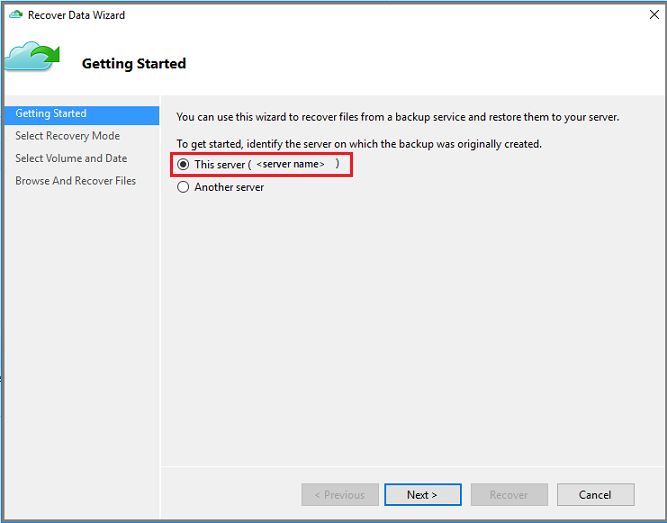
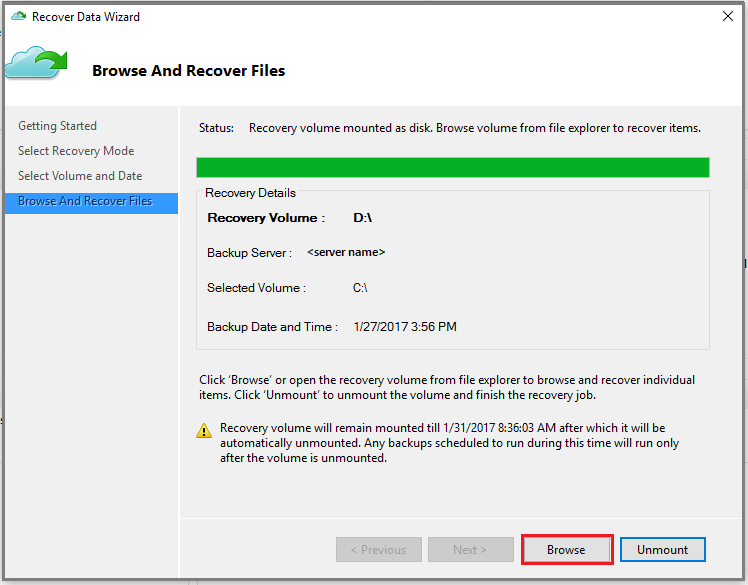
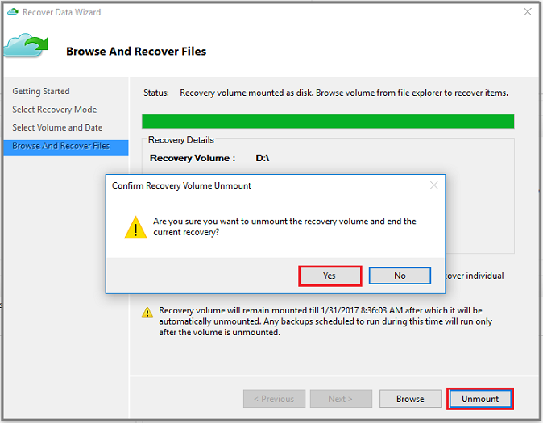
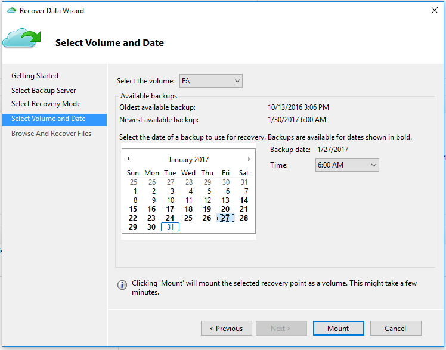

# 使用 Azure 资源管理器部署模型将文件还原到 Windows

本文介绍如何从备份保管库还原数据。 若要还原数据，请在 Azure 恢复服务 (MARS) 代理中使用“恢复数据”向导。 方法：

* 将数据还原到备份时所在的同一台计算机。
* 将数据还原到备用计算机。

使用“即时还原”功能可将可写入的恢复点快照作为恢复卷装载。 然后，可以浏览恢复卷，并将文件复制到本地计算机，从而选择性地还原文件。

> [!NOTE]
> 若要使用“即时还原”还原数据，必须安装 [2017 年 1 月 Azure 备份更新](https://support.microsoft.com/help/3216528?preview) 。 此外，必须在支持文章所列的区域中的保管库内保护备份数据。 请查阅 [2017 年 1 月 Azure 备份更新](https://support.microsoft.com/help/3216528?preview) ，获取支持“即时还原”的区域的最新列表。
>

在 Azure 门户中将“即时还原”与恢复服务保管库配合使用。 如果在备份保管库中存储了数据，则这些保管库已转换为恢复服务保管库。 如果要使用“即时还原”，请下载 MARS 更新，并按照提及“即时还原”的过程进行操作。

[!INCLUDE [learn-about-deployment-models](../../includes/learn-about-deployment-models-rm-include.md)]

## 使用“即时还原”将数据恢复到同一台计算机

如果意外删除了某个文件并想要在同一台计算机（备份位置）中还原文件，以下步骤可帮助你恢复数据。

1. 打开 **Azure 备份** 管理单元。 如果不知道该管理单元的安装位置，请在计算机或服务器中搜索“Azure 备份” 。

    该桌面应用应会显示在搜索结果中。

2. 选择“恢复数据”以启动向导。

    

3. 若要将数据还原到同一台服务器或计算机，请在“开始”页上选择“此服务器(`<server name>`)” > “下一步”。

    

4. 在“选择恢复模式”页上，选择“单个文件和文件夹” > “下一步”。

    
  > [!IMPORTANT]
  > 还原单个文件和文件夹的选项需要 .NET Framework 4.5.2 或更高版本。 如果未看到“单个文件和文件夹”选项，则必须将 .NET Framework 升级到 4.5.2 或更高版本，然后重试。

  > [!TIP]
  > 使用“单个文件和文件夹”选项可以快速访问恢复点数据。 它适用于恢复各个单独的文件，各个文件的总大小不能超过 80 GB，在恢复期间，它的传输或复制速度最高可达 6 MBps。 “卷”选项恢复指定卷中的所有备份数据。 此选项可提供更快的传输速度（高达 60 MBps），这适用于恢复大量数据或整个卷。

5. 在“选择卷和日期”页上，选择包含想要还原的文件和文件夹的卷。

    在日历中选择恢复点。 以 **粗体** 显示的日期表示至少有一个可用的恢复点。 如果单个日期有多个可用的恢复点，请从“时间”下拉菜单中选择特定的恢复点。

    

6. 选择要还原的恢复点之后，选择“装载”。

    Azure 备份会装载本地恢复点，并将其用作恢复卷。

7. 在“浏览和恢复文件”页上，选择“浏览”打开 Windows 资源管理器并找到所需的文件和文件夹。

    

8. 在 Windows 资源管理器中，复制想要还原的文件和文件夹，将其粘贴到服务器或计算机本地的任何位置。 可从恢复卷直接打开或流式传输文件，并验证是否恢复的是正确的版本。

    

9. 完成后，在“浏览和恢复文件”页上，选择“卸载”。 然后选择“是”，确认要卸载该卷。

    

    > [!Important]
    > 如果不选择“卸载”，恢复卷将保持装载 6 个小时（从装载时算起）。 但是，如果正在持续进行文件复制，装载时间延长至最多 24 小时。 装载卷时，不会运行任何备份操作。 计划为在装载卷时运行的任何备份操作会在卸载恢复卷后运行。
    >

## 使用即时还原将数据还原到另一台计算机
如果整个服务器断开连接，仍可将 Azure 备份中的数据恢复到另一台计算机。 下面的步骤演示了工作流。

这些步骤使用了以下术语：

* *源计算机* - 从其中创建备份并且当前不可用的原始计算机。
* *目标计算机* - 要将数据恢复到其中的计算机。
* *示例保管库* - 源计算机和目标计算机注册到的恢复服务保管库。  

> [!NOTE]
> 无法将备份还原到运行较低 操作系统版本的目标计算机。 例如，在 Windows 8（或更高版本）的计算机上，可以还原在 Windows 7 计算机中创建的备份。 但是，在 Windows 8 计算机上创建的备份无法还原到 Windows 7 计算机。
>
>

1. 在目标计算机中打开“Azure 备份”管理单元。

2. 确保目标计算机和源计算机已还原到同一个恢复服务保管库。

3. 选择“恢复数据”打开“恢复数据向导”。

    

4. 在“开始”页上选择“另一台服务器”。

    

5. 提供对应于示例保管库的保管库凭据文件，并选择“下一步”。

    如果保管库凭据文件无效（或已过期），请在 Azure 门户中从示例保管库下载新的保管库凭据文件。 提供有效的保管库凭据后，会显示相应备份保管库的名称。

6. 在“选择备份服务器”窗格中，从显示的计算机列表中选择源计算机并提供通行短语。 然后，选择“下一步”。

    

7. 在“选择恢复模式”页上，选择“单个文件和文件夹” > “下一步”。

    

8. 在“选择卷和日期”页上，选择包含想要还原的文件和文件夹的卷。

    在日历中选择恢复点。 以 **粗体** 显示的日期表示至少有一个可用的恢复点。 如果单个日期有多个可用的恢复点，请从“时间”下拉菜单中选择特定的恢复点。

    

9. 选择“装载”，在本地将恢复点装载为目标计算机上的恢复卷。

10. 在“浏览和恢复文件”页上，选择“浏览”打开 Windows 资源管理器并找到所需的文件和文件夹。

    

11. 在 Windows 资源管理器中，从恢复卷复制文件和文件夹，并将其粘贴到目标计算机位置。 可以从恢复卷直接打开或流式传输文件，并验证是否恢复了正确的版本。

    

12. 完成后，在“浏览和恢复文件”页上，选择“卸载”。 然后选择“是”，确认要卸载该卷。

    

    > [!Important]
    > 如果不选择“卸载”，恢复卷将保持装载 6 个小时（从装载时算起）。 但是，如果正在持续进行文件复制，装载时间延长至最多 24 小时。 装载卷时，不会运行任何备份操作。 计划为在装载卷时运行的任何备份操作会在卸载恢复卷后运行。
    >

## 后续步骤
恢复文件和文件夹后，可以[管理备份](backup-azure-manage-windows-server.md)。

<!-- Update_Description: wording update -->