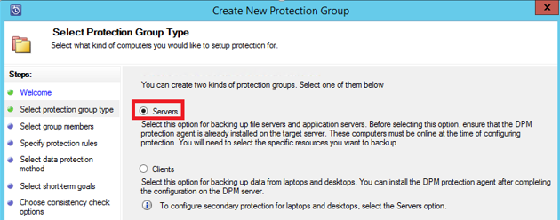
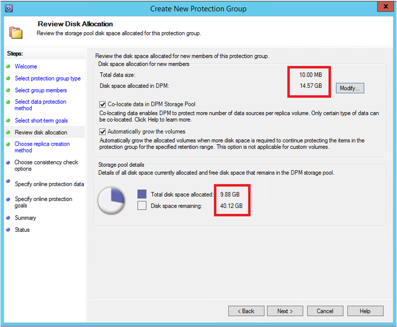
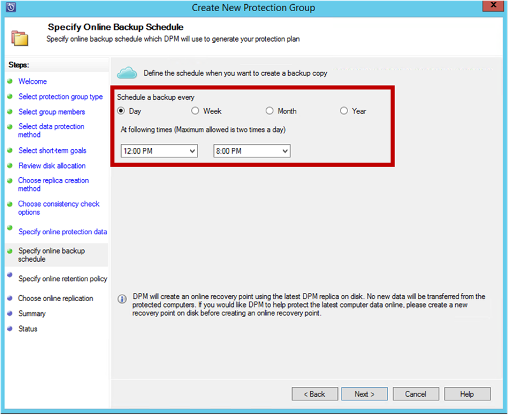
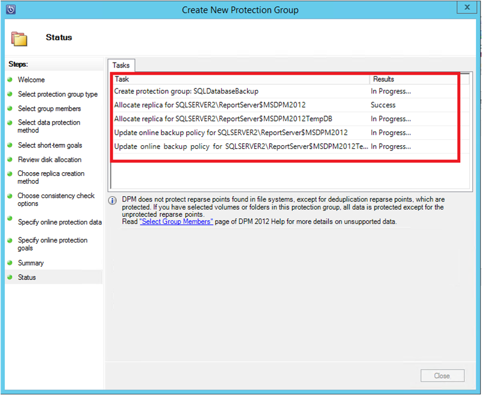
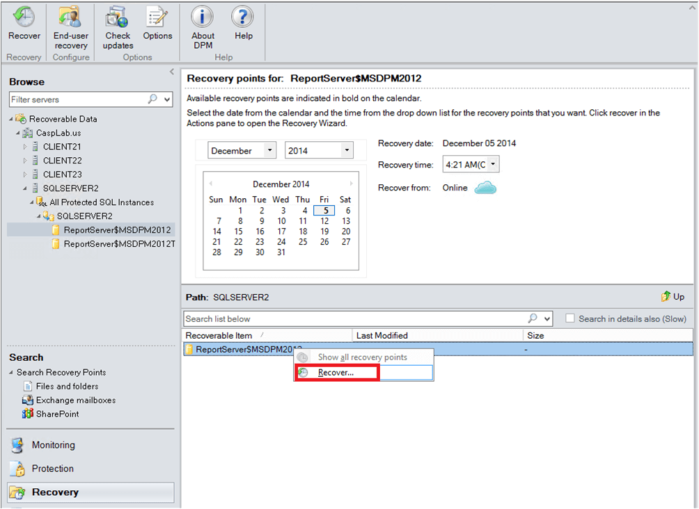

# 使用 Azure 备份服务器将 SQL Server 备份到 Azure

本文帮助你使用 Microsoft Azure 备份服务器 (MABS) 设置 SQL Server 数据库的备份。

若要备份 SQL Server 数据库并从 Azure 恢复该数据库：

1. 创建一个备份策略以便在 Azure 中保护 SQL Server 数据库。
1. 在 Azure 中创建按需备份副本。
1. 恢复 Azure 中的数据库。

## 开始之前

在开始之前，请确保[已安装并准备好 Azure 备份服务器](backup-azure-microsoft-azure-backup.md)。

## 创建备份策略 

若要在 Azure 中保护 SQL Server 数据库，请先创建一个备份策略：

1. 在 Azure 备份服务器中，选择“保护”工作区。 
1. 选择“新建”以创建保护组。 

    
1. 在“开始”页上，查看有关创建保护组的指导。 然后，选择“下一步”  。
1. 对于保护组类型，请选择“服务器”。 

    
1. 展开要备份的数据库所在的 SQL Server 计算机。 将会看到可从该服务器备份的数据源。 展开“所有 SQL 共享”，然后选择要备份的数据库。  此示例选择了 ReportServer$MSDPM2012 和 ReportServer$MSDPM2012TempDB。 选择“**下一步**”。

    
1. 为保护组命名，然后选择“我需要在线保护”。 

    
1. 在“指定短期目标”页上，提供在磁盘中创建备份点所需的输入。 

    在此示例中，“保留期”设置为“5 天”。   备份“同步频率”设置为每隔“15 分钟”一次。   “快速完整备份”设置为“晚上 8:00”。  

    

   > [!NOTE]
   > 在此示例中，将在每天晚上 8:00 创建一个备份点。 自前一天晚上 8:00 的备份点以来修改了的数据将被传输。 此过程称为 **快速完整备份**。 尽管事务日志每隔 15 分钟同步一次，但如果需要在晚上 9:00 恢复数据库，则会重播自上一个快速完整备份点（在本示例中为晚上 8:00）以来的日志，从而创建备份点。
   >
   >

1. 选择“**下一步**”。 MABS 将显示可用的总存储空间。 它还显示潜在的磁盘空间利用率。

    

    默认情况下，MABS 将为每个数据源（SQL Server 数据库）创建一个卷。 该卷用作初始备份副本。 在此配置中，逻辑磁盘管理器 (LDM) 将 MABS 保护限制到 300 个数据源（SQL Server 数据库）。 若要避免此限制，请选择“在 DPM 存储池中共置数据”。  如果使用此选项，MABS 将对多个数据源使用单个卷。 这种设置可让 MABS 保护最多 2,000 个 SQL Server 数据库。

    如果选择“自动增大卷”，MABS 可以随着生产数据的增长考虑增大备份卷。  如果未选择“自动增大卷”，MABS 会限制保护组中用于备份数据源的备份存储的大小。 
1. 如果你是管理员，可以选择“自动通过网络”传输此初始备份并选择传输时间。  或者选择“手动”传输备份。  然后，选择“下一步”  。

    

    初始备份副本需要传输整个数据源（SQL Server 数据库）。 备份数据会从生产服务器（SQL Server 计算机）传输到 MABS。 如果此备份很大，通过网络传输数据可能会造成带宽拥塞。 出于此原因，管理员可以选择使用可移动媒体以“手动”方式传输初始备份。  或者，他们可以在指定的时间“自动通过网络”传输数据。 

    初始备份完成后，备份将在初始备份副本的基础上以增量方式继续进行。 增量备份往往比较小，能轻松地通过网络传输。
1. 选择何时运行一致性检查。 然后，选择“下一步”  。

    

    MABS 可以运行一致性检查来检查备份点的完整性。 它会计算生产服务器（在本示例中为 SQL Server 计算机）上的备份文件和 MABS 中该文件的已备份数据的校验和。 如果检查发现冲突，则认为 MABS 中的备份文件已损坏。 MABS 通过发送与校验和不匹配部分相对应的块，来修复备份的数据。 由于一致性检查是对性能影响很大的操作，因此管理员可以选择是按计划运行还是自动运行一致性检查。
1. 选择要在 Azure 中保护的数据源。 然后，选择“下一步”  。

    
1. 如果你是管理员，可以选择适合组织策略的备份计划和保留策略。

    

    在此示例中，将在每天中午 12:00 和晚上 8:00 创建备份。

    > [!TIP]
    > 若要快速恢复，可在磁盘上设置几个短期恢复点。 这些恢复点适用于“操作恢复”。 Azure 提供很高的 SLA 和有保障的可用性，因此可充当理想的场外位置。
    >
    > 使用 Data Protection Manager (DPM) 将 Azure 备份安排在本地磁盘备份完成之后进行。 如果遵循此做法，最新的磁盘备份将复制到 Azure。
    >

1. 选择保留策略计划。 有关保留策略工作原理的详细信息，请参阅[使用 Azure 备份来取代磁带基础结构](backup-azure-backup-cloud-as-tape.md)。

    

    在本示例中：

    * 将在每天中午 12:00 和晚上 8:00 创建备份。 备份保留 180 天。
    * 在星期六中午 12:00 创建的备份将保留 104 周。
    * 在每月最后一个星期六中午 12:00 创建的备份将保留 60 个月。
    * 在 3 月最后一个星期六中午 12:00 创建的备份将保留 10 年。

    选择保留策略后，选择“下一步”。 
1. 选择如何将初始备份副本传输到 Azure。

    * “自动通过网络”选项按照备份计划将数据传输到 Azure。 

    选择传输机制后，选择“下一步”。 
1. 在“摘要”页上复查策略详细信息。  然后选择“创建组”。  可以选择“关闭”，并在“监视”工作区中监视作业进度。  

    

## 创建 SQL Server 数据库的按需备份副本

首次备份时会创建一个恢复点。 可以手动触发恢复点的创建，而不必等待计划运行：

1. 在保护组中，确保数据库状态为“正常”。 

    
1. 右键单击该数据库并选择“创建恢复点”。 

    
1. 在下拉菜单中选择“在线保护”。  然后选择“确定”开始在 Azure 中创建恢复点。 

    
1. 可以在“监视”工作区中查看作业进度。  

    

## 从 Azure 恢复 SQL Server 数据库

若要从 Azure 恢复受保护的实体（例如某个 SQL Server 数据库）：

1. 打开 DPM 服务器管理控制台。 转到“恢复”工作区查看 DPM 备份的服务器。  选择数据库（在本示例中为 ReportServer$MSDPM2012）。 选择以 **Online** 结尾的**恢复时间**。

    
1. 右键单击数据库名称并选择“恢复”。 

    
1. DPM 会显示恢复点的详细信息。 选择“**下一步**”。 选择恢复类型“**恢复到 SQL Server 的原始实例**”。 然后，选择“下一步”  。

    

    在本示例中，DPM 允许将数据库恢复到另一个 SQL Server 实例或独立的网络文件夹。
1. 在“指定恢复选项”页上，可以选择恢复选项。  例如，可以选择“网络带宽使用限制”，以限制恢复操作所占用的带宽。  然后，选择“下一步”  。
1. 在“摘要”页上，可以看到当前的恢复配置。  选择“恢复”。 

    恢复状态显示数据库正在恢复。 可以选择“关闭”来关闭向导，并在“监视”工作区中查看进度。  

    

    恢复完成后，还原的数据库将与应用程序保持一致。

### 后续步骤

有关详细信息，请参阅 [Azure 备份常见问题解答](backup-azure-backup-faq.md)。
