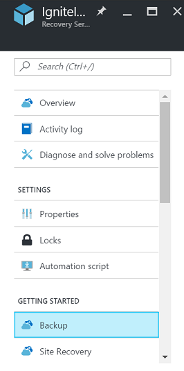
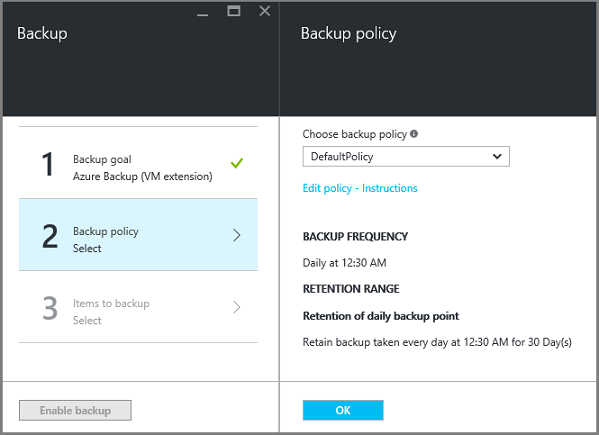
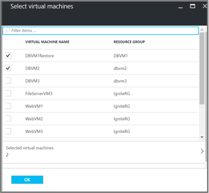
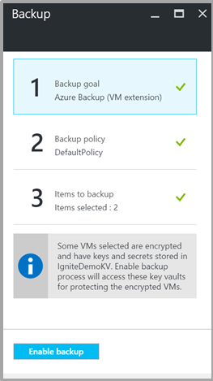

# 使用 Azure 备份来备份和还原加密型 VM
本文介绍使用 Azure 备份来备份和还原虚拟机的步骤， 同时提供有关支持的方案、先决条件和错误案例故障排除步骤的详细信息。

## 支持的方案
> [!NOTE]
> 1. 仅 Resource Manager 部署型虚拟机支持备份和还原加密型 VM。 经典部署型虚拟机不支持此功能。  
> 2. 使用 Azure 磁盘加密的 Windows 和 Linux 虚拟机支持此功能，Azure 磁盘加密利用 Windows 的行业标准 BitLocker 功能和 Linux 的 DM-Crypt 功能加密磁盘。  
> 3. 仅同时使用 BitLocker 加密密钥和密钥加密密钥进行加密的虚拟机支持此功能。 仅使用 BitLocker 加密密钥进行加密的虚拟机不支持此功能。  
>
>

## 先决条件
1. 虚拟机已使用 Azure 磁盘加密进行加密。 虚拟机应同时使用 BitLocker 加密密钥和密钥加密密钥进行加密。
2. 已创建恢复服务保管库并已按照[为备份做环境准备](./backup-azure-arm-vms-prepare.md)一文中所提到的步骤设置存储复制。

## 备份加密型 VM
使用以下步骤设置备份目标、定义策略、配置项和触发备份。

### 配置备份
1. 如果已打开恢复服务保管库，请转到下一步。 如果没有打开恢复服务保管库，但位于 Azure 门户中，请在“中心”菜单中单击“浏览” 。

   - 在资源列表中，键入“恢复服务”。
   - 开始键入时，会根据输入筛选该列表。 出现“恢复服务保管库”时，请单击它。

        

     此时将显示恢复服务保管库列表。 在恢复服务保管库列表中选择一个保管库。

     此时将打开选定的保管库仪表板。
2. 从保管库下显示的项列表中，单击“备份”  打开“备份”边栏选项卡。

      
3. 在“备份”边栏选项卡中，单击“备份目标”打开“备份目标”边栏选项卡。

      
4. 在“备份目标”边栏选项卡中，将“工作负荷的运行位置”设置为“Azure”，并将“要备份的项”设置为“虚拟机”，然后单击“确定”。

   随即关闭“备份目标”边栏选项卡，然后打开“备份策略”边栏选项卡。

   
5. 在“备份策略”边栏选项卡中选择要应用到保管库的备份策略，然后单击“确定”。

      

    默认策略的详细信息将在详细信息中列出。 如果要创建策略，请从下拉菜单中选择“新建”。 单击“确定”后，备份策略将与保管库相关联。

    接下来，选择要与保管库关联的 VM。
6. 选择要与指定策略关联的加密型虚拟机，然后单击“确定” 。

      
7. 此页显示与所选加密型 VM 关联的密钥保管库的消息。 备份服务需要对密钥保管库中的密钥和机密的只读访问权限。 它使用这些权限备份密钥和机密，以及关联的 VM。

      

      现在，已定义保管库的所有设置，接下来请在“备份”边栏选项卡中，单击页面底部的“启用备份”。 “启用备份”会将策略部署到保管库和 VM。
8. 下一个阶段的准备工作是安装 VM 代理，或确保 VM 代理已安装。 若要执行相同操作，请使用[准备备份环境](./backup-azure-arm-vms-prepare.md)一文中所述的步骤。

## 还原加密型 VM
若要还原已加密的 VM，请先使用“选择 VM 还原配置”的 **还原已备份磁盘** 部分中提到的步骤还原磁盘。 之后，使用[从还原的磁盘创建 VM](./backup-azure-vms-automation.md#create-a-vm-from-restored-disks) 中提到的 PowerShell 步骤从还原的磁盘创建完整的 VM。

## 排查错误
| 操作 | 错误详细信息 | 解决方法 |
| --- | --- | --- |
| 备份 |验证失败，因为虚拟机仅使用 BEK 进行加密。 仅可为同时使用 BEK 和 KEK 进行加密的虚拟机启用备份。 |虚拟机应使用 BEK 和 KEK 进行加密。 首先解密 VM，然后使用 BEK 和 KEK 对其进行加密。 使用 BEK 和 KEK 对 VM 进行加密后，即可启用备份。  |
| 还原 |无法还原此加密型 VM，因为与此 VM 关联的密钥保管库不存在。 |按照 [Azure Key Vault 入门](../key-vault/key-vault-get-started.md)中的步骤创建 Key Vault。 请参阅[使用 Azure 备份还原 Key Vault 密钥和机密](./backup-azure-restore-key-secret.md)一文，还原密钥和机密（如果它们不存在）。 |
| 还原 |无法还原此加密型 VM，因为与此 VM 关联的密钥和机密不存在。 |请参阅[使用 Azure 备份还原 Key Vault 密钥和机密](./backup-azure-restore-key-secret.md)一文，还原密钥和机密（如果它们不存在）。 |
| 还原 |备份服务无权访问用户订阅中的资源。 |如上所述，先使用“选择 VM 还原配置”的 **还原已备份磁盘** 部分中提到的步骤还原磁盘。 之后，使用 PowerShell [从还原的磁盘创建 VM](./backup-azure-vms-automation.md#create-a-vm-from-restored-disks)。
