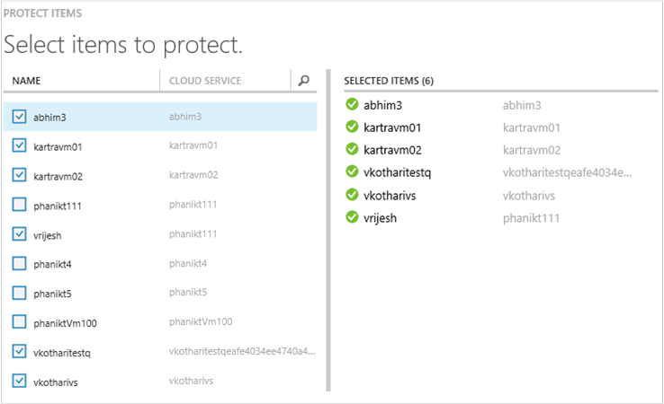
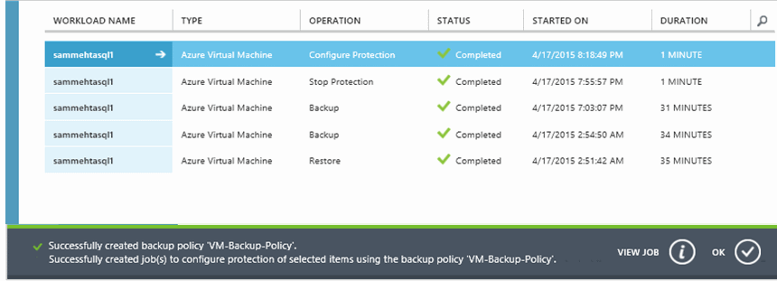

# 初步了解：备份 Azure 虚拟机
> [!div class="op_single_selector"]
> * [使用恢复服务保管库保护 VM](backup-azure-vms-first-look-arm.md)
> * [使用备份保管库保护 Azure VM](backup-azure-vms-first-look.md)
>
>

本教程引导完成将 Azure 虚拟机 (VM) 备份到 Azure 备份保管库的步骤。 本文介绍用于备份 VM 的经典模型或服务管理器部署模型。 以下步骤仅适用于在经典管理门户中创建的备份保管库。 Microsoft 建议新部署使用 Resource Manager 模型。

如果对将 VM 备份到属于资源组的恢复服务保管库感兴趣，请参阅[初步了解：使用恢复服务保管库保护 VM](backup-azure-vms-first-look-arm.md)。

若要顺利完成本教程，必须满足以下先决条件：

- 已在 Azure 订阅中创建了一个 VM。
- VM 已连接到 Azure 公共 IP 地址。 有关更多信息，请参阅[网络连接](backup-azure-vms-prepare.md#network-connectivity)。

> [!NOTE]
> Azure 有两种用于创建和使用资源的部署模型： [Resource Manager 部署模型和经典部署模型](../azure-resource-manager/resource-manager-deployment-model.md)。 本教程适用于在经典管理门户中创建的虚拟机。
>
>

## 创建备份保管库
备份保管库是存储所有按时间创建的备份和恢复点的实体。 备份保管库还包含应用到要备份的虚拟机的备份策略。

> [!IMPORTANT]
> 从 2017 年 3 月开始，无法再使用经典管理门户来创建备份保管库。
> 可将备份保管库升级到恢复服务保管库。 有关详细信息，请参阅文章[将备份保管库升级到恢复服务保管库](backup-azure-upgrade-backup-to-recovery-services.md)。 Microsoft 鼓励将备份保管库升级到恢复服务保管库。  2017 年 10 月 15 日之后，将无法使用 PowerShell 创建备份保管库。 2017 年 11 月 1 日之前：
>- 其余所有备份保管库都将自动升级到恢复服务保管库。
>- 无法在经典管理门户中访问备份数据。 应使用 Azure 门户在恢复服务保管库中访问备份数据。
>

## 发现并注册 Azure 虚拟机
向保管库注册 VM 之前，请运行发现过程以识别所有新 VM。 随后返回订阅中虚拟机的列表和其他信息，例如云服务名称和区域。

1. 登录 [Azure 经典管理门户](http://manage.windowsazure.cn/)
2. 在 Azure 经典管理门户中，单击“恢复服务”  打开恢复服务保管库列表。
    
3. 从保管库列表中，选择要备份 VM 的保管库。

    选择保管库时，它会在“快速启动”  页中打开
4. 在保管库菜单中，单击“已注册项” 。

    
5. 在“**类型**”菜单中选择“**Azure 虚拟机**”。

    
6. 单击页面底部的“**发现**”。
    

    在以表格显示虚拟机时，发现过程可能会需要几分钟。 屏幕底部有一个通知，让你知道系统正在运行发现过程。

    

    发现过程完成后，该通知会变化。

    
7. 单击页面底部的“**注册**”。
    
8. 在“**注册项**”快捷菜单中，选择要注册的虚拟机。

   > [!TIP]
   > 可以一次注册多个虚拟机。
   >
   >

    为每一个选定的虚拟机创建一个作业。
9. 单击通知中的“**查看作业**”，转到“**作业**”页。

    

    虚拟机还会出现在注册项列表中，并会显示注册操作的状态。

    

    操作完成后，状态会更改，以反映 *已注册* 状态。

    

## 在虚拟机中安装 VM 代理
Azure VM 代理必须安装在 Azure 虚拟机上，备份扩展才能运行。 如果 VM 是从 Azure 库创建的，则该 VM 上已存在 VM 代理；可以跳到[保护 VM](backup-azure-vms-first-look.md#create-the-backup-policy)。

如果 VM 是从本地数据中心迁移的，则该 VM 上可能尚未安装 VM 代理。 必须先在虚拟机上安装 VM 代理，才能继续保护 VM。 有关安装 VM 代理的详细步骤，请参阅 [“备份 VMs”一文中“VM 代理”部分](backup-azure-vms-prepare.md#vm-agent)。

## 创建备份策略 
在触发初始备份作业之前，请设置计划来规定何时创建备份快照。 规定备份快照创建时间以及快照保留时长的计划就是备份策略。 保留期信息基于祖父-父-子备份轮转方案。

1. 导航到备份保管库（位于 Azure 经典管理门户的“恢复服务”下），然后单击“已注册项”。
2. 从下拉菜单中选择“**Azure 虚拟机**”。

    
3. 单击页面底部的“保护”  。
    

    此时显示**受保护的项向导** ，其中 *只* 列出了已注册但未受保护的虚拟机。

    
4. 选择要保护的虚拟机。

    如果存在两个以上的同名虚拟机，请使用云服务来区别虚拟机。
5. 在“配置保护”  菜单中，选择现有策略或创建新策略，以保护标识的虚拟机。

    新备份保管库与一个默认策略相关联。 此策略在每天晚上创建每日快照，该每日快照将保留 30 天。 每个备份策略可以有多个关联的虚拟机。 但是，虚拟机一次只能与一个策略相关联。

    

   > [!NOTE]
   > 备份策略包括计划备份的保留期方案。 如果选择现有的备份策略，则不能修改下一步的保留期选项。
   >
   >
6. 在“保留期”  中，定义特定备份点的每日、每周、每月和每年范围。

    

    保留策略指定存储备份的时间长短。 可以根据备份的时间指定不同的保留策略。
7. 单击“作业”查看“配置保护”作业的列表。

    

    现在已创建策略，接下来请转到下一步骤，运行初始备份。

## 初始备份
在虚拟机受到策略保护后，可以在“ **受保护的项** ”选项卡上查看该关系。在执行初始备份之前，“保护状态”会显示为“受保护 - (等待初始备份)”。 默认情况下，第一个计划的备份是 *初始备份*。

若要立即开始初始备份，请执行以下操作：

1. 在“受保护的项”页底部，单击“立即备份”。
    

    Azure 备份服务将为初始备份操作创建备份作业。
2. 单击“**作业**”选项卡查看作业列表。

    

    完成初始备份后，“受保护的项”选项卡中的虚拟机状态将显示为“受保护”。

    

   > [!NOTE]
   > 备份虚拟机是在本地完成的过程。 不能将一个区域的虚拟机备份到另一个区域的备份保管库。 因此，对于每个需要备份 VM 的 Azure 区域，需要在该区域中至少创建一个备份保管库。
   >
   >

## 后续步骤
成功备份 VM 后，你可能需要执行几个后续步骤。 最合理的步骤是熟悉将数据还原到 VM 的操作。 但是，有几个管理任务可帮助了解如何确保数据安全和最大限度地降低成本。

- [管理和监视虚拟机](backup-azure-manage-vms.md)
- [恢复虚拟机](backup-azure-restore-vms.md)
- [故障排除指南](backup-azure-vms-troubleshoot.md)

## 有疑问？
如果有疑问，或者希望包含某种功能，请 [给我们反馈](http://aka.ms/azurebackup_feedback)。

<!--Update_Description: wording update -->