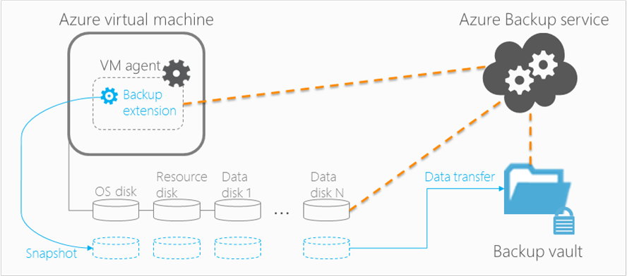

# <a name="about-azure-vm-backup"></a>关于 Azure VM 备份

本文介绍 [Azure 备份服务](backup-introduction-to-azure-backup.md)如何备份 Azure VM。

## <a name="backup-process"></a>备份过程

下面描述 Azure 备份如何对 Azure VM 完成备份。

1. 对于选择进行备份的 Azure VM，Azure 备份服务将根据指定的备份计划启动备份作业。
2. 该服务触发备份扩展。
    - Windows VM 使用 _VMSnapshot_ 扩展。
    - Linux VM 使用 _VMSnapshotLinux_ 扩展。
    - 在第一个 VM 备份期间安装扩展。
    - 若要安装扩展，VM 必须处于运行状态。
    - 如果 VM 未运行，备份服务会创建基础存储的快照（因为在 VM 停止时不会发生任何应用程序写入）。
4. 备份扩展创建存储级别的应用一致性快照。
5. 创建快照后，数据将传输到保管库。 为最大限度地提高效率，服务仅标识并传输自上次备份以来已更改的数据块（增量备份）。
5. 数据传输完成后，会删除快照并创建恢复点。



## <a name="data-encryption"></a>数据加密

在备份过程中，Azure 备份不会加密数据。 Azure 备份确实支持备份使用 Azure 磁盘加密进行加密的 Azure VM。

- 对于托管和非托管式 Azure VM，支持备份仅使用 Bitlocker 加密密钥 (BEK) 加密的 VM，以及结合使用 BEK 和密钥加密密钥 (KEK) 加密的 VM。
- 备份的 BEK（机密）和 KEK（密钥）已加密，因此，只有在经授权的用户将它们还原到 Key Vault 之后，才能读取和使用它们。
- 由于同时备份 BEK，在 BEK 丢失的情况下，经授权的用户可将 BEK 还原到 KeyVault，然后恢复已加密的 VM。 已加密 VM 的密钥和机密将以加密的形式进行备份，因此，未经授权的用户和 Azure 都无法读取或使用备份的密钥与机密。 只有拥有适当权限级别的用户可以备份和还原已加密的 VM 以及密钥和机密。

## <a name="snapshot-consistency"></a>快照一致性

若要在应用运行时创建快照，Azure 备份将会创建应用一致性快照。

- **Windows VM**：对于 Windows VM，备份服务将与卷影复制服务 (VSS) 相协调，以获取 VM 磁盘的一致性快照。
    - 默认情况下，Azure 备份创建完整的 VSS 备份。 [了解详细信息](http://blogs.technet.com/b/filecab/archive/2008/05/21/what-is-the-difference-between-vss-full-backup-and-vss-copy-backup-in-windows-server-2008.aspx)。
    - 若要更改设置，使 Azure 备份创建 VSS 副本备份，请设置以下注册表项：
        ```
        [HKEY_LOCAL_MACHINE\SOFTWARE\MICROSOFT\BCDRAGENT]
        ""USEVSSCOPYBACKUP"="TRUE"
        ```
- **Linux VM**：若要在 Azure 备份创建快照时确保 Linux VM 的应用一致性，可以使用 Linux 前脚本和后脚本框架。 可以编写自己的自定义脚本来确保创建 VM 快照时的一致性。
    -  Azure 备份只调用你编写的前脚本和后脚本。
    - 如果前脚本和后脚本成功执行，Azure 备份会将恢复点标记为应用程序一致。 但是，你最终要为使用自定义脚本时的应用程序一致性负责。
    - [详细了解](backup-azure-linux-app-consistent.md)如何配置脚本。


#### <a name="consistency-types"></a>一致性类型

下表解释了不同的一致性类型。

**快照** | **基于 VSS** | **详细信息** | **恢复**
--- | --- | --- | ---
**应用程序一致** | 是（仅限 Windows） | 应用一致性备份捕获内存内容和挂起的 I/O 操作。 应用一致性快照使用 VSS 编写器（或适用于 Linux 的前/后脚本）来确保备份之前的应用数据一致性。 | 使用应用一致性快照进行恢复时，VM 将会启动。 不会发生数据损坏或丢失。 应用将以一致的状态启动。
**文件系统一致** | 是（仅限 Windows） |  文件一致性备份同时创建所有文件的快照，为磁盘文件提供一致性备份。<br/><br/> 对于以下备份而言，Azure 备份恢复点是文件一致性的：<br/><br/> - 没有前/后脚本的或者脚本失败的 Linux VM 备份。<br/><br/> - VSS 失败的 Windows VM 备份。 | 使用文件一致性快照进行恢复时，VM 将会启动。 不会发生数据损坏或丢失。 应用需要实现自身的“修复”机制来确保还原数据的一致性。
**崩溃一致** | 否 | 如果在备份时 Azure VM 关闭，则往往会发生崩溃一致性。  仅会捕获和备份备份时磁盘上已存在的数据。<br/><br/> 崩溃一致性恢复点不保证操作系统或应用数据的一致性。 | VM 通常会启动，然后执行磁盘检查来修复损坏错误，但不能保证这一点。 未传输到磁盘的任何内存中数据或写入内容将会丢失。 应用实现自身的数据验证。 例如，对于数据库应用而言，如果事务日志中的条目不在数据库中，则数据库软件将执行回滚，直到数据一致。


## <a name="service-and-subscription-limits"></a>服务和订阅限制

Azure 备份在订阅和保管库方面施加许多限制。

[!INCLUDE [azure-backup-limits](../../includes/azure-backup-limits.md)]


## <a name="backup-performance"></a>备份性能

### <a name="disk-considerations"></a>磁盘注意事项

备份会尽量以最快的速度完成，同时尽最大的数量消耗资源。

- 为了最大限度加快速度，备份过程会尝试并行备份每个 VM 磁盘。
- 例如，如果 VM 有 4 个磁盘，则服务会尝试并行备份所有 4 个磁盘。
- 决定存储帐户备份流量的最重要因素是备份的磁盘数。
- I/O 操作总次数由单个 Blob 的目标吞吐量限制为每秒 60 MB。
- 对于每个要备份的磁盘，Azure 备份将读取磁盘上的块，并只存储更改的数据（增量备份）。 可以使用下面的平均吞吐量值估算备份给定大小的磁盘所需的时间。

    **操作** | **最佳吞吐量**
    --- | ---
    初始备份 | 160 Mbps |
    增量备份 | 640 Mbps <br><br> 如果增量数据分散在磁盘中，则吞吐量会显著下降。|


### <a name="scheduling-considerations"></a>计划注意事项

备份计划会影响性能。

- 如果将策略配置为同时备份所有 VM，则会出现流量拥塞，因为备份过程会尝试并行备份所有磁盘。
- 若要减少备份流量，请在一天的不同时间备份不同 VM，并且时间不重叠。


### <a name="time-considerations"></a>时间注意事项

尽管大部分备份时间花在读取和复制数据上，但其他操作也会影响到备份 VM 所需的总时间：

- **安装备份扩展**：安装或更新备份扩展所需的时间。
- **触发快照**：触发快照花费的时间。 接近计划的备份时间时触发快照。
- **队列等待时间**：由于备份服务同时处理来自多个客户存储帐户的作业，快照数据可能无法立即复制到恢复服务保管库。 在负载高峰，最长可能需要八小时才能处理完备份。 但是，每日备份策略规定的 VM 备份总时间不会超过 24 小时。
- **初始备份**：增量备份的总备份时间不超过 24 小时，但是，首次备份可能并非如此。 所需的时间取决于数据大小和备份时间。
- **数据传输时间**：备份服务计算上一备份中的增量更改并将更改传输到保管库存储所需的时间。

### <a name="factors-affecting-backup-time"></a>影响备份时间的因素

备份包括两个阶段：创建快照，以及将快照传输到保管库。 备份服务针对存储进行相关优化。

- 将快照数据传输到保管库时，服务仅传输上一个快照的增量更改。
- 为确定增量更改，服务会计算块的校验和。
    - 如果一个块发生更改，则该块会被标识为要发送到保管库的块。
    - 服务进一步钻取到每个已标识的块，寻找机会尽量减少要传输的数据。
    - 评估所有已更改块后，服务联合更改并将其发送到保管库。

可能会影响备份时间的情况包括：


- **新添加到已受保护 VM 的磁盘的初始备份**：如果 VM 正在进行增量备份，添加新磁盘后，备份可能会失去一天的 SLA，具体取决于新磁盘的大小。
- **应用碎片化**：如果应用的配置不当，它可能并不十分适合存储：
    - 如果快照包含很多小的分段写入，则服务会花费额外时间处理应用程序写入的数据。
    - 对于在 VM 内部运行的应用程序，建议的应用程序写入块的最小值是 8 KB。 如果应用程序使用大小小于 8 KB 的块，则备份性能会受影响。
- **存储帐户过载**：当应用在生产环境中运行，或者在同一存储帐户中托管 5 到 10 个以上的磁盘时，可以计划备份。
- **一致性检查 (CC) 模式**：对于大于 1TB 的磁盘，可以出于以下原因在 CC 模式下进行备份：
    - 托管磁盘在 VM 重新启动过程中进行移动。
    - 将快照提升到基础 Blob。


## <a name="restore-considerations"></a>还原注意事项

还原操作包括两个主要任务：将数据从保管库复制回到所选的存储帐户，以及创建虚拟机。 从保管库复制数据所需的时间取决于备份存储在 Azure 中的位置，以及存储帐户的位置。 复制数据所花的时间取决于：

- **队列等待时间**：由于服务同时处理来自多个存储帐户的还原作业，因此还原请求会排入队列。
- **数据复制时间**：将数据从保管库复制到存储帐户。 还原时间取决于 Azure 备份服务使用的所选存储帐户的 IOPS 和吞吐量。 若要减少还原过程期间的复制时间，请选择一个未加载其他应用程序写入和读取的存储帐户。

## <a name="best-practices"></a>最佳实践

我们建议在配置 VM 备份时遵循以下做法：

- 请勿计划同时在一个保管库中备份 100 台以上的 VM。
- 将 VM 备份安排在非高峰时间进行。 这样，备份服务会使用 IOPS 将数据从存储帐户传输到保管库。
- 如果备份托管磁盘，Azure 备份服务会处理存储管理。 如果备份非托管磁盘：
    - 确保将备份策略应用于多个存储帐户中的 VM。
    - 同一个备份计划所保护的来自单个存储帐户的磁盘数不应超过 20 个。
    - 如果存储帐户中的磁盘超过 20 个，可将这些 VM 分散到多个策略中，以便在备份过程的传输阶段能够获得所需的 IOPS。
    - 不要将运行在高级存储上的 VM 还原到同一存储帐户。 如果还原操作过程与备份操作一致，则会减少备份的可用 IOPS。
    - 针对 VM 备份堆栈 V1 上的高级 VM 备份，应仅分配总存储帐户空间的 50%，这样使备份服务能够将快照复制到存储帐户，并将数据从存储帐户传输到保管库。
- 建议使用不同的而不是相同的存储帐户，以便从单个保管库还原 VM。 这可以避免发生限制，确保 100% 的还原成功率，同时获得良好的性能。
- 从第 1 层存储层还原只需数分钟就能完成，而从第 2 层存储还原则需要几个小时。 建议使用[即时 RP 功能](backup-upgrade-to-vm-backup-stack-v2.md)来加快还原速度。 此功能仅适用于托管式 Azure VM。


## <a name="backup-costs"></a>备份成本

使用 Azure 备份进行备份的 Azure VM 按 [Azure 备份定价](https://www.azure.cn/pricing/details/backup/)计费。

- 第一个备份成功完成后才会开始计费。 存储和受保护的实例也会在此同时开始计费。
- 只要针对虚拟机的任何备份数据存储在保管库中就会持续计费。 如果在虚拟机上停止保护，但在保管库中仍然存在虚拟机备份数据，仍将继续计费。
- 针对特定 VM 的计费仅在停止保护并且删除全部备份数据后才会停止。
- 当停止保护并且没有活动的备份作业时，最后一个成功的 VM 备份的大小成为用于每月帐单的受保护实例大小。
- 受保护的实例计算基于虚拟机的实际大小，即虚拟机中除临时存储外的所有数据之和。
- 定价基于数据磁盘中存储的实际数据。
- VM 备份定价并非基于附加到虚拟机的每个数据磁盘的最大支持大小。
- 与此类似，备份存储的收费是基于 Azure 备份中存储的数据量，即每个恢复点中实际数据之和。

以 A2 标准大小的虚拟机为例，该虚拟机有两个额外的数据磁盘，总大小为 4 TB。 下表提供了其中每个磁盘上存储的实际数据：

| 磁盘类型 | 最大大小 | 实际存在的数据 |
| --------- | -------- | ----------- |
| 操作系统磁盘 |4095 GB |17 GB |
| 本地磁盘/临时磁盘 |135 GB |5 GB（不包括在备份中） |
| 数据磁盘 1 |4095 GB |30 GB |
| 数据磁盘 2 |4095 GB |0 GB |

- 在本例中，虚拟机 (VM) 的实际大小为 17 GB + 30 GB + 0 GB = 47 GB。
- 此受保护实例大小 (47 GB) 成为按月计费的基础。
- 随着虚拟机中数据量的增长，用于计费的受保护实例大小也会相应变化。


## <a name="next-steps"></a>后续步骤

查看备份过程和性能注意事项后，请完成以下工作：

- 下载[容量规划 Excel 电子表格](https://gallery.technet.microsoft.com/Azure-Backup-Storage-a46d7e33)，以尝试计算出磁盘和备份的计划数目。
- [了解](../virtual-machines/windows/premium-storage-performance.md)如何优化应用，以获得最佳的 Azure 存储性能。 该文章侧重于高级存储，但也适用于标准存储磁盘。


<!-- Update_Description: wording update -->