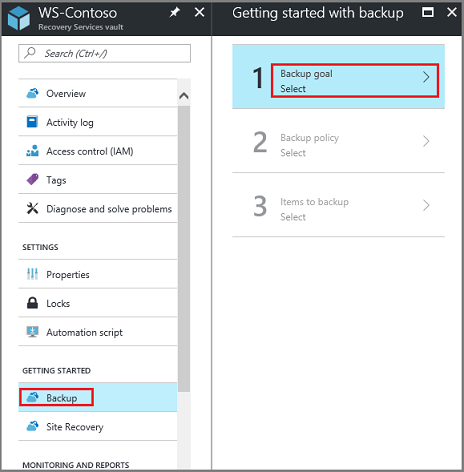

# 使用 Azure 备份 MARS 代理备份 Windows 计算机

本文介绍如何使用 [Azure 备份](backup-overview.md)服务和 Microsoft Azure 恢复服务 (MARS) 代理（也称为 Azure 备份代理）备份 Windows 计算机。

本文介绍如何执行以下操作：

> [!div class="checklist"]
>
> * 验证先决条件，并创建恢复服务保管库。
> * 下载和设置 MARS 代理
> * 创建备份策略和计划。
> * 执行按需备份。

## 关于 MARS 代理

Azure 备份使用 MARS 代理将本地计算机和 Azure VM 中的文件、文件夹和状态备份到 Azure 中的恢复服务保管库。 可按如下所述运行代理：

* 直接在本地 Windows 计算机上运行该代理，使这些计算机能够直接备份到 Azure 中的备份恢复服务保管库。
* 在运行 Windows（与 Azure VM 备份扩展一起运行）的 Azure VM 上运行代理，以备份 VM 上的特定文件和文件夹。
* 在 Microsoft Azure 备份服务器 (MABS) 或 System Center Data Protection Manager (DPM) 服务器上运行该代理。 在此方案中，计算机和工作负荷将备份到 MABS/DPM，然后 MABS/DPM 将通过 MARS 代理备份到 Azure 中的保管库。
可备份的内容取决于该代理的安装位置。

> [!NOTE]
> 备份 Azure VM 的主要方法是在 VM 上使用 Azure 备份扩展。 这将备份整个 VM。 若要备份 VM 上的特定文件和文件夹，可以安装 MARS 代理并将其与该扩展一起使用。 [了解详细信息](backup-architecture.md)。

## 开始之前

* [了解](backup-architecture.md#architecture-direct-backup-of-on-premises-windows-server-machines-or-azure-vm-files-or-folders) Azure 备份如何使用 MARS 代理备份 Windows 计算机。
* [了解](backup-architecture.md#architecture-back-up-to-dpmmabs)在辅助 MABS 或 DPM 服务器上运行 MARS 代理的备份体系结构。
* [查看](backup-support-matrix-mars-agent.md) MARS 代理支持的内容以及可以备份的内容。
* 验证要备份的计算机的 Internet 访问权限。
* 要将服务器或客户端备份到 Azure，你需要一个 Azure 帐户。 如果没有帐户，只需几分钟的时间就能创建一个[免费帐户](https://azure.microsoft.com/free/)。

### 验证 Internet 访问

如果计算机的 Internet 访问状态受限，请确保计算机或代理上的防火墙设置允许以下 URL 和 IP 地址：

#### URL

- www\.msftncsi.com
- *.Microsoft.com
- *.WindowsAzure.cn
- *.microsoftonline.com
- *.chinacloudapi.cn

#### IP 地址

* 20.190.128.0/18
* 40.126.0.0/18

对上面列出的所有 URL 和 IP 地址的访问都使用端口 443 上的 HTTPS 协议。

## 创建恢复服务保管库

恢复服务保管库会存储你在不同时间创建的所有备份和恢复点，并且包含应用到已备份的计算机的备份策略。 按如下所述创建保管库：

1. 使用 Azure 订阅登录到 [Azure 门户](https://portal.azure.cn/) 。
2. 搜索并选择“恢复服务保管库”  。

    

3. 在“恢复服务保管库”菜单中，单击“+添加”   。

    

4. 对于“名称”，请输入一个友好名称以标识保管库  。

   * 名称对于 Azure 订阅需要是唯一的。
   * 该名称可以包含 2 到 50 个字符。
   * 名称必须以字母开头，只能包含字母、数字和连字符。

5. 选择要在其中创建保管库的 Azure 订阅、资源组和地理区域。 备份数据将发送到保管库。 然后单击“创建”  。

    

   * 创建保管库可能需要一段时间。
   * 可以在门户的右上区域中监视状态通知。 如果在几分钟后看不到保管库，请单击“刷新”  。

     

### 设置存储冗余

Azure 备份会自动处理保管库的存储。 需要指定如何复制该存储。

1. 从“恢复服务保管库”边栏选项卡中，单击新保管库  。 在“设置”部分下，单击“属性”   。
2. 在“属性”  中的“备份配置”  下，单击“更新”  。

3. 选择存储复制类型，然后单击“保存”  。

      

* 如果使用 Azure 作为主要备份存储终结点，则我们建议继续使用默认的“异地冗余”设置。 
* 如果不使用 Azure 作为主要备份存储终结点，则选择“本地冗余”  ，以减少 Azure 存储成本。
* 详细了解[异地冗余](../storage/common/storage-redundancy-grs.md)和[本地冗余](../storage/common/storage-redundancy-lrs.md)。

## 下载 MARS 代理

下载 MARS 代理并将其安装到所要备份的计算机上。

* 如果已在任何计算机上安装该代理，请确保运行最新版本。
* 可以在门户中或使用[直接下载](https://aka.ms/azurebackup_agent)获取最新版本

1. 在保管库中的“开始使用”下，单击“备份”。  

    

2. 在“工作负荷在哪里运行?”中，选择“本地”   。 即使你要在 Azure VM 上安装 MARS 代理，也应选择此选项。
3. 在“要备份哪些内容?”中，选择“文件和文件夹”和/或“系统状态”。    还有其他一些可用选项，但如果运行的是辅助备份服务器，则仅支持这些选项。 单击“准备基础结构”。 

      

4. 在“准备基础结构”中的“安装恢复服务代理”下，下载 MARS 代理。  

    

5. 在下载弹出窗口中单击“保存”  。 默认情况下，**MARSagentinstaller.exe** 文件将保存到 Downloads 文件夹。

6. 现在，请选中“已下载或使用最新的恢复服务代理”，然后下载保管库凭据。 

    

7. 单击“保存”  。 文件将下载到“下载”文件夹。 无法打开保管库凭据文件。

## 安装并注册代理

1. 在要备份的计算机上运行 **MARSagentinstaller.exe** 文件。
2. 在 MARS 代理安装向导中选择“安装设置”，并指定代理的安装位置以及用于缓存的位置。   。
   * Azure 备份在将数据快照发送到 Azure 之前，会使用缓存来存储这些快照。
   * 缓存位置的可用空间应该至少为所要备份的数据大小的 5%。

    

3. 在“代理配置”中，指定 Windows 计算机上运行的代理如何连接到 Internet。   。

   * 如果使用自定义代理，请指定代理设置，并根据需要指定凭据。
   * 请记住，代理需要有权访问[这些 URL](#verify-internet-access)。

     

4. 在“安装”中复查先决条件检查结果，然后单击“安装”。  
5. 安装代理后，单击“继续注册”。 
6. 在“注册服务器向导” > “保管库标识”中，浏览并选择已下载的凭据文件。    。

    

7. 在“加密设置”中，指定用于加密和解密计算机备份的通行短语。 

    * 将加密通行短语保存在安全的位置。
    * 如果你丢失或忘记了该通行短语，Microsoft 无法帮助恢复备份数据。 请将文件保存在安全的位置。 还原备份时需要用到它。

8. 单击“完成”  。 现已安装代理，且已向保管库注册计算机。 接下来可以配置和计划备份。

## 创建备份策略

备份策略指定何时生成数据快照来创建恢复点，以及恢复点的保留期限。

* 使用 MARS 代理配置备份策略。
* Azure 备份不会自动考虑夏令时 (DST)。 这可能会导致实际时间与计划的备份时间存在一定的偏差。

按如下所述创建策略：
1. 下载并注册 MARS 代理后，启动代理控制台。 可以通过在计算机中搜索 **Microsoft Azure 备份**找到该代理。  
2. 在“操作”中单击“计划备份”。  

    
3. 在计划备份向导中选择“开始”，然后单击“下一步”。  
4. 在“选择要备份的项”中，单击“添加项”。  

    

5. 在“选择项”中选择要备份的内容，然后单击“确定”。  

    

6. 在“选择要备份的项”页中，单击“下一步”。  
7. 在“指定备份计划”页中，指定何时创建每日备份或每周备份。   。

    - 创建备份时会创建一个恢复点。
    - 在环境中创建的恢复点数目取决于备份计划。

8. 可以计划每日备份，每天最多备份三次。 例如，以下屏幕截图显示了两个每日备份，一个在午夜创建，另一个在下午 6:00 创建。

    

9. 也可以运行每周备份。 例如，以下屏幕截图显示了每隔两周的星期日和星期三上午 9:30 和凌晨 1:00 创建的备份。

    

10. 在“选择保留策略”页上，指定如何存储数据的历史副本。   。

    - 保留设置指定要存储哪些恢复点，以及要存储多长时间。
    - 例如，在设置每日保留设置时，可以指明在针对每日保留指定的时间，要将最新恢复点保留指定的天数。 另举一例，可以指定每月保留策略，指明在每个月的 30 日创建的恢复点应保留 12 个月。
    - 每日和每周恢复点保留期通常与备份计划相一致。 这意味着，根据计划触发备份时，备份创建的恢复点将存储每日或每周保留策略中指定的持续时间。
    - 例如，在以下屏幕截图中：

        -   在午夜和下午 6:00 创建的每日备份将保留 7 天。
        -   在星期六的午夜和下午 6:00 创建的备份将保留 4 周。
        -   在当月最后一周的星期六午夜和下午 6:00 创建的备份将保留 12 个月。
        -   在 3 月份最后一周的星期六创建的备份将保留 10 年。

    

11. 在“选择初始备份类型”中，  决定是要通过网络进行初始备份还是使用脱机备份（有关脱机备份的详细信息，请参阅此[文章](backup-azure-backup-import-export.md)）。 若要通过网络进行初始备份，请选择“自动通过网络进行”  ，然后单击“下一步”。 

    

12. 在“确认”中复查信息，然后单击“完成”   。

    

13. 在向导完成创建备份计划后，请单击“**关闭**”。

    

必须在安装了代理的每台计算机上创建一项策略。

### 脱机执行初始备份

可以通过网络自动运行初始备份，也可以脱机执行初始备份。 如果需要消耗大量的网络带宽来传输大量的数据，则初始备份的脱机种子设定非常有用。 按如下所述执行脱机传输：

1. 将备份数据写入暂存位置。
2. 使用 AzureOfflineBackupDiskPrep 工具将暂存位置中的数据复制到一个或多个 SATA 磁盘。
3. 该工具会创建 Azure 导入作业。 [详细了解](/storage/common/storage-import-export-service) Azure 导入和导出。
4. 将 SATA 磁盘寄送到 Azure 数据中心。
5. 在数据中心，磁盘数据将复制到 Azure 存储帐户。
6. Azure 备份将数据从存储帐户复制到保管库，并计划增量备份。

### 启用网络限制

可以通过启用网络限制，来控制 MARS 代理使用网络带宽的方式。 如果你需要在工作时间备份数据，但想要控制用于备份和还原活动的带宽量，则限制会很有帮助。

* Azure 备份网络限制在本地操作系统上使用[服务质量 (QoS)](https://docs.microsoft.com/windows-server/networking/technologies/qos/qos-policy-top)。
* 针对备份的网络限制适用于 Windows Server 2012 和更高版本，以及 Windows 8 和更高版本。 操作系统应该运行最新的服务包。

按如下所述启用网络限制：

1. 在 MARS 代理中，单击“更改属性”。 
2. 在“限制”选项卡上，选中“为备份操作启用 Internet 带宽使用限制”。  

    
3. 指定在工作时间和下班时间允许的带宽。 带宽值最小为 512 Kbps，最大为 1,023 MBps。  。

## 运行按需备份

1. 在 MARS 代理中，单击“立即备份”。 

    

2. 如果 MARS 代理版本为 2.0.9169.0 或更高版本，则可以设置自定义保留期。 在“保留备份截止日期”  部分中，从显示的日历中选择日期：

   

3. 在“确认”中复查设置，然后单击“备份”。  
4. 单击“**关闭**”以关闭向导。 如果在备份完成之前执行此操作，向导将继续在后台运行。
5. 完成初始备份后，备份控制台中显示“**作业已完成**”状态。

## 按需备份策略保留行为

>[!NOTE]
>仅适用于 2.0.9169.0 以前的 MARS 代理版本
>

* 有关详细信息，请参阅[创建备份策略](backup-configure-vault.md#create-a-backup-policy)的步骤 8

| “备份计划”选项 | 备份数据将保留多长时间？
| -- | --
| 计划备份间隔：*天 | **默认保留期**：相当于“每日备份的保留期(以天为单位)”    **例外**：如果为长期保留（周、月、年）设置的每日计划备份失败，则会考虑将在此失败的计划备份之后立即触发的按需备份进行长期保留。 否则，将考虑进行下一次计划备份以进行长期保留。   **示例**：如果（假设）在星期四上午 8:00 进行的计划备份失败，并且考虑每周/每月/每年保留相同的备份，则在下一次计划备份（比如）星期五上午 8:00 之前触发的第一个按需备份将自动标记为每周/每月/每年保留，使之适用于星期四上午 8:00 备份。
| 计划备份间隔：*每周 | **默认保留期**：1 天   使用每周备份策略为数据源执行的按需备份将在第二天删除，即使它们是数据源的最新备份也是如此。    **例外**：如果为长期保留（周、月、年）设置的每周计划备份失败，则会考虑将在此失败的计划备份之后立即触发的按需备份进行长期保留。 否则，将考虑进行下一次计划备份以进行长期保留。    **示例**：如果（假设）在星期四上午 8:00 进行的计划备份失败，并且考虑每月/每年保留相同的备份，则在下一次计划备份（比如）星期四上午 8:00 之前触发的第一个按需备份将自动标记为每月/每年保留，使之适用于星期四上午 8:00 备份

## 后续步骤

[了解如何还原文件](backup-azure-restore-windows-server.md)。
<!-- Update_Description: update metedata properties -->