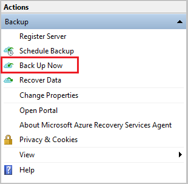

# <a name="first-look-back-up-files-and-folders-in-resource-manager-deployment"></a>初步了解：在 Resource Manager 部署中备份文件和文件夹
本文介绍如何通过 Resource Manager 部署将 Windows Server（或 Windows 计算机）文件和文件夹备份到 Azure。 本教程旨在引导你完成基本操作。 如果想要开始使用 Azure 备份，本文的内容非常合适。

如果想要深入了解 Azure 备份，请阅读此 [概述](backup-introduction-to-azure-backup.md)。

将文件和文件夹备份到 Azure 需要进行以下活动：

 获取 Azure 订阅（如果还没有的话）。<br>
 创建恢复服务保管库。<br>
 下载恢复服务代理并进行安装和注册。<br>
 备份文件和文件夹。

## <a name="get-an-azure-subscription"></a>获取 Azure 订阅
如果没有 Azure 订阅，可以先创建一个 [试用帐户](https://www.azure.cn/pricing/1rmb-trial/) ，这样就可以访问任何 Azure 服务。

## <a name="create-a-recovery-services-vault"></a>创建恢复服务保管库
若要备份文件和文件夹，需在要存储数据的区域内创建恢复服务保管库。 还需确定存储复制方式。

恢复服务保管库是一个实体，用于存储一段时间内创建的所有备份和恢复点。 恢复服务保管库还包含应用到受保护文件和文件夹的备份策略。 创建恢复服务保管库时，也应选择适当的存储冗余选项。

以下步骤将引导用户创建恢复服务保管库。 恢复服务保管库不同于备份保管库。

1. 使用以下命令通过订阅凭据登录。

    ```
    Login-AzureRmAccount -EnvironmentName AzureChinaCloud
    ```

2. 如果是首次使用 Azure 备份，则必须使用 **[Register-AzureRMResourceProvider](https://msdn.microsoft.com/library/mt679020.aspx)** cmdlet 将 Azure 恢复服务提供程序注册到订阅。

    ```
    PS C:\> Register-AzureRmResourceProvider -ProviderNamespace "Microsoft.RecoveryServices"
    ```
3. 恢复服务保管库是一种 Resource Manager 资源，因此需要将它放在资源组中。 你可以使用现有的资源组，也可以使用 **[New-AzureRmResourceGroup](https://msdn.microsoft.com/library/mt678985.aspx)** cmdlet 创建新的资源组。 创建新的资源组时，请指定资源组的名称和位置。  

    ```
    PS C:\> New-AzureRmResourceGroup –Name "test-rg" –Location "West US"
    ```
4. 使用 **[New-AzureRmRecoveryServicesVault](https://msdn.microsoft.com/library/mt643910.aspx)** cmdlet 创建新的保管库。 确保为保管库指定的位置与用于资源组的位置是相同的。

    ```
    PS C:\> New-AzureRmRecoveryServicesVault -Name "testvault" -ResourceGroupName " test-rg" -Location "West US"
    ```
5. 指定要使用的存储冗余类型；你可以使用[本地冗余存储 (LRS)](../storage/storage-redundancy.md#locally-redundant-storage) 或[异地冗余存储 (GRS)](../storage/storage-redundancy.md#geo-redundant-storage)。 以下示例显示，testVault 的 -BackupStorageRedundancy 选项设置为 GeoRedundant。

    ```
    PS C:\> $vault1 = Get-AzureRmRecoveryServicesVault –Name "testVault"
    PS C:\> Set-AzureRmRecoveryServicesBackupProperties  -Vault $vault1 -BackupStorageRedundancy GeoRedundant
    ```

   > [!TIP]
   > 许多 Azure 备份 cmdlet 要求使用恢复服务保管库对象作为输入。 因此，在变量中存储备份恢复服务保管库对象可提供方便。
   >
   >


## <a name="download-and-install-and-register-the-agent"></a>下载、安装和注册代理

> [!NOTE]
> 尚未推出通过 Azure 门户启用备份这一功能。 请使用 Azure 恢复服务代理备份文件和文件夹。

若要详细了解如何下载、安装和注册代理，可参阅[此文](./backup-configure-vault-classic.md#download-install-register-backup-agent)。

## <a name="back-up-your-files-and-folders"></a>备份文件和文件夹
初始备份包括两个关键任务：

- 计划备份
- 首次备份文件和文件夹

若要完成初始备份，请使用 Azure 恢复服务代理。

### <a name="to-schedule-the-backup-job"></a>计划备份作业
1. 打开 Azure 恢复服务代理。 可以通过在计算机中搜索“Azure 备份”找到该代理。

    
2. 在恢复服务代理中，单击“ **计划备份**”。

    
3. 在计划备份向导的“开始使用”页上，单击“**下一步**”。
4. 在“选择要备份的项”页上，单击“**添加项**”。
5. 选择要备份的文件和文件夹，然后单击“**确定**”。
6. 单击“资源组名称” 的 Azure 数据工厂。
7. 在“**指定备份计划**”页上指定**备份计划**，然后单击“**下一步**”。

    可以计划每日（频率为一天最多三次）或每周备份。

    

   > [!NOTE]
   > 有关如何指定备份计划的详细信息，请参阅 [使用 Azure 备份来取代磁带基础结构](backup-azure-backup-cloud-as-tape.md)一文。
   >

8. 在“**选择保留策略**”页上，为备份复制选择“**保留策略**”。

    保留策略指定备份数据的存储时长。 可以根据备份的创建时间指定不同的保留策略，无需为所有备份点指定一个“通用的策略”。 你可以根据需要修改每日、每周、每月和每年保留策略。
9. 在“选择初始备份类型”页上，选择初始备份类型。 将“**自动通过网络**”选项保持选中状态，然后单击“**下一步**”。

    你可以通过网络自动备份，或者脱机备份。 本文的余下部分将介绍自动备份过程。 如果你想要执行脱机备份，请查看 [Azure 备份中的脱机备份工作流](backup-azure-backup-import-export.md) 以了解更多信息。
10. 在“确认”页上复查信息，然后单击“**完成**”。
11. 在向导完成创建备份计划后，请单击“**关闭**”。

### <a name="to-back-up-files-and-folders-for-the-first-time"></a>首次备份文件和文件夹
1. 在恢复服务代理中单击“ **立即备份** ”，以通过网络完成初始种子设定。

    
2. 在“确认”页上复查“立即备份向导”用于备份计算机的设置。 然后单击“**备份**”。
3. 单击“**关闭**”以关闭向导。 如果在备份过程完成之前关闭向导，向导将继续在后台运行。

完成初始备份后，备份控制台中将显示“**作业已完成**”状态。


## <a name="questions"></a>有疑问？
如果你有疑问，或者希望包含某种功能，请 [给我们反馈](http://aka.ms/azurebackup_feedback)。

## <a name="next-steps"></a>后续步骤
- 详细了解如何 [备份 Windows 计算机](backup-configure-vault.md)。
- 备份文件和文件夹后，可以 [管理保管库和服务器](backup-azure-manage-windows-server-classic.md)。
- 如果需要还原备份，请参阅 [将文件还原到 Windows 计算机](backup-azure-restore-windows-server.md)一文。


