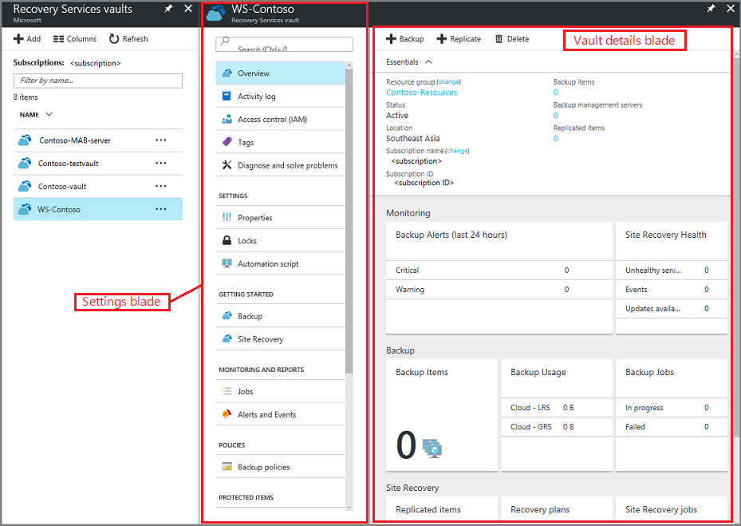
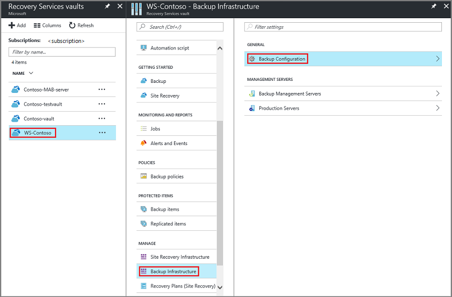

# 初步了解：在 Resource Manager 部署中备份文件和文件夹
本文介绍如何通过 Resource Manager 部署将 Windows Server（或 Windows 计算机）文件和文件夹备份到 Azure。 本教程旨在引导完成基本操作。 如果想要开始使用 Azure 备份，本文的内容非常合适。

如果想要深入了解 Azure 备份，请阅读此 [概述](backup-introduction-to-azure-backup.md)。

如果没有 Azure 订阅，可以先创建一个 [试用帐户](https://www.azure.cn/pricing/1rmb-trial/) ，这样就可以访问任何 Azure 服务。

## 创建恢复服务保管库
若要备份文件和文件夹，需在要存储数据的区域内创建恢复服务保管库。 还需确定存储复制方式。

### 创建恢复服务保管库
1. 若尚未登录 [Azure 门户](https://portal.azure.cn/) ，请使用 Azure 订阅登录。
2. 在“中心”菜单中，单击“更多服务”，并在资源列表中，键入“恢复服务”并单击“恢复服务保管库”。

      

    如果在订阅中有恢复服务保管库，则会列出这些保管库。
3. 在“恢复服务保管库”菜单中，单击“添加”。

    

    此时将打开“恢复服务保管库”边栏选项卡，其中会提示你提供“名称”、“订阅”、“资源组”和“位置”。

    

4. 对于“名称”，请输入一个友好名称以标识保管库 。 名称对于 Azure 订阅需要是唯一的。 键入包含 2 到 50 个字符的名称。 名称必须以字母开头，只能包含字母、数字和连字符。

5. 在“订阅”部分，通过下拉菜单选择 Azure 订阅  。 如果只使用一个订阅，则会显示该订阅，用户可以跳到下一步。 如果不确定要使用哪个订阅，请使用默认的（或建议的）订阅。 仅当组织帐户与多个 Azure 订阅关联时，才会有多个选项。

6. 在“资源组”  部分：

    - 如果要创建新的资源组，请选择“新建”  。
    或
    - 选择“使用现有项”，并单击下拉菜单查看可用资源组列表  。

  有关资源组的完整信息，请参阅 [Azure 资源管理器概述](../azure-resource-manager/resource-group-overview.md)。

7. 单击“位置”，为保管库选择地理区域  。 此选项决定了备份数据要发送到的地理区域。

8. 在“恢复服务保管库”边栏选项卡的底部，单击“创建” 。

    创建恢复服务保管库可能需要数分钟。 可以在门户右上区域监视状态通知。 创建保管库后，它会显示在“恢复服务保管库”的列表中。 如果在几分钟后看不到保管库，请单击“刷新” 。

     

    一旦在恢复服务保管库列表中看到保管库，即可设置存储冗余。

### 为保管库设置存储冗余
在创建恢复服务保管库时，请确保存储冗余配置为所希望的方式。

1. 从“恢复服务保管库”边栏选项卡中，单击新保管库  。

    

    选择保管库时，“恢复服务保管库”边栏选项卡会缩窄，“设置”边栏选项卡（*顶部有保管库的名称*）和保管库详细信息边栏选项卡会打开。

    
2. 在新保管库的“设置”边栏选项卡中，使用垂直滚动条向下滚动到“管理”部分，并单击“备份基础结构” 。
    此时会打开“备份基础结构”边栏选项卡。
3. 在“备份基础结构”边栏选项卡中，单击“备份配置”打开“备份配置”边栏选项卡。

    
4. 为保管库选择合适的存储复制选项。

    

    默认情况下，保管库具有异地冗余存储。 如果使用 Azure 作为主要备份存储终结点，请继续使用“异地冗余” 。 如果不使用 Azure 作为主要备份存储终结点，则选择“本地冗余” ，以减少 Azure 存储成本。 请在此[存储冗余概述](../storage/common/storage-redundancy.md)中深入了解[异地冗余](../storage/common/storage-redundancy.md#geo-redundant-storage)和[本地冗余](../storage/common/storage-redundancy.md#locally-redundant-storage)存储选项。

创建保管库以后，即可对其进行配置，以便备份文件和文件夹。

## 配置保管库
1. 在“恢复服务保管库”边栏选项卡（对应于刚创建的保管库）的“开始”部分中单击“备份”，并在“开始备份”边栏选项卡上选择“备份目标”。

    

    此时会打开“备份目标”  边栏选项卡。

    

2. 从“工作负荷的运行位置?”下拉菜单中选择“本地”。

    之所以选择“本地”  ，是因为 Windows Server 或 Windows 计算机是不在 Azure 中的物理计算机。

3. 从“要备份的项?”菜单中选择“文件和文件夹”，并单击“确定”。

    

    单击“确定”后，会在“备份目标”旁边显示一个复选标记，并会打开“准备基础结构”边栏选项卡。

    

4. 在“准备基础结构”边栏选项卡上，单击“下载 Windows Server 或 Windows 客户端的代理”。

    

    如果使用的是 Windows Server Essential，则选择下载 Windows Server Essential 的代理。 弹出菜单会提示用户运行或保存 MARSAgentInstaller.exe。

    

5. 在下载弹出窗口中单击“保存” 。

    默认情况下，**MARSagentinstaller.exe** 文件将保存到 Downloads 文件夹。 下载完安装程序以后，会显示一个弹出窗口，询问用户是要运行安装程序，还是要打开文件夹。

    

    此时还不需要安装代理。 下载保管库凭据之后，即可安装代理。

6. 在“准备基础结构”边栏选项卡上，单击“下载”。

    

    保管库凭据下载到“下载”文件夹。 下载完保管库凭据以后，会显示一个弹出窗口，询问用户是要打开还是要保存凭据。 单击“保存” 。 ，可以让尝试打开保管库凭据的对话框关闭。 不能打开保管库凭据。 继续下一步。 保管库凭据位于“下载”文件夹中。   

    

## 安装并注册代理

> [!NOTE]
> 尚未推出通过 Azure 门户启用备份这一功能。 请使用 Azure 恢复服务代理备份文件和文件夹。
>

1. 在 Downloads 文件夹（或其他保存位置）中找到并双击 **MARSagentinstaller.exe**。

    安装程序会在提取、安装和注册恢复服务代理时提供一系列消息。

    

2. 完成 Azure 恢复服务代理安装向导。 若要完成该向导，需完成以下操作：

   - 选择安装和缓存文件夹的位置。
   - 如果使用代理服务器来连接 Internet，请提供代理服务器信息。
   - 如果使用经过身份验证的代理，请提供用户名和密码详细信息。
   - 提供已下载的保管库凭据
   - 将加密通行短语保存在安全的位置。

     > [!NOTE]
     > 如果丢失或忘记了通行短语，Microsoft 无法帮助你恢复备份数据。 请将文件保存在安全的位置。 还原备份时需要用到此文件。
     >
     >

现已安装代理，且已向保管库注册计算机。 接下来可以配置和计划备份。

## 网络和连接要求

如果计算机/代理具有有限的 Internet 访问，请确保计算机/代理上的防火墙设置配置为允许以下 URL：  
    1. www.msftncsi.com
    2. *.Microsoft.com
    3. *.WindowsAzure.com
    4. *.microsoftonline.com
    5. *.windows.ne

## 备份文件和文件夹
初始备份包括两个关键任务：

- 计划备份
- 首次备份文件和文件夹

若要完成初始备份，请使用 Azure 恢复服务代理。

### 计划备份作业
1. 打开 Azure 恢复服务代理。 可以通过在计算机中搜索“Azure 备份”找到该代理。

    
2. 在恢复服务代理中，单击“ **计划备份**”。

    
3. 在计划备份向导的“开始使用”页上，单击“**下一步**”。
4. 在“选择要备份的项”页上，单击“**添加项**”。
5. 选择要备份的文件和文件夹，然后单击“确定”。
6. 单击“资源组名称” 的 Azure 数据工厂。
7. 在“指定备份计划”页上指定**备份计划**，然后单击“下一步”。

    可以计划每日（频率为一天最多三次）或每周备份。

    

   > [!NOTE]
   > 有关如何指定备份计划的详细信息，请参阅 [使用 Azure 备份来取代磁带基础结构](backup-azure-backup-cloud-as-tape.md)一文。
   >

8. 在“**选择保留策略**”页上，为备份复制选择“**保留策略**”。

    保留策略指定备份数据的存储时长。 可以根据备份的创建时间指定不同的保留策略，无需为所有备份点指定一个“通用的策略”。 可以根据需要修改每日、每周、每月和每年保留策略。
9. 在“选择初始备份类型”页上，选择初始备份类型。 将“自动通过网络”选项保持选中状态，然后单击“下一步”。

    可以通过网络自动备份，或者脱机备份。 本文的余下部分介绍自动备份过程。 如果想要执行脱机备份，请查看 [Azure 备份中的脱机备份工作流](backup-azure-backup-import-export.md)以了解更多信息。
10. 在“确认”页上复查信息，然后单击“完成”。
11. 在向导完成创建备份计划后，请单击“**关闭**”。

### 首次备份文件和文件夹
1. 在恢复服务代理中单击“ **立即备份** ”，以通过网络完成初始种子设定。

    
2. 在“确认”页上复查“立即备份向导”用于备份计算机的设置。 然后单击“备份”。
3. 单击“**关闭**”以关闭向导。 如果在备份过程完成之前关闭向导，向导将继续在后台运行。

完成初始备份后，备份控制台中显示“**作业已完成**”状态。

## 有疑问？
如果有疑问，或者希望包含某种功能，请 [给我们反馈](http://aka.ms/azurebackup_feedback)。

## 后续步骤
- 详细了解如何 [备份 Windows 计算机](backup-configure-vault.md)。
- 备份文件和文件夹后，可以 [管理保管库和服务器](backup-azure-manage-windows-server.md)。
- 如果需要还原备份，请参阅[将文件还原到 Windows 计算机](backup-azure-restore-windows-server.md)一文。

<!--Update_Description: wording update -->